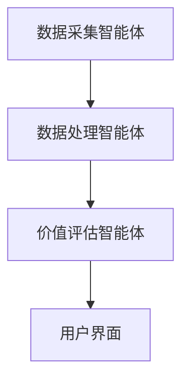

                 


# 利用多智能体系统进行实时市场情绪分析和价值评估

> 关键词：多智能体系统，实时市场情绪分析，价值评估，协同学习，情感计算，实时数据处理

> 摘要：本文详细探讨了利用多智能体系统进行实时市场情绪分析和价值评估的方法。通过分析多智能体系统的原理、市场情绪分析的核心概念、协同学习算法、实时数据处理机制以及系统架构设计，本文提供了一种基于多智能体系统的解决方案。文章还通过实际案例展示了如何利用Python实现核心算法，并结合系统架构图和实体关系图，详细讲解了系统设计与实现。最后，本文总结了最佳实践经验和注意事项，为读者提供了完整的解决方案。

---

# 第一部分: 多智能体系统与市场情绪分析概述

## 第1章: 多智能体系统与市场情绪分析概述

### 1.1 问题背景与目标

#### 1.1.1 问题背景
- 金融市场数据的复杂性与实时性要求：金融市场数据具有高度动态性和复杂性，传统的集中式计算难以满足实时分析的需求。
- 市场情绪分析的重要性：市场情绪是影响投资决策的关键因素，但传统的单一智能体分析方法难以捕捉市场的多维度信息。
- 多智能体系统在实时分析中的优势：通过分布式计算和协同学习，多智能体系统能够高效地处理实时数据，并提供准确的市场情绪分析结果。

#### 1.1.2 问题描述
- 市场情绪分析的定义与挑战：市场情绪分析是指通过自然语言处理和情感计算技术，对市场参与者的情绪进行量化分析。其挑战在于数据的实时性、多样性和动态变化。
- 多智能体系统在实时分析中的应用场景：多智能体系统可以分别负责数据采集、情感计算和协同学习，从而实现高效的实时分析。
- 价值评估的复杂性与实时性需求：价值评估需要结合市场情绪、历史数据和实时动态，传统的集中式计算难以满足实时性需求。

#### 1.1.3 问题解决
- 多智能体系统的分布式计算优势：通过分布式计算，多智能体系统能够高效地处理大量数据，并实时更新市场情绪分析结果。
- 实时数据处理与分析的解决方案：通过多智能体协同学习，系统能够快速响应市场变化，提供实时的价值评估结果。
- 情绪分析与价值评估的结合：通过多智能体系统，情绪分析结果可以被快速整合到价值评估模型中，从而提供更准确的评估结果。

#### 1.1.4 边界与外延
- 系统的输入与输出边界：系统的输入包括实时市场数据、新闻标题和社交媒体评论，输出包括市场情绪指数和价值评估结果。
- 与其他系统的接口定义：系统需要与数据源、用户界面和其他外部系统进行交互，接口设计需要考虑数据格式和通信协议。
- 系统的可扩展性与适应性：系统设计需要考虑到未来数据源的扩展和算法的优化，确保系统的可扩展性和适应性。

#### 1.1.5 核心概念结构与要素
- 多智能体系统的核心要素：智能体、通信机制、协同学习算法、数据源和用户界面。
- 市场情绪分析的特征：实时性、多样性、动态性。
- 价值评估的关键指标：市场情绪指数、资产价格预测、投资建议。

---

## 第2章: 多智能体系统的核心原理

### 2.1 多智能体系统原理

#### 2.1.1 多智能体系统的定义
- 多智能体系统的组成：由多个智能体组成，每个智能体负责特定的任务。
- 分布式计算与协同工作的机制：智能体之间通过通信和协作完成任务，避免了集中式计算的瓶颈。

#### 2.1.2 多智能体系统的核心要素
- 智能体的定义与分类：智能体是具有感知、决策和执行能力的实体，可以根据任务分为数据采集智能体、情感计算智能体和协同学习智能体。
- 智能体之间的通信与协作：智能体之间通过消息传递进行通信，协作完成数据处理和分析任务。
- 智能体的决策机制：智能体根据接收到的数据和任务需求，进行决策并执行相应的操作。

#### 2.1.3 多智能体系统的架构
- 分层架构与模块化设计：系统分为数据采集层、处理层和应用层，每个层由不同的智能体负责。
- 组件之间的交互与依赖关系：数据采集智能体向情感计算智能体提供数据，情感计算智能体向协同学习智能体提供情绪分析结果，协同学习智能体根据情绪分析结果生成价值评估报告。

---

## 第3章: 市场情绪分析与价值评估的核心概念

### 3.1 市场情绪分析原理

#### 3.1.1 市场情绪分析的定义与目标
- 市场情绪分析的定义：通过对新闻标题、社交媒体评论等文本数据进行分析，量化市场参与者的情绪状态。
- 市场情绪分析的目标：识别市场情绪的变化趋势，辅助投资决策。

#### 3.1.2 市场情绪分析的特征
- 数据来源的多样性：包括新闻、社交媒体、论坛等。
- 情感强度的量化：通过情感计算技术，将情绪强度量化为一个数值。
- 情绪的动态变化：市场情绪会随着时间推移而变化，需要实时监控和分析。

### 3.2 价值评估的核心概念

#### 3.2.1 价值评估的定义与目标
- 价值评估的定义：通过对市场情绪、历史数据和实时动态的综合分析，评估资产的内在价值。
- 价值评估的目标：为投资者提供科学的投资建议，降低投资风险。

#### 3.2.2 价值评估的关键指标
- 市场情绪指数：反映市场整体情绪的指标。
- 资产价格预测：基于市场情绪和历史数据，预测资产的未来价格。
- 投资建议：根据市场情绪和价值评估结果，提供买入、卖出或持有建议。

---

## 第4章: 协同学习与情感计算

### 4.1 协同学习原理

#### 4.1.1 协同学习的定义
- 协同学习：多个智能体通过协作完成任务的学习方法。

#### 4.1.2 协同学习算法
- 分布式协同学习：智能体之间通过消息传递进行协作，每个智能体负责特定的任务。
- 联合学习：智能体之间共享数据和模型，共同完成学习任务。

### 4.2 情感计算原理

#### 4.2.1 情感计算的定义
- 情感计算：通过自然语言处理技术，分析文本中的情感倾向。

#### 4.2.2 情感计算算法
- 基于词袋模型的情感计算：通过统计文本中的情感词汇，计算情感强度。
- 基于深度学习的情感计算：使用神经网络模型，自动学习情感特征。

---

## 第5章: 实时数据处理与分析

### 5.1 实时数据处理

#### 5.1.1 数据采集
- 数据源：新闻网站、社交媒体、金融数据API。
- 数据格式：文本数据、结构化数据。

#### 5.1.2 数据预处理
- 数据清洗：去除噪声数据，如特殊符号和停用词。
- 数据转换：将文本数据转换为数值形式，便于分析。

### 5.2 实时数据分析

#### 5.2.1 情感分析
- 情感强度计算：通过情感计算算法，计算每条文本的情感强度。
- 情感趋势分析：分析情感强度随时间的变化趋势。

#### 5.2.2 价值评估
- 市场情绪指数计算：根据情感强度和相关指标，计算市场情绪指数。
- 资产价格预测：基于市场情绪指数和历史数据，预测资产价格。

---

## 第6章: 系统架构与设计

### 6.1 问题场景介绍

#### 6.1.1 系统目标
- 实时采集和分析市场数据。
- 提供准确的市场情绪分析和价值评估结果。

#### 6.1.2 系统功能需求
- 数据采集：实时采集新闻、社交媒体评论等数据。
- 情感分析：对采集到的文本进行情感分析，计算情感强度。
- 价值评估：根据情感分析结果和历史数据，评估资产价值。
- 用户界面：提供直观的市场情绪指数和价值评估结果展示。

### 6.2 系统架构设计

#### 6.2.1 领域模型设计
- 数据采集层：负责数据采集的智能体。
- 数据处理层：负责数据预处理和情感分析的智能体。
- 应用层：负责价值评估和结果展示的智能体。

#### 6.2.2 系统架构图


#### 6.2.3 系统接口设计
- 数据采集接口：提供API，供数据采集智能体调用。
- 情感分析接口：提供API，供数据处理智能体调用。
- 价值评估接口：提供API，供价值评估智能体调用。

#### 6.2.4 系统交互序列图
```mermaid
sequenceDiagram
    participant 用户
    participant 数据采集智能体
    participant 数据处理智能体
    participant 价值评估智能体
    participant 用户界面
    用户 -> 数据采集智能体: 请求实时数据
    数据采集智能体 -> 数据处理智能体: 提供数据
    数据处理智能体 -> 价值评估智能体: 提供情感分析结果
    价值评估智能体 -> 用户界面: 提供价值评估结果
    用户 <- 用户界面: 显示结果
```

---

## 第7章: 项目实战

### 7.1 环境安装

#### 7.1.1 安装Python
- 安装Python 3.8或更高版本。

#### 7.1.2 安装依赖库
- 使用pip安装以下库：
  ```bash
  pip install numpy
  pip install pandas
  pip install nltk
  pip install requests
  pip install matplotlib
  ```

### 7.2 系统核心实现

#### 7.2.1 数据采集模块

##### 7.2.1.1 数据采集代码
```python
import requests
import json

def fetch_data(api_key):
    url = f"https://api.example.com/market_data?api_key={api_key}"
    response = requests.get(url)
    return response.json()
```

##### 7.2.1.2 数据预处理代码
```python
import pandas as pd
from sklearn.feature_extraction.text import TfidfVectorizer

def preprocess_data(data):
    df = pd.DataFrame(data)
    vectorizer = TfidfVectorizer(stop_words='english')
    tfidf_matrix = vectorizer.fit_transform(df['text'])
    return tfidf_matrix
```

#### 7.2.2 情感分析模块

##### 7.2.2.1 情感计算代码
```python
from sklearn.svm import SVC
from sklearn.pipeline import Pipeline

def sentiment_analysis(data):
    pipeline = Pipeline([
        ('tfidf', TfidfVectorizer()),
        ('clf', SVC())
    ])
    pipeline.fit(data['text'], data['label'])
    return pipeline.predict(data['text'])
```

#### 7.2.3 价值评估模块

##### 7.2.3.1 价值评估代码
```python
import numpy as np

def value_assessment(sentiment_scores, historical_data):
    market_mood = np.mean(sentiment_scores)
    predicted_price = historical_data[-1] * (1 + market_mood * 0.05)
    return predicted_price
```

### 7.3 代码应用解读与分析

#### 7.3.1 数据采集模块
- 通过API接口获取实时市场数据。
- 使用TfidfVectorizer进行文本数据的特征提取。

#### 7.3.2 情感分析模块
- 使用SVM模型进行情感分类。
- 返回每条文本的情感倾向。

#### 7.3.3 价值评估模块
- 根据情感分析结果计算市场情绪指数。
- 基于历史数据和市场情绪指数预测资产价格。

### 7.4 实际案例分析

#### 7.4.1 案例背景
- 数据源：新闻标题和社交媒体评论。
- 数据预处理：去除停用词，提取特征向量。
- 情感分析：分类结果为正面、中性、负面。
- 价值评估：计算市场情绪指数，预测资产价格。

### 7.5 项目小结

#### 7.5.1 项目总结
- 项目目标：利用多智能体系统进行实时市场情绪分析和价值评估。
- 项目成果：开发了一个高效、准确的实时分析系统。

#### 7.5.2 经验与教训
- 数据质量对分析结果的影响：需要高质量的数据源。
- 算法优化的空间：可以尝试不同的情感计算算法和协同学习方法。

---

## 第8章: 最佳实践 tips、小结、注意事项、拓展阅读

### 8.1 小结
- 多智能体系统的分布式计算优势：通过协作完成任务，提高效率。
- 情感计算与价值评估的结合：准确反映市场情绪，辅助投资决策。

### 8.2 注意事项
- 数据隐私与安全：确保数据采集和处理过程中的隐私保护。
- 系统性能优化：优化算法和架构设计，提高处理速度。
- 系统可扩展性：设计灵活的架构，方便未来扩展。

### 8.3 拓展阅读
- 多智能体系统：推荐阅读《Multi-Agent Systems: Algorithm and Applications》。
- 情感计算：推荐阅读《Sentiment Analysis: A Survey》。
- 实时数据处理：推荐阅读《Real-Time Data Processing: System Design and Implementation》。

---

# 第二部分: 总结

通过本文的详细讲解，我们了解了如何利用多智能体系统进行实时市场情绪分析和价值评估。从背景介绍到系统设计，从算法实现到项目实战，我们系统地探讨了这一领域的核心技术与应用。未来的研究可以进一步优化算法，提高系统的准确性和效率，为投资者提供更优质的决策支持。

