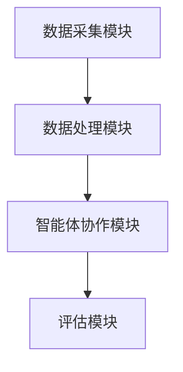

                 


# 利用多智能体系统进行跨资产类别的价值比较

## 关键词：多智能体系统、资产价值比较、分布式计算、智能体协作、金融分析

## 摘要：  
在金融领域，资产价值的跨类别比较是一个复杂且具挑战性的任务，尤其是在面对海量数据和多维度评估指标的情况下。传统的单一智能体系统难以有效应对这种复杂性。多智能体系统（Multi-Agent System, MAS）通过分布式的智能体协作，能够更好地处理这种复杂性。本文将探讨如何利用多智能体系统进行跨资产类别的价值比较，从理论基础到实际应用，详细分析其优势、实现方法和实际案例。

---

# 第1章: 多智能体系统的定义与核心概念

## 1.1 多智能体系统的定义  
多智能体系统（Multi-Agent System, MAS）是由多个智能体（Agent）组成的分布式系统，这些智能体通过协作完成特定任务。智能体是具有感知、决策和行动能力的实体，可以是软件程序、算法或物理设备。

## 1.2 多智能体系统的核心特征  
1. **分布式性**：智能体分布在网络中，每个智能体负责特定任务。  
2. **协作性**：智能体之间通过通信和协商完成共同目标。  
3. **自主性**：每个智能体能够自主决策，无需外部干预。  
4. **反应性**：智能体能够实时感知环境变化并做出响应。  

## 1.3 多智能体系统与传统单体系统的主要区别  
| 特性             | 单体系统                | 多智能体系统            |  
|------------------|-------------------------|------------------------|  
| 结构             | 单一中心化结构          | 分布式结构              |  
| 任务分配         | 由中心节点统一分配任务  | 智能体自主分配任务      |  
| 系统扩展性       | 扩展性有限              | 扩展性高                |  

---

# 第2章: 资产价值比较的背景与挑战

## 2.1 资产价值比较的重要性  
在金融领域，资产价值的评估是投资决策的核心。跨资产类别比较（如股票、债券、基金等）能够帮助投资者更好地理解不同资产的风险和收益特性。

## 2.2 跨资产比较的核心挑战  
1. **数据异构性**：不同资产类别的数据格式和评估指标差异大。  
2. **复杂性**：资产之间的相关性需要综合多个维度进行分析。  
3. **实时性要求**：金融市场对实时性有较高要求。  

## 2.3 多智能体系统在跨资产比较中的优势  
1. **分布式计算能力**：能够同时处理多个资产类别的数据。  
2. **协作能力**：智能体之间可以协同完成复杂任务。  
3. **灵活性**：系统能够快速适应市场变化。  

---

# 第3章: 多智能体系统在资产比较中的实现原理

## 3.1 多智能体系统的通信机制  
智能体之间的通信是通过消息传递完成的。例如，一个智能体可以向其他智能体发送“请求数据”的消息，接收方智能体则返回相应的数据。

## 3.2 分布式计算与协作  
多智能体系统通过分布式计算将任务分解到多个智能体，每个智能体负责特定部分的数据处理。例如，一个智能体可以负责股票数据的清洗，另一个智能体负责债券数据的清洗。

## 3.3 协商与共识机制  
在多智能体系统中，智能体需要通过协商达成共识。例如，在评估资产价值时，多个智能体可能需要通过协商确定最终的评估指标。

---

# 第4章: 资产价值比较的多智能体系统实现

## 4.1 系统架构设计  
### 4.1.1 系统功能模块  
1. **数据采集模块**：负责从不同数据源获取资产数据。  
2. **数据处理模块**：对数据进行清洗和预处理。  
3. **智能体协作模块**：实现智能体之间的通信与协作。  
4. **评估模块**：基于智能体协作结果进行资产价值评估。  

### 4.1.2 系统架构图  


## 4.2 系统实现步骤  
1. **环境配置**：安装所需依赖库，如Python的`multiprocessing`模块。  
2. **智能体设计**：定义智能体的感知、决策和行动逻辑。  
3. **通信机制实现**：实现智能体之间的消息传递。  
4. **数据处理与协作**：通过智能体协作完成数据的清洗和预处理。  
5. **资产价值评估**：基于协作结果进行资产价值评估。  

## 4.3 代码实现示例  
```python
import threading
import queue

class Agent:
    def __init__(self, id):
        self.id = id
        self.task_queue = queue.Queue()
    
    def run(self):
        while True:
            if not self.task_queue.empty():
                task = self.task_queue.get()
                self.execute_task(task)
    
    def execute_task(self, task):
        # 具体任务执行逻辑
        pass

# 创建多个智能体
agents = [Agent(i) for i in range(4)]

# 启动智能体
for agent in agents:
    threading.Thread(target=agent.run).start()

# 发送任务到智能体
for agent in agents:
    agent.task_queue.put("process_data")
```

---

# 第5章: 项目实战——跨资产比较的多智能体实现

## 5.1 项目背景  
本项目旨在利用多智能体系统实现股票和债券的跨资产价值比较。  

## 5.2 系统功能设计  
### 5.2.1 功能模块  
1. **数据采集模块**：从Yahoo Finance获取股票和债券数据。  
2. **数据处理模块**：清洗和预处理数据。  
3. **智能体协作模块**：智能体之间协作完成数据的分析和评估。  
4. **评估模块**：基于协处理器结果进行资产价值评估。  

### 5.2.2 功能流程图  


## 5.3 系统实现与代码解读  
```python
import requests
import json

class StockAgent(Agent):
    def execute_task(self, task):
        if task == "get_stock_data":
            response = requests.get("https://api.example.com/stock")
            self.data = json.loads(response.text)

class BondAgent(Agent):
    def execute_task(self, task):
        if task == "get_bond_data":
            response = requests.get("https://api.example.com/bond")
            self.data = json.loads(response.text)

# 创建股票和债券智能体
stock_agent = StockAgent(1)
bond_agent = BondAgent(2)

# 发送任务
stock_agent.task_queue.put("get_stock_data")
bond_agent.task_queue.put("get_bond_data")

# 等待任务完成
while stock_agent.task_queue.empty() and bond_agent.task_queue.empty():
    pass

# 显示结果
print("股票数据:", stock_agent.data)
print("债券数据:", bond_agent.data)
```

---

# 第6章: 总结与展望

## 6.1 本章总结  
本文详细探讨了如何利用多智能体系统进行跨资产类别的价值比较，从理论基础到实际实现，展示了多智能体系统在金融领域的广泛应用。  

## 6.2 未来研究方向  
1. **更复杂的资产类别**：如加密货币、房地产等。  
2. **更高效的协作算法**：优化智能体之间的通信和协作效率。  
3. **实时性优化**：提升系统的实时处理能力。  

---

通过本文的分析，我们可以看到，多智能体系统在跨资产价值比较中的应用潜力巨大，未来随着技术的不断发展，其在金融领域的应用将会更加广泛和深入。

