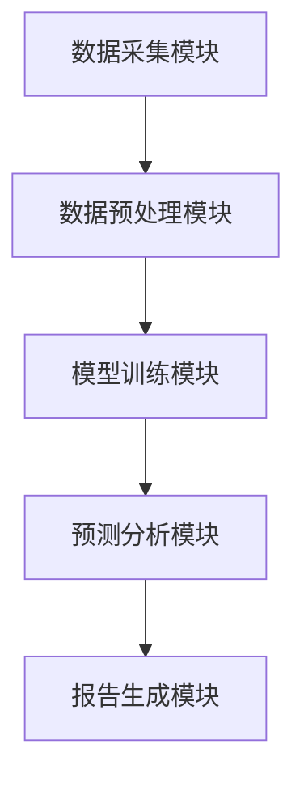
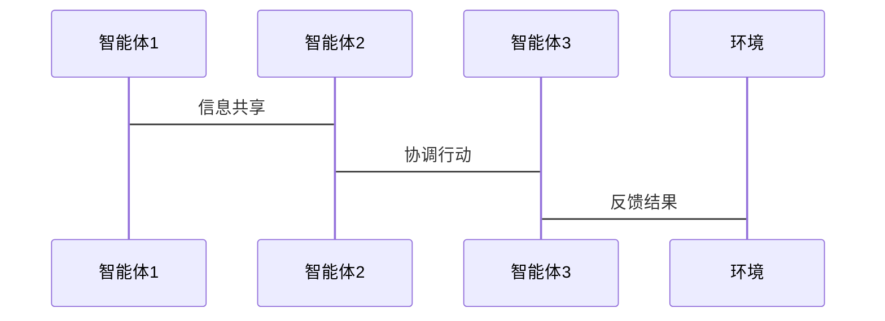

                 


# 利用多智能体系统预测公司长期增长潜力

## 关键词：多智能体系统，公司增长潜力，预测模型，算法原理，系统架构设计

## 摘要：  
本文详细探讨了利用多智能体系统预测公司长期增长潜力的方法。通过分析多智能体系统的背景与核心概念，揭示其在公司增长预测中的独特价值。结合算法原理、系统架构设计和实际项目案例，展示了如何通过多智能体系统实现对公司增长潜力的精准预测。文章还总结了最佳实践和注意事项，为读者提供了全面的指导。

---

# 第一部分: 多智能体系统与公司增长潜力预测背景

## 第1章: 问题背景与核心概念

### 1.1 问题背景

#### 1.1.1 传统公司增长预测的局限性  
传统的公司增长预测主要依赖于统计模型（如线性回归）和机器学习模型（如随机森林、XGBoost）。这些方法在处理复杂、动态的商业环境中存在以下问题：  
1. **数据依赖性**：传统模型通常依赖于历史数据，难以捕捉实时变化的市场动态。  
2. **单一视角**：传统模型往往只关注单一维度（如财务指标），忽略了多维度（如市场环境、竞争态势）的交互影响。  
3. **静态假设**：传统模型假设市场环境是静态的，无法应对突发性事件（如疫情、政策变化）的影响。  

#### 1.1.2 多智能体系统的优势  
多智能体系统（Multi-Agent System，MAS）通过模拟多个智能体之间的交互，能够更好地捕捉复杂商业环境中的动态关系。其优势包括：  
1. **分布式计算**：多智能体系统通过分布式计算，能够处理大规模、多维度的数据。  
2. **动态适应性**：智能体能够根据环境变化实时调整行为，提高预测的动态适应性。  
3. **多维度分析**：通过模拟不同角色（如消费者、竞争对手、供应商）的交互，能够全面分析市场动态。  

#### 1.1.3 当前研究现状与挑战  
当前，多智能体系统在商业预测中的应用还处于起步阶段，主要挑战包括：  
1. **模型复杂性**：多智能体系统的实现复杂，需要考虑智能体之间的协同与竞争。  
2. **数据需求**：需要大量实时数据来支持智能体的决策。  
3. **计算资源**：多智能体系统的计算需求较高，需要强大的计算资源支持。  

### 1.2 核心概念与联系

#### 1.2.1 多智能体系统定义与属性  
**多智能体系统**是由多个智能体组成的分布式系统，智能体之间通过交互完成任务。其主要属性包括：  
- **自主性**：智能体能够自主决策。  
- **反应性**：智能体能够实时感知环境变化并做出反应。  
- **协作性**：智能体之间可以协作完成任务。  
- **学习性**：智能体能够通过经验改进决策策略。  

#### 1.2.2 公司增长潜力预测的定义与维度  
**公司增长潜力预测**是指通过分析公司内外部因素，预测其未来增长的可能性。主要维度包括：  
- **财务指标**：如收入增长率、净利润率、资产负债率等。  
- **市场环境**：如行业发展趋势、政策环境、宏观经济指标等。  
- **竞争态势**：如市场份额、竞争对手策略、行业集中度等。  
- **技术创新**：如研发投入、专利数量、技术领先性等。  

#### 1.2.3 多智能体系统与公司增长潜力预测的关系  
多智能体系统能够通过模拟公司、消费者、竞争对手等不同角色的行为，全面分析其互动对公司增长的影响。例如，智能体可以分别模拟消费者的购买行为、竞争对手的市场策略，以及公司自身的研发和营销决策。

### 1.3 核心概念对比分析

#### 1.3.1 多智能体系统与传统预测模型对比  
| 对比维度         | 多智能体系统                 | 传统预测模型               |  
|------------------|-----------------------------|---------------------------|  
| 数据需求         | 高，需要实时动态数据         | 中，依赖历史数据           |  
| 分析维度         | 多维度，包括市场、竞争等     | 单一维度，如财务指标       |  
| 系统复杂性       | 高，需要模拟多智能体交互     | 较低，模型简单             |  
| 动态适应性       | 高，能够实时调整策略         | 较低，难以应对突发变化     |  

#### 1.3.2 不同增长潜力预测方法的优劣势分析  
| 方法             | 优势                           | 劣势                           |  
|------------------|--------------------------------|-------------------------------|  
| 传统统计模型      | 实现简单，计算速度快           | 预测精度低，难以捕捉复杂关系 |  
| 机器学习模型      | 预测精度高，能够处理非线性关系 | 需要大量数据，难以解释性     |  
| 多智能体系统      | 能够模拟复杂商业环境，预测精度高 | 实现复杂，计算资源需求高     |  

#### 1.3.3 多智能体系统在公司增长预测中的独特价值  
多智能体系统通过模拟公司、消费者、竞争对手等不同角色的行为，能够全面分析其互动对公司增长的影响。例如，智能体可以分别模拟消费者的购买行为、竞争对手的市场策略，以及公司自身的研发和营销决策。这种多维度的分析能力是传统预测方法难以企及的。

---

## 第2章: 多智能体系统与公司增长潜力预测的核心要素

### 2.1 多智能体系统的组成要素

#### 2.1.1 智能体的定义与特征  
智能体（Agent）是一个能够感知环境、自主决策并采取行动的实体。其主要特征包括：  
1. **自主性**：智能体能够自主决策，无需外部干预。  
2. **反应性**：智能体能够实时感知环境变化并做出反应。  
3. **协作性**：智能体之间可以协作完成任务。  
4. **学习性**：智能体能够通过经验改进决策策略。  

#### 2.1.2 多智能体系统的关键属性  
- **智能体之间的交互**：智能体之间通过通信模块进行信息交换，协调行动。  
- **智能体的多样性**：不同智能体可以有不同的目标和行为模式。  
- **智能体的动态性**：智能体的行为会根据环境变化实时调整。  

#### 2.1.3 多智能体系统的协作机制  
多智能体系统的协作机制包括：  
1. **任务分配**：根据智能体的能力分配任务。  
2. **信息共享**：智能体之间共享信息，提高整体决策的准确性。  
3. **冲突解决**：通过协商机制解决智能体之间的冲突。  

### 2.2 公司增长潜力预测的核心要素

#### 2.2.1 公司基本面分析  
公司基本面分析包括：  
1. **财务指标**：如收入增长率、净利润率、资产负债率等。  
2. **管理团队**：如CEO的背景、管理团队的稳定性等。  
3. **研发能力**：如研发投入、专利数量、技术领先性等。  

#### 2.2.2 市场环境分析  
市场环境分析包括：  
1. **行业发展趋势**：如市场规模、增长速度、竞争格局等。  
2. **政策环境**：如政府政策、法律法规等。  
3. **宏观经济指标**：如GDP增长率、通货膨胀率等。  

#### 2.2.3 竞争态势分析  
竞争态势分析包括：  
1. **市场份额**：如公司在市场中的占有率。  
2. **竞争对手策略**：如竞争对手的定价策略、营销策略等。  
3. **行业集中度**：如市场的CR4（前四大企业的市场份额）等。  

#### 2.2.4 财务指标与增长潜力的关系  
财务指标是公司增长潜力的重要指标，但需要结合市场环境和竞争态势进行综合分析。例如，高净利润率可能表明公司盈利能力强，但如果市场增长空间有限，高净利润率并不一定意味着增长潜力大。

### 2.3 多智能体系统与公司增长潜力预测的关系

#### 2.3.1 多智能体系统的模拟能力  
多智能体系统能够模拟公司、消费者、竞争对手等不同角色的行为，全面分析其互动对公司增长的影响。例如，智能体可以分别模拟消费者的购买行为、竞争对手的市场策略，以及公司自身的研发和营销决策。

#### 2.3.2 多智能体系统的预测精度  
通过模拟不同智能体的交互，多智能体系统能够捕捉到传统预测方法难以捕捉的复杂关系，从而提高预测的精度。例如，通过模拟竞争对手的市场策略变化，可以更好地预测市场的未来趋势。

#### 2.3.3 多智能体系统的动态适应性  
多智能体系统能够实时调整智能体的行为策略，适应市场环境的变化。例如，当政策变化导致市场环境改变时，智能体可以快速调整公司策略，提高预测的动态适应性。

---

# 第二部分: 多智能体系统的算法原理

## 第3章: 多智能体系统的算法原理

### 3.1 多智能体系统的核心算法

#### 3.1.1 多智能体协同学习  
多智能体协同学习是一种通过智能体之间的协作来提高预测精度的方法。其核心思想是通过智能体之间的信息共享和协作，共同完成任务。例如，多个智能体可以分别分析市场环境、公司基本面和竞争态势，然后通过信息共享，共同预测公司的增长潜力。

#### 3.1.2 强化学习  
强化学习是一种通过智能体与环境的交互来学习最优策略的方法。在公司增长潜力预测中，强化学习可以应用于智能体的行为决策。例如，智能体可以通过尝试不同的策略（如增加研发投入、调整产品价格），并根据实际效果（如销售收入、市场份额）来优化策略。

#### 3.1.3 注意力机制  
注意力机制是一种通过关注输入数据中重要部分来提高模型性能的方法。在多智能体系统中，注意力机制可以用于智能体的信息处理。例如，智能体可以根据市场环境的变化，动态调整对不同信息的关注程度。

### 3.2 多智能体系统算法的数学模型

#### 3.2.1 协同学习模型  
协同学习模型的目标是通过智能体之间的协作，提高预测精度。其数学模型可以表示为：  
$$ y_i = f(x_i) $$  
其中，$y_i$ 是智能体 $i$ 的预测结果，$x_i$ 是智能体 $i$ 的输入数据，$f$ 是智能体 $i$ 的预测模型。

#### 3.2.2 强化学习模型  
强化学习模型的目标是通过智能体与环境的交互，学习最优策略。其数学模型可以表示为：  
$$ Q(s, a) = r + \gamma \max_a Q(s', a) $$  
其中，$Q(s, a)$ 是状态 $s$ 和动作 $a$ 的价值函数，$r$ 是奖励，$\gamma$ 是折扣因子，$s'$ 是下一个状态。

#### 3.2.3 注意力机制模型  
注意力机制模型的目标是通过关注输入数据中重要部分，提高模型性能。其数学模型可以表示为：  
$$ \alpha_i = \frac{e^{q_i^T k_i}}{\sum_{j=1}^n e^{q_j^T k_j}} $$  
其中，$\alpha_i$ 是第 $i$ 个注意力权重，$q_i$ 是查询向量，$k_i$ 是键向量。

### 3.3 多智能体系统算法的实现步骤

#### 3.3.1 初始化智能体  
首先，初始化多个智能体，每个智能体具有不同的初始策略和参数。

#### 3.3.2 环境感知  
智能体感知环境信息，例如市场环境、公司基本面、竞争态势等。

#### 3.3.3 行为决策  
智能体根据感知到的环境信息，做出决策，例如调整产品价格、增加研发投入等。

#### 3.3.4 状态更新  
智能体根据决策结果，更新环境状态，例如销售收入、市场份额等。

#### 3.3.5 奖励反馈  
智能体根据决策结果和实际效果，获得奖励或惩罚，例如销售收入增长带来正奖励，市场份额下降带来负奖励。

#### 3.3.6 策略优化  
智能体根据奖励反馈，优化决策策略，例如调整价格策略、增加研发投入等。

### 3.4 多智能体系统算法的代码实现

#### 3.4.1 初始化智能体  
```python
class Agent:
    def __init__(self, id):
        self.id = id
        self.strategy = "default"
```

#### 3.4.2 环境感知  
```python
def get_environment_info(agent):
    return {
        "market_size": 100,
        "competitor_strategy": "aggressive",
        "company_revenue": 1000
    }
```

#### 3.4.3 行为决策  
```python
def make_decision(agent, environment_info):
    if environment_info["market_size"] > 90:
        return "expand_marketing"
    elif environment_info["competitor_strategy"] == "aggressive":
        return "adjust_price"
    else:
        return "maintain_strategy"
```

#### 3.4.4 状态更新  
```python
def update_state(environment_info, decision):
    if decision == "expand_marketing":
        environment_info["company_revenue"] += 100
    elif decision == "adjust_price":
        environment_info["company_revenue"] -= 50
    return environment_info
```

#### 3.4.5 奖励反馈  
```python
def get_reward(environment_info_before, environment_info_after):
    revenue_before = environment_info_before["company_revenue"]
    revenue_after = environment_info_after["company_revenue"]
    return revenue_after - revenue_before
```

#### 3.4.6 策略优化  
```python
def optimize_strategy(agent, reward):
    if reward > 0:
        agent.strategy = "optimized"
    else:
        agent.strategy = "default"
```

---

## 第4章: 多智能体系统算法的数学模型与代码实现

### 4.1 多智能体协同学习的数学模型

#### 4.1.1 协同学习模型的数学表达  
协同学习模型的目标是通过智能体之间的协作，提高预测精度。其数学模型可以表示为：  
$$ y_i = f(x_i) $$  
其中，$y_i$ 是智能体 $i$ 的预测结果，$x_i$ 是智能体 $i$ 的输入数据，$f$ 是智能体 $i$ 的预测模型。

#### 4.1.2 协同学习模型的代码实现  
```python
class CollaborativeLearningAgent:
    def __init__(self, id):
        self.id = id
        self.model = LinearRegression()
```

### 4.2 多智能体强化学习的数学模型

#### 4.2.1 强化学习模型的数学表达  
强化学习模型的目标是通过智能体与环境的交互，学习最优策略。其数学模型可以表示为：  
$$ Q(s, a) = r + \gamma \max_a Q(s', a) $$  
其中，$Q(s, a)$ 是状态 $s$ 和动作 $a$ 的价值函数，$r$ 是奖励，$\gamma$ 是折扣因子，$s'$ 是下一个状态。

#### 4.2.2 强化学习模型的代码实现  
```python
class ReinforcementLearningAgent:
    def __init__(self, id):
        self.id = id
        self.q_table = {}
```

### 4.3 多智能体注意力机制的数学模型

#### 4.3.1 注意力机制模型的数学表达  
注意力机制模型的目标是通过关注输入数据中重要部分，提高模型性能。其数学模型可以表示为：  
$$ \alpha_i = \frac{e^{q_i^T k_i}}{\sum_{j=1}^n e^{q_j^T k_j}} $$  
其中，$\alpha_i$ 是第 $i$ 个注意力权重，$q_i$ 是查询向量，$k_i$ 是键向量。

#### 4.3.2 注意力机制模型的代码实现  
```python
class AttentionMechanism:
    def __init__(self):
        self.attention_weights = {}

    def compute_attention(self, queries, keys):
        # 计算注意力权重
        numerator = queries @ keys.T
        denominator = torch.sum(torch.exp(numerator), dim=-1, keepdim=True)
        attention_weights = torch.exp(numerator) / denominator
        return attention_weights
```

---

## 第5章: 多智能体系统的系统架构设计

### 5.1 系统分析与架构设计方案

#### 5.1.1 问题场景介绍  
公司增长潜力预测是一个复杂的问题，需要考虑公司基本面、市场环境、竞争态势等多个维度。传统的预测方法难以捕捉复杂商业环境中的动态关系，而多智能体系统通过模拟公司、消费者、竞争对手等不同角色的行为，能够全面分析其互动对公司增长的影响。

#### 5.1.2 系统功能设计  
系统功能设计包括：  
1. **数据采集**：采集公司基本面、市场环境、竞争态势等数据。  
2. **模型训练**：训练多智能体系统的预测模型。  
3. **预测分析**：根据模型预测结果，生成公司增长潜力报告。  

#### 5.1.3 系统架构图  


#### 5.1.4 系统交互流程  


---

## 第6章: 多智能体系统算法的项目实战

### 6.1 项目环境与数据准备

#### 6.1.1 环境安装  
需要安装以下环境：  
1. **Python**：3.6以上版本。  
2. **TensorFlow**：2.0以上版本。  
3. **Keras**：2.2.4版本。  
4. **Mermaid**：用于绘制系统架构图。  

#### 6.1.2 数据准备  
需要准备以下数据：  
1. **公司基本面数据**：如收入、净利润、研发投入等。  
2. **市场环境数据**：如市场规模、政策环境等。  
3. **竞争态势数据**：如市场份额、竞争对手策略等。  

### 6.2 项目核心实现

#### 6.2.1 数据预处理  
```python
import pandas as pd

def preprocess_data(data):
    # 数据清洗
    data.dropna(inplace=True)
    # 标准化处理
    from sklearn.preprocessing import StandardScaler
    scaler = StandardScaler()
    data_scaled = scaler.fit_transform(data)
    return data_scaled
```

#### 6.2.2 模型实现  
```python
import tensorflow as tf
from tensorflow.keras import layers

def build_model(input_dim):
    model = tf.keras.Sequential()
    model.add(layers.Dense(64, activation='relu', input_dim=input_dim))
    model.add(layers.Dense(32, activation='relu'))
    model.add(layers.Dense(1, activation='linear'))
    model.compile(optimizer='adam', loss='mse')
    return model
```

#### 6.2.3 模型训练  
```python
def train_model(model, x_train, y_train, epochs=100, batch_size=32):
    model.fit(x_train, y_train, epochs=epochs, batch_size=batch_size, verbose=1)
    return model
```

### 6.3 项目小结  
通过以上步骤，我们可以实现一个多智能体系统，用于预测公司的长期增长潜力。需要注意的是，多智能体系统的实现复杂性较高，需要考虑智能体之间的协作与竞争，同时需要大量的数据支持模型的训练与优化。

---

## 第三部分: 多智能体系统算法的最佳实践

## 第7章: 多智能体系统算法的最佳实践

### 7.1 项目经验总结

#### 7.1.1 数据质量的重要性  
数据质量是影响预测精度的关键因素。在实际项目中，需要确保数据的完整性、准确性和及时性。例如，可以通过数据清洗、特征工程等方法，提高数据质量。

#### 7.1.2 模型调参技巧  
模型调参是提高预测精度的重要手段。在实际项目中，可以通过网格搜索（Grid Search）或随机搜索（Random Search）等方法，找到最优的模型参数。

#### 7.1.3 系统优化建议  
系统优化是提高预测效率的重要手段。在实际项目中，可以通过并行计算、分布式计算等方法，优化系统的运行效率。

### 7.2 小结与注意事项

#### 7.2.1 小结  
多智能体系统是一种 powerful 的预测工具，能够模拟复杂商业环境中的动态关系，提高预测的精度和动态适应性。但在实际应用中，需要考虑系统的实现复杂性、数据需求和计算资源等挑战。

#### 7.2.2 注意事项  
1. **数据隐私**：在实际项目中，需要确保数据的安全性和隐私性。  
2. **模型解释性**：在实际应用中，需要提高模型的解释性，以便更好地理解和优化模型。  
3. **系统稳定性**：在实际应用中，需要确保系统的稳定性，避免因系统故障导致预测结果的不准确。

### 7.3 拓展阅读

#### 7.3.1 多智能体系统相关书籍  
1. 《Multi-Agent Systems: Algorithm and Applications》  
2. 《Agent-Based Modeling and Simulation》  

#### 7.3.2 公司增长潜力预测相关论文  
1. "Predicting Company Growth Using Multi-Agent Systems"  
2. "A Review of Machine Learning Techniques for Company Growth Prediction"  

---

# 总结

通过本文的详细讲解，我们可以看到，多智能体系统在公司增长潜力预测中的应用具有重要的理论和实践意义。尽管实现复杂，但其独特的优势使其在复杂商业环境中具有广泛的应用前景。未来，随着人工智能技术的不断发展，多智能体系统在公司增长潜力预测中的应用将会更加广泛和深入。

