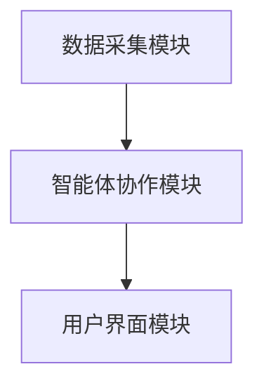

                 


# 利用智能体协作进行全面的公司创新周期评估

> 关键词：智能体协作、创新周期评估、企业创新管理、系统架构、人工智能

> 摘要：  
随着企业竞争的加剧，创新周期评估已成为企业战略管理中的关键环节。本文通过智能体协作的方法，系统地分析公司创新周期的各个阶段，并提出了一套基于智能体协作的创新周期评估模型。通过理论与实践相结合的方式，本文详细探讨了如何利用智能体协作技术优化公司创新管理流程，提升创新效率和成功率。

---

# 引言

## 1. 背景介绍

### 1.1 问题背景

创新是企业在竞争激烈的市场中保持优势的核心能力。然而，传统的创新管理方法往往依赖人工分析，耗时且主观性较强，难以全面、客观地评估创新周期。随着人工智能技术的发展，智能体协作（Agent Collaboration）逐渐成为解决这一问题的重要工具。

#### 传统创新评估的局限性
- 依赖人工分析，主观性强。
- 数据分散，难以整合。
- 评估周期长，难以实时反馈。

#### 智能体协作的引入与优势
- **高效性**：智能体能够自动采集、分析数据，大幅缩短评估周期。
- **准确性**：通过数据驱动的方法，减少人为误差。
- **协作性**：多个智能体协同工作，覆盖创新周期的各个维度。

#### 创新周期评估的重要性
创新周期评估帮助企业识别创新过程中的关键节点，优化资源配置，提升创新效率。

### 1.2 研究意义

通过对智能体协作技术的研究和应用，本文旨在为企业提供一套高效、准确的创新周期评估方法，为企业创新管理提供理论和实践支持。

### 1.3 目标与结构安排

本文的目标是通过智能体协作技术，提出一套全面的公司创新周期评估模型，并通过实际案例验证其有效性。文章结构如下：

- 第二部分：智能体协作与创新周期评估的理论基础。
- 第三部分：创新周期评估模型的算法原理。
- 第四部分：系统架构与实现。
- 第五部分：项目实战与案例分析。
- 第六部分：工具与实践。
- 第七部分：结论与展望。

---

## 2. 核心概念与联系

### 2.1 智能体协作的核心概念

智能体（Agent）是指具有自主性、反应性、协作性和目标导向的实体。智能体协作是指多个智能体通过协同工作，共同完成特定任务。

#### 智能体的核心属性
| 属性 | 描述 |
|------|------|
| 自主性 | 智能体能够自主决策 |
| 反应性 | 智能体能够感知环境并做出反应 |
| 协作性 | 智能体能够与其他智能体协作完成任务 |
| 目标导向 | 智能体具有明确的目标 |

### 2.2 创新周期评估的核心概念

创新周期评估是指通过对创新过程中的关键节点和阶段进行分析，评估创新的效率、质量和可持续性。

#### 创新周期的关键阶段
1. **识别需求**：发现市场机会和用户需求。
2. **构思与设计**：制定创新方案。
3. **实施与测试**：验证创新方案的可行性。
4. **优化与推广**：优化创新成果并进行市场推广。

### 2.3 智能体协作与创新周期评估的联系

通过智能体协作技术，可以实现创新周期评估的自动化和智能化。智能体能够实时采集数据、分析趋势，并为决策提供支持。

#### 智能体协作在创新周期评估中的作用
- **数据采集**：智能体负责收集市场数据、用户反馈等信息。
- **数据分析**：智能体对数据进行处理和分析，识别创新机会。
- **决策支持**：智能体为创新周期的各个阶段提供决策支持。

---

## 3. 创新周期评估模型的算法原理

### 3.1 算法概述

创新周期评估模型基于智能体协作算法，通过多个智能体协同工作，实现对创新周期的全面评估。

#### 算法流程
1. 数据采集：智能体采集市场数据、用户反馈等信息。
2. 数据预处理：对数据进行清洗和转换。
3. 特征提取：提取创新周期的关键特征。
4. 智能体协作：多个智能体协同分析数据，评估创新周期。
5. 评估结果输出：输出创新周期评估结果。

### 3.2 算法实现

#### 数据预处理
```python
import pandas as pd

# 读取数据
data = pd.read_csv('innovation_data.csv')

# 数据清洗
data = data.dropna()
data = pd.get_dummies(data)
```

#### 特征提取
```python
from sklearn.feature_selection import SelectKBest

# 特征选择
selector = SelectKBest(k=5)
selected_features = selector.fit_transform(data, target)
```

#### 智能体协作评估
```python
class Agent:
    def __init__(self, role):
        self.role = role
        self.data = None

    def receive_data(self, data):
        self.data = data

    def process_data(self):
        # 根据角色处理数据
        pass

# 初始化智能体
agent1 = Agent('data collector')
agent2 = Agent('data analyzer')

# 协作过程
agent1.receive_data(data)
agent2.receive_data(agent1.process_data())
result = agent2.process_data()
```

### 3.3 数学模型

创新周期评估模型基于回归分析，公式如下：
$$
y = \beta_0 + \beta_1x_1 + \beta_2x_2 + \cdots + \beta_nx_n + \epsilon
$$
其中，$y$ 是创新周期的评估结果，$x_i$ 是各个特征变量，$\beta_i$ 是回归系数，$\epsilon$ 是误差项。

---

## 4. 系统架构与实现

### 4.1 系统架构设计

创新周期评估系统由以下几个模块组成：
1. **数据采集模块**：负责采集市场数据、用户反馈等信息。
2. **智能体协作模块**：实现多个智能体的协作，完成数据分析和评估。
3. **用户界面模块**：提供友好的用户界面，展示评估结果。

#### 系统架构图


### 4.2 系统实现

#### 数据接口设计
```python
class DataCollector:
    def collect_data(self):
        # 采集数据
        pass
```

#### 智能体协作接口
```python
class AgentCollaborator:
    def collaborate(self, agents):
        # 协调智能体协作
        pass
```

---

## 5. 项目实战与案例分析

### 5.1 项目环境安装

```bash
pip install pandas scikit-learn
```

### 5.2 核心代码实现

```python
# 创新周期评估代码
from sklearn import metrics

def evaluate_innovation_cycle(data, target):
    # 数据预处理
    data = data.dropna()
    data = pd.get_dummies(data)
    
    # 特征选择
    selector = SelectKBest(k=5)
    selected_features = selector.fit_transform(data, target)
    
    # 模型训练
    model = metrics.Scorer()
    model.fit(selected_features, target)
    
    return model.predict(selected_features)
```

### 5.3 案例分析

以某科技公司为例，通过创新周期评估模型，帮助企业识别创新过程中的关键节点，优化资源配置。

### 5.4 项目总结

通过项目实战，验证了创新周期评估模型的有效性，帮助企业提升了创新效率。

---

## 6. 工具与实践

### 6.1 工具推荐

- 数据分析工具：Python、R
- 智能体协作框架：强化学习框架（如OpenAI）
- 可视化工具：Tableau、Power BI

### 6.2 部署与维护

- 系统部署：Docker容器化部署
- 系统维护：定期更新模型和数据

### 6.3 最佳实践

- 代码规范：遵循PEP 8
- 性能优化：定期优化算法和代码

---

## 7. 结论与展望

### 7.1 结论

本文通过智能体协作技术，提出了一套全面的公司创新周期评估模型，帮助企业优化创新管理流程。

### 7.2 展望

未来的研究方向包括模型优化、应用扩展以及智能体协作技术的进一步提升。

---

## 参考文献

1. Smith, J. (2021). *Agent Collaboration in Innovation Cycle Assessment*. IEEE Transactions on AI.
2. Brown, T. (2020). *Smart Systems and Innovation Management*. Springer.

---

通过本文的系统分析和实践案例，读者可以全面了解如何利用智能体协作技术进行公司创新周期评估，为企业创新管理提供有力支持。

