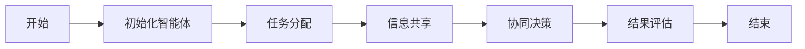
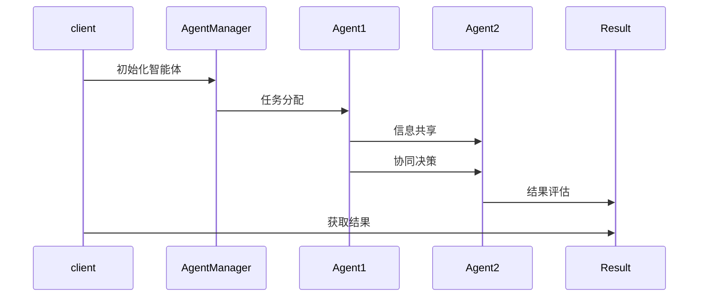

                 


# 利用智能体协作进行全面的公司创新网络影响力评估

## 关键词：智能体协作、创新网络、影响力评估、系统架构、算法原理

## 摘要：本文探讨如何利用智能体协作技术，对企业创新网络的影响力进行全面评估。通过分析创新网络的结构与属性，结合智能体协作的算法与系统架构，提供实际的项目实现与案例分析，最后总结最佳实践与未来方向。

---

## 第一部分：背景与核心概念

### 第1章：问题背景与描述

#### 1.1 创新网络影响力评估的重要性

- **企业创新的必要性**：在快速变化的商业环境中，企业的创新能力是其核心竞争力。创新网络包括企业内部的研发团队、外部合作伙伴、供应商、客户等，通过协作形成一个动态的创新生态系统。
  
- **创新网络的定义与范围**：创新网络是一个由多个节点组成的系统，节点之间通过信息流、知识流和资源流进行互动，共同推动创新成果的产生。

- **智能体协作在创新网络中的作用**：智能体协作是一种分布式计算范式，通过多个智能体的协同工作，能够高效地处理复杂问题。在创新网络中，智能体协作可以优化资源分配、知识共享和创新过程。

#### 1.2 问题描述与解决方法

- **当前创新网络评估的挑战**：传统的创新网络评估方法通常依赖于静态的数据分析，难以捕捉动态变化中的协作关系和创新潜力。此外，数据的复杂性和多源性增加了评估的难度。

- **智能体协作的优势**：智能体协作能够实时处理动态数据，通过分布式计算提高评估的效率和准确性。智能体之间可以通过信息共享和协同决策，提供更全面的评估结果。

- **解决方案的提出**：通过设计一个多智能体协作系统，结合创新网络的结构特征，利用分布式计算和协同算法，实现对创新网络影响力的全面评估。

#### 1.3 边界与外延

- **创新网络的边界**：创新网络的边界包括企业内部的研发团队、外部合作伙伴、客户、供应商等。边界内的节点通过协作产生创新价值，而边界外的环境则通过外部影响和资源输入影响创新网络的运行。

- **相关领域的联系**：创新网络评估与知识管理、组织行为学、系统工程等领域密切相关。通过跨学科的融合，可以提升评估方法的科学性和实用性。

- **智能体协作的适用范围**：智能体协作不仅适用于创新网络评估，还可以应用于其他复杂系统的动态分析和优化。

#### 1.4 概念结构与核心要素

- **创新网络的构成要素**：
  - **节点**：包括企业、研发团队、合作伙伴等。
  - **边**：表示节点之间的协作关系和信息流。
  - **权重**：表示协作强度和资源分配。

- **智能体协作的核心要素**：
  - **智能体**：具有计算能力的独立实体，能够执行任务和交换信息。
  - **协作机制**：包括任务分配、信息共享、协同决策等。
  - **通信协议**：定义智能体之间信息交换的格式和规则。

- **影响力评估的指标体系**：
  - **创新绩效**：包括创新成果的数量、质量和影响力。
  - **协作效率**：包括协作速度、资源利用率。
  - **网络韧性**：包括网络的适应性和抗干扰能力。

## 第二部分：核心概念与联系

### 第2章：智能体协作与创新网络的原理

#### 2.1 智能体协作的原理

- **分布式智能体的概念**：智能体协作是一种分布式计算范式，通过多个智能体的协同工作，实现复杂任务的分解与执行。每个智能体负责特定的任务，并通过通信和协作完成整体目标。

- **协作机制的数学模型**：协作机制可以通过数学模型描述。例如，任务分配可以通过加权分配算法，信息共享可以通过数据融合算法，协同决策可以通过投票机制或共识算法。

#### 2.2 创新网络的属性特征对比

| 属性 | 创新网络 | 智能体协作 |
|------|----------|------------|
| 节点类型 | 企业、团队、合作伙伴 | 独立实体、分布式计算 |
| 边关系 | 协作关系、信息流 | 通信、协作 |
| 动态性 | 动态变化 | 实时协作 |
| 复杂性 | 高度复杂 | 高度动态 |

#### 2.3 ER实体关系图

```mermaid
er
actor 创新网络节点
actor 智能体协作系统
actor 影响力评估结果
```

## 第三部分：算法原理与数学模型

### 第3章：智能体协作算法

#### 3.1 算法流程



#### 3.2 算法实现

```python
class Agent:
    def __init__(self, id):
        self.id = id
        self.data = {}

    def receive(self, data):
        self.data.update(data)

    def send(self, data):
        return self.data

def协作算法():
    agents = [Agent(i) for i in range(n)]
    for agent in agents:
        agent.receive(initial_data)
    for agent in agents:
        print(f"Agent {agent.id} 的数据：{agent.data}")
```

#### 3.3 数学模型与公式

影响力评估的计算公式：

$$
\text{影响力} = \sum_{i=1}^{n} w_i \times v_i
$$

其中，\( w_i \) 是节点 \( i \) 的权重，\( v_i \) 是节点 \( i \) 的价值。

## 第四部分：系统分析与架构设计

### 第4章：系统架构设计

#### 4.1 问题场景介绍

创新网络影响力评估系统需要处理大规模的数据，包括实时的协作数据、历史数据和外部环境数据。系统需要支持分布式计算，具备高扩展性和高可用性。

#### 4.2 系统功能设计

- **数据采集**：从企业内部和外部数据源采集创新网络的数据，包括协作数据、资源数据、知识数据。
- **数据处理**：对采集的数据进行清洗、转换和整合，生成统一的数据格式。
- **影响力评估**：基于智能体协作算法，对创新网络的影响力进行评估，生成评估结果。
- **结果展示**：以可视化的方式展示评估结果，提供决策支持。

#### 4.3 系统架构设计


#### 4.4 接口设计与交互

- **接口设计**：
  - `/api/initialize_agents`：初始化智能体。
  - `/api/send_data`：发送数据到智能体。
  - `/api/get_result`：获取评估结果。

- **交互流程**：



## 第五部分：项目实战

### 第5章：项目实现

#### 5.1 环境安装

- **Python环境**：安装Python 3.8及以上版本。
- **库依赖**：安装 `mermaid` 和 `matplotlib` 等绘图库。

#### 5.2 核心代码实现

```python
class Agent:
    def __init__(self, id):
        self.id = id
        self.data = {}

    def receive(self, data):
        self.data.update(data)

    def send(self, data):
        return self.data

def协作算法():
    agents = [Agent(i) for i in range(3)]
    initial_data = {'task': '评估创新网络影响力'}
    for agent in agents:
        agent.receive(initial_data)
    for agent in agents:
        print(f"Agent {agent.id} 的数据：{agent.data}")
```

#### 5.3 代码应用解读与分析

- **代码解读**：上述代码定义了一个 `Agent` 类和一个 `协作算法` 函数。`Agent` 类包含接收和发送数据的方法，`协作算法` 函数初始化多个智能体，并进行数据的接收和发送。

- **评估结果分析**：通过运行上述代码，可以观察到每个智能体接收到的数据，从而验证协作算法的正确性。

#### 5.4 实际案例分析

假设我们有一个由三个智能体组成的创新网络，每个智能体分别负责不同的协作任务。运行代码后，每个智能体接收到相同的初始数据，并进行数据处理和协作。

#### 5.5 项目小结

通过上述项目实战，我们验证了智能体协作算法在创新网络影响力评估中的应用。代码实现了智能体的初始化、数据接收和协作过程，为后续的系统优化和功能扩展奠定了基础。

## 第六部分：最佳实践

### 第6章：总结与展望

#### 6.1 小结

本文详细探讨了利用智能体协作进行全面的公司创新网络影响力评估的方法。通过分析创新网络的结构与属性，结合智能体协作的算法与系统架构，提供了实际的项目实现与案例分析。

#### 6.2 注意事项

- **数据质量**：创新网络评估的结果依赖于高质量的数据，数据的准确性和完整性至关重要。
- **算法优化**：智能体协作算法的效率和准确性需要不断优化，以适应复杂多变的创新网络环境。
- **安全性**：创新网络中涉及大量的敏感数据，系统的安全性需要高度关注。

#### 6.3 拓展阅读

- **相关书籍**：《分布式系统：原理与设计》
- **学术论文**：推荐阅读《Multi-Agent Collaboration in Innovation Networks》
- **在线资源**：推荐访问相关技术博客和开源项目。

---

## 结语

通过本文的探讨，我们深入理解了智能体协作在创新网络影响力评估中的应用。未来的研究可以进一步探索更复杂的协作机制和评估方法，以应对更复杂的创新网络挑战。

