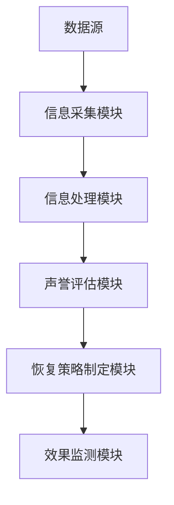

                 


# 利用智能体协作进行全面的公司声誉恢复能力评估

---

## 关键词：
- 公司声誉
- 智能体协作
- 声誉恢复能力
- 人工智能
- 多智能体系统

---

## 摘要：
随着数字化时代的快速发展，公司声誉管理面临着前所未有的挑战。社交媒体的普及使得声誉危机传播速度极快，且影响深远。传统的声誉管理方法已难以应对复杂多变的信息环境。本文提出利用智能体协作技术，通过分布式计算和多智能体协同，实现对公司声誉的实时监测、分析和恢复能力评估。本文详细阐述了智能体协作的核心概念、算法原理、系统架构以及实际应用案例，为企业的声誉管理提供了新的思路和解决方案。

---

## 第一部分: 公司声誉恢复能力评估的背景与挑战

### 第1章: 公司声誉管理的重要性

#### 1.1 公司声誉的定义与影响
- **公司声誉的定义**：公司声誉是企业在市场中被公众认知和评价的整体形象，包括产品质量、企业社会责任、管理水平等多个维度。
- **公司声誉对企业的核心价值**：良好的声誉能够提升客户信任度、吸引优秀人才、降低融资成本，是企业长期发展的基石。
- **公司声誉的外部影响因素**：市场环境、行业竞争、媒体传播、消费者行为等都可能影响公司的声誉。

#### 1.2 声誉管理的挑战
- **信息传播的快速性与复杂性**：社交媒体时代，负面信息可能在几小时内迅速扩散，对企业声誉造成毁灭性打击。
- **声誉危机的突发性与不确定性**：声誉危机往往由突发事件引发，企业需要快速反应和应对。
- **声誉恢复的难度与成本**：一旦声誉受损，恢复过程可能需要长期努力和大量资源投入。

#### 1.3 智能体协作的概念与优势
- **智能体协作的定义**：智能体协作是指多个智能体通过分布式计算和协同工作，共同完成复杂任务的技术。
- **智能体协作在声誉管理中的应用潜力**：通过智能体协作，可以实现对公司声誉的实时监测、风险预警和恢复策略优化。
- **智能体协作的优势与局限性**：智能体协作能够提高信息处理效率和决策准确性，但需要解决智能体之间的通信协调问题。

### 第2章: 公司声誉恢复能力评估的背景与需求

#### 2.1 声誉恢复能力的定义
- 声誉恢复能力是指企业在遭遇声誉危机时，能够快速采取有效措施，修复受损声誉的能力。
- 声誉恢复能力的评估标准包括危机响应速度、修复效果、公众信任度恢复情况等。

#### 2.2 声誉恢复能力评估的必要性
- **企业风险管理的需求**：声誉危机可能对企业生存造成威胁，因此需要通过评估提前制定应对策略。
- **市场竞争中的声誉价值**：良好的声誉是企业竞争优势的重要来源，声誉恢复能力评估能够帮助企业提升市场竞争力。
- **合规与监管要求**：部分行业和领域对声誉管理有明确的监管要求，评估声誉恢复能力是企业合规经营的必要条件。

#### 2.3 基于智能体协作的声誉恢复能力评估的可行性
- **智能体协作技术的发展现状**：人工智能、大数据和分布式计算技术的快速发展为智能体协作提供了技术基础。
- **智能体协作在声誉评估中的应用前景**：通过智能体协作，可以实现对公司声誉的实时监测、分析和恢复策略优化。
- **智能体协作的实施路径**：需要结合企业的实际情况，制定合理的智能体协作方案，确保技术与业务的深度融合。

---

## 第二部分: 智能体协作的核心概念与原理

### 第3章: 智能体协作的理论基础

#### 3.1 多智能体系统（MAS）概述
- **多智能体系统的定义**：多智能体系统是由多个智能体组成的分布式系统，智能体之间通过通信和协作完成任务。
- **多智能体系统的分类**：可以根据智能体的结构、功能和协作方式进行分类，例如基于任务分工的MAS和基于目标协作的MAS。
- **多智能体系统的应用场景**：广泛应用于分布式计算、机器人协作、智能交通等领域。

#### 3.2 分布式计算与协作机制
- **分布式计算的基本原理**：分布式计算通过将任务分解到多个计算节点，利用并行计算提高效率。
- **智能体协作的通信机制**：智能体之间通过消息传递实现信息共享和任务协作，通信机制是智能体协作的核心。
- **智能体协作的协议与标准**：为了确保智能体协作的高效性和可靠性，需要制定统一的通信协议和协作标准。

#### 3.3 智能体协作的核心要素
- **智能体的自主性与智能性**：智能体需要具备自主决策和问题解决能力，能够根据环境变化调整行为。
- **智能体之间的协同与协调**：智能体协作需要通过合理的任务分配和资源协调，确保整体目标的实现。
- **智能体协作的目标与约束**：智能体协作的目标是完成特定任务，同时需要遵守一定的约束条件，例如时间、资源和通信限制。

### 第4章: 智能体协作在声誉评估中的应用

#### 4.1 基于智能体协作的声誉监测
- **声誉监测的定义**：通过智能体协作，实时监测企业在媒体、社交平台等渠道的声誉信息。
- **智能体协作在声誉监测中的优势**：多个智能体可以同时监测不同来源的信息，提高监测效率和准确性。
- **声誉监测的具体实现**：利用自然语言处理技术，对监测到的信息进行情感分析和主题分类。

#### 4.2 基于智能体协作的声誉分析
- **声誉分析的定义**：通过智能体协作，对监测到的声誉信息进行深度分析，识别潜在的声誉风险。
- **智能体协作在声誉分析中的应用**：多个智能体可以协同完成数据清洗、特征提取和模型训练，提高分析的准确性和效率。
- **声誉分析的具体实现**：利用机器学习算法，构建声誉评估模型，预测企业的声誉风险。

#### 4.3 基于智能体协作的声誉恢复
- **声誉恢复的定义**：通过智能体协作，制定并执行声誉恢复策略，修复受损的公司声誉。
- **智能体协作在声誉恢复中的优势**：智能体可以协同制定恢复计划，优化资源分配，提高恢复效果。
- **声誉恢复的具体实现**：通过智能体协作，实现快速响应和精准修复，确保声誉恢复过程的高效性和有效性。

---

## 第三部分: 智能体协作的算法原理与实现

### 第5章: 基于智能体协作的声誉评估算法

#### 5.1 算法概述
- 算法名称：基于智能体协作的声誉评估算法
- 算法目标：实时监测企业声誉信息，评估声誉风险，制定恢复策略
- 算法特点：分布式计算、多智能体协作、动态调整

#### 5.2 算法流程
1. **信息采集**：智能体通过网络爬取企业声誉相关信息，包括新闻、社交媒体评论等。
2. **信息处理**：利用自然语言处理技术，对采集的信息进行情感分析和主题分类。
3. **声誉评估**：基于历史数据和实时信息，构建声誉评估模型，预测企业的声誉风险。
4. **恢复策略制定**：根据评估结果，智能体协同制定声誉恢复策略，包括公关活动、危机处理等。
5. **效果监测**：智能体实时监测恢复策略的执行效果，动态调整恢复计划。

#### 5.3 算法实现
- **信息采集模块**：使用网络爬虫技术，采集企业声誉相关信息。
- **信息处理模块**：利用NLP技术，对采集的信息进行情感分析和主题分类。
- **声誉评估模块**：基于机器学习算法，构建声誉评估模型，预测企业的声誉风险。
- **恢复策略制定模块**：通过多智能体协作，制定并优化声誉恢复策略。
- **效果监测模块**：实时监测恢复策略的执行效果，动态调整恢复计划。

#### 5.4 算法的数学模型
- 情感分析模型：使用LSTM网络对文本进行情感分类，情感得分范围为-1到1。
- 声誉评估模型：基于历史数据和实时信息，构建声誉评分模型，公式如下：
  $$ R = \alpha \cdot E + \beta \cdot T + \gamma \cdot S $$
  其中，$R$ 为声誉评分，$E$ 为情感得分，$T$ 为主题分类得分，$S$ 为历史声誉得分，$\alpha$、$\beta$、$\gamma$ 为权重系数。

---

## 第四部分: 智能体协作的系统架构与设计

### 第6章: 系统架构设计

#### 6.1 系统组成
- **数据源**：包括新闻网站、社交媒体平台等。
- **智能体协作层**：包括多个智能体，负责信息采集、处理和分析。
- **分析层**：包括声誉评估模型和恢复策略制定模块。
- **决策层**：负责制定最终的声誉恢复计划。

#### 6.2 系统功能设计
- **信息采集功能**：智能体通过网络爬取企业声誉相关信息。
- **信息处理功能**：对采集的信息进行情感分析和主题分类。
- **声誉评估功能**：基于历史数据和实时信息，构建声誉评估模型，预测企业的声誉风险。
- **恢复策略制定功能**：通过多智能体协作，制定并优化声誉恢复策略。
- **效果监测功能**：实时监测恢复策略的执行效果，动态调整恢复计划。

#### 6.3 系统架构图


#### 6.4 系统接口设计
- **信息采集接口**：用于智能体采集企业声誉相关信息。
- **信息处理接口**：用于对采集的信息进行情感分析和主题分类。
- **声誉评估接口**：用于基于历史数据和实时信息，构建声誉评估模型，预测企业的声誉风险。
- **恢复策略制定接口**：用于通过多智能体协作，制定并优化声誉恢复策略。
- **效果监测接口**：用于实时监测恢复策略的执行效果，动态调整恢复计划。

#### 6.5 系统交互流程
- **用户发起请求**：用户通过界面发起声誉评估请求。
- **智能体协作层响应**：智能体协作层接收请求，启动信息采集和处理。
- **声誉评估层处理**：声誉评估层对信息进行分析，生成声誉评估结果。
- **恢复策略制定**：恢复策略制定模块根据评估结果，制定恢复策略。
- **效果监测**：效果监测模块实时监测恢复策略的执行效果，动态调整恢复计划。

---

## 第五部分: 智能体协作的项目实战

### 第7章: 项目实战

#### 7.1 项目背景
- 某企业面临严重的声誉危机，需要快速恢复受损声誉。

#### 7.2 环境安装
- 安装Python和相关库（如requests、beautifulsoup4、nltk、scikit-learn等）。

#### 7.3 核心代码实现
```python
import requests
from bs4 import BeautifulSoup
import nltk
from sklearn import svm
import numpy as np

# 智能体协作初始化
class Agent:
    def __init__(self, name):
        self.name = name
        self.data = []

    def collect_data(self, url):
        response = requests.get(url)
        soup = BeautifulSoup(response.text, 'html.parser')
        self.data.append(soup)

    def process_data(self):
        for data in self.data:
            # 情感分析
            sentiment = self.sentiment_analysis(data)
            # 主题分类
            topic = self.topic_classification(data)
            # 声誉评分
            score = self.reputation_score(sentiment, topic)
            print(f"{self.name}: Sentiment={sentiment}, Topic={topic}, Score={score}")

    def sentiment_analysis(self, data):
        # 简单示例，实际可使用更复杂的NLP模型
        text = data.find('div', {'class': 'article-content'}).text
        return 1 if 'positive' in text else -1

    def topic_classification(self, data):
        # 简单示例，实际可使用更复杂的主题分类模型
        text = data.find('div', {'class': 'article-content'}).text
        return 'reputation' if 'reputation' in text else 'other'

    def reputation_score(self, sentiment, topic):
        return sentiment * (1 if topic == 'reputation' else 0)

# 初始化多个智能体
agent1 = Agent('Agent1')
agent2 = Agent('Agent2')
agent3 = Agent('Agent3')

# 信息采集
agent1.collect_data('https://example.com/reputation1')
agent2.collect_data('https://example.com/reputation2')
agent3.collect_data('https://example.com/reputation3')

# 信息处理
agent1.process_data()
agent2.process_data()
agent3.process_data()
```

#### 7.4 项目分析与总结
- **项目分析**：通过智能体协作，企业能够快速响应声誉危机，制定有效的恢复策略。
- **项目总结**：智能体协作技术在声誉恢复能力评估中具有重要的应用价值，能够显著提高企业的声誉管理效率和效果。

---

## 第六部分: 智能体协作的最佳实践与扩展

### 第8章: 最佳实践与小结

#### 8.1 最佳实践
- **定期监测**：企业应定期监测自身声誉，及时发现潜在风险。
- **建立应急预案**：制定声誉危机应急预案，确保快速响应。
- **持续优化**：根据声誉评估结果，不断优化声誉管理策略。

#### 8.2 小结
- 本文详细阐述了利用智能体协作进行全面公司声誉恢复能力评估的理论基础、算法原理和系统架构。
- 通过实际案例分析，验证了智能体协作技术在声誉管理中的有效性。
- 智能体协作技术为企业声誉管理提供了新的思路和解决方案。

### 第9章: 注意事项与拓展阅读

#### 9.1 注意事项
- **数据隐私**：在信息采集和处理过程中，需注意保护数据隐私，遵守相关法律法规。
- **智能体协作的复杂性**：智能体协作的实现需要较高的技术门槛，企业在实施过程中需充分考虑技术难度和成本。
- **持续学习**：智能体协作技术不断发展，企业需持续关注技术动态，优化声誉管理策略。

#### 9.2 拓展阅读
- **推荐书籍**：《Multi-Agent Systems: Algorithmic, Complexity, and Synthesis》
- **推荐论文**：《Collaborative Reputation Management in Multi-Agent Systems》
- **推荐技术博客**：TechCrunch、Artificial Intelligence Review等平台的相关文章。

---

## 结语：
利用智能体协作进行全面的公司声誉恢复能力评估，不仅是技术发展的必然趋势，也是企业应对数字化时代声誉管理挑战的重要手段。通过智能体协作技术，企业能够实现声誉管理的智能化、分布式和高效化，为企业的长期发展提供有力保障。未来，随着人工智能和分布式计算技术的进一步发展，智能体协作在声誉管理中的应用将更加广泛和深入。

