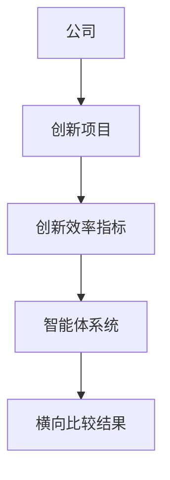
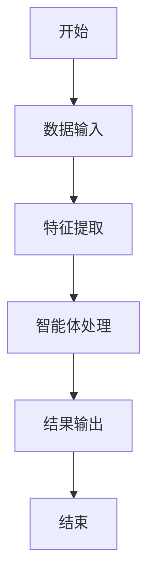
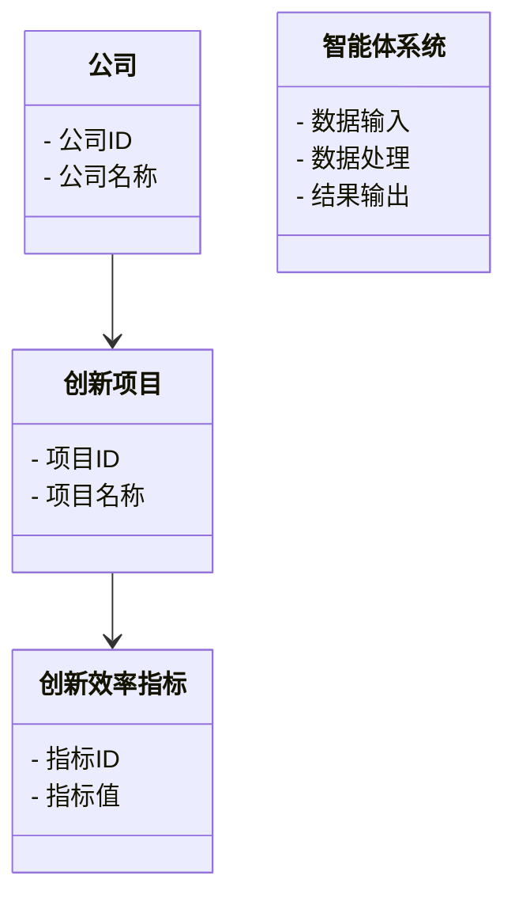
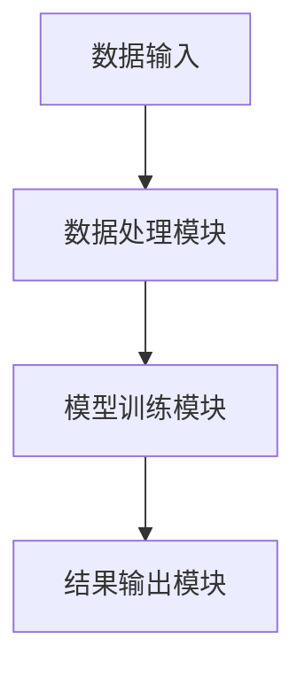
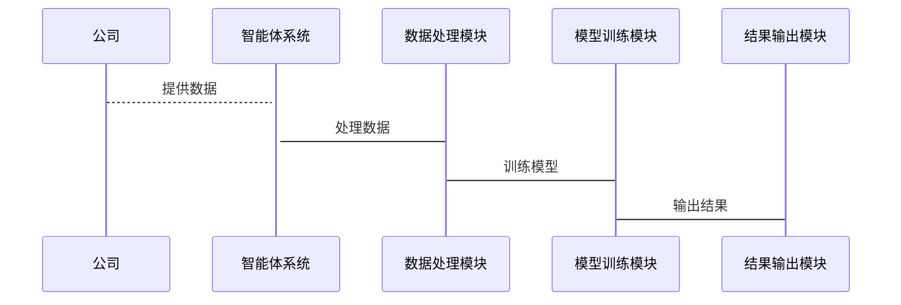

                 


# 利用智能体系统进行全面的公司创新效率横向比较

**关键词**：智能体系统、创新效率、横向比较、算法原理、系统架构、项目实战

**摘要**：本文旨在探讨如何利用智能体系统对公司的创新效率进行横向比较。通过分析创新效率的核心概念、智能体系统的原理、算法实现、系统架构设计以及实际案例，为读者提供全面的解决方案和实践指导。

---

# 第一部分: 智能体系统与公司创新效率横向比较的背景与基础

## 第1章: 背景介绍

### 1.1 问题背景
#### 1.1.1 公司创新效率的重要性
创新是企业发展的核心驱动力，创新效率直接关系到企业的市场竞争力和长期发展。然而，如何量化和比较不同公司的创新效率是一个复杂的问题。

#### 1.1.2 现有创新效率评估的局限性
传统的创新效率评估方法通常依赖主观指标，如专利数量、研发投入等，但这些指标难以全面反映创新的实际效果。

#### 1.1.3 智能体系统在创新效率评估中的作用
智能体系统通过自动化数据处理和分析，能够提供客观、全面的创新效率评估，为横向比较提供可靠依据。

### 1.2 问题描述
#### 1.2.1 创新效率的定义与维度
创新效率可以定义为单位时间内产生的创新成果与投入资源的比率。主要维度包括创新速度、创新质量、创新成本等。

#### 1.2.2 横向比较的需求与挑战
横向比较需要在同一框架下评估不同公司的创新效率，但数据异构性和公司规模差异是主要挑战。

#### 1.2.3 智能体系统如何实现横向比较
智能体系统通过数据清洗、特征提取和模型训练，可以标准化不同公司的创新效率数据，实现横向比较。

### 1.3 问题解决
#### 1.3.1 智能体系统的解决方案
智能体系统通过数据处理、模型训练和结果输出，提供创新效率评估的自动化解决方案。

#### 1.3.2 智能体系统的核心优势
优势包括数据处理能力强、评估结果客观、可扩展性高。

#### 1.3.3 智能体系统的实施步骤
包括数据采集、数据清洗、特征提取、模型训练和结果输出。

### 1.4 智能体系统的边界与外延
#### 1.4.1 系统的边界定义
智能体系统的边界包括数据输入、数据处理和结果输出。

#### 1.4.2 系统的外延与扩展
系统可以扩展到更多数据源和更复杂的模型。

#### 1.4.3 系统与其他技术的关联
智能体系统与其他技术如大数据分析、机器学习密切相关。

### 1.5 核心概念结构与组成
#### 1.5.1 核心概念的组成要素
包括数据输入、特征提取、模型训练和结果输出。

#### 1.5.2 概念之间的关系
数据输入与特征提取相互关联，特征提取影响模型训练，模型训练决定结果输出。

#### 1.5.3 系统的模块化结构
系统由数据处理模块、模型训练模块和结果输出模块组成。

---

## 第2章: 智能体系统的核心概念与联系

### 2.1 核心概念原理
#### 2.1.1 智能体的定义与特征
智能体是一种能够感知环境并采取行动的实体，具有自主性、反应性、目标性和学习性。

#### 2.1.2 智能体系统的运行机制
通过数据处理、特征提取、模型训练和结果输出实现创新效率评估。

#### 2.1.3 智能体系统的功能模块
包括数据处理模块、模型训练模块和结果输出模块。

### 2.2 概念属性特征对比
#### 2.2.1 智能体与传统算法的对比
智能体具有自主性和学习性，传统算法依赖预定义规则。

#### 2.2.2 不同智能体系统的对比
基于规则的智能体与基于学习的智能体在性能和复杂度上有差异。

#### 2.2.3 智能体系统的优缺点分析
优点包括灵活性和适应性，缺点包括复杂性和学习曲线。

### 2.3 ER实体关系图架构


---

## 第3章: 智能体系统算法原理讲解

### 3.1 算法原理
#### 3.1.1 比较算法的流程
数据输入、特征提取、模型训练和结果输出。

#### 3.1.2 智能体算法的流程
数据处理、特征提取、模型训练和结果输出。

#### 3.1.3 算法的数学模型
创新效率 = ∑(创新成果) / ∑(创新投入)

### 3.2 算法流程图


### 3.3 算法实现代码
```python
def compare_efficiency(company_data):
    # 特征提取
    features = extract_features(company_data)
    # 智能体处理
    result = agent_process(features)
    return result
```

### 3.4 算法的数学模型和公式
创新效率的计算公式为：
$$ 创新效率 = \frac{\sum 创新成果}{\sum 创新投入} $$

---

## 第4章: 系统分析与架构设计方案

### 4.1 问题场景介绍
如何设计一个智能体系统来实现公司创新效率的横向比较。

### 4.2 项目介绍
一个智能体系统用于评估和比较不同公司的创新效率。

### 4.3 系统功能设计
#### 4.3.1 领域模型


### 4.4 系统架构设计


### 4.5 系统接口设计
接口包括数据输入接口、特征提取接口和结果输出接口。

### 4.6 系统交互


---

## 第5章: 项目实战

### 5.1 环境安装
安装Python、机器学习库和数据处理工具。

### 5.2 核心代码实现
```python
def extract_features(company_data):
    # 提取特征
    features = company_data[['专利数量', '研发投入']]
    return features

def agent_process(features):
    # 智能体处理
    model = train_model(features)
    result = model.predict(features)
    return result
```

### 5.3 代码应用解读与分析
代码实现数据提取和模型训练，输出创新效率评估结果。

### 5.4 实际案例分析
分析一家公司与行业平均水平的创新效率差异。

### 5.5 项目小结
项目展示了智能体系统在创新效率横向比较中的应用。

---

## 第6章: 最佳实践与注意事项

### 6.1 最佳实践
数据预处理、模型优化和结果验证是关键。

### 6.2 小结
智能体系统能够有效提升公司创新效率的横向比较。

### 6.3 注意事项
数据质量、模型选择和结果解释是需要关注的重点。

### 6.4 拓展阅读
推荐相关书籍和论文，供读者深入学习。

---

## 附录

### 附录A: 工具安装指南
如何安装Python和相关库。

### 附录B: 术语表
解释书中使用的专业术语。

### 附录C: 参考文献
列出参考的书籍和论文。

---

通过以上内容，您可以开始撰写详细的博客文章。

