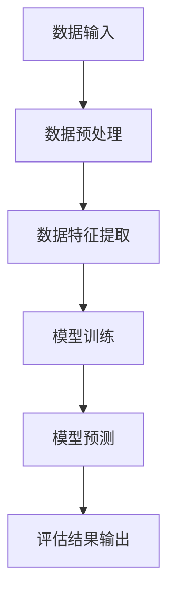
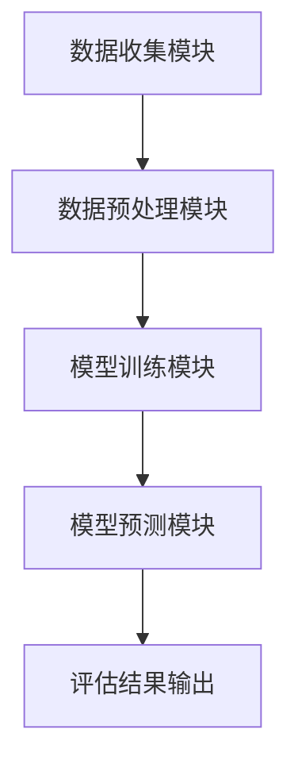

                 


# 利用智能体系统进行全面的公司无形资产价值量化

## 关键词：智能体系统、无形资产、价值量化、人工智能、资产评估

## 摘要：  
随着企业数字化转型的深入，无形资产（如品牌价值、知识产权、客户关系等）在企业价值中的占比越来越大。然而，传统的无形资产评估方法往往依赖主观判断，缺乏数据支持和动态评估能力。本文将介绍如何利用智能体系统，结合人工智能和大数据技术，实现对公司无形资产的全面价值量化。通过智能体系统，我们可以实时收集和分析数据，建立动态的评估模型，从而更准确地反映无形资产的价值变化。本文将从智能体系统的原理、算法实现、系统架构设计到实际案例分析，全面探讨如何利用智能体系统进行无形资产价值量化。

---

# 第1章: 智能体系统与无形资产价值量化背景

## 1.1 无形资产价值量化的重要性

### 1.1.1 无形资产的定义与分类

无形资产是指企业拥有或控制的，没有实物形态但能够为企业带来长期经济利益的资源。常见的无形资产包括：

- **品牌价值**：品牌的知名度和美誉度直接影响企业的市场价值。
- **知识产权**：专利、商标、版权等。
- **客户关系**：客户数据库的价值。
- **商誉**：企业并购中产生的商誉。
- **技术资产**：核心技术、研发能力等。

### 1.1.2 无形资产价值量化的意义

- **提升企业价值**：准确评估无形资产价值，帮助企业在并购、融资等活动中获得更高的估值。
- **优化资源配置**：通过动态评估，企业可以更好地分配资源，提升运营效率。
- **风险管理**：及时发现无形资产的价值波动，帮助企业规避潜在风险。

### 1.1.3 传统无形资产评估的局限性

传统的无形资产评估方法主要依赖于主观判断和历史数据，存在以下问题：

- **缺乏实时性**：无法实时反映市场变化对企业无形资产的影响。
- **数据不足**：传统方法往往依赖少量的历史数据，难以捕捉复杂市场环境中的动态变化。
- **主观性较强**：评估结果受到评估师主观判断的影响，可能存在偏差。

## 1.2 智能体系统的核心概念

### 1.2.1 智能体系统的定义

智能体系统（Intelligent Agent System）是一种能够感知环境、自主决策、执行任务的智能系统。它具有以下核心特征：

- **自主性**：能够在没有外部干预的情况下自主运行。
- **反应性**：能够实时感知环境变化并做出响应。
- **学习能力**：通过数据和经验不断优化自身的决策能力。
- **协作性**：能够与其他智能体或系统协同工作。

### 1.2.2 智能体系统的特征

1. **动态适应性**：智能体系统能够根据环境变化调整自身的行为策略。
2. **数据驱动**：通过收集和分析大量数据，智能体系统能够做出更精准的决策。
3. **自我优化**：通过机器学习算法，智能体系统能够不断优化自身的模型和策略。

### 1.2.3 智能体系统与无形资产价值量化的联系

智能体系统通过实时数据收集、分析和动态评估，能够帮助企业更准确地量化无形资产的价值。例如，智能体系统可以通过分析社交媒体数据、市场反馈、销售数据等，动态评估品牌价值的变化。

## 1.3 问题背景与目标

### 1.3.1 无形资产价值评估的难点

- **数据复杂性**：无形资产的评估涉及多种类型的数据，如文本、图像、销售数据等。
- **动态变化**：市场环境的变化会影响无形资产的价值，传统静态评估方法难以捕捉这种变化。
- **多维度评估**：无形资产的价值需要从多个维度进行评估，如品牌知名度、客户忠诚度等。

### 1.3.2 引入智能体系统的必要性

智能体系统能够通过实时数据收集和分析，提供动态的评估能力。例如，智能体系统可以通过分析社交媒体上的用户反馈，实时评估品牌声誉的变化。

### 1.3.3 本书的目标与范围

本书的目标是通过智能体系统，帮助企业实现对公司无形资产的全面价值量化。内容涵盖智能体系统的原理、算法实现、系统架构设计以及实际案例分析。

## 1.4 本章小结

本章介绍了无形资产价值量化的重要性，以及智能体系统在这一领域的应用。通过对比传统评估方法的局限性和智能体系统的优势，我们明确了引入智能体系统进行无形资产价值量化的必要性。

---

# 第2章: 智能体系统与无形资产的核心概念

## 2.1 智能体系统的原理

### 2.1.1 智能体的构成要素

智能体系统主要由以下构成要素组成：

1. **感知层**：负责收集环境数据，如传感器、API接口等。
2. **决策层**：通过机器学习算法对数据进行分析，生成决策指令。
3. **执行层**：根据决策层的指令，执行具体的任务。

### 2.1.2 智能体的感知与决策机制

智能体的感知与决策机制是其核心之一。感知层通过多种数据源（如API、传感器、日志文件等）收集数据，决策层通过机器学习模型对数据进行分析，并生成决策指令。例如，智能体可以通过分析社交媒体数据，评估品牌声誉的变化，并根据变化情况调整品牌价值的评估结果。

### 2.1.3 智能体的自适应能力

智能体系统具有很强的自适应能力，能够根据环境变化优化自身的模型和策略。例如，智能体系统可以通过在线学习算法，实时更新评估模型，以适应市场的动态变化。

## 2.2 无形资产的特征与评估维度

### 2.2.1 无形资产的无形性

无形资产没有实物形态，其价值主要体现在企业的品牌、技术、客户关系等方面。这种无形性使得传统的资产评估方法难以准确反映其价值。

### 2.2.2 无形资产的可变性

无形资产的价值往往受到市场环境、政策变化等因素的影响，具有较强的可变性。例如，品牌声誉的变化可能会影响企业的品牌价值。

### 2.2.3 无形资产的评估维度

无形资产的评估可以从以下几个维度进行：

- **品牌价值**：通过分析品牌知名度、品牌忠诚度等指标进行评估。
- **客户关系**：通过分析客户满意度、客户留存率等指标进行评估。
- **技术资产**：通过分析技术的先进性、技术壁垒等指标进行评估。

## 2.3 智能体系统与无形资产的关联

### 2.3.1 智能体系统在无形资产评估中的作用

智能体系统可以通过实时数据收集和分析，动态评估无形资产的价值。例如，智能体系统可以通过分析社交媒体数据，实时评估品牌声誉的变化。

### 2.3.2 智能体系统如何提升评估效率

智能体系统通过自动化数据收集和分析，能够显著提升评估效率。例如，智能体系统可以通过自动化爬虫技术，实时收集市场数据，并快速生成评估报告。

### 2.3.3 智能体系统与无形资产价值的关系

智能体系统通过动态评估，能够更准确地反映无形资产的价值变化。例如，智能体系统可以通过分析市场数据，动态调整品牌价值的评估结果。

## 2.4 核心概念对比表

| 概念         | 特征                     | 与智能体系统的关联                     |
|--------------|--------------------------|----------------------------------------|
| 无形资产     | 无形性、可变性           | 智能体系统通过数据驱动进行动态评估     |
| 智能体系统   | 自适应、实时性           | 提供动态评估能力，提升评估准确性       |

## 2.5 ER实体关系图

```mermaid
erd
  实体1: 无形资产
    - 资产ID: 唯一标识符
    - 资产类型: 类别
    - 资产价值: 数值
  实体2: 智能体系统
    - 系统ID: 唯一标识符
    - 系统功能: 描述
    - 系统输入: 数据类型
  关系: 无形资产评估
    - 实体1 --> 实体2: 通过智能体系统进行评估
```

## 2.6 本章小结

本章详细介绍了智能体系统的核心概念，以及其在无形资产评估中的应用。通过对比分析，我们明确了智能体系统在提升无形资产评估效率和准确性方面的优势。

---

# 第3章: 智能体系统驱动的无形资产价值量化算法原理

## 3.1 算法概述

### 3.1.1 算法目标

智能体系统驱动的无形资产价值量化算法的目标是通过实时数据收集和分析，动态评估无形资产的价值。例如，算法可以通过分析社交媒体数据，实时评估品牌声誉的变化。

### 3.1.2 算法输入与输出

- **输入**：包括各种类型的数据，如文本数据（社交媒体评论）、数值数据（销售数据）、时间序列数据（市场指数）等。
- **输出**：包括无形资产的实时价值评估结果，以及评估结果的变化趋势。

### 3.1.3 算法的基本流程

算法的基本流程包括以下几个步骤：

1. **数据预处理**：对收集到的数据进行清洗和标准化处理。
2. **数据特征提取**：从数据中提取有助于评估的特征。
3. **模型训练**：使用机器学习算法训练评估模型。
4. **模型预测**：利用训练好的模型进行预测，并生成评估结果。

## 3.2 算法原理

### 3.2.1 数据预处理

数据预处理是算法实现的基础。常见的数据预处理方法包括：

- **数据清洗**：去除噪声数据，如重复数据、异常值等。
- **数据标准化**：将数据标准化到统一的范围内，如归一化处理。

### 3.2.2 智能体的感知与决策机制

智能体的感知与决策机制是算法的核心。感知层通过多种数据源收集数据，决策层通过机器学习算法对数据进行分析，并生成决策指令。例如，智能体可以通过分析社交媒体数据，评估品牌声誉的变化。

### 3.2.3 价值量化模型

价值量化模型是算法的核心部分，负责将输入的数据转化为具体的评估结果。常见的价值量化模型包括：

- **线性回归模型**：用于预测连续型变量，如品牌价值。
- **随机森林模型**：用于分类和回归任务，能够处理多种类型的数据。
- **深度学习模型**：如LSTM，用于处理时间序列数据。

## 3.3 算法流程图



## 3.4 算法实现

### 3.4.1 算法实现代码

以下是一个简单的Python代码示例，展示了如何使用机器学习算法进行无形资产价值量化。

```python
import pandas as pd
from sklearn.model_selection import train_test_split
from sklearn.ensemble import RandomForestRegressor
from sklearn.metrics import mean_absolute_error

# 数据预处理
data = pd.read_csv('asset_data.csv')
X = data.drop('value', axis=1)
y = data['value']

# 数据分割
X_train, X_test, y_train, y_test = train_test_split(X, y, test_size=0.2, random_state=42)

# 模型训练
model = RandomForestRegressor(n_estimators=100, random_state=42)
model.fit(X_train, y_train)

# 模型预测
y_pred = model.predict(X_test)

# 评估结果
mae = mean_absolute_error(y_test, y_pred)
print(f'均绝对误差: {mae}')
```

### 3.4.2 算法数学模型

以下是价值量化模型的数学表达式：

$$
y = \beta_0 + \beta_1x_1 + \beta_2x_2 + \dots + \beta_nx_n + \epsilon
$$

其中：
- \( y \) 表示无形资产的价值。
- \( x_i \) 表示影响无形资产价值的各个特征。
- \( \beta_i \) 表示各个特征的系数。
- \( \epsilon \) 表示误差项。

### 3.4.3 算法实现步骤

1. **数据收集**：通过多种数据源（如社交媒体、销售数据）收集相关数据。
2. **数据预处理**：对收集到的数据进行清洗和标准化处理。
3. **特征提取**：从数据中提取有助于评估的特征。
4. **模型训练**：使用机器学习算法训练评估模型。
5. **模型预测**：利用训练好的模型进行预测，并生成评估结果。

## 3.5 算法实现的数学推导

以下是价值量化模型的数学推导过程：

1. **数据矩阵表示**：将输入数据表示为矩阵 \( X \)，输出数据表示为向量 \( y \)。
2. **模型假设**：假设模型的形式为线性回归模型。
3. **损失函数**：使用均方误差（MSE）作为损失函数。
4. **优化目标**：最小化损失函数，求解模型参数 \( \beta \)。

优化目标为：

$$
\min_{\beta} \frac{1}{2m} \sum_{i=1}^{m} (y_i - \beta^T x_i)^2
$$

其中：
- \( m \) 表示样本数量。
- \( x_i \) 表示第 \( i \) 个样本的特征向量。
- \( y_i \) 表示第 \( i \) 个样本的目标值。

## 3.6 算法实现的注意事项

1. **数据质量问题**：数据预处理阶段需要仔细检查数据质量，确保数据的准确性和完整性。
2. **模型选择**：选择合适的模型需要根据具体场景和数据特征进行分析。
3. **模型调优**：通过交叉验证等方法，优化模型的超参数，提升模型的性能。

## 3.7 本章小结

本章详细介绍了智能体系统驱动的无形资产价值量化算法的实现过程。通过具体的代码示例和数学推导，我们了解了算法的核心原理和实现步骤。

---

# 第4章: 智能体系统驱动的无形资产价值量化算法实现

## 4.1 系统分析与架构设计方案

### 4.1.1 问题场景介绍

本章将通过一个具体的案例，介绍如何利用智能体系统进行无形资产价值量化。例如，我们可以通过智能体系统，实时评估某公司的品牌声誉变化。

### 4.1.2 系统功能设计

以下是系统的主要功能模块：

1. **数据收集模块**：通过多种数据源（如API、传感器）收集相关数据。
2. **数据预处理模块**：对收集到的数据进行清洗和标准化处理。
3. **模型训练模块**：使用机器学习算法训练评估模型。
4. **模型预测模块**：利用训练好的模型进行预测，并生成评估结果。

### 4.1.3 系统架构设计

以下是系统的架构图：



### 4.1.4 系统接口设计

系统主要接口包括：

- **数据输入接口**：用于接收外部数据源的数据。
- **数据输出接口**：用于输出评估结果。
- **模型接口**：用于与机器学习模型进行交互。

### 4.1.5 系统交互流程

以下是系统的交互流程图：

```mermaid
graph TD
    U[用户] --> A[数据收集模块]: 提供数据源
    A --> B[数据预处理模块]: 处理数据
    B --> C[模型训练模块]: 训练模型
    C --> D[模型预测模块]: 进行预测
    D --> E[评估结果输出]: 输出结果
```

## 4.2 项目实战

### 4.2.1 环境安装

以下是项目实战所需的环境配置：

1. **Python**：建议使用Python 3.8或更高版本。
2. **Pandas**：用于数据处理。
3. **Scikit-learn**：用于机器学习算法。
4. **Jupyter Notebook**：用于代码实现和结果展示。

### 4.2.2 核心代码实现

以下是核心代码实现：

```python
import pandas as pd
from sklearn.ensemble import RandomForestRegressor
from sklearn.model_selection import train_test_split
from sklearn.metrics import mean_absolute_error

# 数据预处理
data = pd.read_csv('asset_data.csv')
X = data.drop('value', axis=1)
y = data['value']

# 数据分割
X_train, X_test, y_train, y_test = train_test_split(X, y, test_size=0.2, random_state=42)

# 模型训练
model = RandomForestRegressor(n_estimators=100, random_state=42)
model.fit(X_train, y_train)

# 模型预测
y_pred = model.predict(X_test)

# 评估结果
mae = mean_absolute_error(y_test, y_pred)
print(f'均绝对误差: {mae}')
```

### 4.2.3 代码解读与分析

1. **数据预处理**：使用Pandas库对数据进行处理，包括清洗和标准化。
2. **数据分割**：将数据分为训练集和测试集，用于模型训练和评估。
3. **模型训练**：使用随机森林回归模型进行训练。
4. **模型预测**：利用训练好的模型进行预测，并生成评估结果。
5. **评估结果**：通过均绝对误差（MAE）评估模型的性能。

### 4.2.4 实际案例分析

以下是实际案例的分析过程：

1. **数据收集**：收集某公司的品牌声誉数据，包括社交媒体评论、销售数据等。
2. **数据预处理**：对收集到的数据进行清洗和标准化处理。
3. **模型训练**：使用随机森林回归模型进行训练。
4. **模型预测**：利用训练好的模型进行预测，生成品牌声誉的实时评估结果。
5. **结果分析**：通过分析评估结果，帮助企业优化品牌管理策略。

## 4.3 项目小结

本章通过实际案例，详细介绍了如何利用智能体系统进行无形资产价值量化。通过代码实现和案例分析，我们了解了算法在实际应用中的具体操作和实现步骤。

---

# 第5章: 总结与展望

## 5.1 总结

通过本篇文章，我们了解了如何利用智能体系统进行公司无形资产价值量化。智能体系统通过实时数据收集和分析，能够动态评估无形资产的价值，帮助企业更好地管理和优化无形资产。

## 5.2 展望

随着人工智能和大数据技术的不断发展，智能体系统在无形资产评估中的应用将更加广泛和深入。未来，我们可以进一步研究如何结合深度学习算法，提升评估模型的准确性和实时性。

## 5.3 最佳实践 Tips

1. **数据质量管理**：数据预处理阶段需要仔细检查数据质量，确保数据的准确性和完整性。
2. **模型选择与调优**：根据具体场景和数据特征，选择合适的模型，并通过交叉验证等方法优化模型的超参数。
3. **系统架构设计**：在系统架构设计阶段，需要充分考虑系统的可扩展性和可维护性。

## 5.4 小结

智能体系统在无形资产评估中的应用具有广阔的应用前景。通过不断优化算法和系统架构，我们可以进一步提升评估的准确性和效率。

---

# 附录

## 附录 A: 常见问题解答

1. **问题**：智能体系统在无形资产评估中的优势是什么？
   - **答案**：智能体系统能够通过实时数据收集和分析，动态评估无形资产的价值，显著提升评估的准确性和效率。

2. **问题**：如何选择合适的机器学习算法？
   - **答案**：根据具体场景和数据特征，选择合适的算法。例如，随机森林适合处理多种类型的数据，而深度学习模型适合处理时间序列数据。

3. **问题**：如何优化模型的性能？
   - **答案**：通过数据增强、超参数调优、模型集成等方法，可以有效提升模型的性能。

---

## 附录 B: 参考文献

1. 《机器学习实战》
2. 《智能体系统与人工智能》
3. 《无形资产评估与管理》

---

通过以上内容，我们详细介绍了如何利用智能体系统进行全面的公司无形资产价值量化。希望本文能够为相关领域的研究和实践提供有价值的参考。

