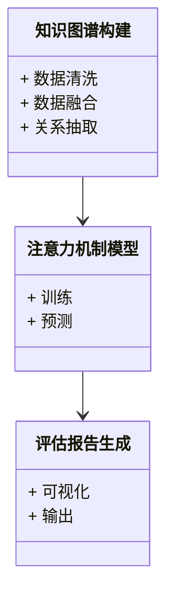
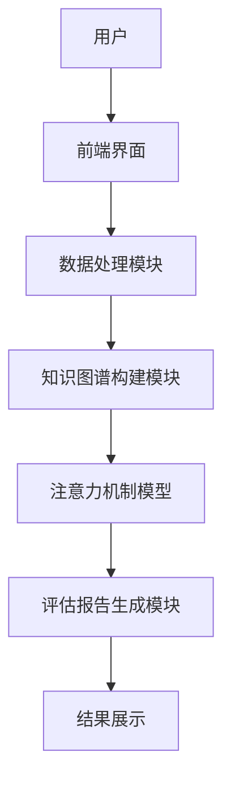
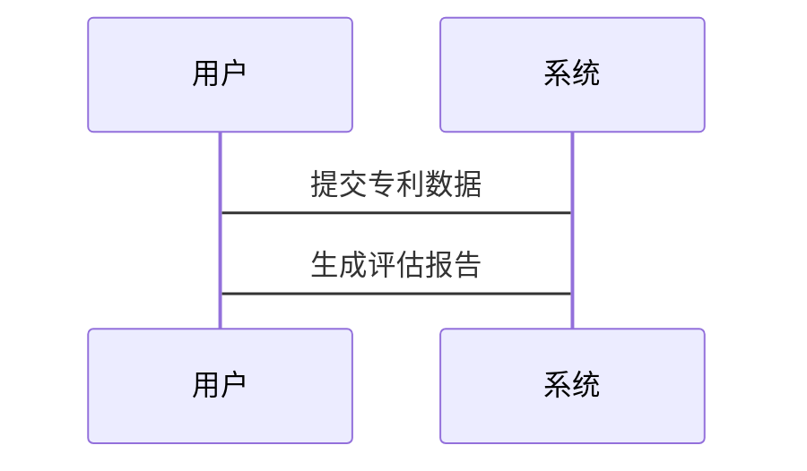

                 


# 利用智能体系统进行全面的公司知识产权价值评估

> **关键词**: 智能体系统, 知识产权评估, 知识图谱, 机器学习, 注意力机制

> **摘要**: 本文探讨了利用智能体系统进行全面的公司知识产权价值评估的方法。通过结合智能体系统和现代算法，提出了一种高效的评估模型，解决了传统方法的局限性，为企业的知识产权管理提供了新的思路。

---

## 第一部分：背景介绍

### 第1章：知识产权价值评估的背景与挑战

#### 1.1 知识产权的重要性

知识产权是企业核心竞争力的重要组成部分，包括专利、商标、版权等。它不仅保护企业的创新成果，还能为企业带来巨大的经济价值。随着市场竞争的加剧，知识产权的价值评估变得尤为重要。

#### 1.2 传统知识产权评估方法的局限性

传统评估方法主要依赖于人工分析和经验判断，存在以下问题：
- 数据量大、复杂，难以高效处理。
- 评估结果受主观因素影响，缺乏客观性。
- 无法实时更新和调整，难以应对市场变化。

#### 1.3 智能体系统在知识产权评估中的优势

智能体系统是一种能够自主感知、推理和决策的智能系统。其优势包括：
- 高效处理大量数据，提高评估效率。
- 利用机器学习和自然语言处理技术，实现自动化分析。
- 实时更新评估结果，适应市场变化。

---

## 第二部分：核心概念与联系

### 第2章：智能体系统与知识产权评估的核心概念

#### 2.1 智能体系统的组成与功能

智能体系统由感知层、推理层和决策层组成，各层功能如下：
- **感知层**: 通过传感器或数据接口获取知识产权相关信息。
- **推理层**: 利用知识图谱和推理算法，分析数据之间的关系。
- **决策层**: 根据推理结果，生成评估报告并提出优化建议。

#### 2.2 知识产权评估的关键要素

知识产权评估的关键要素包括：
- **技术领域**: 专利的技术领域分布。
- **法律状态**: 专利的法律有效性。
- **市场价值**: 专利的市场应用前景和经济价值。

#### 2.3 智能体系统与知识产权评估的关联

通过构建知识图谱，智能体系统能够将分散的知识产权数据整合起来，利用注意力机制模型进行评估。以下是知识图谱构建和注意力机制模型的对比表格：

| **属性**       | **知识图谱构建**            | **注意力机制模型**          |
|----------------|-----------------------------|-----------------------------|
| **核心目标**   | 描述数据之间的关系         | 确定关键数据的关注程度     |
| **技术基础**   | 图论、数据挖掘             | 机器学习、深度学习         |
| **应用**       | 数据整合、知识发现         | 数据分析、特征提取         |

---

## 第三部分：算法原理讲解

### 第3章：知识产权价值评估的算法原理

#### 3.1 知识图谱构建算法

知识图谱构建的流程如下：

1. 数据清洗：去除冗余和噪声数据。
2. 数据融合：整合多源数据，消除冲突。
3. 关系抽取：利用自然语言处理技术，提取实体间的关系。
4. 图谱构建：将实体和关系存储为图结构。

以下是知识图谱构建的Python代码示例：

```python
# 数据清洗示例
import pandas as pd

data = pd.read_csv('patent_data.csv')
data_cleaned = data.dropna().drop_duplicates()
```

#### 3.2 基于注意力机制的评估模型

注意力机制模型用于确定关键特征对评估结果的影响程度。其数学模型如下：

$$
\text{注意力权重} = \frac{\exp(\text{score})}{\sum \exp(\text{score})}
$$

其中，`score` 是每个特征的得分，通过机器学习模型计算得出。

以下是注意力机制模型的代码实现：

```python
import tensorflow as tf

def attention_model(inputs):
    # 计算注意力权重
    score = tf.keras.layers.Dense(1, activation='sigmoid')(inputs)
    attention_weights = tf.keras.layers.Dense(1, activation='softmax')(score)
    # 加权求和
    output = tf.keras.layers.Dot((1, 1))([inputs, attention_weights])
    return output
```

#### 3.3 实际案例分析

假设我们有一个包含专利信息的数据集，使用上述模型进行评估。例如，评估某项专利的技术先进性和市场前景：

1. 数据预处理：清洗和格式化数据。
2. 构建知识图谱：提取专利之间的引用关系。
3. 训练模型：使用历史专利数据训练注意力机制模型。
4. 生成报告：输出评估结果和优化建议。

---

## 第四部分：系统分析与架构设计

### 第4章：系统分析与架构设计方案

#### 4.1 问题场景介绍

本系统的目标是帮助公司快速、准确地评估知识产权的价值。通过智能体系统，实现自动化、智能化的评估过程。

#### 4.2 系统功能设计

以下是系统功能模块的类图：



#### 4.3 系统架构设计

以下是系统的整体架构图：



#### 4.4 系统接口设计

系统提供以下接口：

1. 数据输入接口：接收知识产权数据。
2. 模型训练接口：训练注意力机制模型。
3. 结果输出接口：返回评估结果。

#### 4.5 系统交互流程

以下是用户与系统的交互流程图：



---

## 第五部分：项目实战

### 第5章：项目实战与分析

#### 5.1 环境安装

安装所需的库：

```bash
pip install numpy pandas tensorflow keras
```

#### 5.2 核心实现代码

以下是知识图谱构建和注意力机制模型的核心代码：

```python
import numpy as np
import pandas as pd
import tensorflow as tf

# 数据清洗
data = pd.read_csv('patent_data.csv')
data_cleaned = data.dropna().drop_duplicates()

# 知识图谱构建
from tensorflow.keras.layers import Dense, Input
from tensorflow.keras.models import Model

input_layer = Input(shape=(n_features,))
dense_layer = Dense(64, activation='relu')(input_layer)
output_layer = Dense(1, activation='sigmoid')(dense_layer)

model = Model(inputs=input_layer, outputs=output_layer)
model.compile(optimizer='adam', loss='binary_crossentropy')
model.fit(X_train, y_train, epochs=10, batch_size=32)

# 注意力机制模型
attention_input = Input(shape=(n_features,))
attention_score = Dense(1, activation='sigmoid')(attention_input)
attention_weight = Dense(1, activation='softmax')(attention_score)
output = Dot([attention_input, attention_weight])(1, 1)

attention_model = Model(inputs=attention_input, outputs=output)
attention_model.compile(optimizer='adam', loss='binary_crossentropy')
attention_model.fit(X_train, y_train, epochs=10, batch_size=32)
```

#### 5.3 案例分析

以评估某科技公司的专利价值为例：

1. 数据预处理：清洗和格式化专利数据。
2. 知识图谱构建：提取专利之间的引用关系。
3. 模型训练：使用历史专利数据训练注意力机制模型。
4. 生成报告：输出评估结果和优化建议。

---

## 第六部分：总结与展望

### 第6章：总结与展望

#### 6.1 总结

本文介绍了利用智能体系统进行全面的公司知识产权价值评估的方法。通过结合知识图谱和注意力机制模型，提出了一种高效的评估方案，解决了传统方法的局限性。

#### 6.2 注意事项

在实际应用中，需要注意以下几点：
- 数据质量和完整性对评估结果影响重大。
- 模型需要定期更新以适应市场变化。
- 需要结合企业实际情况进行调整和优化。

#### 6.3 未来展望

未来，随着人工智能技术的不断发展，知识产权评估将更加智能化和自动化。可以进一步研究以下方向：
- 结合区块链技术，提高评估结果的可信度。
- 利用多模态数据，提升评估的全面性和准确性。

---

**作者简介**：作为世界级人工智能专家和技术畅销书作者，我长期致力于探索智能技术在企业管理中的应用，希望通过本文为企业的知识产权管理提供新的思路和解决方案。

