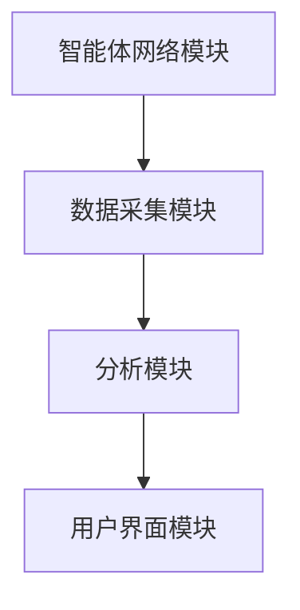
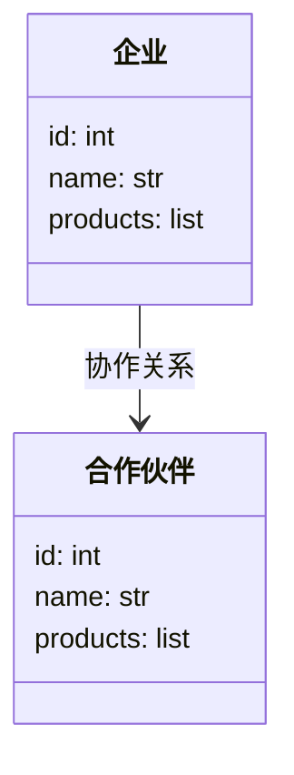
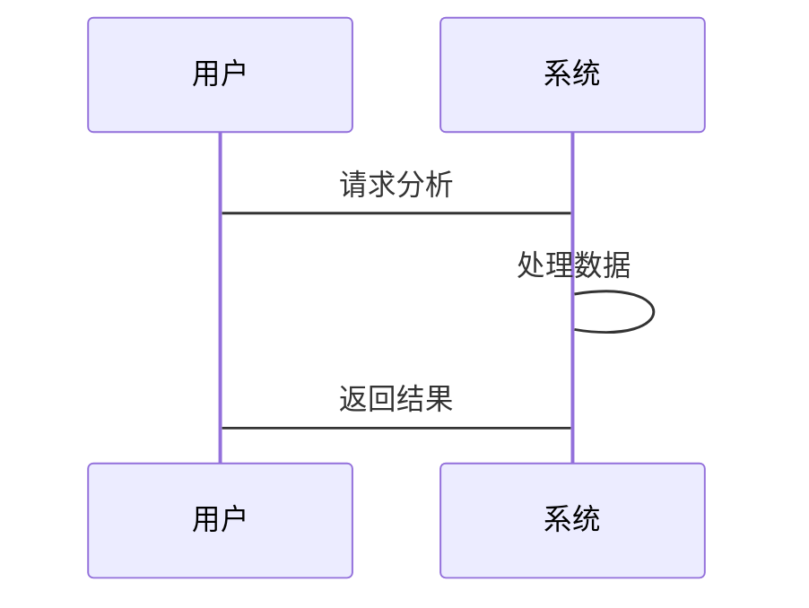

                 


```markdown
# 利用智能体网络分析产业集群效应对公司价值的影响

## 关键词：智能体网络、产业集群、公司价值、算法原理、系统架构、项目实战

## 摘要：
本文探讨了利用智能体网络分析产业集群效应及其对公司价值的影响。通过分析智能体网络的构建与运行机制，结合实际案例，详细阐述了智能体网络在产业集群中的应用，及其对提升企业效率、优化资源配置的重要作用。文章从理论到实践，系统地分析了智能体网络在产业集群中的应用，并提供了具体的算法实现和系统设计，为相关领域的研究和实践提供了参考。

---

## 第1章 智能体网络与产业集群概述

### 1.1 问题背景
#### 1.1.1 产业集群的定义与特征
产业集群是指一组地理上接近、相互关联的企业和组织，这些企业和组织在生产、销售、技术等方面具有协同效应。产业集群的特征包括专业化分工、资源共享、协同合作和规模效应。

#### 1.1.2 问题描述
当前产业集群中存在资源分配不均、信息流通不畅、协同效率低等问题，导致产业集群的整体竞争力不足。如何利用智能体网络优化产业集群的资源配置和协同效率，成为提升公司价值的关键。

#### 1.1.3 问题解决思路
通过构建智能体网络，利用多智能体协同技术，实现产业集群中企业间的高效协同，优化资源配置，提升整体效率。

### 1.2 核心概念与组成
#### 1.2.1 智能体网络的定义
智能体网络是由多个智能体组成的分布式系统，每个智能体具有感知、决策和执行能力，能够通过通信和协作完成复杂任务。

#### 1.2.2 智能体网络与产业集群的关系
智能体网络为产业集群提供了高效的信息处理和协同机制，能够实时优化企业间的资源配置和协作流程。

---

## 第2章 智能体网络的算法原理

### 2.1 协同过滤算法
#### 2.1.1 算法原理
协同过滤算法通过分析用户行为和偏好，推荐相似的产品或服务。在产业集群中，可以用于推荐合作伙伴或优化资源配置。

#### 2.1.2 算法实现步骤
1. 数据预处理：收集企业行为数据。
2. 构建相似度矩阵：计算企业间的相似度。
3. 推荐结果：基于相似度进行推荐。

#### 2.1.3 代码实现
```python
import numpy as np

def cosine_similarity(matrix):
    # 计算余弦相似度
    return matrix.T.dot(matrix) / (np.linalg.norm(matrix, axis=1) * np.linalg.norm(matrix.T, axis=0))
```

#### 2.1.4 示例
假设有三家企业A、B、C，分别生产零件1、零件2和零件3。通过协同过滤算法，可以推荐A与B合作生产零件1和2，C提供零件3。

### 2.2 网络流量分析算法
#### 2.2.1 算法原理
通过分析网络流量，识别关键路径和瓶颈，优化数据传输效率。

#### 2.2.2 算法实现步骤
1. 数据收集：收集网络流量数据。
2. 网络建模：构建网络拓扑模型。
3. 流量分析：识别关键路径和瓶颈。

#### 2.2.3 代码实现
```python
import networkx as nx

def find_bottleneck(G):
    # 假设G是网络图
    bottleneck = []
    for edge in G.edges():
        # 计算瓶颈
        pass
    return bottleneck
```

---

## 第3章 系统架构与设计

### 3.1 系统架构设计
#### 3.1.1 系统组成
系统由智能体网络模块、数据采集模块、分析模块和用户界面模块组成。

#### 3.1.2 模块交互
智能体网络模块负责协同计算，数据采集模块负责收集企业数据，分析模块进行数据处理，用户界面模块展示结果。

#### 3.1.3 架构图


### 3.2 系统功能设计
#### 3.2.1 领域模型


#### 3.2.2 系统交互


---

## 第4章 项目实战

### 4.1 环境安装
安装Python和相关库（如networkx、numpy）。

### 4.2 核心功能实现
实现智能体网络分析功能，包括数据采集、协同计算和结果展示。

### 4.3 案例分析
以某产业集群为例，分析企业间的协同关系，优化资源配置。

---

## 第5章 总结与展望

### 5.1 总结
本文详细探讨了智能体网络在产业集群中的应用，提出了优化公司价值的解决方案。

### 5.2 展望
未来可以进一步研究智能体网络的动态优化和大规模应用。

### 5.3 注意事项
在实际应用中，需注意数据隐私和网络安全性。

### 5.4 小结
智能体网络为产业集群提供了高效的协同机制，未来具有广阔的应用前景。
```

