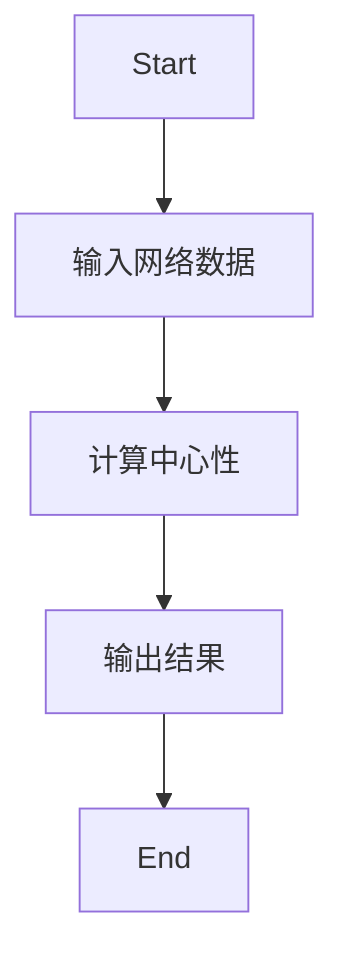

                 

# 利用智能体网络分析公司在产业链中的地位变化

## 关键词：
智能体网络、产业链、公司地位、网络分析、人工智能

## 摘要：
本文探讨了利用智能体网络分析公司在产业链中的地位变化的方法。通过分析产业链的结构和公司间的互动，结合智能体网络的构建与算法，帮助读者理解公司如何在产业链中动态调整其地位。文章涵盖了背景介绍、核心概念、算法原理、系统架构和项目实战，结合具体案例和代码示例，为读者提供全面的指导。

---

# 目录大纲

## 第一部分：产业链与智能体网络基础

### 第1章：产业链与公司地位变化概述
1.1 产业链的基本概念
- 产业链的定义与构成
- 产业链中的公司角色与地位
- 产业链变化的驱动因素

1.2 智能体网络的概念与特点
- 智能体的定义与核心特征
- 网络分析的基本原理
- 智能体网络与产业链分析的结合

1.3 本书的核心目标与方法
- 利用智能体网络分析公司地位变化的目标
- 分析方法与技术路线
- 本书的结构安排

### 第2章：智能体网络的构建与分析
2.1 智能体网络的构建过程
- 数据采集与预处理
- 网络节点与边的定义
- 网络权重的计算方法

2.2 网络分析的核心算法
- 网络中心性分析
- 网络聚类分析
- 网络演化分析

2.3 智能体网络分析的数学模型
- 网络权重计算模型
- 网络中心性计算公式
- 网络演化方程

## 第二部分：产业链分析的系统架构与实现

### 第3章：系统架构设计
3.1 系统功能模块划分
- 数据采集模块
- 网络构建模块
- 分析算法模块
- 结果可视化模块

3.2 系统架构设计图
- 系统架构图（Mermaid）

3.3 系统交互设计
- 系统交互流程图（Mermaid）

### 第4章：算法实现与数学模型

4.1 网络中心性分析算法
- 算法流程图（Mermaid）

4.2 网络聚类分析算法
- 算法步骤说明
- 示例代码实现（Python）
- 算法复杂度分析

### 第5章：数学模型与公式推导

5.1 网络权重计算公式
- $$w_{ij} = \frac{1}{1 + d_{ij}}$$，其中$w_{ij}$表示节点i和j之间的权重，$d_{ij}$是它们的距离。
- 网络权重计算的步骤说明

5.2 网络中心性计算公式
- $$C(i) = \frac{\sum_{j} w_{ij}}{n-1}$$，其中$C(i)$表示节点i的中心性，$n$是节点总数。
- 示例计算过程

## 第三部分：项目实战与案例分析

### 第6章：项目实战

6.1 项目背景与目标
- 选择一个具体行业（如汽车制造）
- 设定分析目标：识别关键公司及其在产业链中的地位变化

6.2 数据采集与预处理
- 数据来源：公开数据、企业年报、行业报告
- 数据清洗：去除重复数据、处理缺失值
- 数据格式：转换为网络分析所需的格式（如邻接矩阵）

6.3 网络构建与分析
- 使用Gephi或NetworkX构建网络图
- 应用中心性分析识别关键公司
- 应用聚类分析识别行业趋势

6.4 分析结果与解读
- 关键公司的识别
- 产业链结构的变化趋势
- 公司地位的变化分析

6.5 案例分析与结果展示
- 具体案例分析：如某汽车制造企业的地位变化
- 结果可视化：使用Gephi生成网络图和中心性分布图

## 第四部分：总结与展望

### 第7章：总结与最佳实践

7.1 本章总结
- 智能体网络在产业链分析中的应用价值
- 关键技术总结：网络构建、算法实现、结果解读

7.2 最佳实践
- 数据质量的重要性
- 模型选择的策略
- 算法优化建议

7.3 未来研究方向
- 更复杂的网络模型
- 结合其他数据分析技术（如机器学习）
- 动态网络分析

### 第8章：小结

- 重申文章核心观点
- 强调智能体网络分析在现代商业中的应用前景
- 鼓励读者应用这些方法进行深入研究

## 附录

- 附录A：相关工具与库的安装与使用指南
- 附录B：完整的Python代码实现
- 附录C：数学公式的详细推导

---

## 总结：
本文通过系统的分析和实践，展示了如何利用智能体网络分析公司在产业链中的地位变化。从基础概念到算法实现，再到项目实战，全面覆盖了相关知识点。通过具体的案例分析，读者可以掌握如何应用这些方法进行实际的商业分析。未来，随着技术的进步，智能体网络分析将在更多领域展现出其独特的优势。

