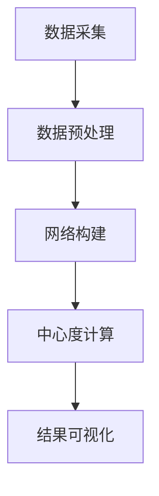

                 

# 利用智能体网络分析公司在创新生态系统中的中心度

## 关键词：智能体网络，创新生态系统，中心度，网络分析，企业创新

## 摘要

在当今快速变化的商业环境中，创新生态系统的复杂性不断增加，企业之间的相互作用和依赖关系变得尤为重要。为了更好地理解公司在创新生态系统中的位置和影响力，智能体网络分析提供了一种强大的工具。通过构建智能体网络，分析公司的中心度，可以揭示其在生态系统中的关键角色和潜在影响。本文将详细介绍智能体网络的基本原理、构建方法、中心度计算模型，以及如何将这些方法应用于实际案例中，帮助读者更好地理解公司在创新生态系统中的地位和作用。

---

# 第1章 创新生态系统与智能体网络概述

## 1.1 创新生态系统的基本概念

### 1.1.1 创新生态系统的定义与特征

创新生态系统是指由多个参与者（如企业、研究机构、供应商、客户等）共同构成的网络，这些参与者通过合作、竞争和资源整合，共同推动技术创新和价值创造。创新生态系统具有动态性、复杂性和网络化的特征，参与者之间的关系错综复杂，形成了一个有机的整体。

### 1.1.2 智能体网络在创新生态系统中的作用

智能体网络是一种基于智能体（Agent）的网络模型，通过模拟个体行为和交互，分析网络的整体结构和动态。在创新生态系统中，智能体网络可以用来建模企业的创新行为，分析企业的创新影响力和资源分配情况。

### 1.1.3 公司在创新生态系统中的中心度

中心度是衡量网络中节点的重要性程度的指标。在创新生态系统中，公司的中心度反映了其在创新网络中的核心地位和影响力。高中心度的公司通常具有更多的创新资源和更广泛的合作网络。

## 1.2 智能体网络的基本原理

### 1.2.1 智能体网络的定义与特点

智能体网络是由多个智能体构成的网络，每个智能体具有自主性、反应性和社会性等特征。智能体网络通过智能体之间的交互和信息共享，形成复杂的网络结构。

### 1.2.2 智能体网络与创新生态系统的结合

将智能体网络应用于创新生态系统，可以通过模拟企业的创新行为和资源分配，分析企业的创新影响力和合作网络。智能体网络可以帮助我们更好地理解创新生态系统中的动态关系。

### 1.2.3 智能体网络的核心要素与功能

智能体网络的核心要素包括智能体、网络结构和交互规则。智能体网络的功能包括信息共享、资源分配、创新扩散等。

---

# 第2章 智能体网络的构建与分析方法

## 2.1 智能体网络的数据采集与处理

### 2.1.1 数据来源与采集方法

数据来源包括企业合作数据、专利数据、市场数据等。数据采集方法包括爬虫技术、API接口调用和问卷调查等。

### 2.1.2 数据清洗与预处理

数据清洗包括去除重复数据、处理缺失值和异常值等。预处理步骤包括数据格式转换、标准化和特征提取。

### 2.1.3 数据建模与网络构建

通过构建图模型（如图论模型），将企业之间的关系表示为节点和边。节点代表企业，边代表企业之间的合作关系。

## 2.2 智能体网络的分析指标

### 2.2.1 中心度的定义与计算方法

中心度是衡量节点在网络中的重要性程度的指标。中心度的计算方法包括度数中心度、介数中心度和接近度中心度。

### 2.2.2 其他网络分析指标

除了中心度，其他网络分析指标还包括网络密度、网络聚类系数和网络路径长度等。

### 2.2.3 中心度在创新生态系统中的意义

在创新生态系统中，中心度反映了企业的创新影响力和资源分配能力。高中心度的企业通常具有更强的创新能力和社会影响力。

## 2.3 智能体网络的可视化与解读

### 2.3.1 网络可视化工具与方法

常用的网络可视化工具包括Gephi、NetworkX和igraph等。可视化方法包括节点着色、边长调整和网络布局优化。

### 2.3.2 中心度的网络可视化展示

通过节点大小和颜色的调整，可以直观展示中心度的高低。中心度高的节点通常表现为较大的节点和较亮的颜色。

### 2.3.3 可视化结果的解读与应用

可视化结果可以帮助我们识别创新生态系统中的核心企业和关键节点，从而制定更有针对性的创新策略。

## 2.4 本章小结

---

# 第3章 智能体网络分析的数学模型与算法

## 3.1 中心度计算的数学模型

### 3.1.1 度数中心度公式

$$ 度数中心度 = \frac{d_i}{n-1} $$

其中，\( d_i \) 表示节点 \( i \) 的度数，\( n \) 表示网络中节点的总数。

### 3.1.2 介数中心度公式

$$ 介数中心度 = \sum_{i=1}^{n} \frac{1}{d_i} $$

### 3.1.3 接近度中心度公式

$$ 接近度中心度 = \frac{1}{\text{ecc}(v)} $$

其中，\( \text{ecc}(v) \) 表示节点 \( v \) 的 eccentricity（偏心距）。

## 3.2 智能体网络分析的算法流程

### 3.2.1 算法流程图

## 3.3 算法实现与优化

### 3.3.1 算法实现步骤

1. 数据采集与预处理
2. 构建智能体网络模型
3. 计算节点中心度
4. 可视化结果展示

### 3.3.2 算法优化方法

通过并行计算和分布式处理优化算法性能，提高计算效率。

### 3.3.3 算法复杂度分析

中心度计算的复杂度主要取决于网络的规模和结构。度数中心度的计算复杂度为 \( O(n + m) \)，介数中心度的计算复杂度为 \( O(nm) \)。

## 3.4 本章小结

---

# 第4章 基于智能体网络的公司创新生态系统分析

## 4.1 创新生态系统中的公司角色

### 4.1.1 核心企业与非核心企业的定义

核心企业是指在创新生态系统中具有较高中心度的企业，而非核心企业则是中心度较低的企业。

### 4.1.2 公司在创新生态系统中的网络位置

公司的网络位置可以通过中心度指标来衡量。高中心度的公司通常位于网络的核心位置，具有广泛的合作网络和资源分配能力。

### 4.1.3 中心度与公司创新影响

中心度高的公司通常具有更强的创新能力和更大的影响力，能够更好地推动创新生态系统的协同发展。

## 4.2 创新生态系统中的公司创新影响力分析

### 4.2.1 中心度与创新影响力的关系

中心度是衡量公司创新影响力的重要指标。高中心度的公司通常具有更高的创新影响力和更强的资源整合能力。

### 4.2.2 中心度与公司创新战略的制定

通过分析公司的中心度，可以制定更有针对性的创新战略，提升公司在创新生态系统中的地位和影响力。

## 4.3 案例分析：科技公司的创新生态系统分析

### 4.3.1 案例背景介绍

以某科技公司为例，分析其在创新生态系统中的中心度和创新影响力。

### 4.3.2 数据收集与网络构建

收集该科技公司的合作数据、专利数据和市场数据，构建智能体网络模型。

### 4.3.3 中心度计算与分析

通过计算该科技公司的中心度，分析其在创新生态系统中的网络位置和创新影响力。

### 4.3.4 可视化结果展示

通过网络可视化工具，展示该科技公司的中心度和网络位置，直观反映其创新影响力。

## 4.4 本章小结

---

# 附录

## 附录A 数据格式与处理工具

### A.1 数据格式

数据格式包括文本文件、Excel文件和数据库文件等。

### A.2 数据处理工具

常用的工具包括Python的pandas库、R语言和Tableau等。

## 附录B 算法优化与实现

### B.1 并行计算工具

常用的并行计算工具包括Python的multiprocessing模块和Dask库。

### B.2 分布式计算框架

常用的分布式计算框架包括Apache Spark和Hadoop。

## 附录C 参考文献

### C.1 参考文献列表

1. Newman, M. E. (2010). Networks: An introduction.
2. Borgatti, S. P., & Halgin, D. S. (2011). "Analyzing social networks using networkx."

