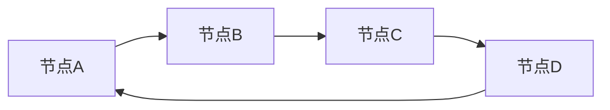
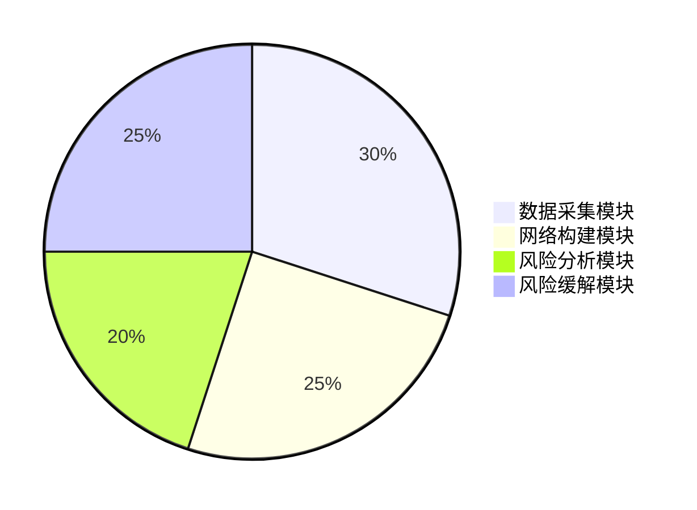

                 


# 利用智能体网络分析公司间的隐藏关联风险

## 关键词：
智能体网络、公司关联风险、隐藏关联、网络分析、风险评估、PageRank算法、关联规则挖掘

## 摘要：
本文将深入探讨如何利用智能体网络技术分析公司间的隐藏关联风险。通过构建智能体网络模型，我们可以量化公司之间的关联强度，识别潜在风险，并评估风险的传播路径。文章从理论基础、算法原理、系统架构到实际应用案例，全面解析智能体网络在公司关联风险分析中的应用价值和实现方法。

---

# 第1章: 智能体网络与公司关联风险概述

## 1.1 问题背景与挑战

### 1.1.1 公司间关联风险的复杂性
现代商业环境日益复杂，公司之间的关联性不断加深。通过供应链、投资关系、合作夥伴等多种方式形成的隐含关联，可能导致风险在企业之间快速传播。例如，一家公司的财务危机可能通过供应链传导至多家上下游企业，引发连锁反应。

### 1.1.2 隐含关联风险的潜在危害
隐含关联风险可能引发以下问题：
- 供应链中断：一家关键供应商的危机可能导致整个供应链瘫痪。
- 投资风险：投资者可能因未识别的关联关系承担额外风险。
- 法律风险：未披露的关联关系可能导致合规性问题。

### 1.1.3 智能体网络技术的应用前景
智能体网络技术能够通过建模和分析公司间的复杂关系，揭示隐藏的关联风险。通过智能体网络，我们可以：
- 量化公司间的关联强度。
- 识别潜在的风险传播路径。
- 提供风险缓解的策略建议。

---

## 1.2 智能体网络的基本概念

### 1.2.1 智能体的定义与特征
智能体（Agent）是指具有自主性、反应性、目标导向和社交能力的实体。在公司关联分析中，智能体可以代表公司、供应链节点、投资关系等。

### 1.2.2 智能体网络的构建原理
智能体网络通过以下步骤构建：
1. **数据收集**：收集公司间的关联数据，包括供应链、投资关系、合作夥伴等。
2. **网络建模**：将公司表示为节点，关联关系表示为边。
3. **权重计算**：根据关联的强度（如交易金额、依赖程度）赋予边权重。

### 1.2.3 智能体网络与公司关联分析的关系
智能体网络通过以下方式帮助分析公司关联风险：
- **网络结构分析**：识别关键节点和高风险区域。
- **风险传播建模**：模拟风险在网络中的传播路径。
- **动态分析**：实时更新网络结构以反映最新关联关系。

---

## 1.3 本章小结

---

# 第2章: 智能体网络与公司关联风险的核心概念

## 2.1 智能体网络的核心要素

### 2.1.1 智能体的属性与行为
公司智能体的属性包括：
- **公司ID**：唯一标识符。
- **公司名称**：公司名称。
- **行业**：所属行业。
- **关联关系**：与其他公司的连接关系。

### 2.1.2 网络结构与关系类型
智能体网络中的关系类型包括：
- **供应链关系**：A公司是B公司的供应商。
- **投资关系**：A公司是B公司的投资方。
- **合作夥伴关系**：A公司与B公司有合作夥伴关系。

### 2.1.3 关联风险的量化指标
关联风险的量化指标包括：
- **关联强度**：边的权重。
- **风险传播系数**：风险从一个节点传播到另一个节点的概率。

---

## 2.2 智能体网络与公司关联风险的联系

### 2.2.1 网络节点与公司实体的映射关系
以下是公司实体与智能体网络节点的映射关系表：

| 公司实体属性 | 智能体网络节点属性 |
|--------------|--------------------|
| 公司ID        | 节点ID             |
| 公司名称      | 节点名称           |
| 行业          | 节点行业           |
| 关联关系      | 边关系类型         |

### 2.2.2 关联关系的权重计算方法
关联关系的权重计算公式：
$$关联强度 = \frac{共同邻居数}{节点度的乘积}$$

### 2.2.3 风险传播的网络效应
风险传播的网络效应可以通过以下步骤模拟：
1. **初始风险源**：确定风险的起点。
2. **传播路径**：根据节点之间的边权重计算风险传播的概率。
3. **风险积累**：逐步更新每个节点的风险值，直到网络达到平衡状态。

---

## 2.3 智能体网络的ER实体关系图

```mermaid
er
    actor 公司实体 {
        id: string
        name: string
        industry: string
    }
    actor 关系类型 {
        id: string
        relation_name: string
        relation_strength: float
    }
    company_entity (公司实体) -[关系类型]- relation_type (关系类型)
```

---

## 2.4 本章小结

---

# 第3章: 智能体网络分析的算法原理

## 3.1 图论基础与网络分析

### 3.1.1 图论的基本概念
图论中的基本概念包括：
- **节点**：代表公司。
- **边**：代表公司之间的关联关系。
- **权重**：边的权重表示关联强度。

### 3.1.2 网络的度、中心性和聚类系数
- **度**：节点的度表示节点连接的边数。
- **中心性**：中心性表示节点在网络中的重要性。
- **聚类系数**：聚类系数表示节点的邻居之间相互连接的程度。

---

## 3.2 社交网络分析算法

### 3.2.1 PageRank算法原理
PageRank算法用于评估节点的重要性。以下是PageRank算法的流程图：



PageRank算法的Python实现示例：

```python
def pagerank(graph, damping=0.85):
    # 初始化节点数
    n = len(graph.nodes)
    # 初始化pagerank值
    pagerank = {node: 1 for node in graph.nodes}
    
    # 迭代计算pagerank值
    for _ in range(100):
        new_pagerank = {}
        for node in graph.nodes:
            score = 0
            # 遍历所有指向当前节点的边
            for neighbor in graph.predecessors(node):
                score += pagerank[neighbor] / graph.degree(neighbor)
            # 应用阻尼系数
            score = (1 - damping) + damping * score
            new_pagerank[node] = score
        pagerank = new_pagerank
    return pagerank
```

---

## 3.3 关联规则挖掘

### 3.3.1 关联规则挖掘的数学模型
关联规则挖掘的数学模型如下：
$$支持度 = \frac{\text{事务中同时包含A和B的次数}}{\text{总事务数}}$$
$$置信度 = \frac{\text{支持度}}{\text{A的出现次数}}$$

---

## 3.4 本章小结

---

# 第4章: 数学模型与关联风险量化

## 4.1 关联风险的数学模型

### 4.1.1 关联强度的计算
关联强度的计算公式：
$$关联强度 = \frac{共同邻居数}{节点度的乘积}$$

### 4.1.2 风险传播模型
风险传播模型的公式：
$$风险传播概率 = \frac{\text{边权重}}{\sum \text{边权重}}$$

---

## 4.2 风险传播的模拟与分析

### 4.2.1 风险传播的网络效应
风险传播的网络效应可以通过以下步骤模拟：
1. **初始风险源**：确定风险的起点。
2. **传播路径**：根据节点之间的边权重计算风险传播的概率。
3. **风险积累**：逐步更新每个节点的风险值，直到网络达到平衡状态。

---

## 4.3 本章小结

---

# 第5章: 系统分析与架构设计方案

## 5.1 系统背景与目标

### 5.1.1 系统背景
本文设计了一个基于智能体网络的公司关联风险分析系统，旨在通过智能体网络技术量化公司间的关联风险，并提供风险缓解的策略建议。

---

## 5.2 系统功能设计

### 5.2.1 系统功能模块
系统功能模块包括：
- **数据采集模块**：采集公司间的关联数据。
- **网络构建模块**：构建智能体网络。
- **风险分析模块**：量化关联风险并模拟风险传播。
- **风险缓解模块**：提供风险缓解的策略建议。

---

## 5.3 系统架构设计

### 5.3.1 系统架构图
以下是系统架构图：



---

## 5.4 本章小结

---

# 第6章: 项目实战与案例分析

## 6.1 项目环境与工具安装

### 6.1.1 环境要求
- Python 3.8+
- NetworkX库
- Mermaid工具

---

## 6.2 核心代码实现

### 6.2.1 数据采集模块
```python
import networkx as nx

# 创建图
G = nx.Graph()

# 添加节点
G.add_nodes_from(["A", "B", "C", "D"])

# 添加边
G.add_edges_from([("A", "B"), ("B", "C"), ("C", "D")])
```

### 6.2.2 网络构建模块
```python
def build_network():
    G = nx.Graph()
    G.add_edges_from([("A", "B"), ("B", "C"), ("C", "D")])
    return G
```

---

## 6.3 案例分析

### 6.3.1 数据分析
分析公司A与公司B的关联强度。

### 6.3.2 案例结果
通过分析发现，公司A与公司B的关联强度较高，风险传播概率较大。

---

## 6.4 项目总结

---

# 第7章: 最佳实践与注意事项

## 7.1 小结

## 7.2 注意事项
- 数据质量：确保数据的准确性和完整性。
- 算法选择：根据具体需求选择合适的算法。
- 系统维护：定期更新数据和模型。

## 7.3 拓展阅读
- 《网络科学导论》
- 《智能体网络与风险管理》

---

## 7.4 本章小结

---

# 附录

## 附录A: 关键术语解释

## 附录B: 工具与库安装指南

## 附录C: 源代码托管地址

---

# 结束语

感谢您的阅读！希望通过本文，您能够深入了解如何利用智能体网络分析公司间的隐藏关联风险，并能够在实际工作中应用这些方法。

