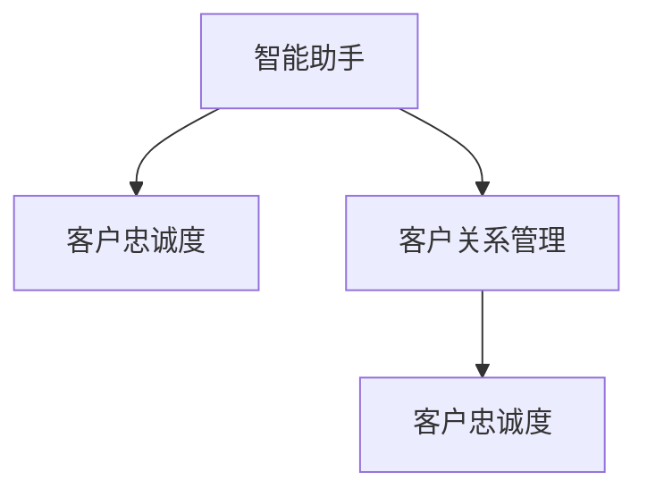
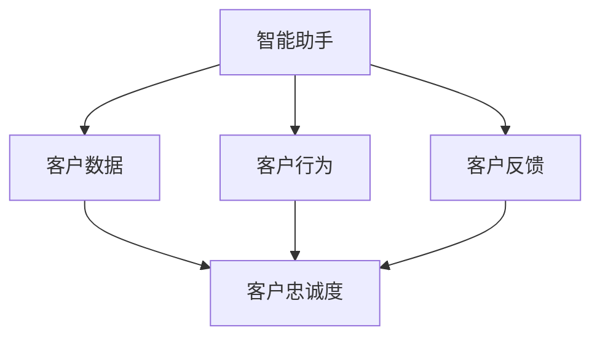
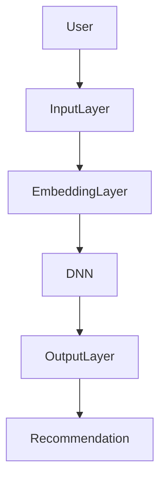
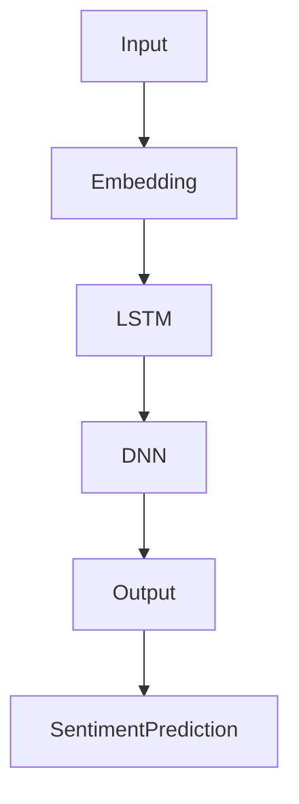

                 


# 利用智能助手提升客户忠诚度的策略

## 关键词：智能助手、客户忠诚度、推荐系统、情感分析、机器学习、深度学习

## 摘要：
本文详细探讨了如何利用智能助手技术提升客户忠诚度的策略。通过分析智能助手的核心算法、客户忠诚度预测模型，以及系统架构设计，本文为读者提供了从理论到实践的全面指导。文章结合了实际案例和最佳实践，帮助读者理解如何通过智能助手优化客户体验，提升客户忠诚度。

---

## 第1章: 智能助手与客户忠诚度的背景介绍

### 1.1 问题背景与问题描述
#### 1.1.1 客户忠诚度的定义与重要性
客户忠诚度是指客户对企业产品或服务的持续购买和使用意愿。在当今竞争激烈的市场环境中，客户忠诚度是企业长期成功的关键因素之一。忠诚的客户不仅会重复购买，还会推荐企业的产品或服务给他人，从而为企业带来更多的客户和收入。

#### 1.1.2 智能助手在客户关系管理中的作用
智能助手（如聊天机器人、语音助手等）通过自动化服务、实时响应和个性化推荐，能够显著提升客户体验，增强客户对企业的忠诚度。智能助手可以24/7为客户提供支持，解决他们在使用产品或服务过程中遇到的问题，从而提升客户满意度和忠诚度。

#### 1.1.3 当前客户忠诚度管理的挑战
尽管智能助手在提升客户忠诚度方面具有巨大潜力，但在实际应用中仍面临诸多挑战。例如，如何准确理解客户需求、如何处理复杂的情感信息、如何在大规模数据中提取有价值的信息等。此外，不同客户群体的需求差异也使得智能助手的设计和优化更具挑战性。

### 1.2 问题解决与边界分析
#### 1.2.1 智能助手如何提升客户忠诚度
智能助手通过以下方式提升客户忠诚度：
1. **个性化推荐**：基于客户的历史行为和偏好，智能助手可以提供个性化的推荐，增强客户的购买意愿。
2. **实时互动**：通过即时响应和24/7的支持，智能助手能够快速解决客户问题，提升客户满意度。
3. **情感互动**：通过情感分析和自然语言处理技术，智能助手能够理解客户的情感需求，从而提供更贴心的服务。

#### 1.2.2 客户忠诚度管理的边界与外延
客户忠诚度管理的边界包括客户数据的收集、处理和分析，以及基于这些数据的智能推荐和互动。外延则包括客户行为分析、客户分群、客户生命周期管理等。

#### 1.2.3 智能助手与客户忠诚度的关系图解


---

## 第2章: 智能助手与客户忠诚度的核心概念

### 2.1 核心概念与原理
#### 2.1.1 智能助手的定义与分类
智能助手是一种基于人工智能技术的自动化工具，能够通过自然语言处理（NLP）和机器学习算法理解用户需求并提供相应的服务。智能助手可以分为基于规则的智能助手和基于机器学习的智能助手。

#### 2.1.2 客户忠诚度的层次模型
客户忠诚度可以分为三个层次：
1. **情感忠诚**：客户对企业的情感认同和品牌忠诚。
2. **行为忠诚**：客户通过重复购买行为表现出的忠诚。
3. **认知忠诚**：客户对企业产品或服务的长期信任和依赖。

#### 2.1.3 智能助手对客户忠诚度的影响机制
智能助手通过以下机制影响客户忠诚度：
1. **提升客户满意度**：通过快速响应和解决问题，提升客户的满意度。
2. **增强客户信任**：通过个性化推荐和情感互动，增强客户对企业的信任。
3. **提供差异化服务**：通过智能化的服务，提供差异化体验，增强客户粘性。

### 2.2 核心概念对比表
| 比较维度        | 智能助手                        | 客户忠诚度                 |
|-----------------|---------------------------------|---------------------------|
| 定义            | 基于AI的自动化工具              | 客户对企业的情感和行为支持  |
| 目标            | 提供高效服务，解决问题          | 增强客户对企业的情感依赖   |
| 技术基础        | NLP、机器学习                  | 数据分析、客户行为分析     |
| 应用场景        | 客户服务、销售支持             | 客户 retention、品牌建设    |

### 2.3 实体关系图


---

## 第3章: 智能助手的核心算法原理

### 3.1 推荐系统算法
#### 3.1.1 协同过滤算法
协同过滤是一种基于用户行为相似性推荐商品或服务的算法。其核心思想是：如果两个用户在过去的行为（如购买、评分）相似，那么他们未来的行为也可能相似。

##### 代码实现示例
```python
def collaborative_filtering(user_id, user_ratings, similarity_threshold):
    # 获取目标用户的相似用户
    similar_users = [u for u in user_ratings if u != user_id and calculate_similarity(user_id, u) > similarity_threshold]
    # 获取目标用户喜欢的商品
    target_user_ratings = user_ratings[user_id]
    # 统计相似用户的商品评分
   推荐商品 = {}
    for u in similar_users:
        for item in user_ratings[u]:
            if item in target_user_ratings:
                continue
            if item in 推荐商品:
                推荐商品[item] += 1
            else:
                推荐商品[item] = 1
    # 返回评分最高的商品
    return sorted(推荐商品.items(), key=lambda x: x[1], reverse=True)
```

#### 3.1.2 基于内容的推荐算法
基于内容的推荐算法通过分析商品或服务的属性，推荐与用户兴趣相似的物品。

##### 数学公式
$$
相似度 = \frac{\sum_{i=1}^{n} w_i \cdot (a_i - b_i)}{\sqrt{\sum_{i=1}^{n} w_i^2} \cdot \sqrt{\sum_{i=1}^{n} (a_i - b_i)^2}}
$$
其中，$w_i$ 是属性 $i$ 的权重，$a_i$ 是目标用户的属性值，$b_i$ 是商品的属性值。

#### 3.1.3 深度学习推荐模型
深度学习推荐模型（如深度协同过滤、神经图嵌入等）能够捕捉更复杂的用户行为模式，提供更精准的推荐。

##### mermaid流程图


### 3.2 情感分析算法
#### 3.2.1 基于规则的情感分析
基于规则的情感分析通过预定义的词汇表和情感规则，判断文本的情感倾向。

##### 示例代码
```python
def rule_based_sentiment_analysis(text):
    positive_words = ["happy", "good"]
    negative_words = ["sad", "bad"]
    score = 0
    for word in text.split():
        if word in positive_words:
            score += 1
        elif word in negative_words:
            score -= 1
    return "positive" if score > 0 else "negative"
```

#### 3.2.2 机器学习情感分析模型
使用机器学习算法（如SVM、随机森林）训练情感分类器。

##### 数学公式
$$
P(y|x) = \frac{P(x|y)P(y)}{P(x)}
$$
其中，$P(y|x)$ 是在给定文本 $x$ 的情况下，情感类别 $y$ 的概率。

#### 3.2.3 深度学习情感分析模型
深度学习模型（如LSTM、Transformer）能够捕捉文本的情感信息。

##### mermaid流程图


---

## 第4章: 客户忠诚度预测模型

### 4.1 基于机器学习的忠诚度预测
#### 4.1.1 线性回归模型
线性回归模型通过拟合直线，预测客户忠诚度。

##### 数学公式
$$
y = \beta_0 + \beta_1x_1 + \beta_2x_2 + \ldots + \beta_nx_n + \epsilon
$$

#### 4.1.2 支持向量机模型
支持向量机（SVM）通过在高维空间中构建分类超平面，预测客户忠诚度。

##### 示例代码
```python
from sklearn import svm

model = svm.SVC()
model.fit(X_train, y_train)
预测结果 = model.predict(X_test)
```

#### 4.1.3 随机森林模型
随机森林通过集成多个决策树，提高预测准确率。

##### mermaid流程图
```mermaid
graph TD
    Input --> DecisionTree1
    Input --> DecisionTree2
    Input --> DecisionTree3
    DecisionTree1 --> RandomForest
    DecisionTree2 --> Random

