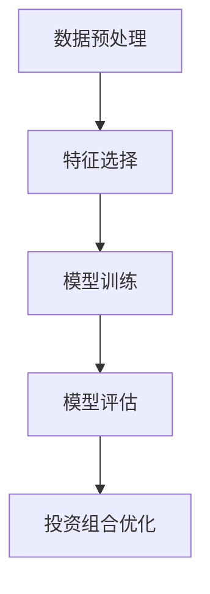
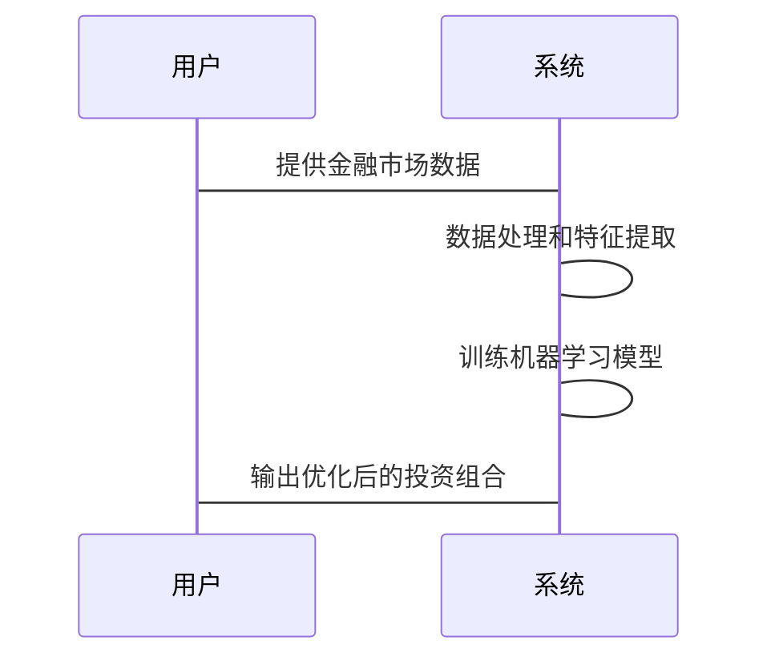

                 


# 利用机器学习优化投资组合分配策略

> **关键词**：机器学习，投资组合优化，资产配置，风险管理，收益预测

> **摘要**：本文探讨了如何利用机器学习技术优化投资组合分配策略。通过分析传统投资组合优化方法的局限性，结合机器学习的优势，提出了基于机器学习的投资组合优化框架。文章详细介绍了机器学习在投资组合优化中的核心概念、算法原理、系统架构设计以及实际项目案例，为读者提供了一套完整的解决方案。

---

# 第1章：投资组合优化的背景与问题

## 1.1 投资组合优化的定义与目标

### 1.1.1 投资组合优化的定义
投资组合优化是指在给定的资产集合中，通过合理分配资金比例，以实现特定目标（如最大化收益、最小化风险）的过程。其核心在于在风险与收益之间找到最佳平衡点。

### 1.1.2 投资组合优化的目标
- **最大化收益**：在风险可控的前提下，追求最高可能的收益。
- **最小化风险**：在收益固定的情况下，降低投资组合的波动性。
- **资产配置**：根据市场环境和投资者偏好，动态调整资产比例。

### 1.1.3 投资组合优化的边界与外延
- **边界**：受资金限制、市场条件和投资者风险承受能力的约束。
- **外延**：从简单的资产分配扩展到复杂的产品组合优化，涉及多目标优化和动态调整。

---

## 1.2 传统投资组合优化方法

### 1.2.1 均值-方差模型
**均值-方差模型**由Harry Markowitz提出，是投资组合优化的基础。该模型通过最小化投资组合的方差（风险）来优化收益。

- **数学表达**：
  $$ \text{目标函数：} \min \sigma^2 $$
  $$ \text{约束条件：} \sum w_i r_i = \mu $$
  $$ \sum w_i = 1 $$
  其中，\( w_i \) 是资产 \( i \) 的权重，\( r_i \) 是资产 \( i \) 的预期收益，\( \mu \) 是目标收益。

### 1.2.2 马科维茨有效前沿理论
**有效前沿**是所有有效投资组合的集合，这些组合在给定风险下提供最高收益，或在给定收益下提供最小风险。

### 1.2.3 传统方法的局限性
- **计算复杂性**：随着资产数量增加，计算复杂性呈指数级增长。
- **假设限制**：假设资产收益呈正态分布，且未来收益可预测，这在现实中往往不成立。
- **静态性**：传统模型假设市场环境不变，难以应对动态市场。

---

## 1.3 机器学习在投资组合优化中的应用背景

### 1.3.1 机器学习的基本概念
机器学习是一种人工智能技术，通过数据训练模型，使其能够从数据中学习并做出预测或决策。

### 1.3.2 机器学习在金融领域的优势
- **非线性关系建模**：能够捕捉复杂的市场动态。
- **数据驱动决策**：利用大量历史数据进行预测，减少人为偏差。
- **实时调整**：能够快速适应市场变化。

### 1.3.3 机器学习在投资组合优化中的潜力
- **动态调整**：根据市场变化实时优化投资组合。
- **个性化配置**：根据投资者风险偏好定制策略。
- **多因素分析**：考虑多个影响收益和风险的因素。

---

# 第2章：机器学习与投资组合优化的核心概念

## 2.1 机器学习的核心原理

### 2.1.1 监督学习、无监督学习与强化学习
- **监督学习**：基于标签数据进行预测，如回归和分类。
- **无监督学习**：发现数据中的隐含结构，如聚类和降维。
- **强化学习**：通过试错优化决策，适用于动态环境。

### 2.1.2 机器学习模型的训练与评估
- **训练**：使用历史数据训练模型，使其能够预测目标变量。
- **评估**：通过测试数据验证模型的性能，如准确率、召回率等。

### 2.1.3 机器学习在金融中的应用案例
- **股价预测**：利用LSTM网络预测股票价格。
- **信用评分**：通过随机森林模型评估客户信用风险。

---

## 2.2 投资组合优化的核心要素

### 2.2.1 资产分配与风险控制
- **资产分配**：根据风险承受能力和收益目标，分配不同资产的比例。
- **风险控制**：通过多样化投资降低风险。

### 2.2.2 收益预测与资产选择
- **收益预测**：利用机器学习模型预测不同资产的收益。
- **资产选择**：基于预测结果选择最优资产组合。

### 2.2.3 现金流管理与市场预测
- **现金流管理**：优化现金流的流入和流出，确保资金流动性。
- **市场预测**：预测市场趋势，提前调整投资组合。

---

## 2.3 机器学习与投资组合优化的结合点

### 2.3.1 数据驱动的收益预测
- **特征工程**：提取影响收益的关键特征，如宏观经济指标、市场情绪等。
- **模型训练**：使用回归或时间序列模型预测收益。

### 2.3.2 风险评估与资产配置
- **风险评估**：利用聚类或因子分析识别市场风险。
- **资产配置**：根据风险评估结果调整资产比例。

### 2.3.3 动态投资组合调整
- **实时监控**：根据市场变化实时调整投资组合。
- **反馈机制**：利用强化学习优化调整策略。

---

# 第3章：机器学习在投资组合优化中的算法原理

## 3.1 常见的机器学习算法及其应用

### 3.1.1 线性回归与资产收益预测
- **线性回归**：用于预测资产收益。
- **应用场景**：基于历史数据预测未来收益。

### 3.1.2 支持向量机（SVM）在风险评估中的应用
- **SVM**：用于分类问题，可以将资产分为高风险和低风险两类。

### 3.1.3 随机森林与资产选择
- **随机森林**：通过投票机制选择最优资产组合。

---

## 3.2 算法流程图



---

## 3.3 优化算法的数学模型

### 3.3.1 均值-方差模型的数学表达
$$ \text{目标函数：} \min \sigma^2 $$
$$ \text{约束条件：} \sum w_i r_i = \mu $$
$$ \sum w_i = 1 $$

### 3.3.2 机器学习模型的优化目标
$$ \text{损失函数}：\min \sum (y_i - \hat{y}_i)^2 $$

---

# 第4章：系统架构与设计

## 4.1 系统功能设计

### 4.1.1 数据获取与处理
- **数据源**：金融市场数据，如股票价格、指数、经济指标。
- **数据处理**：清洗、转换、标准化。

### 4.1.2 特征工程
- **特征提取**：从数据中提取有用特征，如移动平均、波动率等。
- **特征选择**：选择对收益影响最大的特征。

### 4.1.3 模型训练与优化
- **模型选择**：选择适合的机器学习算法。
- **超参数优化**：通过网格搜索或随机搜索优化模型性能。

### 4.1.4 投资组合优化
- **策略生成**：根据模型预测生成投资组合策略。
- **策略评估**：评估策略的收益和风险。

---

## 4.2 系统架构设计

### 4.2.1 系统架构图


---

## 4.3 接口设计与交互

### 4.3.1 系统接口设计
- **输入接口**：接收金融市场数据。
- **输出接口**：输出优化后的投资组合和评估结果。

### 4.3.2 系统交互流程



---

# 第5章：项目实战——基于机器学习的投资组合优化系统

## 5.1 项目背景与目标
- **背景**：当前市场波动加剧，需要动态调整投资组合。
- **目标**：构建一个基于机器学习的投资组合优化系统，实现收益最大化和风险最小化。

---

## 5.2 系统实现

### 5.2.1 环境配置
- **工具**：Python、Jupyter Notebook、机器学习库（如scikit-learn、XGBoost）。
- **数据源**：获取历史股票数据，如Yahoo Finance。

### 5.2.2 数据处理与特征工程
```python
import pandas as pd
import numpy as np

# 数据预处理
data = pd.read_csv('stock_data.csv')
data = data.dropna()
data['return'] = data['price'].pct_change()

# 特征工程
features = data[['price', 'volume', 'return']]
```

### 5.2.3 模型训练与优化
```python
from sklearn.ensemble import RandomForestRegressor
from sklearn.model_selection import GridSearchCV

# 参数搜索
param_grid = {'n_estimators': [100, 200], 'max_depth': [None, 10]}
grid_search = GridSearchCV(RandomForestRegressor(), param_grid, cv=5)
grid_search.fit(X_train, y_train)

# 最优模型
best_model = grid_search.best_estimator_
```

### 5.2.4 投资组合优化
```python
import numpy as np

# 定义优化目标函数
def optimize_portfolio(weights, expected_returns, covariance_matrix):
    return np.var(np.dot(weights, expected_returns))

# 使用遗传算法优化
from scipy.optimize import minimize

result = minimize(optimize_portfolio, x0=np.ones(len(expected_returns)) / len(expected_returns),
                 args=(expected_returns, covariance_matrix), method='SLSQP')
```

### 5.2.5 结果分析与可视化
```python
import matplotlib.pyplot as plt

# 绘制优化后的投资组合
plt.bar(weights, height=weights)
plt.title('Optimized Portfolio Weights')
plt.show()
```

---

## 5.3 项目小结
- **实现目标**：成功构建了一个基于机器学习的投资组合优化系统。
- **优势**：能够根据市场变化动态调整投资组合，提高收益并降低风险。

---

# 第6章：总结与展望

## 6.1 总结
本文详细介绍了如何利用机器学习优化投资组合分配策略，从传统方法的局限性到机器学习的优势，再到具体的算法实现和系统设计，为读者提供了一套完整的解决方案。

## 6.2 未来展望
- **强化学习的应用**：利用强化学习进一步优化投资组合调整策略。
- **多目标优化**：考虑更多的目标，如税收、交易成本等。
- **实时监控与自适应调整**：构建实时监控系统，根据市场变化快速调整投资组合。

---

## 6.3 最佳实践 tips

- **数据质量**：确保数据的完整性和准确性。
- **模型监控**：定期监控模型性能，及时更新模型。
- **风险管理**：始终将风险管理放在首位，避免过度优化。

---

## 6.4 小结
机器学习为投资组合优化带来了新的可能性，但也需要结合传统金融理论和实际市场情况，才能实现最优的投资组合分配策略。

--- 

希望这篇文章能够帮助读者更好地理解如何利用机器学习优化投资组合分配策略，并为实际应用提供有价值的参考。

