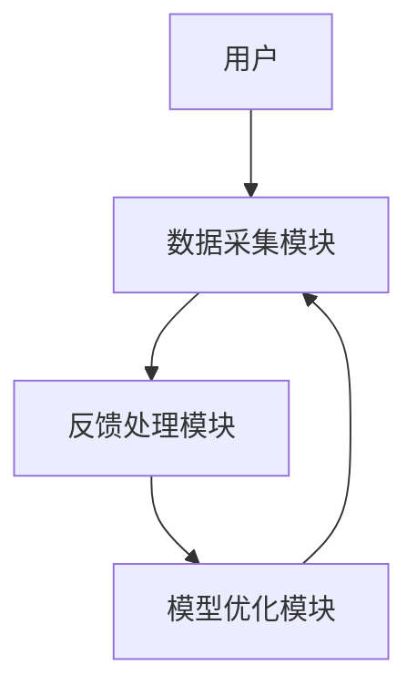
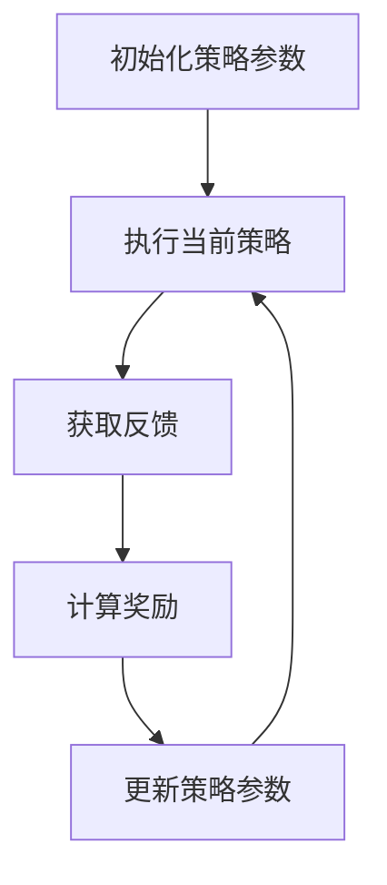
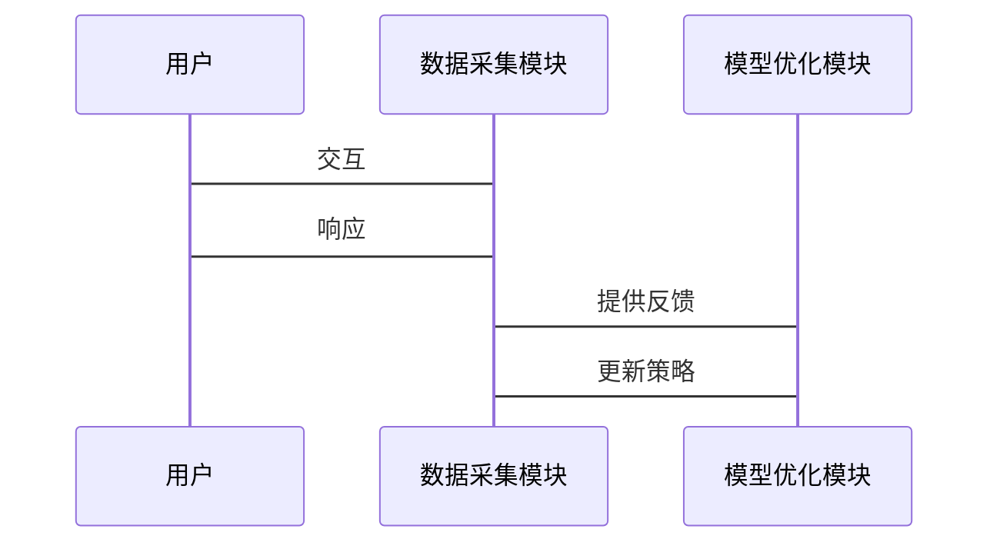

                 


# 利用用户反馈改进AI Agent的方法

## 关键词：AI Agent，用户反馈，算法优化，系统设计，强化学习

## 摘要：  
本文详细探讨了如何利用用户反馈来改进AI Agent的性能。通过分析用户反馈的类型、AI Agent的核心算法与模型，以及系统设计与架构，本文提出了基于用户反馈的AI Agent优化方法。文章结合实际案例，通过数学公式和代码实现，详细阐述了如何通过用户反馈改进AI Agent的决策能力，提升用户体验。

---

# 第1章: 用户反馈与AI Agent概述

## 1.1 用户反馈的重要性  
用户反馈是连接用户与AI Agent的重要桥梁，能够帮助AI Agent更好地理解用户需求，优化其行为策略。  

### 1.1.1 用户反馈的定义与分类  
用户反馈可以是显性的（如评分、点击）或隐性的（如停留时间、浏览行为）。显性反馈直接反映用户的满意度，而隐性反馈则需要通过分析用户行为间接推断用户的偏好。  

### 1.1.2 用户反馈在AI Agent中的作用  
用户反馈为AI Agent提供了改进的方向。通过分析用户反馈，AI Agent可以优化其决策策略，提升用户体验。  

### 1.1.3 用户反馈的收集与处理流程  
用户反馈的收集通常包括数据采集、数据清洗、特征提取和反馈分析四个步骤。  

## 1.2 AI Agent的基本概念  
AI Agent是一种智能代理，能够感知环境并采取行动以实现特定目标。  

### 1.2.1 AI Agent的定义与特点  
AI Agent具备自主性、反应性、目标导向性和社会性等特点。  

### 1.2.2 AI Agent的分类与应用场景  
AI Agent可以分为基于规则的Agent、基于模型的Agent和基于学习的Agent，广泛应用于推荐系统、对话系统和游戏AI等领域。  

### 1.2.3 用户反馈在AI Agent中的应用价值  
用户反馈能够帮助AI Agent理解用户的偏好，优化其决策策略，提升系统性能。  

## 1.3 用户反馈与AI Agent的关系  
用户反馈为AI Agent提供了改进的依据，而AI Agent通过反馈不断优化其行为策略。  

### 1.3.1 用户反馈对AI Agent性能的影响  
用户反馈能够直接影响AI Agent的决策质量和用户体验。  

### 1.3.2 AI Agent如何利用用户反馈进行优化  
通过强化学习、监督学习等方法，AI Agent可以利用用户反馈调整其行为策略。  

### 1.3.3 用户反馈在不同AI Agent场景中的应用  
在推荐系统中，用户反馈用于优化推荐算法；在对话系统中，用户反馈用于改进对话生成策略。  

---

# 第2章: 用户反馈与AI Agent的核心概念  

## 2.1 用户反馈的类型与特征  
用户反馈可以分为显性反馈和隐性反馈，显性反馈包括评分、点击等，隐性反馈包括浏览时间、跳出率等。  

### 2.1.1 显性反馈与隐性反馈  
显性反馈直接反映用户意图，隐性反馈则需要通过分析用户行为间接推断用户偏好。  

### 2.1.2 用户反馈的特征  
用户反馈具有实时性、相关性和可操作性等特点。  

## 2.2 AI Agent的核心算法与模型  
AI Agent的核心算法包括强化学习、监督学习和混合学习。  

### 2.2.1 基于反馈的强化学习  
强化学习通过用户反馈调整策略，最大化累积奖励。  

### 2.2.2 基于反馈的监督学习  
监督学习通过用户反馈标签优化模型预测。  

### 2.2.3 基于反馈的混合学习  
混合学习结合强化学习和监督学习的优点，利用用户反馈优化模型。  

## 2.3 用户反馈与AI Agent的关系模型  
用户反馈与AI Agent的关系可以通过反馈的特征、权重和实时性来建模。  

### 2.3.1 用户反馈的特征与AI Agent行为的关系  
用户反馈的特征影响AI Agent的决策策略。  

### 2.3.2 用户反馈的权重计算与AI Agent决策的关系  
用户反馈的权重反映了其对决策的影响程度。  

### 2.3.3 用户反馈的实时性与AI Agent响应速度的关系  
实时反馈能够更快地优化AI Agent的响应速度。  

## 2.4 核心概念对比分析  
用户反馈在不同学习方法中的应用特点可以通过对比分析来理解。  

### 2.4.1 用户反馈与传统监督学习的对比  
用户反馈为监督学习提供了动态标签。  

### 2.4.2 用户反馈与无监督学习的对比  
用户反馈为无监督学习提供了方向性信息。  

### 2.4.3 用户反馈与半监督学习的对比  
用户反馈结合了监督学习和无监督学习的优势。  

---

# 第3章: 基于用户反馈改进AI Agent的算法原理  

## 3.1 反馈驱动的AI Agent优化算法  
通过用户反馈优化AI Agent的决策策略是核心问题。  

### 3.1.1 基于反馈的强化学习算法  
强化学习通过用户反馈调整策略，最大化累积奖励。  

#### 3.1.1.1 算法流程  
1. 初始化策略参数。  
2. 执行当前策略，获取反馈。  
3. 计算奖励并更新策略参数。  
4. 重复步骤1-3，直到收敛。  

#### 3.1.1.2 数学模型  
强化学习的数学模型可以用以下公式表示：  
$$ Q(s,a) = Q(s,a) + \alpha (r + \gamma \max Q(s',a') - Q(s,a)) $$  
其中，\( Q(s,a) \) 表示状态-动作值函数，\( \alpha \) 是学习率，\( r \) 是奖励，\( \gamma \) 是折扣因子。  

### 3.1.2 基于反馈的监督学习算法  
监督学习通过用户反馈标签优化模型预测。  

#### 3.1.2.1 算法流程  
1. 收集用户反馈数据。  
2. 标记数据。  
3. 训练模型。  
4. 验证并优化模型。  

#### 3.1.2.2 数学模型  
监督学习的数学模型可以用以下公式表示：  
$$ y = \theta x + b $$  
其中，\( y \) 是目标值，\( \theta \) 是权重参数，\( x \) 是输入特征，\( b \) 是偏置项。  

### 3.1.3 基于反馈的混合学习算法  
混合学习结合强化学习和监督学习的优点，利用用户反馈优化模型。  

#### 3.1.3.1 算法流程  
1. 初始化策略参数。  
2. 执行当前策略，获取反馈。  
3. 结合反馈优化策略参数。  
4. 重复步骤1-3，直到收敛。  

---

# 第4章: 系统分析与架构设计  

## 4.1 系统架构设计  
AI Agent的系统架构包括数据采集模块、反馈处理模块和模型优化模块。  

### 4.1.1 数据采集模块  
数据采集模块负责收集用户行为数据，如点击、评分等。  

### 4.1.2 反馈处理模块  
反馈处理模块对用户反馈进行分析，提取特征并计算权重。  

### 4.1.3 模型优化模块  
模型优化模块利用用户反馈优化AI Agent的决策策略。  

## 4.2 系统交互设计  
系统交互设计包括用户与AI Agent的交互流程。  

### 4.2.1 交互流程  
1. 用户与AI Agent交互，触发反馈。  
2. 反馈传递到反馈处理模块。  
3. 模型优化模块根据反馈优化策略。  
4. 优化后的策略用于后续交互。  

## 4.3 系统架构图  
以下是系统架构的Mermaid图：  



---

# 第5章: 项目实战  

## 5.1 环境配置  
项目实战需要安装必要的库，如TensorFlow、PyTorch等。  

## 5.2 核心实现  
以下是一个基于用户反馈的强化学习算法的Python实现示例：  

```python
import numpy as np

# 初始化策略参数
theta = np.random.randn(1)

# 定义奖励函数
def get_reward(action):
    return np.random.normal(0, 1) * action

# 强化学习算法
learning_rate = 0.1
iterations = 100

for _ in range(iterations):
    # 执行当前策略
    action = theta * 2  # 示例策略
    reward = get_reward(action)
    
    # 计算梯度
    gradient = (reward - np.mean(reward)) * action
    
    # 更新策略参数
    theta += learning_rate * gradient
    
print(theta)
```

---

# 第6章: 最佳实践与总结  

## 6.1 最佳实践  
1. 定期收集用户反馈，保持模型的更新。  
2. 结合多种学习方法，优化模型性能。  

## 6.2 小结  
用户反馈是改进AI Agent的重要手段，通过合理的算法设计和系统架构，可以显著提升AI Agent的性能和用户体验。  

## 6.3 注意事项  
1. 反馈的及时性影响优化效果。  
2. 避免过度依赖用户反馈，保持模型的泛化能力。  

## 6.4 拓展阅读  
推荐阅读《强化学习导论》和《机器学习实战》等书籍，深入理解用户反馈在AI Agent中的应用。  

--- 

# 附录  

## 附录A: 算法流程图  
以下是强化学习算法的流程图：  



## 附录B: 系统交互图  
以下是系统交互的序列图：  



---

# 结束语  

通过本文的详细讲解，读者可以理解如何利用用户反馈改进AI Agent的方法，并能够在实际项目中应用这些方法。

