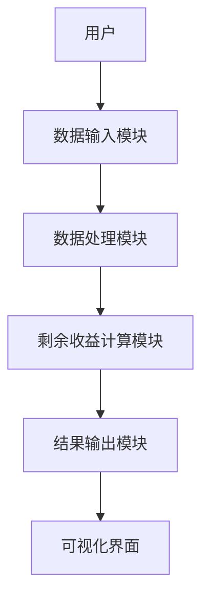
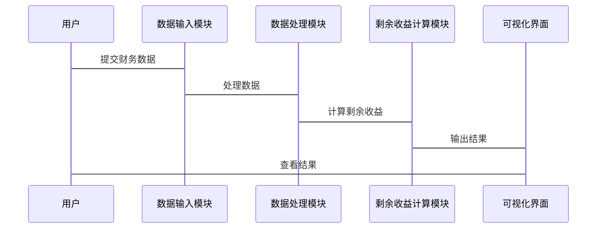

                 


# 剩余收益模型：结合会计信息的公司价值评估

> 关键词：剩余收益模型、会计信息、公司价值评估、财务模型、企业价值

> 摘要：剩余收益模型是一种基于会计信息的公司价值评估方法，通过计算公司产生的剩余收益来评估其内在价值。本文将详细介绍剩余收益模型的背景、核心概念、数学模型、系统架构以及实际项目中的应用，帮助读者全面理解并掌握这一模型的使用方法。

---

# 第一部分: 背景介绍

## 第1章: 剩余收益模型的背景与概念

### 1.1 剩余收益模型的定义
剩余收益模型是一种用于评估公司内在价值的财务模型，通过分析公司产生的剩余收益（即净利润减去资本成本）来判断其价值是否被市场合理定价。该模型的核心在于将会计信息与公司价值评估相结合，强调资本成本在价值评估中的重要性。

### 1.2 剩余收益模型的演进历程
剩余收益模型的提出是对传统财务模型的改进。早期的财务模型（如市盈率模型和股息贴现模型）主要依赖市场数据，而忽视了公司内在盈利能力与资本成本的关系。剩余收益模型弥补了这一缺陷，通过将会计信息与资本成本相结合，为公司价值评估提供了更准确的依据。

### 1.3 剩余收益模型与其他价值评估方法的对比
- **市盈率模型**：基于市盈率倍数，忽略了公司的盈利能力。
- **股息贴现模型**：依赖于股息的未来现金流，适用于高分红的公司。
- **DCF模型**：需要预测未来现金流，计算复杂且依赖假设。
- **剩余收益模型**：结合会计信息与资本成本，计算简洁，适用于大多数公司。

---

# 第二部分: 核心概念与原理

## 第2章: 剩余收益模型的核心概念

### 2.1 净收益与资本成本
- **净收益**：公司扣除所有费用后的净利润。
- **资本成本**：股东和债权人要求的最低回报率，包括权益资本成本和债务资本成本。

### 2.2 剩余收益的计算公式
$$ \text{剩余收益} = \text{净收益} - (\text{资本成本} \times \text{平均资本总额}) $$

### 2.3 剩余收益与公司价值的关系
- 如果剩余收益为正，说明公司创造的利润超过资本成本，公司价值被低估。
- 如果剩余收益为负，说明公司创造的利润低于资本成本，公司价值被高估。

---

## 第3章: 剩余收益模型的数学模型与公式

### 3.1 基于ROE的剩余收益公式
$$ \text{剩余收益} = \text{净利润} - (\text{权益资本成本} \times \text{股东权益}) $$

### 3.2 基于WACC的剩余收益公式
$$ \text{剩余收益} = \text{净利润} - (\text{WACC} \times \text{企业价值}) $$

### 3.3 模型的假设条件
- 公司的资本结构在评估期内保持不变。
- 资本成本是固定的且可以准确计算。
- 会计信息是准确且可比的。

---

# 第三部分: 系统分析与架构设计

## 第4章: 系统功能设计

### 4.1 数据输入与处理模块
- 输入公司财务数据（如净利润、股东权益、债务等）。
- 计算资本成本（如WACC）。

### 4.2 模型计算模块
- 计算剩余收益。
- 评估公司价值。

### 4.3 结果输出与可视化模块
- 显示计算结果。
- 可视化公司价值与市场价格的对比。

## 第5章: 系统架构设计

### 5.1 系统架构图


### 5.2 接口设计
- 输入接口：财务数据接口。
- 输出接口：计算结果接口。

### 5.3 交互流程图


---

# 第四部分: 项目实战

## 第6章: 项目实战分析

### 6.1 项目介绍
- **项目名称**：使用剩余收益模型评估微软公司价值。
- **目标**：通过模型计算微软的剩余收益，判断其市场价值是否合理。

### 6.2 环境安装
- 安装Python和相关库（如pandas、numpy）。
- 安装可视化工具（如Matplotlib或Seaborn）。

### 6.3 核心代码实现

```python
import pandas as pd
import numpy as np

# 输入数据
net_income = 50  # 净利润（单位：亿美元）
equity = 100     # 股东权益（单位：亿美元）
debt = 20        # 债务（单位：亿美元）
wacc = 0.08      # 加权平均资本成本

# 计算剩余收益
average_capital = (equity + debt) / (1 - debt/equity)  # 计算平均资本
residual_income = net_income - (wacc * average_capital)

print(f"剩余收益为：{residual_income:.2f}亿美元")
```

### 6.4 案例分析
- 假设微软的净利润为50亿美元，股东权益为100亿美元，债务为20亿美元，WACC为8%。
- 计算得出剩余收益为$50 - 0.08 \times 120 = 50 - 9.6 = 40.4$亿美元。
- 结果为正，说明微软的价值被市场低估。

### 6.5 项目小结
通过剩余收益模型，我们可以快速评估公司的内在价值，为投资决策提供参考。

---

# 第五部分: 总结与展望

## 第7章: 总结与展望

### 7.1 最佳实践
- 确保输入数据的准确性和可比性。
- 考虑资本成本的变化对模型结果的影响。

### 7.2 小结
剩余收益模型是一种简单而有效的公司价值评估工具，能够帮助投资者更好地理解公司的内在价值。

### 7.3 注意事项
- 模型假设资本结构不变，实际情况可能不同。
- 模型依赖准确的会计信息，数据误差可能影响结果。

### 7.4 拓展阅读
- 《Financial Statement Analysis and Security Valuation》
- 《The Theory of Financial Decision Making》

---

通过以上分析，我们可以看到，剩余收益模型结合会计信息，为公司价值评估提供了一种简洁而有力的方法。无论是从理论还是实践的角度，该模型都具有重要的应用价值。

