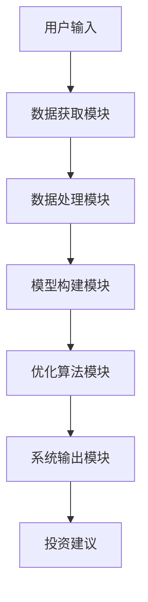
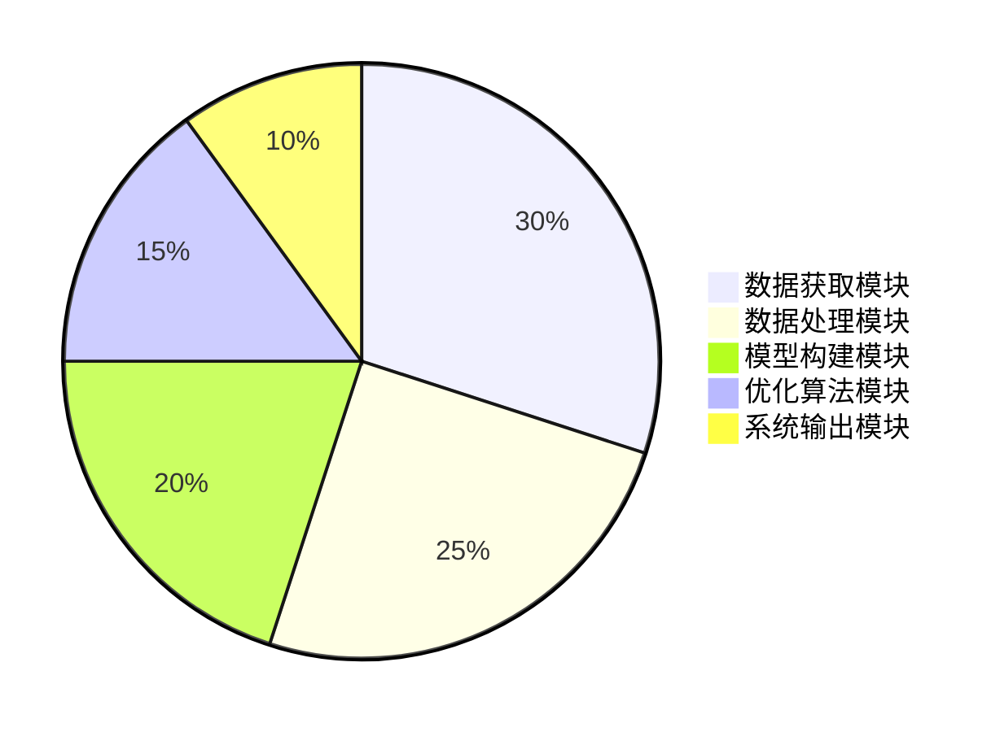
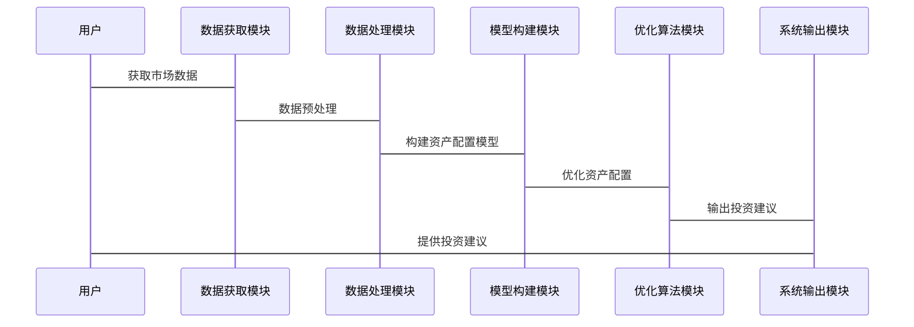

                 


# 动态资产配置：根据市场环境调整投资策略

## 关键词：
动态资产配置、投资策略、市场环境、风险管理、资产组合优化、Python实现、数学模型

## 摘要：
动态资产配置是一种根据市场环境变化调整投资组合的方法，旨在最大化投资收益并降低风险。本文系统地介绍了动态资产配置的理论基础、核心概念、技术实现和实际应用。通过分析现代投资组合理论、资产定价模型和优化算法，结合Python代码实现和案例分析，展示了如何在实际投资中动态调整资产配置策略。文章最后总结了动态资产配置的关键点和未来研究方向，为投资者提供了理论和实践的双重指导。

---

## 第一部分：动态资产配置的背景与基础

### 第1章：动态资产配置概述

#### 1.1 资产配置的基本概念
##### 1.1.1 资产配置的定义
资产配置是指将资金分配到不同资产类别（如股票、债券、房地产等）中，以实现投资目标的过程。它是投资组合管理的核心步骤，旨在平衡风险与收益。

##### 1.1.2 资产配置的分类
资产配置主要分为战略资产配置和战术资产配置：
- **战略资产配置**：基于长期投资目标和风险承受能力，确定资产类别权重。
- **战术资产配置**：根据短期市场环境变化，对资产配置进行动态调整。

##### 1.1.3 资产配置的重要性
资产配置通过分散投资降低风险，同时提高投资组合的整体收益。合理的资产配置能够帮助投资者在不同市场条件下实现收益最大化。

#### 1.2 动态资产配置的定义与特点
##### 1.2.1 动态资产配置的定义
动态资产配置是一种根据市场环境变化，实时调整资产类别权重的投资策略。它通过跟踪市场变化，优化投资组合，以应对不同的经济周期和市场波动。

##### 1.2.2 动态资产配置的核心特点
- **灵活性**：能够快速响应市场变化。
- **适应性**：根据市场环境调整资产配置。
- **风险控制**：通过动态调整降低投资风险。

#### 1.3 动态资产配置的必要性
##### 1.3.1 市场环境变化的影响
市场环境的变化（如经济周期波动、通货膨胀、利率变化等）会影响资产收益和风险。动态资产配置能够帮助投资者应对这些变化。

##### 1.3.2 投资者风险偏好的变化
投资者的风险偏好可能随时间和市场环境变化而变化。动态资产配置能够根据投资者的偏好调整投资组合。

##### 1.3.3 动态调整的必要性
静态资产配置在市场环境变化时可能导致投资组合偏离目标收益和风险水平。动态调整能够保持投资组合与市场环境的同步，提高投资效率。

#### 1.4 动态资产配置的理论基础
##### 1.4.1 现代投资组合理论
现代投资组合理论（MPT）由Harry Markowitz提出，强调通过分散投资降低风险。MPT为动态资产配置提供了理论基础。

##### 1.4.2 马科维茨的有效前沿
有效前沿是指在给定风险水平下，能够提供最高收益的投资组合。动态资产配置通过优化投资组合，使其位于有效前沿。

##### 1.4.3 动态资产配置的理论框架
动态资产配置的理论框架包括资产定价模型、风险收益模型和优化算法。

---

## 第二部分：动态资产配置的核心理论

### 第2章：动态资产配置的核心概念

#### 2.1 资产配置的驱动因素
##### 2.1.1 市场环境分析
市场环境分析包括宏观经济指标（GDP、利率、通货膨胀率）和市场指标（波动率、收益）。

##### 2.1.2 风险因素分析
风险因素包括市场风险、流动性风险和信用风险。

##### 2.1.3 经济周期的影响
经济周期分为复苏、增长、滞胀和衰退阶段，不同阶段适合不同的资产配置策略。

#### 2.2 动态资产配置的决策过程
##### 2.2.1 信息收集与分析
收集市场数据，分析宏观经济指标和资产收益。

##### 2.2.2 模型构建与评估
构建资产定价模型，评估不同资产配置下的收益和风险。

##### 2.2.3 决策执行与监控
根据模型结果调整资产配置，并持续监控市场变化。

#### 2.3 动态资产配置的核心要素
##### 2.3.1 投资目标的设定
明确投资目标，包括收益目标和风险承受能力。

##### 2.3.2 资产类别选择
选择适合的资产类别，如股票、债券、黄金等。

##### 2.3.3 风险承受能力
根据投资者的风险偏好，确定投资组合的风险水平。

---

## 第三部分：动态资产配置的理论框架

### 第3章：动态资产配置的理论基础

#### 3.1 现代投资组合理论（MPT）
##### 3.1.1 MPT的基本假设
- 投资者是理性的，追求收益最大化，厌恶风险。
- 资产收益符合正态分布。
- 资产之间存在相关性。

##### 3.1.2 有效前沿的构建
有效前沿是通过优化投资组合，找到在给定风险水平下的最高收益。

##### 3.1.3 风险与收益的权衡
通过夏普比率衡量投资组合的风险调整后收益。

#### 3.2 均值-方差优化模型
##### 3.2.1 模型的数学表达
投资组合的收益和风险可以通过以下公式计算：
$$
\text{收益} = \sum_{i=1}^{n} w_i r_i
$$
$$
\text{风险} = \sqrt{\sum_{i=1}^{n} \sum_{j=1}^{n} w_i w_j \sigma_i \sigma_j \rho_{ij}}
$$
其中，\( w_i \) 是资产 \( i \) 的权重，\( r_i \) 是资产 \( i \) 的期望收益，\( \sigma_i \) 是资产 \( i \) 的标准差，\( \rho_{ij} \) 是资产 \( i \) 和 \( j \) 之间的相关系数。

##### 3.2.2 参数估计与假设
- 估计资产的期望收益和协方差矩阵。
- 假设资产收益符合正态分布。

##### 3.2.3 约束条件
- 投资权重之和为1。
- 投资权重非负。

#### 3.3 资产定价模型
##### 3.3.1 资本资产定价模型（CAPM）
CAPM公式为：
$$
r_i = r_f + \beta_i (r_m - r_f)
$$
其中，\( r_i \) 是资产 \( i \) 的期望收益，\( r_f \) 是无风险利率，\( \beta_i \) 是资产 \( i \) 的贝塔系数，\( r_m \) 是市场期望收益。

##### 3.3.2 Fama三因子模型
Fama三因子模型扩展了CAPM，考虑了规模因子和价值因子。

#### 3.4 动态资产配置的数学模型
动态资产配置可以通过以下步骤实现：
1. 确定投资目标和约束条件。
2. 估计资产收益和风险。
3. 构建优化模型。
4. 解决优化问题，得到最优资产配置。
5. 实时监控市场变化，定期调整资产配置。

---

## 第四部分：动态资产配置的技术实现

### 第4章：动态资产配置的技术实现

#### 4.1 数据获取与处理
##### 4.1.1 数据来源
从金融数据供应商（如Yahoo Finance、 Bloomberg）获取资产价格数据。

##### 4.1.2 数据清洗
处理缺失值和异常值，确保数据的完整性。

#### 4.2 指标体系设计
##### 4.2.1 风险指标
- 方差：衡量资产收益的波动性。
- 标准差：衡量资产收益的离散程度。
- Value at Risk（VaR）：在给定置信水平下，可能的最大损失。

##### 4.2.2 收益指标
- 平均收益：资产的平均收益。
- 夏普比率：风险调整后的收益。

#### 4.3 模型构建
##### 4.3.1 资产配置模型
构建基于MPT的优化模型，目标是最化夏普比率。

##### 4.3.2 优化算法
使用凸优化算法（如Newton法）求解优化问题。

#### 4.4 优化算法实现
##### 4.4.1 优化问题的数学表达
$$
\text{最大化 } \mu^T w - \lambda w^T \Sigma w
$$
其中，\( \mu \) 是资产收益的期望向量，\( \Sigma \) 是协方差矩阵，\( \lambda \) 是风险厌恶系数。

##### 4.4.2 优化算法流程
1. 输入资产收益、协方差矩阵和风险厌恶系数。
2. 构建优化目标函数和约束条件。
3. 使用优化算法求解，得到最优权重。

##### 4.4.3 Python实现
以下是使用Python求解优化问题的代码示例：

```python
import numpy as np
from scipy.optimize import minimize

# 定义目标函数
def objective(w, mu, Sigma, lamb):
    return - (mu @ w) + lamb * w @ Sigma @ w

# 定义约束条件
cons = ({'type': 'eq', 'fun': lambda w: np.sum(w) - 1})

# 优化问题
w0 = np.ones(len(mu)) / len(mu)
res = minimize(objective, w0, args=(mu, Sigma, lamb), method='SLSQP', constraints=cons)

# 输出结果
print(res.x)
```

#### 4.5 回测与绩效评估
##### 4.5.1 回测策略
根据优化后的资产配置权重，回测投资组合的历史表现。

##### 4.5.2 绩效评估
评估投资组合的夏普比率、最大回撤和收益波动性。

---

## 第五部分：动态资产配置的系统架构与实现方案

### 第5章：动态资产配置系统架构

#### 5.1 项目介绍
##### 5.1.1 项目背景
动态资产配置系统的开发是为了帮助投资者根据市场环境变化调整资产配置。

##### 5.1.2 项目目标
实现一个动态资产配置系统，能够实时获取市场数据，优化资产配置，并生成投资建议。

#### 5.2 系统功能设计
##### 5.2.1 系统功能模块
- 数据获取模块：从金融数据供应商获取市场数据。
- 数据处理模块：清洗和预处理数据。
- 模型构建模块：构建资产配置模型。
- 优化算法模块：求解优化问题。
- 系统输出模块：生成投资建议。

##### 5.2.2 功能模块设计
使用Mermaid图展示系统功能模块的交互流程：



#### 5.3 系统架构设计
##### 5.3.1 系统架构图
使用Mermaid图展示系统架构：



##### 5.3.2 系统接口设计
- 数据获取接口：提供市场数据的API接口。
- 优化算法接口：提供优化问题的输入和输出接口。

##### 5.3.3 系统交互流程
使用Mermaid图展示系统交互流程：



---

## 第六部分：动态资产配置的项目实战

### 第6章：动态资产配置项目实战

#### 6.1 环境安装
##### 6.1.1 安装Python环境
安装Python 3.8及以上版本，并安装必要的库（如numpy、pandas、scipy）。

#### 6.2 系统核心实现
##### 6.2.1 核心代码实现
以下是动态资产配置系统的核心代码：

```python
import numpy as np
from scipy.optimize import minimize

# 定义目标函数
def objective(w, mu, Sigma, lamb):
    return - (mu @ w) + lamb * w @ Sigma @ w

# 定义约束条件
cons = ({'type': 'eq', 'fun': lambda w: np.sum(w) - 1})

# 优化问题
w0 = np.ones(len(mu)) / len(mu)
res = minimize(objective, w0, args=(mu, Sigma, lamb), method='SLSQP', constraints=cons)

# 输出结果
print(res.x)
```

##### 6.2.2 代码解读
- `objective`函数定义了优化目标，最大化夏普比率。
- `cons`定义了权重之和为1的约束条件。
- `minimize`函数使用SLSQP方法求解优化问题。

#### 6.3 代码应用解读与分析
##### 6.3.1 代码应用解读
通过优化算法，系统能够自动调整资产配置权重，以最大化夏普比率。

##### 6.3.2 代码分析
- 输入参数包括资产收益、协方差矩阵和风险厌恶系数。
- 输出结果是最优资产配置权重。

#### 6.4 实际案例分析
##### 6.4.1 案例背景
假设我们有两只股票A和B，历史收益和协方差矩阵如下：

| 资产 | 收益（%） | 标准差（%） | 相关系数 |
|------|-----------|-------------|-----------|
| A    | 8         | 10          | 0.5       |
| B    | 6         | 15          | 0         |

##### 6.4.2 优化过程
1. 估计资产收益和协方差矩阵。
2. 设定风险厌恶系数为5。
3. 使用优化算法求解，得到最优权重。

##### 6.4.3 优化结果
假设优化结果为w_A = 0.6，w_B = 0.4，则投资组合的夏普比率为：

$$
\text{夏普比率} = \frac{\mu_p - r_f}{\sigma_p} = \frac{7.2\% - 2\%}{\sqrt{0.6^2 \times 10^2 + 0.4^2 \times 15^2 + 2 \times 0.6 \times 0.4 \times 0.5 \times 10 \times 15}} = 1.2
$$

#### 6.5 项目小结
动态资产配置系统能够根据市场环境变化，自动调整资产配置，优化投资组合的收益和风险。通过Python代码实现，系统具有较高的灵活性和可扩展性。

---

## 第七部分：动态资产配置的最佳实践

### 第7章：最佳实践、小结、注意事项和拓展阅读

#### 7.1 最佳实践
##### 7.1.1 定期监控市场变化
定期调整资产配置，以应对市场环境的变化。

##### 7.1.2 合理设置风险厌恶系数
根据投资者的风险偏好，合理设置风险厌恶系数。

##### 7.1.3 组合理财工具的使用
使用Python和相关库（如numpy、pandas、scipy）进行资产配置的优化和回测。

#### 7.2 小结
动态资产配置是一种根据市场环境变化调整投资策略的方法。通过现代投资组合理论和优化算法，投资者可以实现投资收益的最大化和风险的最小化。

#### 7.3 注意事项
- 动态资产配置需要实时获取市场数据。
- 优化模型的参数估计可能会影响结果。
- 需要定期监控和调整资产配置。

#### 7.4 拓展阅读
- Harry Markowitz的《投资的科学》。
- John C. Hull的《期权、期货和其他衍生产品》。

---

通过本文的详细讲解，读者可以全面了解动态资产配置的理论和实践。从理论基础到技术实现，再到实际案例分析，本文为投资者提供了完整的指导。希望本文能够帮助读者在投资领域中实现更高效和更稳健的投资策略。

