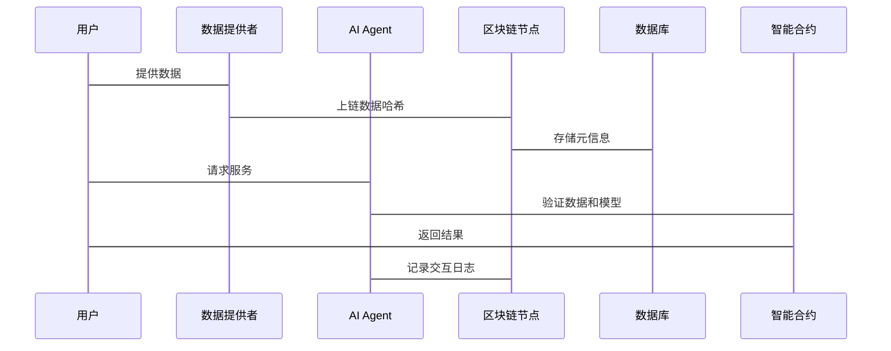

                 


# 区块链+AI：去中心化的可信AI Agent系统

## 关键词：
区块链、人工智能、可信AI Agent、去中心化、分布式系统

## 摘要：
本文探讨了区块链与人工智能结合的去中心化可信AI Agent系统的构建，分析了区块链在AI系统中的作用，详细讲解了可信AI Agent的核心概念、算法原理、系统架构及实际应用案例，最后总结了该领域的发展趋势。

---

# 第一章: 区块链与AI的背景与结合

## 1.1 区块链技术概述

### 1.1.1 区块链的基本概念
区块链是一种分布式账本技术，通过去中心化的方式记录交易，确保数据不可篡改。它由区块、链式结构和共识机制组成，具备去中心化、不可篡改和透明性特点。

### 1.1.2 区块链的核心特点
1. **去中心化**：数据存储在多个节点，避免单点故障。
2. **不可篡改**：通过哈希值和共识机制确保数据完整性。
3. **透明性**：所有交易对所有参与者可见，增加信任度。

### 1.1.3 区块链的应用场景
区块链在金融、供应链、医疗等领域有广泛应用，如比特币支付、智能合约和数据共享。

## 1.2 人工智能技术概述

### 1.2.1 人工智能的基本概念
人工智能（AI）是模拟人类智能的计算机系统，涵盖机器学习、自然语言处理和计算机视觉等技术。

### 1.2.2 人工智能的核心技术
1. **机器学习**：通过数据训练模型，实现预测和分类。
2. **深度学习**：基于人工神经网络，处理复杂数据。
3. **自然语言处理**：理解并生成人类语言。

### 1.2.3 人工智能的应用场景
AI在图像识别、语音助手、推荐系统等领域有广泛应用，如Face ID、Siri和Netflix推荐系统。

## 1.3 区块链与AI的结合

### 1.3.1 区块链与AI结合的背景
AI需要大量数据，但数据孤岛和隐私问题限制了数据共享。区块链的去中心化特性为解决这些问题提供了可能。

### 1.3.2 区块链与AI结合的意义
1. **数据共享**：区块链确保数据可信，促进数据共享。
2. **模型发布**：区块链验证模型来源，提升模型可信度。
3. **激励机制**：通过代币激励数据贡献者，促进AI模型优化。

### 1.3.3 区块链与AI结合的应用案例
- 数据共享平台：利用区块链确保数据来源可追溯。
- 智能合约：自动执行AI模型的使用条款。

---

# 第二章: 可信AI Agent的核心概念

## 2.1 可信AI Agent的定义

### 2.1.1 AI Agent的基本概念
AI Agent是具备感知环境和自主决策能力的智能体，能够执行任务并与人类交互。

### 2.1.2 可信AI Agent的特点
1. **可验证性**：决策过程可追溯，确保透明。
2. **抗干扰性**：具备识别恶意输入的能力。
3. **自适应性**：能根据环境变化调整策略。

### 2.1.3 可信AI Agent的设计原则
1. **透明性**：确保决策过程可解释。
2. **安全性**：防止攻击和滥用。
3. **可问责性**：明确责任归属。

## 2.2 可信AI Agent的核心要素

### 2.2.1 数据的可信性
数据来源可靠，确保AI Agent决策正确。

### 2.2.2 模型的可信性
模型经过验证，确保无偏见和公平。

### 2.2.3 交互的可信性
通过区块链确保交互记录可追溯，防止欺诈。

## 2.3 区块链在可信AI Agent中的作用

### 2.3.1 区块链如何保障数据可信性
通过区块链记录数据来源和修改历史，确保数据不可篡改。

### 2.3.2 区块链如何保障模型可信性
记录模型训练数据和过程，验证模型来源和真实性。

### 2.3.3 区块链如何保障交互可信性
记录交互历史，确保所有操作可追溯和验证。

---

# 第三章: 区块链与AI的结合技术

## 3.1 区块链在AI数据共享中的应用

### 3.1.1 数据共享的挑战
数据孤岛、隐私泄露和数据质量等问题阻碍数据共享。

### 3.1.2 区块链如何解决数据共享问题
通过区块链确保数据来源和访问权限，实现数据共享的安全性和透明性。

### 3.1.3 数据共享的实现流程
1. 数据上链：将数据哈希值记录在区块链。
2. 数据访问：通过智能合约控制数据访问权限。
3. 数据使用：用户在区块链上验证数据来源。

## 3.2 区块链在AI模型发布中的应用

### 3.2.1 模型发布的挑战
模型可能存在偏见，发布者身份不明确，缺乏验证机制。

### 3.2.2 区块链如何解决模型发布问题
记录模型训练数据和过程，验证模型来源和真实性。

### 3.2.3 模型发布的实现流程
1. 模型验证：通过区块链验证模型来源。
2. 模型发布：在区块链上记录模型信息。
3. 模型使用：用户通过区块链验证模型可信性。

## 3.3 区块链与AI的结合算法

### 3.3.1 基于区块链的AI算法概述
结合区块链的不可篡改性和AI的学习能力，提升算法可信性。

### 3.3.2 区块链与AI算法的结合方式
通过区块链记录算法训练数据和参数，确保算法透明性。

### 3.3.3 典型结合算法的实现案例
- **案例1**：基于区块链的强化学习算法。
  - 记录每个训练步骤的数据和参数在区块链上。
  - 通过智能合约验证算法的每一步操作。

---

# 第四章: 可信AI Agent的算法原理

## 4.1 AI Agent的算法基础

### 4.1.1 强化学习简介
强化学习通过试错机制，学习最优策略。涉及状态、动作和奖励三要素。

### 4.1.2 强化学习的核心算法
- **Q-learning**：更新Q值，找到最优动作。
  - Q(s, a) = Q(s, a) + α*(r + γ*max(Q(s', a')) - Q(s, a))
  - 其中，α是学习率，γ是折扣因子。

### 4.1.3 强化学习的应用场景
应用于游戏AI、机器人控制等领域。

## 4.2 区块链共识机制与AI结合

### 4.2.1 共识机制的算法原理
- **工作量证明（PoW）**：通过计算找到有效区块。
- **权益证明（PoS）**：基于持有币的数量决定记账权。

### 4.2.2 区块链共识机制对AI的影响
1. **提高数据可靠性**：共识机制确保数据一致性。
2. **增强系统安全性**：防止数据篡改和网络攻击。

---

# 第五章: 系统架构与交互流程

## 5.1 问题场景介绍
构建一个可信AI Agent系统，确保数据、模型和交互的可信性。

## 5.2 系统功能设计

### 5.2.1 领域模型设计
- **用户角色**：数据提供者、模型开发者、AI Agent用户。
- **功能模块**：数据共享模块、模型发布模块、交互记录模块。

## 5.2.2 系统架构设计
- **数据层**：区块链存储数据哈希和元信息。
- **应用层**：处理AI Agent请求和数据验证。
- **网络层**：通信协议和节点间数据传输。

## 5.2.3 系统交互流程
1. 用户提交数据：数据哈希记录在区块链，元信息存储在数据库。
2. 模型发布：发布者上传模型，区块链记录模型信息。
3. AI Agent执行：根据智能合约调用模型，记录交互日志。

## 5.3 系统交互流程图


---

# 第六章: 项目实战

## 6.1 环境安装
- 安装区块链框架（如Ethereum、Hyperledger Fabric）。
- 安装机器学习库（如TensorFlow、PyTorch）。
- 配置智能合约开发环境。

## 6.2 核心模块实现

### 6.2.1 数据共享模块
```python
# 数据上链
import hashlib

def data_to_block(data):
    hash = hashlib.sha256(data.encode()).hexdigest()
    return hash
```

### 6.2.2 模型发布模块
```python
# 模型验证
from tensorflow.keras import models

def validate_model(model):
    # 验证模型是否通过区块链认证
    if model.built:
        return True
    else:
        return False
```

### 6.2.3 交互记录模块
```python
# 记录交互日志
import json
import datetime

def log_interaction(action):
    timestamp = datetime.datetime.now().isoformat()
    log = {"timestamp": timestamp, "action": action}
    with open("interaction_log.json", "a") as f:
        json.dump(log, f)
```

## 6.3 项目实战案例分析
案例：构建一个基于区块链的图像分类AI Agent。
1. 数据提供者上传图像到区块链。
2. AI Agent调用智能合约获取数据。
3. 分析图像并返回结果，记录交互日志。

## 6.4 实际案例分析
分析案例的成功因素和可能的优化点，讨论数据隐私保护和模型更新频率。

---

# 第七章: 总结与展望

## 7.1 本章总结
区块链与AI结合的可信AI Agent系统，解决了数据可信性和隐私保护问题，提升了系统的可靠性和透明性。

## 7.2 未来发展展望
1. **技术优化**：结合边缘计算，降低中心化风险。
2. **应用拓展**：在医疗、金融等领域推广。
3. **政策法规**：制定相关法规，规范数据使用。

---

# 结语
区块链与AI的结合为去中心化可信AI Agent系统提供了新的可能性。通过区块链技术，我们能够构建一个更加可信、安全和透明的AI生态系统，为未来的智能化社会打下坚实基础。

