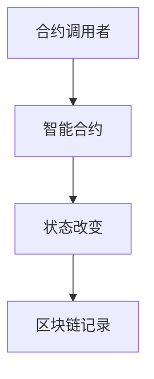
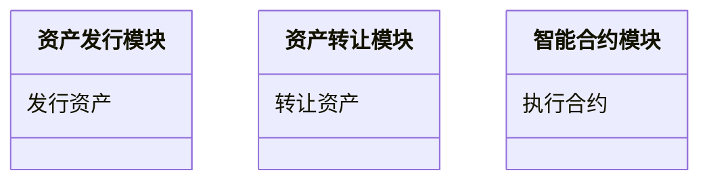
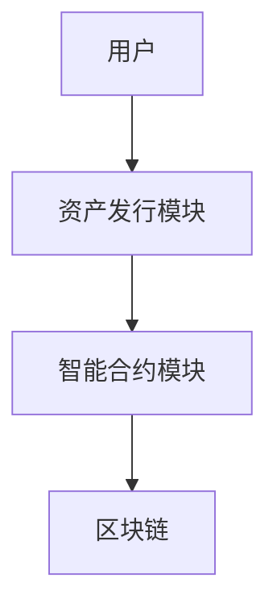

                 


```markdown
# 区块链在资产 Tokenization 中的应用

## 文章关键词

- 区块链
- 资产 Tokenization
- 智能合约
- 去中心化
- 资产数字化

## 文章摘要

区块链技术为资产 Tokenization 提供了安全、透明和去中心化的解决方案。本文详细探讨了区块链在资产 Tokenization 中的应用，包括核心概念、技术原理、系统架构设计及实际案例分析。通过智能合约和分布式账本，区块链实现了资产的高效流转与价值传递，推动了金融创新和数字化转型。

---

# 第一部分: 区块链与资产 Tokenization 的背景

## 第1章: 区块链与资产 Tokenization 概述

### 1.1 区块链的基本概念

#### 1.1.1 区块链的定义与特点

区块链是一种去中心化的分布式账本技术，通过密码学和共识机制确保数据的安全性和不可篡改性。其主要特点包括：

- **去中心化**：无须依赖中央机构，数据由网络中的多个节点共同维护。
- **不可篡改**：数据一旦写入区块链，难以被修改或删除。
- **透明性**：所有交易记录在区块链上公开可见，确保透明性和可追溯性。
- **安全性**：通过加密算法和共识机制，确保数据的安全性和完整性。

#### 1.1.2 区块链的核心技术原理

区块链的核心技术包括：

- **区块结构**：由交易记录和链式结构组成，每个区块包含前一个区块的哈希值，形成链式结构。
- **共识机制**：如工作量证明（PoW）、权益证明（PoS）等，确保所有节点达成一致。
- **智能合约**：基于区块链的自动执行脚本，用于实现复杂的业务逻辑。

#### 1.1.3 区块链的分类与应用场景

区块链主要分为公链、私链和联盟链，应用场景包括金融、供应链、医疗等。

---

### 1.2 资产 Tokenization 的定义与特点

#### 1.2.1 资产 Tokenization 的定义

资产 Tokenization 是将传统资产（如房地产、股权、艺术品等）转化为数字形式的代币，利用区块链技术实现资产的数字化和流转。

#### 1.2.2 资产 Tokenization 的核心要素

- **数字化**：将实体资产转化为数字形式。
- **代币化**：通过代币表示资产的权益。
- **区块链技术**：确保代币的安全性和可追溯性。

#### 1.2.3 资产 Tokenization 的分类与应用场景

资产 Tokenization 可分为金融资产（如股票、债券）和非金融资产（如房地产、艺术品）。应用场景包括证券化、供应链金融、艺术品交易等。

---

### 1.3 区块链与资产 Tokenization 的结合

#### 1.3.1 区块链在资产 Tokenization 中的作用

- 提供安全的分布式账本，确保资产的透明性和不可篡改性。
- 通过智能合约实现自动化的资产发行和转让。

#### 1.3.2 区块链如何实现资产的透明与安全

- 通过区块链的公开账本，确保所有交易记录可追溯。
- 利用加密算法和共识机制，确保数据的安全性。

#### 1.3.3 区块链与传统金融资产的区别

| 特性         | 区块链资产 Tokenization | 传统金融资产 |
|--------------|--------------------------|---------------|
| 所有权       | 可分割、可转让            | 不可分割       |
| 透明性       | 高                      | 低             |
| 成本          | 低                      | 高             |

---

## 第2章: 资产 Tokenization 的核心概念与联系

### 2.1 区块链与 Tokenization 的核心概念

#### 2.1.1 区块链的去中心化特性

去中心化是区块链的核心特性，通过分布式节点实现数据的安全性和可靠性。

#### 2.1.2 Token 的本质与属性

- **本质**：Token 是一种数字资产，用于表示某种权益或价值。
- **属性**：可分割性、可转让性、可编程性。

#### 2.1.3 智能合约的作用与实现

智能合约是区块链上的自动执行脚本，用于实现资产的发行和转让。

---

### 2.2 区块链与 Tokenization 的联系

#### 2.2.1 区块链为 Tokenization 提供技术支撑

通过区块链技术，实现 Token 的安全发行和流转。

#### 2.2.2 Tokenization 为区块链扩展应用场景

资产 Tokenization 将区块链技术应用于更多领域，推动金融创新。

---

## 第3章: 智能合约的算法原理

### 3.1 智能合约的定义与作用

智能合约是区块链上的自动执行脚本，用于实现资产的发行和转让。

### 3.2 智能合约的执行机制

#### 3.2.1 合约编译与部署

- **编译**：将智能合约代码（如Solidity）编译为 bytecode。
- **部署**：将 bytecode 部署到区块链上。

#### 3.2.2 合约执行流程



### 3.3 智能合约的数学模型

智能合约的执行逻辑可以用状态机模型表示：

$$
\text{状态转移} = f(\text{输入}, \text{当前状态})
$$

---

## 第4章: 区块链与 Tokenization 的系统架构设计

### 4.1 系统功能设计

#### 4.1.1 功能模块

- 资产发行模块
- 资产转让模块
- 智能合约模块

#### 4.1.2 领域模型设计



### 4.2 系统架构设计

#### 4.2.1 系统架构图



---

## 第5章: 项目实战

### 5.1 项目背景

本文以房地产资产的 Tokenization 为例，展示区块链技术的应用。

### 5.2 环境配置

- 操作系统：Ubuntu 20.04
- 区块链平台：Ethereum
- 智能合约语言：Solidity

### 5.3 核心代码实现

#### 5.3.1 智能合约代码

```solidity
// SPDX-License-Identifier: MIT
pragma solidity ^0.8.0;

contract AssetToken {
    mapping(address => uint256) public balances;

    function mint(address to, uint256 amount) public {
        balances[to] += amount;
    }

    function transfer(address from, address to, uint256 amount) public {
        require(balances[from] >= amount, "Insufficient balance");
        balances[from] -= amount;
        balances[to] += amount;
    }
}
```

#### 5.3.2 合约部署步骤

1. 编译合约并部署到 Ethereum 网络。
2. 调用 `mint` 函数发行资产。
3. 调用 `transfer` 函数进行资产转让。

---

## 第6章: 总结与展望

### 6.1 总结

区块链技术为资产 Tokenization 提供了高效、安全的解决方案，推动了金融创新和数字化转型。

### 6.2 展望

未来，资产 Tokenization 将与 NFT 和 DeFi 结合，进一步拓展应用场景。

---

**最佳实践 Tips**

- 在进行资产 Tokenization 时，需确保智能合约的逻辑正确，避免漏洞。
- 合规性是关键，需遵守相关法律法规。
- 选择合适的区块链平台，确保系统的性能和安全性。

通过本文的详细讲解，读者可以全面理解区块链在资产 Tokenization 中的应用，并能够实际操作相关项目。
```

