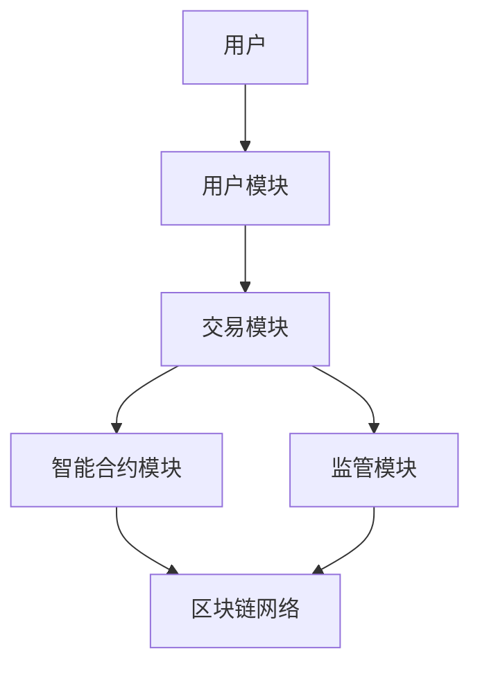

                 


# 区块链在跨境支付中的应用与挑战

---

## 关键词：区块链、跨境支付、去中心化、支付效率、支付安全、金融监管

---

## 摘要：  
区块链技术作为一种分布式账本技术，正在逐步改变传统的跨境支付方式。本文将深入探讨区块链在跨境支付中的应用、技术原理及其面临的挑战，并提出相应的解决方案。通过分析实际案例和系统架构设计，我们将展示区块链如何提升支付效率、降低成本和增强安全性，同时探讨如何应对监管和合规性等现实问题。

---

## 第1章：跨境支付的现状与问题

### 1.1 跨境支付的基本概念

#### 1.1.1 跨境支付的定义  
跨境支付是指跨越不同国家或货币体系的支付活动，通常涉及多个金融机构、支付网络和货币兑换。传统的跨境支付流程复杂，涉及中间银行、清算系统和外汇兑换，导致交易时间长、成本高。

#### 1.1.2 跨境支付的主要参与者  
- **发起人**：支付的发起方，通常是个人或企业。  
- **收款人**：支付的接收方，也可能是个人或企业。  
- **银行或支付机构**：处理支付交易的金融机构。  
- **清算系统**：如SWIFT、ACH等，用于跨行交易的清算。  
- **外汇兑换机构**：处理不同货币之间的兑换。  

#### 1.1.3 跨境支付的流程与特点  
- **流程**：发起支付请求 → 货币兑换 → 跨行清算 → 支付完成。  
- **特点**：涉及多环节、多机构、多货币，交易时间长、成本高、透明度低。  

---

### 1.2 跨境支付的主要问题

#### 1.2.1 跨境支付的高成本  
- **银行手续费**：每次跨境交易可能收取高昂的手续费。  
- **外汇兑换费**：兑换不同货币时会产生额外费用。  

#### 1.2.2 跨境支付的低效率  
- **多机构协作**：需要经过多个银行和清算系统，导致交易时间长。  
- **不透明的流程**：缺乏透明度，难以追踪交易状态。  

#### 1.2.3 跨境支付的安全性问题  
- **欺诈风险**：传统支付系统容易受到网络攻击和欺诈行为的影响。  
- **身份验证问题**：跨国交易中身份验证复杂，存在安全隐患。  

---

## 第2章：区块链技术概述

### 2.1 区块链的基本概念

#### 2.1.1 区块链的定义  
区块链是一种分布式账本技术，通过去中心化的方式记录交易数据，并通过密码学保证数据的安全性和不可篡改性。

#### 2.1.2 区块链的核心特点  
- **去中心化**：没有单一的控制机构，数据分布在网络中的多个节点上。  
- **不可篡改性**：通过密码学和共识机制保证数据的安全性。  
- **透明性**：所有交易记录在区块链上公开可查，但参与者身份可匿名化。  
- **智能合约**：自动执行预定义的合同条款，减少人为干预。  

#### 2.1.3 区块链的分类  
- **公有链**：开放的区块链网络，任何人都可以参与。  
- **私有链**：仅限于特定组织或机构内部使用的区块链。  
- **联盟链**：由多个机构共同管理的区块链，适用于特定行业的协作。  

---

### 2.2 区块链的关键技术

#### 2.2.1 分布式账本  
区块链通过分布式账本记录所有交易数据，每个节点都有一份完整的账本副本，确保数据的高可用性和一致性。

#### 2.2.2 共识机制  
共识机制是区块链的核心技术，用于确保所有节点达成一致。常见的共识机制包括：  
- **工作量证明（PoW）**：比特币采用的机制，通过计算哈希值来验证区块。  
- **权益证明（PoS）**：以太坊采用的机制，根据节点持有的代币数量分配记账权。  
- **实用拜占庭容错（PBFT）**：适用于联盟链的高效共识机制。  

#### 2.2.3 智能合约  
智能合约是区块链上的自动执行程序，可以根据预设条件自动执行合同条款。例如，当满足特定条件时，智能合约自动完成支付或转账。

#### 2.2.4 加密技术  
区块链使用多种加密技术来保证数据的安全性，包括：  
- **哈希函数**：将数据转换为固定长度的哈希值，用于数据验证和存储。  
- **数字签名**：通过公钥和私钥对交易进行签名，确保交易的合法性和真实性。  

---

## 第3章：区块链在跨境支付中的应用

### 3.1 跨境支付流程的区块链改造

#### 3.1.1 支付流程的重构  
- **去中心化支付**：通过区块链技术，直接连接发起人和收款人，减少中间机构的参与。  
- **智能合约支付**：通过智能合约自动执行支付流程，简化交易步骤。  

#### 3.1.2 区块链技术在支付中的具体应用  
- **实时到账**：通过区块链技术实现支付的实时到账，无需等待多天。  
- **多货币支持**：区块链支持多种数字货币和法币，实现无缝兑换和支付。  

---

### 3.2 区块链在跨境支付中的优势

#### 3.2.1 提高支付效率  
- **减少中间环节**：区块链去中心化的特性减少了中间机构的数量，提高了支付效率。  
- **智能合约自动化**：通过智能合约自动执行支付流程，减少人工干预。  

#### 3.2.2 降低交易成本  
- **去除中间机构**：区块链技术减少了传统支付中的中间银行和清算系统的费用。  
- **降低汇率成本**：通过区块链实现直接的点对点支付，减少外汇兑换费用。  

#### 3.2.3 提升支付安全性  
- **数据不可篡改**：区块链通过密码学和共识机制保证了交易数据的安全性和不可篡改性。  
- **身份验证**：通过区块链技术实现高效的多因素身份验证，降低欺诈风险。  

---

## 第4章：区块链在跨境支付中的挑战

### 4.1 技术层面的挑战

#### 4.1.1 区块链的可扩展性问题  
- **交易吞吐量低**：目前的区块链技术在处理高并发交易时存在瓶颈。  
- **网络延迟**：区块链的分布式特性可能导致网络延迟增加，影响交易速度。  

#### 4.1.2 区块链的交易延迟问题  
- **区块确认时间**：区块链交易需要经过多个区块确认，导致交易延迟。  
- **网络拥堵**：高并发交易可能导致区块链网络拥堵，进一步增加交易时间。  

#### 4.1.3 区块链的安全性问题  
- **51%攻击**：某些区块链系统可能面临恶意节点控制网络的风险。  
- **智能合约漏洞**：智能合约的漏洞可能导致资金损失或系统故障。  

---

### 4.2 监管与合规性问题

#### 4.2.1 区块链的匿名性与反洗钱监管  
- **匿名性问题**：区块链的匿名性可能被用于洗钱等非法活动。  
- **反洗钱（AML）**：监管机构需要确保区块链支付符合反洗钱法规。  

#### 4.2.2 跨境支付的合规性要求  
- **KYC（了解你的客户）**：金融机构需要验证客户身份，确保合规性。  
- **AML（反洗钱）**：防止非法资金流动，符合国际金融监管要求。  

#### 4.2.3 不同国家的监管  
- **法律差异**：不同国家对区块链技术的监管政策不同，增加了跨境支付的复杂性。  
- **税收政策**：区块链支付的税务处理可能因国家而异。  

---

## 第5章：区块链在跨境支付中的解决方案

### 5.1 技术层面的解决方案

#### 5.1.1 优化共识机制  
- **侧链技术**：通过侧链实现高并发交易处理，提高交易吞吐量。  
- **分片技术**：将区块链网络分成多个片，每个片独立处理交易，提高整体效率。  

#### 5.1.2 提高交易处理能力  
- **Layer 2 解决方案**：通过状态通道、侧链等技术提高交易速度和降低费用。  
- **二层区块链**：在主链之外构建侧链，处理小额高频交易。  

#### 5.1.3 数据隐私保护  
- **零知识证明**：通过零知识证明技术保护交易隐私，同时保证数据的可验证性。  
- **同态加密**：在不泄露原始数据的情况下，对数据进行加密计算。  

---

### 5.2 监管与合规性的解决方案

#### 5.2.1 监管合规设计  
- **KYC 和 AML 集成**：在区块链系统中集成KYC和AML模块，确保合规性。  
- **监管审计接口**：提供监管机构所需的审计接口，便于监管机构审查交易记录。  

#### 5.2.2 支持多货币和多法币  
- **多币种支持**：区块链系统支持多种数字货币和法币，满足不同国家的支付需求。  
- **合规性设计**：确保系统设计符合不同国家的金融监管要求。  

#### 5.2.3 提升用户体验  
- **用户友好的钱包设计**：提供简单易用的钱包界面，方便用户管理数字资产。  
- **多语言支持**：支持多种语言，便于全球用户使用。  

---

## 第6章：实际案例分析

### 6.1 成功案例：Ripple 的 XRP 网络

#### 6.1.1 案例背景  
Ripple 的 XRP 网络是一个基于区块链的实时转账系统，旨在提供快速、低成本的跨境支付服务。  

#### 6.1.2 系统设计  
- **分布式账本**：使用Ripple共识协议（RCP）实现分布式账本管理。  
- **智能合约**：通过智能合约自动执行支付流程。  

#### 6.1.3 成功经验  
- **高扩展性**：Ripple 网络能够处理每秒数千笔交易。  
- **低延迟**：交易确认时间为几秒，接近实时支付。  

---

### 6.2 失败案例：The DAO 智能合约漏洞

#### 6.2.1 案例背景  
The DAO 是基于以太坊智能合约的去中心化自治组织，因智能合约漏洞导致资金被盗。  

#### 6.2.2 教训  
- **智能合约安全性**：智能合约需要经过严格的安全审计，防止漏洞利用。  
- **风险管理**：建立完善的风险管理体系，确保系统安全。  

---

## 第7章：系统架构设计

### 7.1 系统需求分析

#### 7.1.1 功能需求  
- 支持多货币和多法币的支付。  
- 实现实时到账和快速交易确认。  
- 提供高安全性和隐私保护。  

#### 7.1.2 性能需求  
- 高并发交易处理能力。  
- 低延迟的交易确认。  

---

### 7.2 系统架构设计

#### 7.2.1 系统功能模块  
- **用户模块**：管理用户身份和钱包地址。  
- **交易模块**：处理支付交易，记录交易数据。  
- **智能合约模块**：执行智能合约，自动完成支付流程。  
- **监管模块**：集成KYC和AML功能，确保合规性。  

#### 7.2.2 系统架构图  


---

### 7.3 接口设计

#### 7.3.1 API 接口  
- **发起支付**：API 接口接收支付请求，生成交易数据。  
- **查询交易状态**：API 接口返回交易状态和详细信息。  

---

## 第8章：项目实战

### 8.1 环境搭建

#### 8.1.1 安装以太坊钱包  
- 使用 MetaMask 或其他以太坊钱包管理数字资产。  

#### 8.1.2 部署智能合约  
- 使用 Remix 等智能合约开发工具部署智能合约到以太坊网络。  

---

### 8.2 核心代码实现

#### 8.2.1 智能合约代码  
```solidity
// SPDX-License-Identifier: MIT
pragma solidity ^0.8.0;

contract PaymentContract {
    mapping(address => uint256) public balances;

    function deposit() payable public {
        balances[msg.sender] += msg.value;
    }

    function withdraw(address payable recipient, uint256 amount) public {
        require(balances[msg.sender] >= amount, "Insufficient balance");
        balances[msg.sender] -= amount;
        recipient.transfer(amount);
    }
}
```

#### 8.2.2 交易发起代码  
```javascript
const contractAddress = '0x...'; // 智能合约地址
const contractABI = [...]; // 智能合约ABI

const contract = new ethers.Contract(contractAddress, contractABI, provider);
await contract.deposit({ value: ethers.utils.parseEther('1') });
await contract.withdraw(recipientAddress, ethers.utils.parseEther('1'));
```

---

## 第9章：总结与展望

### 9.1 总结

区块链技术在跨境支付中的应用潜力巨大，通过去中心化和智能合约实现了高效、低成本、安全的支付方式。然而，区块链技术在实际应用中仍然面临诸多挑战，包括技术层面的可扩展性问题和监管层面的合规性问题。

---

### 9.2 未来展望

随着技术的发展和监管政策的完善，区块链在跨境支付中的应用将更加广泛。未来，我们可以期待以下发展：  
- 更高效的共识机制，如侧链和分片技术。  
- 更强的数据隐私保护技术，如零知识证明。  
- 更完善的监管合规设计，确保区块链支付的合法性和安全性。  

---

### 9.3 最佳实践 Tips

- **选择合适的区块链平台**：根据需求选择公有链、私有链或联盟链。  
- **确保智能合约的安全性**：进行严格的代码审计和漏洞测试。  
- **遵守当地法规**：了解并遵守目标市场的监管要求。  

---

通过本文的分析，我们可以看到区块链技术在跨境支付中的巨大潜力，同时也需要我们共同努力，克服技术与监管的双重挑战，推动区块链技术在跨境支付中的广泛应用。

