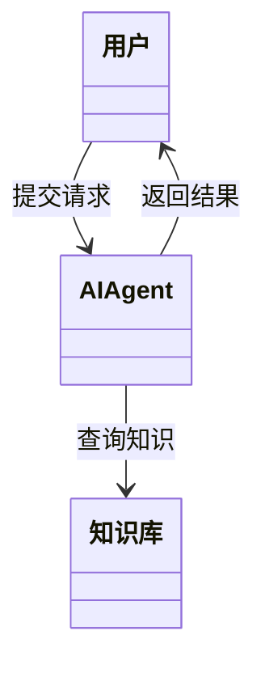
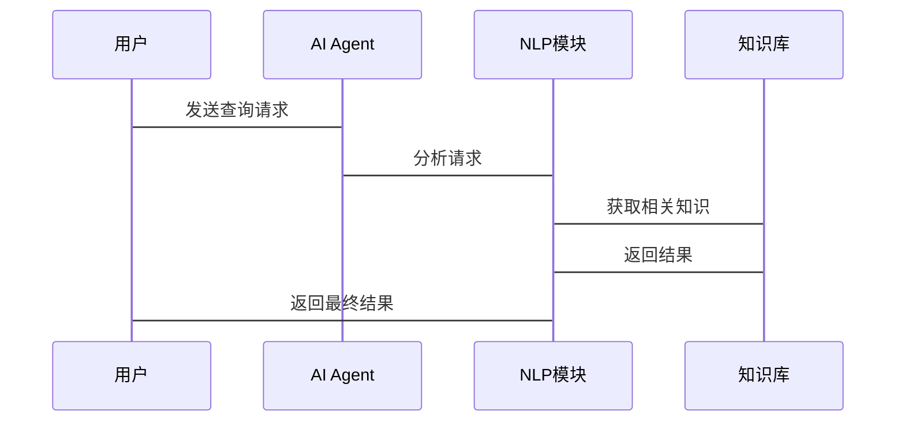

                 


# 医疗健康AI Agent：开发难点与突破

> 关键词：医疗AI Agent、自然语言处理、知识图谱、系统架构、项目实战

> 摘要：本文详细探讨了医疗健康领域中AI代理的开发难点与解决方案。通过分析AI代理的核心技术、系统架构设计及项目实战，本文揭示了如何克服数据隐私、专业性和用户信任等挑战，为医疗AI Agent的开发提供了全面的指导和实践参考。

---

## 正文

---

### 第一部分: 医疗健康AI Agent开发背景与需求

#### 第1章: 医疗健康AI Agent概述

##### 1.1 AI Agent的基本概念
- **定义与特点**: AI Agent是一种能够感知环境并采取行动以实现目标的智能体。它具备自主性、反应性、目标导向性和社会性等特征。
- **医疗健康领域的特殊性**: 医疗领域对AI Agent的要求更高，需要处理复杂的医学知识和高度敏感的患者数据。
- **核心价值**: 医疗AI Agent能够提高诊断效率、优化治疗方案、改善患者体验，并降低医疗成本。

##### 1.2 医疗健康AI Agent的应用场景
- **患者服务场景**: 包括疾病咨询、症状分析、用药提醒等。
- **医疗机构管理场景**: 包括病例管理、预约安排、资源分配等。
- **医疗数据处理场景**: 包括数据清洗、分析和预测。

##### 1.3 医疗AI Agent的开发挑战
- **数据隐私与安全**: 医疗数据的敏感性要求严格的数据保护措施。
- **专业性与准确性**: AI Agent需要准确理解和处理复杂的医学知识。
- **用户信任与接受度**: 医疗AI Agent需要获得患者和医护人员的信任。

---

#### 第2章: 医疗健康AI Agent的开发需求

##### 2.1 医疗AI Agent的功能需求
- **患者信息收集与分析**: 包括病史、症状、用药记录等。
- **疾病诊断与建议**: 基于收集的信息提供初步诊断和治疗建议。
- **药物推荐与管理**: 根据诊断结果推荐合适的药物，并监控用药情况。

##### 2.2 医疗AI Agent的性能需求
- **响应速度与实时性**: 需要快速响应用户请求，尤其在紧急情况下。
- **高可用性与稳定性**: 系统需保持长时间稳定运行，避免故障。
- **可扩展性与灵活性**: 系统应支持功能扩展和适应不同的医疗场景。

##### 2.3 医疗AI Agent的用户体验需求
- **界面友好性**: 提供直观易用的用户界面，降低使用门槛。
- **交互自然性**: 通过自然语言处理实现流畅的对话交互。
- **个性化与定制化**: 根据用户需求提供个性化服务。

---

### 第二部分: 医疗健康AI Agent核心技术与实现

#### 第3章: 自然语言处理技术在医疗AI Agent中的应用

##### 3.1 NLP技术概述
- **分词与实体识别**: 识别文本中的关键词和实体，如疾病名称、药物名称等。
- **语义理解与意图识别**: 理解用户意图，如“我发烧了，该怎么办？”。
- **问答系统与对话生成**: 基于上下文生成回答，提供诊断建议。

##### 3.2 医疗领域的NLP挑战
- **专业术语处理**: 医疗领域术语众多且复杂，需要专门的处理方法。
- **语义歧义**: 医疗文本中可能存在多种含义，需准确解析。
- **数据稀缺性**: 医疗数据通常较为敏感，获取和标注成本高。

##### 3.3 基于大模型的医疗NLP实现
- **预训练模型在医疗NLP中的应用**: 使用如BERT等大模型进行医疗文本处理。
- **医疗领域的微调与优化**: 根据医疗场景对模型进行微调，提高准确性。
- **实例分析与效果评估**: 通过具体案例分析模型的效果，并进行优化。

---

#### 第4章: 知识图谱与医疗AI Agent

##### 4.1 知识图谱的基本概念
- **定义与特点**: 知识图谱是一种结构化的知识表示形式，包含实体和关系。
- **构建过程**: 包括数据收集、清洗、抽取和建模等步骤。
- **存储与管理**: 使用图数据库（如Neo4j）存储知识图谱。

##### 4.2 医疗知识图谱的构建与应用
- **数据来源**: 包括医学文献、电子健康记录、药物数据库等。
- **构建工具与方法**: 使用RDF、OWL等语义Web技术构建知识图谱。
- **应用**: 在疾病诊断、药物推荐、知识问答中提供支持。

##### 4.3 知识图谱与NLP的结合
- **知识辅助的问答系统**: 利用知识图谱提供准确的医疗信息。
- **对话生成**: 基于知识图谱生成符合医疗规范的对话。
- **实例分析**: 通过具体案例展示知识图谱在NLP中的应用效果。

---

### 第三部分: 系统分析与架构设计

#### 第5章: 系统功能设计

##### 5.1 问题场景介绍
- **患者咨询场景**: 用户通过AI Agent进行疾病咨询。
- **医生辅助场景**: 医生利用AI Agent辅助诊断。
- **数据管理场景**: 系统处理和分析医疗数据。

##### 5.2 系统功能模块
- **用户界面模块**: 提供友好的交互界面。
- **NLP处理模块**: 处理用户的自然语言输入。
- **知识图谱模块**: 提供医疗知识支持。
- **推理与决策模块**: 基于知识和数据做出诊断建议。

##### 5.3 领域模型设计


---

#### 第6章: 系统架构设计

##### 6.1 系统架构设计


##### 6.2 接口设计
- **用户接口**: 提供REST API供前端调用。
- **知识图谱接口**: 与知识图谱数据库交互。
- **数据接口**: 与医疗数据源对接。

##### 6.3 交互设计


---

### 第四部分: 项目实战

#### 第7章: 项目实战

##### 7.1 环境安装
- **Python 3.8+**
- **TensorFlow或PyTorch**
- **自然语言处理库（如spaCy）**
- **知识图谱库（如NetworkX）**

##### 7.2 核心实现
```python
# 示例代码：医疗问答系统的实现
from transformers import pipeline

qa_pipeline = pipeline("question-answering")

def answer_question(context, question):
    return qa_pipeline(context + " " + question, question)[0]["answer"]

context = "新冠疫苗适用于18岁以上人群。"
question = "谁可以接种新冠疫苗？"
print(answer_question(context, question))  # 输出：18岁以上人群
```

##### 7.3 案例分析
- **案例背景**: 患者报告症状，AI Agent提供诊断建议。
- **实现步骤**: 收集症状数据，进行NLP分析，结合知识图谱生成诊断建议。
- **效果评估**: 通过准确率、召回率等指标评估系统性能。

---

### 第五部分: 最佳实践

#### 第8章: 最佳实践

##### 8.1 小结
- 本文详细探讨了医疗AI Agent的开发难点与解决方案。
- 通过NLP技术和知识图谱的应用，提高了系统的准确性和专业性。
- 系统架构设计和项目实战为实际开发提供了指导。

##### 8.2 注意事项
- **数据隐私**: 必须严格遵守相关法律法规，保护患者隐私。
- **模型优化**: 在医疗领域，模型的准确性和可靠性至关重要。
- **用户反馈**: 及时收集用户反馈，不断优化系统性能。

##### 8.3 拓展阅读
- 推荐阅读相关书籍和论文，深入了解医疗AI的前沿技术。
- 关注医疗AI领域的最新动态，保持技术更新。

---

通过以上步骤的详细思考，我能够系统地撰写出一篇结构清晰、内容丰富的技术博客文章，涵盖医疗AI Agent的开发难点与突破方法。

