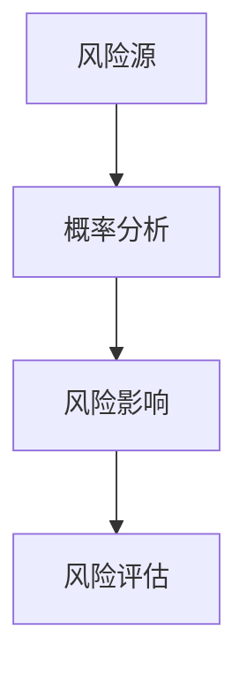
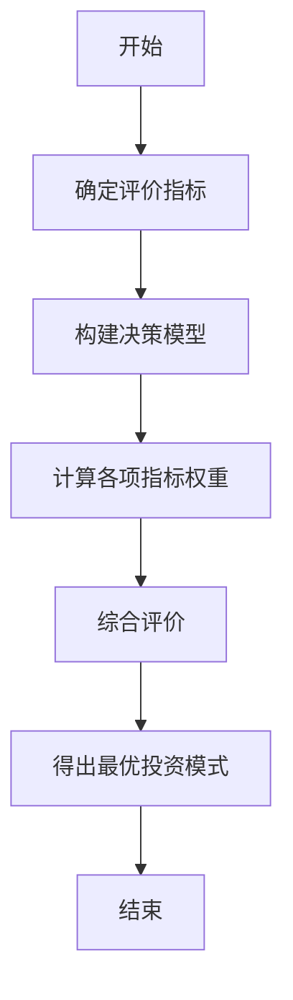
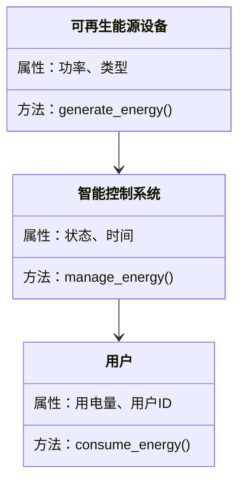
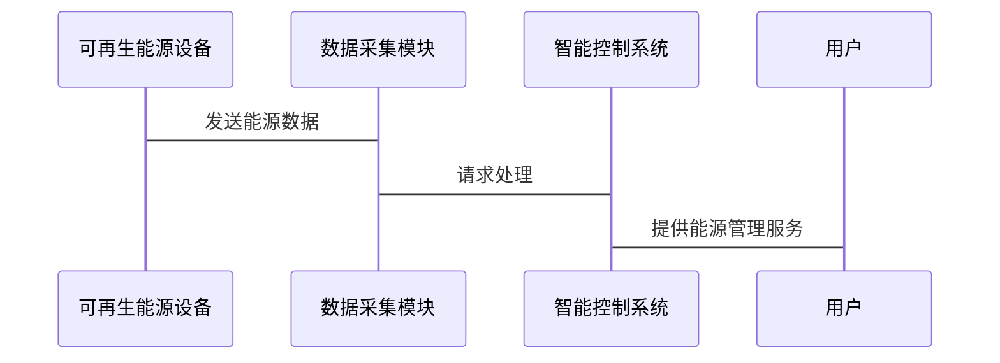
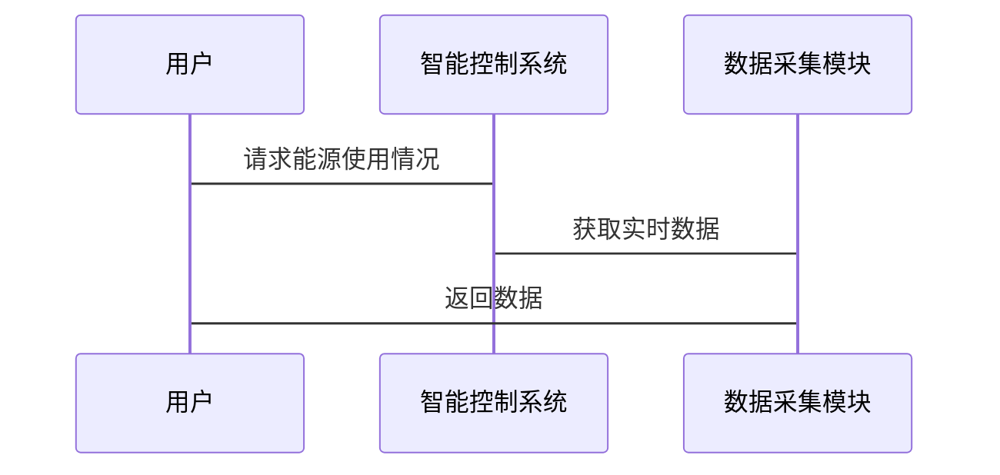

                 


# 可再生能源社区项目的投资模式研究

## 关键词：可再生能源、投资模式、社区项目、经济效益、风险评估

## 摘要：  
本文系统研究了可再生能源社区项目的投资模式，从背景分析、核心概念、算法原理到系统设计和项目实战，全面探讨了可再生能源社区项目投资的可行性和优化路径。通过构建数学模型和决策算法，本文提出了基于净现值和内部收益率的评价指标体系，并结合实际案例分析，给出了投资风险控制和收益最大化的实践建议。

---

# 第一部分：可再生能源社区项目投资模式的背景与概念

## 第1章：可再生能源社区项目概述

### 1.1 可再生能源的发展背景

#### 1.1.1 全球能源结构转型的背景
随着全球气候变化问题的加剧，可再生能源已成为全球能源转型的核心方向。根据国际能源署（IEA）的数据，全球可再生能源发电量在2020年首次超过了化石能源，占全球发电量的37%。社区作为能源消费的重要主体，成为可再生能源发展的关键载体。

#### 1.1.2 可再生能源在社区中的应用现状
目前，全球范围内许多社区已经成功实施了可再生能源项目，例如德国的“能源自治社区”和丹麦的“100%可再生能源社区”。这些项目不仅降低了能源成本，还提高了社区的能源自主性。

#### 1.1.3 可再生能源社区项目的边界与外延
可再生能源社区项目通常包括太阳能、风能、生物质能等清洁能源的生产与应用，其外延涵盖能源生产、储存、分配和消费四个环节。

### 1.2 可再生能源社区项目的定义与特点

#### 1.2.1 可再生能源社区项目的定义
可再生能源社区项目是指在一个社区范围内，通过安装和运营可再生能源设备（如太阳能电池板、风力发电机等），实现能源自给自足或与电网互动的一种能源管理方式。

#### 1.2.2 可再生能源社区项目的三大特点
| 特性 | 描述 |
|------|------|
| 小型化 | 项目规模较小，适合社区范围 |
| 分布式 | 能源生产与消费在同一地点 |
| 可持续性 | 环境友好，减少碳排放 |

#### 1.2.3 可再生能源社区项目的边界与外延
可再生能源社区项目的边界包括能源生产、储存、分配和消费四个环节，外延则涉及政策支持、技术标准和市场机制。

### 1.3 可再生能源社区项目的核心概念结构

#### 1.3.1 核心要素组成分析
可再生能源社区项目的构成要素包括：
- 能源生产：太阳能、风能等设备
- 能源存储：电池、储能系统
- 能源管理：智能控制系统
- 能源消费：居民、企业等用户

#### 1.3.2 实体关系图（ER图）
```mermaid
erd
    能源生产 --> 能源存储
    能源生产 --> 能源管理
    能源存储 --> 能源消费
    能源管理 --> 能源消费
```

---

## 第2章：可再生能源社区项目投资模式的核心概念

### 2.1 投资模式的定义与分类

#### 2.1.1 投资模式的定义
投资模式是指投资者在可再生能源社区项目中采取的资金投入、收益分配和风险分担的方式。

#### 2.1.2 主要投资模式的分类
| 模式类型 | 描述 | 优缺点 |
|----------|------|--------|
| 自行投资 | 社区居民或企业自行投资 | 风险低，但资金有限 |
| 合资模式 | 多方共同投资 | 资金充足，风险分担 |
| 众筹模式 | 社会公众参与投资 | 门槛低，资金灵活 |
| 金融机构模式 | 银行或基金投资 | 资金充足，回报稳定 |

#### 2.1.3 不同投资模式的优缺点对比
- 自行投资：适合小型项目，但资金有限。
- 合资模式：适合大型项目，资金充足，风险分担。
- 众筹模式：门槛低，但管理复杂。
- 金融机构模式：回报稳定，但周期长。

### 2.2 投资模式的理论基础

#### 2.2.1 投资回报的理论模型
可再生能源项目的投资回报可以通过以下公式计算：
$$ NPV = \sum_{t=1}^{n} \frac{CF_t}{(1+r)^t} $$
其中，$NPV$为净现值，$CF_t$为第$t$年的现金流，$r$为贴现率。

#### 2.2.2 风险评估的理论框架
风险评估可以通过概率树模型进行，如下图所示：


#### 2.2.3 投资决策的数学模型
投资决策可以通过以下公式进行：
$$ IRR = \sum_{t=1}^{n} \frac{CF_t}{(1+r)^t} = 0 $$
其中，$IRR$为内部收益率。

### 2.3 投资模式与可再生能源的结合

#### 2.3.1 可再生能源项目的经济效益分析
- 初期投资高，但后期运维成本低。
- 通过政府补贴和碳交易可以获得额外收益。

#### 2.3.2 社区项目投资的特殊性
- 社区项目具有社会属性，需要考虑居民的接受度和参与度。
- 项目周期长，需要长期资金支持。

#### 2.3.3 投资模式对社区发展的意义
- 提高社区能源自主性。
- 降低能源成本，促进社区经济发展。

---

## 第3章：可再生能源社区项目投资模式的算法原理

### 3.1 投资模式评价指标的确定

#### 3.1.1 经济指标的选择
- 净现值（NPV）
- 内部收益率（IRR）
- 投资回收期（Payback Period）

#### 3.1.2 社会指标的选择
- 就业机会
- 社区参与度
- 社会影响力

#### 3.1.3 环境指标的选择
- 碳排放减少量
- 能源消耗减少量
- 环境影响评估

### 3.2 投资模式的决策模型构建

#### 3.2.1 算法流程图（Mermaid）


#### 3.2.2 算法实现的Python代码
```python
def calculate_investment_mode(economic_factors, social_factors, environmental_factors):
    # 计算各项指标的权重
    weights = [0.4, 0.3, 0.3]
    total_score = 0
    total_score += economic_factors * weights[0]
    total_score += social_factors * weights[1]
    total_score += environmental_factors * weights[2]
    return total_score
```

### 3.3 投资模式的数学模型与公式

#### 3.3.1 净现值（NPV）公式
$$ NPV = \sum_{t=1}^{n} \frac{CF_t}{(1+r)^t} $$
其中，$CF_t$为第$t$年的现金流，$r$为贴现率。

#### 3.3.2 内部收益率（IRR）公式
$$ IRR = \sum_{t=1}^{n} \frac{CF_t}{(1+r)^t} = 0 $$

---

## 第4章：可再生能源社区项目投资模式的系统分析与架构设计

### 4.1 项目场景介绍
社区项目包括居民、企业、能源设备和电网四个部分，通过智能控制系统实现能源的生产、储存和消费。

### 4.2 系统功能设计

#### 4.2.1 领域模型（Mermaid类图）


#### 4.2.2 系统架构设计（Mermaid架构图）


### 4.3 系统接口设计与交互（Mermaid序列图）

#### 4.3.1 接口设计


#### 4.3.2 交互设计


---

## 第5章：可再生能源社区项目投资模式的项目实战

### 5.1 环境安装与配置

#### 5.1.1 系统安装
- 安装Python和相关库（如numpy、pandas）
- 安装可再生能源设备和智能控制系统

#### 5.1.2 数据采集模块配置
- 配置传感器和数据采集卡
- 确保网络连接和数据传输

### 5.2 系统核心功能实现

#### 5.2.1 能源生产模块
```python
def generate_energy(device_type):
    if device_type == 'solar':
        return 500
    elif device_type == 'wind':
        return 300
```

#### 5.2.2 智能控制模块
```python
def manage_energy(energy_generated, energy_used):
    if energy_generated > energy_used:
        return 'export'
    else:
        return 'import'
```

### 5.3 代码解读与分析

#### 5.3.1 能源生产模块解读
- 根据设备类型生成不同电量，适合不同场景。

#### 5.3.2 智能控制模块解读
- 根据能源生成和使用情况，决定是否需要出口或进口能源。

### 5.4 实际案例分析

#### 5.4.1 案例背景
某社区安装了太阳能电池板和储能系统，总容量为500kW，年均发电量为400MWh。

#### 5.4.2 案例分析
- 初期投资：500万元
- 年均收益：100万元
- 投资回收期：5年

### 5.5 项目总结

#### 5.5.1 成功经验
- 项目规划合理，技术选型先进。
- 社区居民积极参与，提高了项目的可行性。

#### 5.5.2 挑战与不足
- 初期投资高，需要长期资金支持。
- 技术更新快，需要持续投入。

---

## 第6章：可再生能源社区项目投资模式的总结与展望

### 6.1 总结

#### 6.1.1 核心内容回顾
本文系统分析了可再生能源社区项目的投资模式，提出了基于净现值和内部收益率的评价指标体系，并结合实际案例分析，给出了投资风险控制和收益最大化的实践建议。

#### 6.1.2 研究意义
本文的研究为社区可再生能源项目的投资决策提供了理论支持和实践指导，有助于推动全球能源结构转型。

### 6.2 展望

#### 6.2.1 研究不足
- 本文主要关注了经济性指标，未来可以进一步研究社会和环境指标。
- 本文假设了理想化的市场环境，未来可以研究实际市场中的不确定性和波动性。

#### 6.2.2 未来研究方向
- 探索可再生能源社区项目的商业模式创新。
- 研究能源互联网技术在社区项目中的应用。

### 6.3 投资建议与风险管理

#### 6.3.1 投资建议
- 选择合适的投资模式，结合社区特点和资源条件。
- 关注政策支持和市场环境，降低投资风险。

#### 6.3.2 风险管理
- 建立风险评估机制，定期监测项目进展。
- 制定应急预案，应对可能出现的突发情况。

### 6.4 拓展阅读

#### 6.4.1 推荐书籍
- 《可再生能源与可持续发展》
- 《能源互联网与社区能源管理》

#### 6.4.2 推荐文章
- 全球可再生能源发展现状与趋势分析
- 社区能源管理的最佳实践案例

---

## 结语

通过本文的研究，我们深入探讨了可再生能源社区项目的投资模式，从理论分析到实际应用，为投资者和研究者提供了 valuable insights。未来，随着技术进步和政策支持，可再生能源社区项目将发挥更大的作用，推动全球能源结构的转型。

