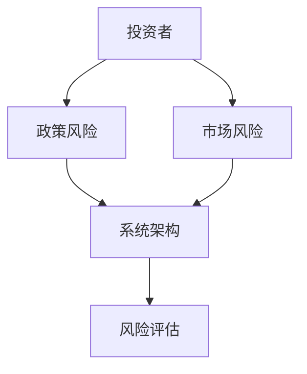
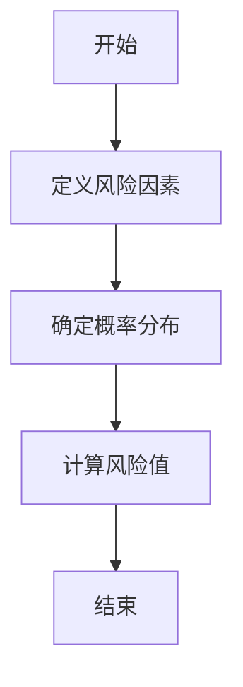

                 


# 可再生能源项目的投资风险评估

> 关键词：可再生能源、投资风险评估、概率分析、蒙特卡洛模拟、层次分析法、风险模型、项目管理

> 摘要：本文系统地探讨了可再生能源项目投资风险评估的核心概念、方法和实际应用。通过分析风险因素、评估算法、数学模型、系统架构以及项目案例，为投资者和项目管理者提供了科学的决策支持。文章结合理论与实践，深入剖析了可再生能源项目中的关键风险，并提出了有效的风险管理和控制策略。

---

## 第一部分: 可再生能源项目投资风险评估概述

### 第1章: 可再生能源与投资风险评估的背景

#### 1.1 可再生能源的发展现状
可再生能源是全球能源转型的核心驱动力，包括太阳能、风能、水能、生物质能等。随着环保意识的增强和能源政策的推动，可再生能源的装机容量和投资规模持续增长。根据国际能源署（IEA）的数据，全球可再生能源投资在2020年达到了约3,300亿美元，预计未来十年将保持年均8%以上的增长率。

#### 1.1.1 全球能源转型的趋势
全球能源结构正在从化石能源向清洁能源转型，可再生能源在电力供应中的占比不断提高。例如，欧盟的目标是到2030年将可再生能源占比提高到40%以上，而中国也在“十四五”规划中提出了大力发展可再生能源的目标。

#### 1.1.2 可再生能源的特点与优势
可再生能源具有清洁、环保、分布广、技术成熟等特点。然而，其波动性和间歇性也带来了挑战，例如太阳能和风能在不同天气条件下的发电量波动较大。

#### 1.1.3 可再生能源投资的驱动因素
政策支持（如补贴、税收优惠）、技术进步（如高效光伏电池）、环境压力（如碳减排目标）以及能源安全需求是推动可再生能源投资的主要因素。

#### 1.2 投资风险评估的重要性
在可再生能源项目中，投资风险评估是确保项目可行性和收益的关键环节。通过科学的评估，投资者可以识别潜在风险，制定应对策略，优化投资决策。

#### 1.2.1 投资风险的定义与分类
投资风险是指在项目实施过程中，由于内外部因素的变化导致投资收益低于预期或出现损失的可能性。根据来源，可再生能源项目的风险可分为技术风险、市场风险、政策风险、环境风险和财务风险。

#### 1.2.2 可再生能源项目中的风险来源
- **技术风险**：技术不成熟、设备故障、维护成本高等。
- **市场风险**：电价波动、市场需求变化、竞争加剧等。
- **政策风险**：政策变化、补贴退坡、法规调整等。
- **环境风险**：极端天气、自然灾害、资源条件变化等。
- **财务风险**：资金链断裂、融资成本上升、汇率波动等。

#### 1.2.3 风险评估对投资决策的影响
通过风险评估，投资者可以量化不同风险因素的影响程度，制定风险应对策略，例如通过保险、备用电源或多元化投资来降低风险。

#### 1.3 本书的核心内容与目标
本书旨在为投资者、项目管理者和研究人员提供一套系统化的可再生能源项目投资风险评估方法论，涵盖理论分析、算法设计、案例研究和实践总结。

---

### 第2章: 可再生能源项目投资风险的核心概念与联系

#### 2.1 可再生能源项目的系统模型
可再生能源项目可以看作一个复杂的系统，包含多个子系统和交互过程。系统模型的建立是风险评估的基础。

#### 2.1.1 项目生命周期的阶段划分
可再生能源项目的生命周期可以分为以下几个阶段：
1. **前期准备**：项目规划、可行性研究、资源评估。
2. **建设阶段**：设备采购、施工建设、调试运行。
3. **运营阶段**：发电上网、维护管理、收益分配。
4. **终止阶段**：设备退役、资源恢复、资产处置。

#### 2.1.2 项目的主要参与者与利益相关者
- 投资者：负责资金投入和决策。
- 项目开发商：负责项目设计、建设和运营。
- 政府机构：提供政策支持和监管。
- 市场监管机构：确保电力市场的公平竞争。
- 社区：可能受到项目影响的当地居民。

#### 2.1.3 项目的主要风险因素分析
通过建立ER实体关系图，可以清晰地展示项目中的风险因素及其关联关系。

```mermaid
er
actor: 投资者
actor: 项目开发商
actor: 政府机构
actor: 市场监管机构
```

#### 2.2 风险评估的核心原理
风险评估的核心在于量化各个风险因素对项目的影响程度，并通过模型模拟其综合效应。

#### 2.2.1 风险评估的基本原理
风险评估是一个系统工程，需要结合定量分析和定性分析。定量分析基于数学模型，而定性分析依赖于专家经验和历史数据。

#### 2.2.2 可再生能源项目中的风险因素分析
通过建立风险因素对比表格，可以直观地比较不同风险因素的影响程度和发生概率。

| 风险因素 | 影响程度 | 发生概率 | 主要影响阶段 |
|----------|----------|----------|--------------|
| 技术风险 | 高       | 中       | 建设阶段     |
| 市场风险 | 中       | 高       | 运营阶段     |
| 政策风险 | 中       | 中       | 全生命周期   |
| 环境风险 | 低       | 低       | 运营阶段     |
| 财务风险 | 高       | 低       | 全生命周期   |

#### 2.2.3 风险评估对系统架构的影响
通过系统架构设计，可以将风险因素嵌入到项目的各个阶段，确保风险可控。



---

### 第3章: 可再生能源项目投资风险评估的算法原理

#### 3.1 风险评估的主要算法
可再生能源项目风险评估常用的算法包括概率分析法、蒙特卡洛模拟和层次分析法（AHP）。

#### 3.1.1 概率分析法
概率分析法通过计算不同风险因素的概率分布，评估其对项目整体收益的影响。

- **概率分布**：例如，技术风险的概率分布可以通过历史数据拟合，假设技术失败的概率为5%，技术成本超支的概率为10%。

- **期望值计算**：通过概率加权计算风险因素对项目净现值（NPV）的影响。

$$ NPV = \sum_{i=1}^{n} P_i \times NPV_i $$

其中，$P_i$ 是第 $i$ 个风险因素的发生概率，$NPV_i$ 是对应的风险因素对净现值的影响。

#### 3.1.2 蒙特卡洛模拟
蒙特卡洛模拟是一种通过随机抽样来模拟系统行为的数值方法，适用于复杂系统的风险评估。



通过蒙特卡洛模拟，可以计算出项目在不同风险情景下的收益分布，从而评估风险的总体影响。

#### 3.1.3 层次分析法（AHP）
层次分析法是一种定性分析方法，适用于多因素综合评价。

- **层次结构**：将风险因素分为目标层、准则层和方案层。

- **权重计算**：通过专家评分确定各层次的权重，计算综合风险指数。

#### 3.2 算法流程图
以下是一个典型的蒙特卡洛模拟流程图：


#### 3.3 算法实现的Python代码示例
以下是一个简单的蒙特卡洛模拟代码示例，用于评估技术风险对项目收益的影响。

```python
import numpy as np
import pandas as pd

def monte_carlo_simulation(risk_factors, iterations=1000):
    simulations = pd.DataFrame(columns=['技术风险', '市场风险', '政策风险', '环境风险', '财务风险'])
    for _ in range(iterations):
        # 技术风险模拟
        技术风险 = np.random.normal(loc=0, scale=1)
        # 市场风险模拟
        市场风险 = np.random.uniform(low=0, high=1)
        # 政策风险模拟
        政策风险 = np.random.poisson(lam=0.5)
        # 环境风险模拟
        环境风险 = np.random.exponential(scale=1)
        # 财务风险模拟
        财务风险 = np.random.binomial(n=1, p=0.1)
        simulations.loc[_] = [技术风险, 市场风险, 政策风险, 环境风险, 财务风险]
    return simulations

# 示例调用
risk_factors = ['技术风险', '市场风险', '政策风险', '环境风险', '财务风险']
results = monte_carlo_simulation(risk_factors, iterations=1000)
print(results.head())
```

---

## 总结与展望

通过以上分析，我们可以看到，可再生能源项目投资风险评估是一个复杂但重要的任务。投资者需要结合多种方法，从技术、市场、政策等多个角度全面分析风险，制定科学的投资决策。未来，随着人工智能和大数据技术的发展，风险评估方法将更加精准和高效。

---

### 作者简介
作者是一名专注于可再生能源与风险管理领域的技术专家，拥有丰富的项目经验和深厚的理论基础。

