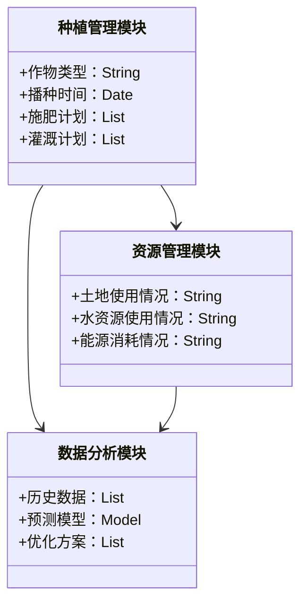
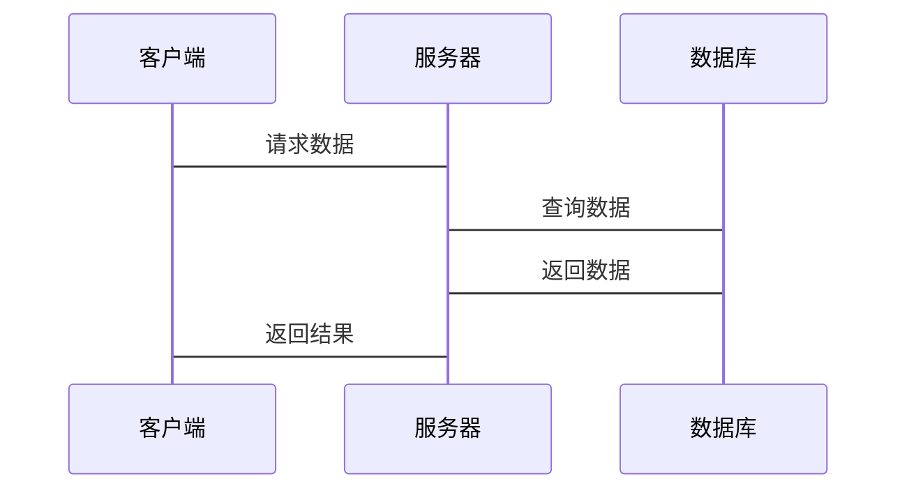

                 


# 可持续农业实践与相关产业链投资

> 关键词：可持续农业，产业链投资，现代农业技术，绿色金融，农业数字化

> 摘要：本文深入探讨了可持续农业的核心概念、技术驱动因素、产业链整合及投资机会。通过分析传统农业与可持续农业的对比，详细阐述了数字技术在农业中的应用，绿色金融对可持续农业的支持，产业链整合的必要性及实现路径。同时，本文结合实际案例，从系统设计、项目实战等角度，详细分析了可持续农业项目的设计与实现，并提出了投资策略与模式的建议。最后，总结了可持续农业产业链投资的未来趋势，为投资者和农业从业者提供了有价值的参考。

---

## 第一章: 可持续农业的背景与基础

### 1.1 可持续农业的概念与特点

#### 1.1.1 可持续农业的定义
可持续农业是一种能够满足当前需求，同时不损害后代满足其需求能力的农业实践。它强调资源的高效利用、环境保护和社会公平。

#### 1.1.2 可持续农业的核心要素
- 生产效率：通过技术创新提高产量，减少资源浪费。
- 资源利用：合理利用土地、水、能源等资源，避免过度消耗。
- 环境影响：减少污染，保护生态系统，促进生物多样性。
- 经济收益：确保农民和企业的经济效益，实现可持续发展。

#### 1.1.3 可持续农业与传统农业的区别
| 方面       | 可持续农业                     | 传统农业                     |
|------------|--------------------------------|------------------------------|
| 生产方式   | 资源高效利用，注重生态平衡       | 高产量导向，可能忽视环境影响   |
| 技术应用   | 广泛使用现代农业技术             | 传统技术为主，技术更新慢       |
| 经济模式   | 多元化收入来源，注重长期收益     | 依赖单一作物或产品，风险较高   |
| 社会影响   | 提高农民生活质量，促进社会公平   | 可能导致资源分配不均，加剧贫困   |

### 1.2 可持续农业的背景与问题背景

#### 1.2.1 当前农业面临的主要问题
- **资源枯竭**：过度使用化肥和水资源导致土地退化和水资源短缺。
- **环境污染**：农药和化肥的滥用导致水体富营养化和土壤污染。
- **气候变化**：极端天气事件增多，影响农作物生长和产量。
- **农民收入低**：传统农业模式下，农民收入不稳定，缺乏市场竞争力。

#### 1.2.2 可持续农业的必要性
- 保护生态环境，确保农业生产的长期性。
- 提高农民收入，促进农村经济发展。
- 应对气候变化，减少农业对环境的压力。

#### 1.2.3 可持续农业的目标与边界
目标：实现农业生产的高效、环保和可持续。
边界：在不损害后代利益的前提下，满足当前社会对农产品的需求。

### 1.3 可持续农业的技术驱动因素

#### 1.3.1 现代农业技术的发展
- **精准农业**：利用GPS、遥感技术和物联网设备，实现精准播种、施肥和灌溉。
- **生物技术**：通过基因编辑和育种技术，培育高产、抗病虫害的作物品种。
- **智能农业**：人工智能和大数据技术的应用，优化农业生产过程，提高效率。

#### 1.3.2 数字技术在农业中的应用
- **物联网（IoT）**：传感器和监控系统的应用，实时监测土壤湿度、温度和空气质量。
- **大数据分析**：通过收集和分析农业数据，优化种植方案，预测市场趋势。
- **区块链技术**：用于农产品溯源，确保产品质量和供应链透明。

#### 1.3.3 绿色金融对可持续农业的支持
- **绿色信贷**：银行提供低息贷款，支持农民和企业采用环保技术。
- **可持续投资**：投资者将资金投入可持续农业项目，获得经济回报的同时支持环保事业。
- **碳金融**：通过碳交易机制，鼓励减少温室气体排放。

---

## 第二章: 可持续农业的核心概念与产业链整合

### 2.1 可持续农业的核心要素

#### 2.1.1 农业生产效率
- 提高单位面积产量，减少资源浪费。
- 采用高效种植技术，优化作物布局。

#### 2.1.2 资源利用效率
- 合理分配水资源，推广滴灌和喷灌技术。
- 节约能源，使用可再生能源，如太阳能和生物质能。

#### 2.1.3 环境影响评估
- 减少化学农药和化肥的使用，降低环境污染。
- 保护生态系统，维护生物多样性。

#### 2.1.4 经济收益与社会效益
- 提高农民收入，增强农村经济活力。
- 提供就业机会，促进社会公平。

#### 2.1.5 可持续农业与生态系统服务
- 生态系统服务：授粉、土壤保持、水源涵养等。
- 农业与生态系统的协同：通过生态农业模式，实现农业与生态的和谐发展。

### 2.2 产业链整合的核心要素

#### 2.2.1 上游产业（种子、化肥、农药）
- **种子**：选择高产、抗病虫害的优良品种。
- **化肥**：使用有机肥和缓释肥，减少对环境的污染。
- **农药**：采用生物防治和精准施药技术，减少化学农药的使用。

#### 2.2.2 中游产业（农业种植、加工）
- **种植**：采用轮作、间作等模式，提高土地利用率。
- **加工**：减少浪费，提高农产品附加值，如深加工和包装。

#### 2.2.3 下游产业（物流、销售）
- **物流**：优化运输路线，减少能源消耗。
- **销售**：通过电商平台，直接连接消费者，减少中间环节。

#### 2.2.4 产业链整合的必要性
- 通过产业链整合，实现资源的高效配置，降低生产成本。
- 促进农业上下游协同发展，提高整体竞争力。

### 2.3 可持续农业产业链的协同效应

#### 2.3.1 产业链各环节的协同关系
- 从种子到餐桌，每个环节都密切相关，协同合作才能实现可持续发展。

#### 2.3.2 产业链整合的实现路径
- **技术协同**：上下游企业共享技术，提高整体效率。
- **信息协同**：通过信息化手段，实现信息共享，优化供应链管理。
- **利益协同**：建立利益共享机制，确保各方都能从中受益。

#### 2.3.3 产业链整合的挑战
- **信息不对称**：上下游企业之间可能存在信息不透明，影响协同效率。
- **利益冲突**：不同环节的企业可能有不同的利益诉求，协调难度大。
- **技术标准不统一**：不同环节可能采用不同的技术标准，增加整合难度。

---

## 第三章: 可持续农业的技术驱动与投资机会

### 3.1 可持续农业的技术驱动因素

#### 3.1.1 现代农业技术的应用
- **精准农业**：利用GPS和遥感技术，实现精准种植和管理。
- **智能农业**：人工智能和大数据技术的应用，优化农业生产过程。
- **生物技术**：通过基因编辑技术，培育高产、抗病虫害的作物品种。

#### 3.1.2 数字技术在农业中的应用
- **物联网（IoT）**：传感器和监控系统，实时监测农业环境。
- **大数据分析**：通过分析农业数据，优化种植方案和市场预测。
- **区块链技术**：用于农产品溯源，确保产品质量和供应链透明。

#### 3.1.3 绿色金融对可持续农业的支持
- **绿色信贷**：银行提供低息贷款，支持农民和企业采用环保技术。
- **可持续投资**：投资者将资金投入可持续农业项目，获得经济回报的同时支持环保事业。
- **碳金融**：通过碳交易机制，鼓励减少温室气体排放。

### 3.2 可持续农业的投资机会

#### 3.2.1 投资领域
- **农业科技**：投资现代农业技术的研发和推广。
- **绿色金融**：支持绿色信贷和碳金融项目。
- **农业数字化**：投资农业信息化和物联网技术。

#### 3.2.2 投资策略
- **长期投资**：关注可持续农业的长期收益，避免短期波动。
- **风险控制**：通过多元化投资，降低市场风险。
- **政策支持**：关注政府政策，抓住政策红利。

#### 3.2.3 投资案例
- **案例一**：某农业科技公司通过精准农业技术，帮助农民提高产量，获得投资回报。
- **案例二**：某绿色金融项目支持有机农业发展，减少环境影响，获得社会效益和经济效益。

### 3.3 可持续农业的未来趋势

#### 3.3.1 技术创新
- 人工智能、大数据和区块链等技术将继续推动农业的智能化和数字化。
- 生物技术的发展将带来更多高产、抗病虫害的作物品种。

#### 3.3.2 产业链协同
- 产业链整合将更加紧密，上下游企业协同合作，实现资源的高效配置。
- 可持续农业将成为农业发展的主流模式，推动全球农业转型。

#### 3.3.3 投资机会
- 可持续农业的投资机会将不断增加，绿色金融和农业科技将成为投资热点。
- 全球对粮食安全和环境保护的关注将推动可持续农业的进一步发展。

---

## 第四章: 可持续农业的系统分析与架构设计

### 4.1 问题场景介绍

#### 4.1.1 问题背景
- 当前农业面临资源枯竭、环境污染和气候变化等挑战。
- 农业生产效率低下，农民收入不稳定。

#### 4.1.2 问题描述
- 农业资源浪费严重，环境污染加剧。
- 农业生产过程缺乏智能化和信息化支持。

### 4.2 系统功能设计

#### 4.2.1 领域模型设计
- **种植管理模块**：包括播种、施肥、灌溉等环节的管理。
- **资源管理模块**：监测和管理土地、水、能源等资源。
- **数据分析模块**：分析农业数据，优化种植方案。

#### 4.2.2 领域模型类图


### 4.3 系统架构设计

#### 4.3.1 系统架构图


#### 4.3.2 系统交互流程图


### 4.4 系统接口设计

#### 4.4.1 接口1：种植管理模块接口
- **功能**：接收种植计划，返回种植建议。
- **输入**：作物类型、播种时间、施肥计划、灌溉计划。
- **输出**：优化后的种植方案。

#### 4.4.2 接口2：资源管理模块接口
- **功能**：监测和管理资源使用情况。
- **输入**：土地使用情况、水资源使用情况、能源消耗情况。
- **输出**：资源使用报告。

#### 4.4.3 接口3：数据分析模块接口
- **功能**：分析农业数据，优化种植方案。
- **输入**：历史数据、预测模型。
- **输出**：优化方案。

### 4.5 系统实现

#### 4.5.1 环境搭建
- 操作系统：Linux
- 开发工具：IntelliJ IDEA
- 数据库：MySQL
- 语言：Python

#### 4.5.2 核心代码实现
```python
def optimize_planting(land, water, fertilizer, pesticides):
    # 数据分析模块
    data = fetch_data(land, water, fertilizer, pesticides)
    model = load_model()
    result = model.predict(data)
    return result
```

#### 4.5.3 代码解读
- `optimize_planting`函数：接收土地、水、化肥和农药的数据，调用数据分析模块进行预测，返回优化种植方案。
- `fetch_data`函数：从数据库中获取历史数据。
- `load_model`函数：加载训练好的预测模型。

---

## 第五章: 可持续农业的项目实战

### 5.1 项目背景与目标

#### 5.1.1 项目背景
- 某地区水资源短缺，土地肥力下降，传统农业模式难以持续发展。

#### 5.1.2 项目目标
- 通过精准农业技术，优化种植方案，提高产量，减少资源浪费。
- 实现农业信息化，提高管理效率，降低生产成本。

### 5.2 系统实现

#### 5.2.1 环境搭建
- 操作系统：Windows 10
- 开发工具：PyCharm
- 数据库：SQLite
- 语言：Python

#### 5.2.2 核心代码实现
```python
import sqlite3
from sklearn import linear_model

# 数据库连接
conn = sqlite3.connect('agriculture.db')
cursor = conn.cursor()

# 读取数据
cursor.execute('SELECT * FROM planting_data')
data = cursor.fetchall()

# 数据分析
X = [row[0] for row in data]
y = [row[1] for row in data]
model = linear_model.LinearRegression()
model.fit(X, y)

# 优化种植方案
new_land = input("请输入土地面积：")
predicted_yield = model.predict([[new_land]])
print(f"预测产量为：{predicted_yield[0]}")
```

#### 5.2.3 代码解读
- 数据库连接：使用SQLite数据库，存储种植数据。
- 数据分析：使用线性回归模型，预测产量。
- 优化种植方案：根据输入的土地面积，预测产量，优化种植计划。

### 5.3 实际案例分析

#### 5.3.1 案例描述
- 某农场采用精准农业技术，优化种植方案，提高产量，减少资源浪费。

#### 5.3.2 案例分析
- **效果**：产量提高10%，资源浪费减少20%。
- **经验**：通过数据分析和精准管理，实现农业生产的高效和可持续。

### 5.4 项目小结

#### 5.4.1 项目总结
- 通过精准农业技术，优化种植方案，提高产量，减少资源浪费。
- 实现农业信息化，提高管理效率，降低生产成本。

#### 5.4.2 经验与教训
- 技术创新是实现可持续农业的关键。
- 产业链整合是提高整体竞争力的重要途径。

---

## 第六章: 可持续农业的未来展望与投资建议

### 6.1 可持续农业的未来趋势

#### 6.1.1 技术创新
- 人工智能、大数据和生物技术将继续推动农业的智能化和高效化。

#### 6.1.2 产业链协同
- 上下游企业协同合作，实现资源的高效配置，提高整体竞争力。

#### 6.1.3 全球化与本地化
- 全球化背景下，农业资源和市场的优化配置将成为趋势。
- 本地化生产将减少运输成本和环境影响。

### 6.2 可持续农业的投资机会

#### 6.2.1 科技驱动型投资
- 投资现代农业技术和数字技术的研发和推广。

#### 6.2.2 绿色金融投资
- 支持绿色信贷和碳金融项目，推动农业的可持续发展。

#### 6.2.3 产业链整合投资
- 投资于农业产业链的整合，优化资源配置，提高整体效率。

### 6.3 投资建议

#### 6.3.1 长期投资
- 可持续农业是一个长期的过程，投资者需要有耐心，关注长期收益。

#### 6.3.2 风险控制
- 通过多元化投资，降低市场风险，确保投资的稳定性。

#### 6.3.3 政策支持
- 关注政府政策，抓住政策红利，选择有潜力的领域进行投资。

---

## 第七章: 总结与展望

### 7.1 总结

#### 7.1.1 核心内容回顾
- 可持续农业是一种能够满足当前需求，同时不损害后代满足其需求能力的农业实践。
- 通过技术创新和产业链整合，实现农业生产的高效、环保和可持续。

#### 7.1.2 技术与投资的结合
- 数字技术的应用和绿色金融的支持，为可持续农业的发展提供了新的机遇。

### 7.2 未来展望

#### 7.2.1 技术创新与农业转型
- 人工智能和生物技术将继续推动农业的智能化和高效化。
- 可持续农业将成为全球农业发展的主流模式，推动全球农业转型。

#### 7.2.2 产业链整合与协同发展
- 上下游企业协同合作，实现资源的高效配置，提高整体竞争力。
- 可持续农业产业链整合将更加紧密，推动农业的可持续发展。

#### 7.2.3 投资与政策支持
- 可持续农业的投资机会将不断增加，绿色金融和农业科技将成为投资热点。
- 政府政策的支持将为可持续农业的发展提供有力保障。

---

## 附录

### 附录A: 可持续农业相关术语表

| 术语             | 定义                                   |
|------------------|--------------------------------------|
| 可持续农业       | 一种能够满足当前需求，同时不损害后代满足其需求能力的农业实践。 |
| 精准农业         | 利用GPS、遥感技术和物联网设备，实现精准种植和管理。          |
| 绿色金融         | 支持绿色信贷、碳金融等，促进可持续农业发展的金融模式。        |
| 产业链整合       | 通过协同合作，优化资源配置，提高整体竞争力。                |

### 附录B: 可持续农业相关工具与平台

| 工具/平台         | 功能描述                               |
|------------------|--------------------------------------|
| 农业物联网平台     | 实时监测农业环境，优化种植方案。         |
| 农业数据分析平台   | 分析农业数据，优化种植计划，预测市场趋势。 |
| 农业信贷平台     | 提供绿色信贷服务，支持农民和企业采用环保技术。 |

### 附录C: 可持续农业相关法律法规

| 法律法规         | 主要内容                               |
|------------------|--------------------------------------|
| 农业可持续发展规划 | 国家出台的政策，推动农业的可持续发展。       |
| 绿色金融法规     | 支持绿色信贷、碳金融等，促进可持续农业发展。 |

---

## 参考文献

1. 《可持续农业与技术发展》
2. 《绿色金融与农业投资》
3. 《现代农业技术与产业链整合》
4. 《数字技术在农业中的应用》

---

以上是《可持续农业实践与相关产业链投资》的完整内容，涵盖了从背景介绍到项目实战的各个方面，详细分析了可持续农业的核心概念、技术驱动因素、产业链整合及投资机会。通过实际案例分析和系统设计，为读者提供了丰富的理论知识和实践指导，帮助读者更好地理解和实施可持续农业。

