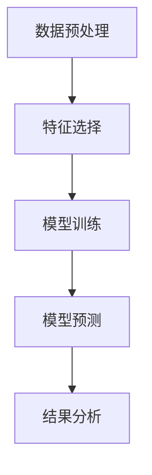

                 


# 可持续农业技术的全球市场规模预测

> 关键词：可持续农业技术、市场规模预测、机器学习、时间序列分析、大数据分析

> 摘要：本文通过分析可持续农业技术的核心概念、市场规模预测的方法以及实际应用案例，探讨了可持续农业技术在全球范围内的市场潜力和发展趋势。文章结合背景介绍、算法原理和系统架构设计，为读者提供了全面的视角，帮助理解如何利用技术手段预测和推动可持续农业的发展。

---

## 第1章: 可持续农业技术的背景与定义

### 1.1 可持续农业技术的定义与核心要素

#### 1.1.1 可持续农业的定义
可持续农业是指在满足当前社会对农产品需求的同时，不破坏或减少对自然资源的依赖，同时保护和改善生态环境的农业生产方式。其核心在于实现经济、社会和环境效益的统一。

#### 1.1.2 可持续农业技术的核心要素
- **资源高效利用**：通过优化水、肥、土地等资源的使用效率，减少浪费。
- **生态友好性**：采用环保技术，减少对土壤、水体和空气的污染。
- **经济可行性**：确保农民在采用可持续技术后能够获得合理的经济效益。

#### 1.1.3 可持续农业与传统农业的区别
| 方面 | 可持续农业 | 传统农业 |
|------|------------|-----------|
| 资源利用 | 高效、循环 | 低效、单向 |
| 环境影响 | 低污染、保护生态 | 可能导致土地退化、水污染 |
| 经济效益 | 长期稳定 | 可能波动较大 |

### 1.2 可持续农业技术的全球发展趋势

#### 1.2.1 全球农业面临的挑战
- **气候变化**：极端天气事件增多，影响农作物生长。
- **资源枯竭**：土地退化、水资源短缺等问题日益严重。
- **环境污染**：化肥、农药的过度使用导致土壤和水体污染。

#### 1.2.2 可持续农业技术的应用现状
- **精准农业**：利用GPS、无人机和物联网技术实现精准施肥、播种和病虫害监测。
- **有机农业**：减少化学农药和化肥的使用，依赖自然方法进行 pest control。
- **节水技术**：滴灌、喷灌等技术的应用减少水资源浪费。

#### 1.2.3 可持续农业技术的未来发展方向
- **智能化农业**：人工智能和大数据技术的应用将进一步提升农业生产的效率和可持续性。
- **生物技术**：基因编辑技术（如CRISPR）将用于改良作物品种，提高抗病性和适应性。
- **循环经济模式**：推广农业废弃物的资源化利用，形成闭环农业系统。

### 1.3 可持续农业技术市场规模预测的重要性

#### 1.3.1 市场规模预测的意义
- **投资决策**：帮助企业制定合理的市场进入策略。
- **政策制定**：为政府制定农业扶持政策提供依据。
- **技术创新**：指导技术研发方向，优化资源配置。

#### 1.3.2 可持续农业技术市场规模预测的挑战
- **数据获取难度**：农业数据分散，获取成本高。
- **模型准确性**：受多种不确定因素影响，预测模型的准确性难以保证。
- **市场动态变化**：技术更新和政策变化会影响市场规模预测结果。

#### 1.3.3 可持续农业技术市场规模预测的未来应用
随着技术的进步和数据的积累，市场规模预测将更加精准，为企业和政府提供更有价值的决策支持。

---

## 第2章: 可持续农业技术的核心概念与联系

### 2.1 可持续农业技术的核心原理

#### 2.1.1 可持续农业技术的资源利用效率
通过优化资源分配和循环利用，提高农业生产的效率。例如，利用农业废弃物生产有机肥，减少对外部肥料的依赖。

#### 2.1.2 可持续农业技术的生态友好性
采用环保技术减少污染，保护生态环境。例如，使用生物防治方法替代化学农药，降低对水体的污染。

#### 2.1.3 可持续农业技术的经济可行性
确保农民在采用新技术后能够获得可持续的经济效益。例如，通过精准农业技术降低成本，提高产量和质量。

### 2.2 可持续农业技术与市场规模的关系

#### 2.2.1 可持续农业技术对市场规模的影响
- **市场需求增长**：随着消费者对绿色食品的需求增加，采用可持续技术的企业将获得更多市场份额。
- **技术普及率**：技术的普及程度直接影响市场规模的大小。
- **政策支持**：政府的补贴和优惠政策将推动可持续技术的市场渗透。

#### 2.2.2 可持续农业技术的市场渗透率分析
市场渗透率 = (采用可持续技术的农户数量 / 农户总数) × 100%

#### 2.2.3 可持续农业技术的市场增长驱动因素
- **技术创新**：新型技术的应用将推动市场规模扩大。
- **政策支持**：政府的扶持政策将加速技术的推广。
- **消费者需求**：消费者对环保产品的需求增加推动市场规模增长。

### 2.3 可持续农业技术的核心概念对比表格

| 技术类型 | 可持续农业技术 | 传统农业技术 |
|----------|----------------|--------------|
| 资源利用 | 高效循环 | 低效单向 |
| 环境影响 | 低污染 | 可能污染 |
| 经济效益 | 长期稳定 | 波动较大 |

### 2.4 可持续农业技术的ER实体关系图

```mermaid
erd
  图表: 可持续农业技术的ER实体关系图
  农户
    关系: 使用
    技术
    关系: 影响
    市场规模
  技术
    属性: 类型, 效率, 成本
  市场规模
    属性: 年销售额, 市场渗透率
```

---

## 第3章: 可持续农业技术市场规模预测的算法原理

### 3.1 可持续农业技术市场规模预测的数学模型

#### 3.1.1 线性回归模型
线性回归模型通过建立自变量和因变量之间的线性关系，预测市场规模。公式如下：
$$ y = \beta_0 + \beta_1x + \epsilon $$
其中，$y$ 为市场规模，$x$ 为自变量（如技术普及率），$\beta_0$ 和 $\beta_1$ 为回归系数，$\epsilon$ 为误差项。

#### 3.1.2 时间序列分析模型
时间序列分析模型通过分析历史数据的周期性，预测未来的市场规模。常用ARIMA模型，公式如下：
$$ ARIMA(p, d, q) $$
其中，$p$ 为自回归阶数，$d$ 为差分阶数，$q$ 为移动平均阶数。

#### 3.1.3 机器学习模型
机器学习模型（如随机森林、XGBoost）能够处理高维数据，捕捉非线性关系，提高预测精度。

### 3.2 可持续农业技术市场规模预测的算法实现

#### 3.2.1 机器学习模型流程图


#### 3.2.2 Python代码实现
```python
import pandas as pd
from sklearn.ensemble import RandomForestRegressor
from sklearn.model_selection import train_test_split
from sklearn.metrics import mean_absolute_error

# 数据加载
data = pd.read_csv('agriculture.csv')

# 特征选择
features = ['technology_type', 'efficiency', 'cost']
target = 'market_size'

# 数据分割
X_train, X_test, y_train, y_test = train_test_split(data[features], data[target], test_size=0.2, random_state=42)

# 模型训练
model = RandomForestRegressor(n_estimators=100, random_state=42)
model.fit(X_train, y_train)

# 模型预测
y_pred = model.predict(X_test)

# 结果分析
mae = mean_absolute_error(y_test, y_pred)
print(f"Mean Absolute Error: {mae}")
```

### 3.3 可持续农业技术市场规模预测的数学公式

#### 3.3.1 线性回归模型
$$ \hat{y} = \beta_0 + \beta_1x $$

#### 3.3.2 时间序列分析模型
$$ \hat{y}_t = \alpha y_{t-1} + (1-\alpha)\hat{y}_{t-1} $$

#### 3.3.3 机器学习模型
$$ \hat{y} = \sum_{i=1}^{n} \theta_i h(x; \theta_i) $$

---

## 第4章: 可持续农业技术市场规模预测的系统分析与架构设计

### 4.1 问题场景介绍

#### 4.1.1 系统功能设计
- 数据采集：收集农业技术的市场数据。
- 数据分析：利用机器学习模型进行市场规模预测。
- 结果展示：将预测结果可视化展示。

#### 4.1.2 领域模型类图


#### 4.1.3 系统架构图


### 4.2 项目实战

#### 4.2.1 环境安装
- 安装Python和相关库（如Pandas、Scikit-learn）。

#### 4.2.2 系统核心实现源代码
```python
import pandas as pd
from sklearn.ensemble import RandomForestRegressor
from sklearn.model_selection import train_test_split
from sklearn.metrics import mean_absolute_error

# 数据加载
data = pd.read_csv('agriculture.csv')

# 特征选择
features = ['technology_type', 'efficiency', 'cost']
target = 'market_size'

# 数据分割
X_train, X_test, y_train, y_test = train_test_split(data[features], data[target], test_size=0.2, random_state=42)

# 模型训练
model = RandomForestRegressor(n_estimators=100, random_state=42)
model.fit(X_train, y_train)

# 模型预测
y_pred = model.predict(X_test)

# 结果分析
mae = mean_absolute_error(y_test, y_pred)
print(f"Mean Absolute Error: {mae}")
```

#### 4.2.3 实际案例分析
以某地区为例，分析可持续农业技术的市场规模，利用上述模型进行预测，并对比实际数据验证模型的准确性。

### 4.3 最佳实践 tips

- 数据预处理：确保数据的完整性和准确性。
- 模型选择：根据数据特点选择合适的预测模型。
- 结果验证：通过实际数据验证模型的准确性。

---

## 第5章: 可持续农业技术市场规模预测的最佳实践与小结

### 5.1 最佳实践 tips

- **数据收集**：确保数据来源可靠，覆盖多个维度。
- **模型优化**：通过参数调优提高模型预测精度。
- **结果解释**：结合业务背景解释预测结果，避免误用。

### 5.2 小结

本文详细介绍了可持续农业技术的市场规模预测方法，从背景、核心概念到算法原理和系统设计，为读者提供了全面的视角。通过实际案例分析和代码实现，展示了如何利用技术手段推动可持续农业的发展。

### 5.3 注意事项

- 在实际应用中，需结合具体业务场景调整模型参数。
- 数据隐私和安全问题需引起重视。

### 5.4 拓展阅读

- 《机器学习在农业中的应用》
- 《时间序列分析入门》

---

通过本文的学习，读者可以掌握可持续农业技术市场规模预测的核心方法，并能够实际应用相关技术解决问题。

