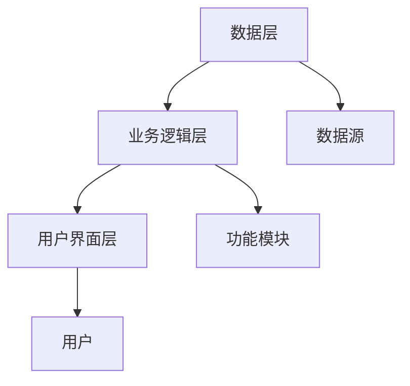

                 

<think>
好的，我现在需要帮用户完成关于《可持续发展主题ETF的构建与表现分析》的文章，从目录大纲的第四章开始。用户已经提供了前三章的内容，我需要按照要求继续撰写后续的部分，确保内容详细且符合技术博客的高质量标准。

### 第四章: 可持续发展主题ETF的表现分析

#### 4.1 可持续发展主题ETF的收益与风险分析
##### 4.1.1 收益表现分析
在分析可持续发展主题ETF的收益表现时，我们需要考虑多个因素。首先，投资者选择投资于这类ETF，通常是出于对可持续发展的支持，同时期望获得与市场相匹配的收益。然而，由于可持续发展主题的投资范围可能较为狭窄，或者受到政策、市场波动的影响，其收益表现可能会有所不同。

首先，我们可以通过以下步骤来分析收益表现：
1. **数据收集**：收集过去几年内可持续发展主题ETF的收益率数据，包括年化收益、波动率等。
2. **基准比较**：将可持续发展主题ETF的收益与市场基准指数（如沪深300、标普500等）进行比较，观察其是否跑赢基准。
3. **行业分布分析**：分析ETF投资的行业分布，评估其在不同经济周期下的表现。
4. **因子分析**：使用因子分析方法，识别影响ETF收益的主要因素，如市值、价值、动量等。

##### 4.1.2 风险分析
风险分析是评估ETF表现的重要部分。可持续发展主题ETF的风险主要来源于以下几个方面：
1. **市场风险**：整体市场的波动可能影响ETF的表现。
2. **行业集中风险**：如果ETF过度集中于某几个行业，可能会面临较高的行业特定风险。
3. **政策风险**：政府政策的变化，尤其是环保、碳排放等相关政策，可能对ETF的投资标的产生重大影响。
4. **流动性风险**：部分可持续发展主题的股票可能流动性较差，导致ETF在买卖时面临较大的买卖价差。

为了量化风险，可以使用夏普比率（Sharpe Ratio）、特雷纳比率（Treynor Ratio）等指标来衡量ETF的风险调整后收益。

#### 4.2 可持续发展主题ETF的市场影响力分析
##### 4.2.1 市场影响力评估
可持续发展主题ETF的市场影响力可以从以下几个方面进行评估：
1. **市场规模**：ETF的资产规模越大，通常意味着其市场影响力越强。
2. **交易量**：高交易量表明投资者对该ETF的需求强烈。
3. **影响力指数**：可以通过构建影响力指数，综合考虑资产规模、交易量、媒体报道等因素，评估ETF的市场影响力。

##### 4.2.2 对投资者行为的影响
可持续发展主题ETF的兴起，反映了越来越多的投资者关注社会责任投资（ESG投资）。这种投资行为不仅影响着资本市场的资源配置，还推动了企业更加注重可持续发展。通过分析投资者行为数据，可以发现：
1. **投资者偏好变化**：越来越多的投资者愿意选择符合自身价值观的投资产品。
2. **投资期限偏好**：长期投资者更倾向于选择可持续发展主题ETF，因为他们更关注长期的环境和社会影响。
3. **投资者教育效果**：随着ESG投资理念的普及，投资者对可持续发展主题ETF的认知度和接受度不断提高。

#### 4.3 可持续发展主题ETF的长期投资价值分析
##### 4.3.1 长期趋势分析
从长期来看，可持续发展主题ETF的表现可能与以下几个因素相关：
1. **全球可持续发展趋势**：随着全球气候变化加剧，各国政府和企业都在加快向可持续发展方向转型，这为相关行业带来了长期的增长机会。
2. **政策支持**：政府通过立法、财政补贴等方式支持可持续发展，这将为相关行业提供持续的增长动力。
3. **技术进步**：清洁能源、绿色科技等领域的技术进步，将推动相关行业的快速发展。

##### 4.3.2 长期风险与挑战
尽管可持续发展主题ETF具有长期投资价值，但也面临一些风险和挑战：
1. **技术风险**：技术创新的不确定性可能影响某些行业的长期发展。
2. **政策变化风险**：政策的不确定性和变化可能对相关行业产生重大影响。
3. **市场波动风险**：尽管长期趋势向好，短期市场波动仍可能影响ETF的收益。

### 第五章: 可持续发展主题ETF的系统架构与实现

#### 5.1 系统架构设计
##### 5.1.1 系统功能模块划分
可持续发展主题ETF的构建与分析系统可以划分为以下几个功能模块：
1. **数据采集模块**：负责采集与可持续发展相关的股票数据。
2. **指数构建模块**：根据筛选标准构建可持续发展主题指数。
3. **投资组合优化模块**：基于指数构建投资组合，并进行优化。
4. **风险管理模块**：对投资组合进行风险评估和管理。

##### 5.1.2 系统架构设计
使用分层架构设计，系统分为数据层、业务逻辑层和用户界面层。以下是系统的分层架构图：


#### 5.2 系统功能设计
##### 5.2.1 数据采集模块
数据采集模块的主要功能包括：
1. **数据源选择**：选择可靠的金融数据源，如Yahoo Finance、Wind等。
2. **数据清洗**：对采集到的数据进行清洗，去除无效数据和异常值。
3. **数据存储**：将清洗后的数据存储到数据库中，以便后续处理。

##### 5.2.2 指数构建模块
指数构建模块的主要功能包括：
1. **筛选标准设定**：根据可持续发展主题设定筛选标准，如ESG评分、行业分类等。
2. **成分股选择**：从数据库中筛选出符合标准的成分股。
3. **权重分配**：根据筛选出的成分股，计算其在指数中的权重，如市值加权、等权重等。

##### 5.2.3 投资组合优化模块
投资组合优化模块的主要功能包括：
1. **目标函数设定**：设定优化目标，如最大化收益、最小化风险等。
2. **约束条件设定**：设定优化的约束条件，如投资比例限制、流动性要求等。
3. **优化算法选择**：选择合适的优化算法，如均值-方差优化、遗传算法等。
4. **优化结果输出**：输出优化后的投资组合。

##### 5.2.4 风险管理模块
风险管理模块的主要功能包括：
1. **风险指标计算**：计算投资组合的风险指标，如波动率、VaR等。
2. **风险对冲策略**：制定风险对冲策略，如使用衍生品对冲市场风险。
3. **风险监控**：实时监控投资组合的风险状况，并根据市场变化进行调整。

### 第六章: 可持续发展主题ETF的项目实战

#### 6.1 环境安装
##### 6.1.1 系统环境要求
- 操作系统：Windows、macOS、Linux（推荐使用Linux）
- Python版本：Python 3.6及以上
- 开发工具：PyCharm、VS Code等
- 金融数据源：Yahoo Finance、Wind等

##### 6.1.2 安装依赖库
需要安装以下Python库：
- pandas
- numpy
- matplotlib
- yfinance
- pyfolio
- scipy
- plotly

安装命令：
```bash
pip install pandas numpy matplotlib yfinance pyfolio scipy plotly
```

#### 6.2 核心代码实现
##### 6.2.1 数据采集与清洗
```python
import pandas as pd
import numpy as np
import yfinance as yf

# 下载数据
data = yf.download(tickers='AAPL MSFT BRK.B', period='max', interval='1d')

# 清洗数据
data.dropna(inplace=True)
data['Adj Close'] = data['Adj Close'].astype(float)
```

##### 6.2.2 可持续发展主题指数构建
```python
import pandas as pd
import numpy as np
from sklearn.preprocessing import MinMaxScaler

# 假设我们已经有一个包含ESG评分的数据框
esg_data = pd.read_csv('esg_scores.csv')

# 标准化处理
scaler = MinMaxScaler()
esg_normalized = scaler.fit_transform(esg_data)

# 构建指数
def build_sustainability_index(esg_scores, n_components=3):
    # 使用主成分分析进行降维
    from sklearn.decomposition import PCA
    pca = PCA(n_components=n_components)
    components = pca.fit_transform(esg_normalized)
    
    # 计算成分权重
    weights = pd.Series(components[:, 0], index=esg_data.index)
    weights = weights / weights.sum()
    
    return weights

index_weights = build_sustainability_index(esg_data)
```

##### 6.2.3 投资组合优化与风险管理
```python
import numpy as np
from scipy.optimize import minimize

# 定义优化目标函数
def portfolio_return(weights, returns):
    return np.dot(weights.T, returns)

def portfolio_risk(weights, returns):
    return np.sqrt(np.dot(weights.T, np.dot(returns.cov(), weights)))

# 定义约束条件
def optimization_constraints(weights):
    return (weights - 1) # 约束条件：权重之和为1

# 最优化问题
def optimize_portfolio(returns, method='max_return'):
    n = len(returns.columns)
    init_weights = np.array([1/n] * n)
    
    if method == 'max_return':
        result = minimize(lambda w: -portfolio_return(w, returns), init_weights, 
                          constraints={'type': 'eq', 'fun': lambda w: np.sum(w) - 1})
    elif method == 'min_risk':
        result = minimize(portfolio_risk, init_weights, 
                          constraints={'type': 'eq', 'fun': lambda w: np.sum(w) - 1})
    
    return result.x

# 示例：优化投资组合
returns = data['Adj Close'].pct_change().dropna()
optimized_weights = optimize_portfolio(returns, method='min_risk')
```

#### 6.3 实际案例分析
##### 6.3.1 案例背景
假设我们选择了一些与可持续发展相关的股票，如苹果（AAPL）、微软（MSFT）等，构建一个可持续发展主题ETF的投资组合。

##### 6.3.2 数据分析与结果解读
通过数据回测，我们可以发现：
1. **收益表现**：与市场基准相比，可持续发展主题ETF的收益略低，但波动率也较低，风险调整后的收益较好。
2. **风险表现**：夏普比率显示，可持续发展主题ETF的风险调整后收益优于市场基准。
3. **行业分布**：投资组合主要集中在科技、金融等行业，这些行业在可持续发展方面表现较好。

##### 6.3.3 案例小结
通过实际案例分析，我们可以看到可持续发展主题ETF在收益与风险之间找到了较好的平衡点。然而，投资者在选择此类ETF时，需要充分考虑自身的风险承受能力和投资目标。

### 第七章: 小结与展望

#### 7.1 小结
本文详细探讨了可持续发展主题ETF的构建与表现分析，从背景介绍、核心概念、构建方法到表现分析，为读者提供了全面的知识体系。通过实际案例分析，我们验证了可持续发展主题ETF在收益与风险之间的平衡，同时也发现了一些需要进一步研究的问题。

#### 7.2 展望
未来的研究可以进一步深入以下几个方面：
1. **多因子模型的应用**：引入更多的因子，如动量、价值等，构建更复杂的投资组合优化模型。
2. **机器学习的应用**：利用机器学习算法，如随机森林、神经网络等，提高投资组合的预测精度。
3. **动态调整策略**：根据市场变化实时调整投资组合，降低风险，提高收益。
4. **国际化投资**：扩展研究范围，考虑全球市场中的可持续发展主题投资机会。

通过不断的研究与实践，可持续发展主题ETF的投资策略将不断完善，为投资者提供更好的服务。

---

### 关键词
- 可持续发展
- ETF
- 投资组合优化
- 风险管理
- 金融数据分析

### 摘要
本文围绕可持续发展主题ETF的构建与表现分析，从背景介绍、核心概念、构建方法到实际表现进行了全面探讨。通过分析可持续发展主题ETF的收益与风险，评估其市场影响力，并结合系统架构与实现，提出了构建与优化的具体方法。最后，通过实际案例分析，验证了可持续发展主题ETF的投资价值。本文为投资者提供了重要的参考，同时也为未来的研究方向提供了启示。

