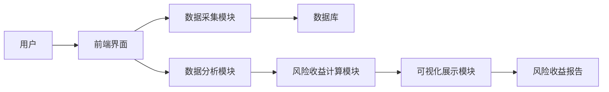

                 


# 可持续发展债券的风险收益特征研究

---

## 关键词：
可持续发展债券、风险收益、金融市场、绿色投资、ESG因素

---

## 摘要：
本文系统性地研究了可持续发展债券的风险收益特征，结合理论分析与实证研究，探讨了可持续发展债券在金融市场中的表现及其影响因素。文章首先介绍了可持续发展债券的基本概念与背景，然后从风险与收益的角度深入分析了其特征，提出了基于ESG因素的评估方法，并通过实际案例验证了理论分析的可行性。最后，本文总结了研究发现，并提出了未来研究方向与投资策略建议。

---

## 第一部分：可持续发展债券的背景与基础

### 第1章：可持续发展债券的定义与背景

#### 1.1 可持续发展债券的定义与核心概念
- **可持续发展债券的定义**：可持续发展债券是一种创新型债券，其募集资金用于支持具有环境、社会和治理（ESG）目标的项目或活动。
- **核心概念术语说明**：
  - **ESG因素**：环境（Environmental）、社会（Social）、治理（Governance）。
  - **绿色债券**：一种特殊的可持续发展债券，募集资金主要用于支持环保项目。
- **问题背景**：随着全球气候变化加剧，可持续发展已成为全球关注的焦点，金融市场的绿色投资需求日益增长。
- **问题描述**：可持续发展债券通过将资金投向绿色项目，帮助实现联合国可持续发展目标（SDGs）。
- **边界与外延**：
  - **边界**：仅限于支持具有明确ESG目标的项目。
  - **外延**：包括绿色债券、社会责任债券（PR bonds）等。
- **概念结构与核心要素**：
  - 核心要素：募集资金用途、ESG目标、信息披露。

#### 1.2 可持续发展债券的发展背景
- **全球可持续发展趋势**：
  - 气候变化、资源枯竭等问题推动了可持续发展的需求。
- **金融市场绿色投资需求**：
  - 投资者越来越关注ESG因素。
- **政策支持**：
  - 各国政府出台政策支持绿色金融发展。

#### 1.3 可持续发展债券的市场现状
- **全球市场发展概况**：
  - 欧洲是最大的绿色债券市场，中国市场的增长迅速。
- **中国市场发展现状**：
  - 中国绿色债券市场规模持续扩大，2022年发行规模超过5000亿元。

---

## 第二部分：可持续发展债券的风险收益特征分析

### 第2章：债券风险与收益的基本理论

#### 2.1 债券风险的分类与特征
- **利率风险**：债券价格受利率波动的影响。
- **信用风险**：债券发行人违约的风险。
- **流动性风险**：债券在二级市场上的交易难度。

#### 2.2 债券收益的计算与影响因素
- **收益计算**：
  - 现金流折现法：债券的未来现金流按贴现率折现。
  - 到期收益率（YTM）：债券的年化收益率。
- **影响因素**：
  - 债券期限、票面利率、市场利率、流动性。

---

### 第3章：可持续发展债券的风险特征

#### 3.1 可持续发展债券的信用风险
- **信用风险的定义与影响因素**：
  - 定义：债券发行人无法按时支付本息的风险。
  - 影响因素：发行人财务状况、行业风险、宏观经济环境。
- **可持续发展债券的信用评级**：
  - 评级机构对发行人ESG表现的评估。
- **信用风险的评估方法**：
  - 使用ESG评分模型对发行人进行评级。

#### 3.2 可持续发展债券的市场风险
- **市场风险的来源与特征**：
  - 利率波动、市场流动性变化。
- **市场波动对可持续发展债券的影响**：
  - ESG因素如何影响债券价格波动。
- **市场风险的量化方法**：
  - 使用VaR（Value at Risk）模型。

#### 3.3 可持续发展债券的流动性风险
- **流动性风险的定义与表现**：
  - 债券在二级市场上的交易深度。
- **可持续发展债券市场的流动性特征**：
  - 市场深度不足可能导致流动性风险。
- **流动性风险的管理策略**：
  - 建立二级市场流动性支持机制。

---

## 第三部分：可持续发展债券的风险收益评估与投资策略

### 第4章：基于ESG因素的风险收益评估方法

#### 4.1 ESG因素对风险收益的影响
- **ESG评分与债券收益的关系**：
  - 高ESG评分的债券可能具有更高的风险调整后收益。
- **ESG因素与债券信用风险的关联**：
  - ESG表现良好的企业违约风险较低。

#### 4.2 ESG驱动的债券组合管理
- **基于ESG的债券筛选**：
  - 通过ESG评分选择优质债券。
- **ESG因素在风险分散中的作用**：
  - 通过ESG分散投资风险。

---

## 第四部分：案例分析与实证研究

### 第5章：可持续发展债券的实证分析

#### 5.1 案例选择与数据来源
- **案例选择**：
  - 选取国内外典型可持续发展债券案例。
- **数据来源**：
  - 第三方评级机构数据、债券发行市场数据。

#### 5.2 案例分析
- **案例一**：国内某绿色债券的发行与表现。
  - 分析其发行规模、募集资金用途、信用评级、市场表现。
- **案例二**：国际某社会责任债券的发行与表现。
  - 分析其ESG评分、市场风险、信用风险。

---

## 第五部分：系统架构与技术实现

### 第6章：可持续发展债券风险收益评估系统的架构设计

#### 6.1 系统功能设计
- **核心功能模块**：
  - 数据采集模块：获取债券发行信息、ESG评分。
  - 数据分析模块：计算债券的风险收益指标。
  - 可视化展示模块：生成风险收益报告。

#### 6.2 系统架构设计


---

## 第六部分：项目实战与代码实现

### 第7章：可持续发展债券风险收益分析的Python实现

#### 7.1 环境安装
- **Python版本**：建议使用Python 3.8以上。
- **依赖库安装**：
  - pandas、numpy、scipy、matplotlib。

#### 7.2 核心代码实现
```python
import pandas as pd
import numpy as np
from sklearn.linear_model import LinearRegression

# 示例数据：假设我们有债券的ESG评分和收益率数据
data = pd.DataFrame({
    'ESG_Score': [85, 70, 80, 90, 75],
    'YTM': [5, 4, 6, 7, 5]
})

# 训练线性回归模型：ESG评分对债券收益的影响
model = LinearRegression()
model.fit(data[['ESG_Score']], data['YTM'])

# 预测收益
predicted_YTM = model.predict(data[['ESG_Score']])
print("回归系数：", model.coef_)
print("截距：", model.intercept_)
```

---

## 第七部分：总结与展望

### 第8章：研究总结与未来展望

#### 8.1 研究总结
- **主要发现**：
  - ESG因素对可持续发展债券的风险收益有显著影响。
  - 高ESG评分的债券通常具有更好的风险调整后收益。
- **研究局限性**：
  - 数据获取难度较大。
  - 模型的适用性有限。

#### 8.2 未来展望
- **研究方向**：
  - 开发更复杂的ESG评分模型。
  - 结合机器学习技术进行风险收益预测。
- **实践建议**：
  - 投资者应注重ESG因素的筛选。
  - 政府和监管机构应进一步完善政策支持。

---

## 参考文献
（此处列出相关文献和数据来源）

---

通过以上目录和内容设计，本文系统性地研究了可持续发展债券的风险收益特征，结合理论分析与实证研究，为投资者和政策制定者提供了有价值的参考。

