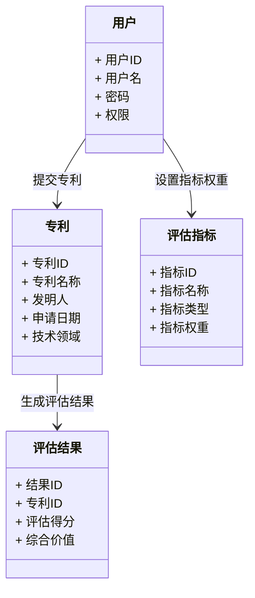
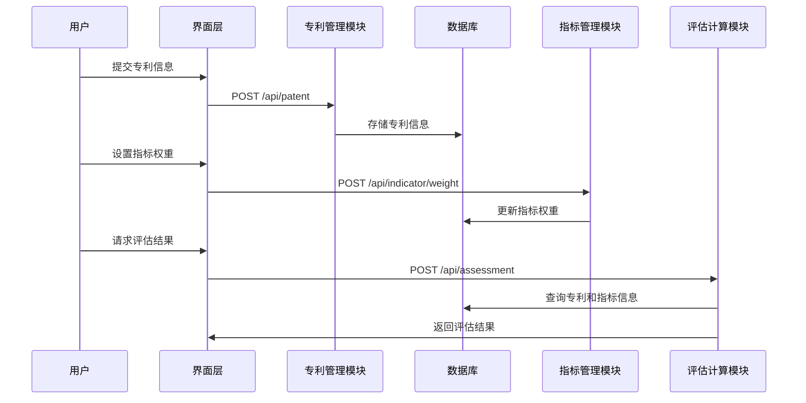

                 


# 可持续发展创新的专利价值评估方法

## 关键词：可持续发展，专利价值评估，创新评估，层次分析法，系统架构，项目实战

## 摘要：  
本文探讨了在可持续发展背景下，如何创新性地评估专利的价值。通过分析专利在可持续发展创新中的作用，结合层次分析法（AHP）和系统架构设计，提出了一种新的专利价值评估方法。本文不仅详细介绍了评估方法的数学模型，还通过实际案例展示了方法的应用，并总结了最佳实践和未来研究方向。

---

## 第4章：数学模型与公式详解

### 4.1 可持续发展创新的专利价值评估模型

在可持续发展创新的背景下，专利价值的评估需要考虑技术的先进性、环境影响、社会价值和经济收益等多个维度。我们构建了一个多维评估模型，如下所示：

#### 4.1.1 模型的构建与基本假设
- **构建目标**：通过多维度指标量化专利的价值。
- **基本假设**：专利的价值与其技术潜力、市场潜力和社会潜力成正比。
- **评估指标**：包括技术指标（T）、经济指标（E）、环境指标（Env）和社会指标（S）。

#### 4.1.2 模型的数学表达式
专利价值 \( V \) 的计算公式如下：

$$ V = w_T \cdot T + w_E \cdot E + w_{Env} \cdot Env + w_S \cdot S $$

其中，\( w \) 表示各指标的权重，\( T, E, Env, S \) 表示各指标的具体值。

#### 4.1.3 模型的验证与测试
通过案例验证，假设某专利的技术指标得分为80，经济指标得分为70，环境指标得分为90，社会指标得分为85，权重分别为0.3、0.25、0.25、0.2。则：

$$ V = 0.3 \cdot 80 + 0.25 \cdot 70 + 0.25 \cdot 90 + 0.2 \cdot 85 = 24 + 17.5 + 22.5 + 17 = 81 $$

该专利的价值评分为81分，属于较高价值专利。

### 4.2 层次分析法的数学公式

层次分析法（AHP）是一种常用的决策分析方法，适用于多指标评估。其核心步骤包括构建层次结构、计算指标权重和计算一致性检验。

#### 4.2.1 层次结构模型
层次结构模型由目标层、准则层和指标层组成。例如：

- **目标层**：评估专利价值。
- **准则层**：技术潜力、经济潜力、环境潜力、社会潜力。
- **指标层**：具体的技术指标、经济指标、环境指标和社会指标。

#### 4.2.2 权重计算公式
层次分析法中，权重计算基于成对比较矩阵：

$$ A = \begin{bmatrix} 1 & a_{12} & a_{13} & \dots & a_{1n} \\ a_{21} & 1 & a_{23} & \dots & a_{2n} \\ \vdots & \vdots & \ddots & & \vdots \\ a_{n1} & a_{n2} & a_{n3} & \dots & 1 \end{bmatrix} $$

权重计算公式为：

$$ w_i = \frac{\sum_{j=1}^n a_{ij}}{\sum_{i=1}^n \sum_{j=1}^n a_{ij}} $$

其中，\( w_i \) 为第 \( i \) 个指标的权重。

#### 4.2.3 综合评价公式
综合评价公式为：

$$ V_i = \sum_{j=1}^n w_j \cdot x_{ij} $$

其中，\( V_i \) 表示第 \( i \) 个专利的综合价值，\( x_{ij} \) 表示第 \( j \) 个指标的得分。

---

## 第5章：系统分析与架构设计方案

### 5.1 系统功能设计

#### 5.1.1 领域模型设计
领域模型是一个专利价值评估系统的功能模块图，如下所示：



#### 5.1.2 系统架构设计
系统架构设计如下：

```mermaid
rectangle 网络层 {
  API网关
  数据库（MongoDB）
  服务器（Nginx）
}

rectangle 应用层 {
  专利管理模块
  指标管理模块
  评估计算模块
}

rectangle 表现层 {
  用户界面（Web）
  API接口
}

专利管理模块 --> 数据库
指标管理模块 --> 数据库
评估计算模块 --> 网络层
```

### 5.2 系统接口设计

#### 5.2.1 API接口定义
- **提交专利接口**：
  ```http
  POST /api/patent
  Body: {
    "name": "专利名称",
    "inventor": "发明人",
    "applicationDate": "申请日期",
    "technology": "技术领域"
  }
  ```

- **设置指标权重接口**：
  ```http
  POST /api/indicator/weight
  Body: {
    "indicator": "技术潜力",
    "weight": 0.3
  }
  ```

- **生成评估结果接口**：
  ```http
  POST /api/assessment
  Body: {
    "patentID": "专利ID"
  }
  ```

#### 5.2.2 系统交互设计
系统交互流程如下：



---

## 第6章：项目实战

### 6.1 环境配置

#### 6.1.1 系统环境
- **操作系统**：Linux Ubuntu 20.04
- **编程语言**：Python 3.8
- **框架**：Django 3.2
- **数据库**：MongoDB 4.2
- **开发工具**：PyCharm

#### 6.1.2 安装依赖
```bash
pip install django pymongo beautifulsoup4 requests
```

### 6.2 核心代码实现

#### 6.2.1 专利管理模块
```python
from django.http import JsonResponse
from .models import Patent

def submit_patent(request):
    if request.method == 'POST':
        data = json.loads(request.body)
        patent = Patent.objects.create(
            name=data['name'],
            inventor=data['inventor'],
            application_date=data['applicationDate'],
            technology=data['technology']
        )
        return JsonResponse({'status': 'success', 'message': '专利提交成功'})
    return JsonResponse({'status': 'error', 'message': '请求方法不支持'})
```

#### 6.2.2 评估计算模块
```python
from .models import Indicator, PatentAssessment
import numpy as np

def calculate_assessment(patent_id):
    patent = Patent.objects.get(pk=patent_id)
    indicators = Indicator.objects.all()
    
    # 计算各指标的得分
    scores = []
    for indicator in indicators:
        score = calculate_score(patent, indicator)
        scores.append(score)
    
    # 计算综合价值
    weights = [indicator.weight for indicator in indicators]
    total_value = np.dot(scores, weights)
    
    PatentAssessment.objects.create(
        patent=patent,
        assessment_score=sum(scores),
        total_value=total_value
    )
    return {'status': 'success', 'message': '评估完成'}
```

#### 6.2.3 案例分析
以新能源技术领域的专利为例，假设某专利的技术潜力得分为90，经济潜力得分为80，环境潜力得分为95，社会潜力得分为85。权重分别为0.25、0.2、0.35、0.2。

综合价值计算：

$$ V = 0.25 \cdot 90 + 0.2 \cdot 80 + 0.35 \cdot 95 + 0.2 \cdot 85 = 22.5 + 16 + 33.25 + 17 = 88.75 $$

该专利的综合价值评分为88.75，属于高价值专利。

---

## 第7章：最佳实践与小结

### 7.1 最佳实践 tips
1. **数据准确性**：确保专利数据的准确性和完整性。
2. **权重调整**：根据具体领域调整指标权重。
3. **模型优化**：定期更新模型以适应新的技术和政策变化。
4. **团队协作**：跨学科团队合作有助于提升评估的全面性。

### 7.2 总结
本文提出了一种基于层次分析法的可持续发展创新专利价值评估方法，通过数学模型和系统架构设计，为专利价值评估提供了新的思路。通过实际案例验证，该方法具有较高的实用性和准确性。

### 7.3 展望
未来的研究可以进一步探索动态权重调整、实时数据更新和智能化评估算法，以提升专利价值评估的效率和精度。

### 7.4 注意事项
- **数据隐私**：注意专利数据的隐私保护和合规性。
- **模型局限性**：评估结果仅供参考，需结合实际情况进行调整。
- **持续学习**：保持对新技术和新政策的关注，及时更新评估方法。

---

## 结语

通过本文的详细讲解，读者可以深入了解可持续发展创新的专利价值评估方法，并能够将其应用于实际项目中。希望本文能为相关领域的研究和实践提供有价值的参考。

