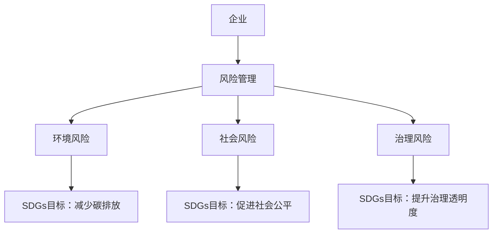

                 

# 可持续发展目标对公司估值的长期影响

---

## 关键词：
可持续发展目标, 公司估值, 长期影响, 企业社会责任, 可持续发展战略, 环境、社会和治理(ESG)

---

## 摘要：
本文探讨可持续发展目标（SDGs）对公司长期估值的影响，分析SDGs如何通过改变企业战略、商业模式和风险管理，进而影响公司的财务表现和市场价值。文章从SDGs的定义和目标出发，结合实际案例，分析SDGs对投资者决策的影响，并提出企业在实现SDGs目标过程中的关键策略。

---

## 第1章: 可持续发展目标概述

### 1.1 可持续发展目标的起源与发展

#### 1.1.1 可持续发展目标的定义与核心理念
可持续发展目标（Sustainable Development Goals, SDGs）是联合国于2015年通过的17个目标，涵盖经济、社会和环境三个方面。SDGs的核心理念是通过平衡这三个维度的发展，实现人类与地球的共同繁荣。

#### 1.1.2 可持续发展目标的起源与演变
SDGs的起源可以追溯到2000年的千年发展目标（MDGs）。SDGs在MDGs的基础上进一步扩展，增加了更多具体目标，如消除贫困、保护地球、促进和平与正义等。

#### 1.1.3 可持续发展目标与企业社会责任的联系
企业社会责任（Corporate Social Responsibility, CSR）是企业在追求经济利益的同时，对社会和环境负责的表现。SDGs为企业提供了实现社会责任的具体目标和框架。

---

### 1.2 可持续发展目标对企业的影响

#### 1.2.1 可持续发展目标对企业战略的影响
SDGs要求企业在制定战略时考虑经济、社会和环境的平衡。企业需要将SDGs目标融入核心业务，例如通过绿色供应链管理减少环境影响。

#### 1.2.2 可持续发展目标对商业模式的改变
传统的商业模式以利润最大化为目标，而SDGs要求企业在创造经济价值的同时，也要创造社会和环境价值。例如，许多企业通过开发可持续产品和服务，满足消费者对环保和公平的需求。

#### 1.2.3 可持续发展目标对企业风险管理的作用
SDGs帮助企业在面对环境和社会风险时更具韧性。例如，气候变化可能导致企业面临更高的监管压力和运营成本，而通过提前实现SDGs目标，企业可以降低这些风险。

---

### 1.3 可持续发展目标与公司估值的关系

#### 1.3.1 可持续发展目标对长期价值的影响
SDGs通过促进企业创新和社会责任，增强企业的长期竞争力。例如，实现清洁能源目标的企业可能在能源成本和技术创新方面更具优势。

#### 1.3.2 可持续发展目标对公司财务表现的潜在影响
SDGs可能影响公司的收入、成本和资本结构。例如，通过减少碳排放，企业可能降低能源成本，同时获得政府补贴或税收优惠。

#### 1.3.3 可持续发展目标对市场声誉与品牌价值的作用
SDGs的实现可以提升企业的市场声誉和品牌价值。例如，被评为“最佳可持续发展企业”的公司在吸引人才和消费者方面更具优势。

---

## 第2章: 可持续发展目标与企业可持续发展的核心概念

### 2.1 可持续发展目标的核心要素

#### 2.1.1 经济、社会和环境三重目标的平衡
SDGs要求企业在追求经济利益的同时，兼顾社会和环境目标。例如，企业需要在创造利润的同时，减少碳足迹并促进社会公平。

#### 2.1.2 可持续发展目标的关键指标体系
为了衡量SDGs的实现程度，企业需要制定关键绩效指标（KPIs），例如碳排放强度、员工满意度和社会责任投资回报率。

#### 2.1.3 可持续发展目标的实现路径
企业可以通过技术创新、管理优化和社会合作等方式实现SDGs目标。例如，采用可再生能源技术减少碳排放，或者通过供应链合作提高社会公平性。

---

### 2.2 可持续发展目标与企业战略的关系

#### 2.2.1 企业战略与可持续发展目标的整合
企业需要将SDGs目标纳入战略规划，例如通过制定长期可持续发展目标和行动计划。例如，某企业将“减少碳排放”作为战略目标之一，并制定具体的时间表和措施。

#### 2.2.2 可持续发展目标对企业组织架构的影响
SDGs的实现需要企业的组织架构进行调整，例如设立专门的可持续发展部门或任命首席可持续发展官（CSDO）。

#### 2.2.3 可持续发展目标对企业文化与员工参与度的促进
SDGs的实现需要全体员工的参与。企业可以通过培训和激励机制，提升员工的可持续发展意识和参与度。

---

### 2.3 可持续发展目标与公司估值的内在联系

#### 2.3.1 可持续发展目标对长期盈利能力的影响
SDGs的实现可以提升企业的长期盈利能力。例如，通过开发绿色产品，企业可以开拓新的市场并获得更高的利润率。

#### 2.3.2 可持续发展目标对风险管理和资本成本的优化
SDGs的实现可以降低企业的风险，例如环境风险和社会风险。这可能降低企业的资本成本，因为投资者更愿意投资具有可持续性优势的企业。

#### 2.3.3 可持续发展目标对投资者偏好的影响
越来越多的投资者关注企业的环境、社会和治理（ESG）表现。SDGs的实现可以提升企业的ESG评级，从而吸引更多投资者，提高公司的估值。

---

## 第3章: 可持续发展目标对财务表现的影响

### 3.1 可持续发展目标对财务表现的核心影响

#### 3.1.1 可持续发展目标对收入和成本的双重影响
SDGs的实现可能增加企业的收入，例如通过销售可持续产品，但也可能增加企业的成本，例如绿色供应链的投入。

#### 3.1.2 可持续发展目标对资本结构的影响
SDGs的实现可能影响企业的资本结构。例如，通过降低环境风险，企业可能更容易获得低成本的债务融资。

#### 3.1.3 可持续发展目标对资产和负债的影响
SDGs的实现可能影响企业的资产和负债。例如，通过减少碳排放，企业可能降低未来因气候变化而产生的负债。

---

### 3.2 可持续发展目标对财务表现的数学模型

#### 3.2.1 SDGs对净现值的影响
净现值（Net Present Value, NPV）是衡量投资项目价值的重要指标。SDGs的实现可能通过影响现金流和贴现率来影响NPV。

公式：  
$$ NPV = \sum_{t=0}^{n} \frac{CF_t}{(1 + r)^t} $$  
其中，CF_t是第t年的现金流，r是贴现率。

#### 3.2.2 可持续发展投资与回报的关系
可持续发展投资的回报可以通过以下公式计算：  
$$ ROI = \frac{\text{净收益}}{\text{投资成本}} $$  
企业需要通过SDGs投资获得更高的ROI，才能实现长期的财务回报。

---

## 第4章: 可持续发展目标对风险管理的影响

### 4.1 可持续发展目标对风险管理的核心作用

#### 4.1.1 环境风险与SDGs
环境风险包括气候变化、资源枯竭等。SDGs的实现可以帮助企业降低环境风险，例如通过减少碳排放和节约资源。

#### 4.1.2 社会风险与SDGs
社会风险包括员工权益、社会责任等。SDGs的实现可以帮助企业降低社会风险，例如通过促进员工福利和社区发展。

#### 4.1.3 治理风险与SDGs
治理风险包括公司治理不善、腐败等。SDGs的实现可以帮助企业提升治理水平，例如通过建立透明的治理结构和加强内部控制。

---

### 4.2 可持续发展目标对风险管理的系统架构

#### 4.2.1 系统架构图
以下是一个SDGs与风险管理的系统架构图：  

#### 4.2.2 风险管理的实现路径
企业可以通过以下步骤实现SDGs目标：
1. 识别和评估环境、社会和治理风险。
2. 制定风险管理策略，例如减少碳排放、促进社会公平和提升治理透明度。
3. 实施风险管理措施，例如采用绿色技术、推动社区发展和建立透明的治理结构。
4. 监测和评估风险管理效果，不断优化风险管理策略。

---

## 第5章: 可持续发展目标对投资者偏好的影响

### 5.1 可持续发展目标对投资者偏好的核心影响

#### 5.1.1 投资者对ESG的关注
越来越多的投资者关注企业的环境、社会和治理表现。SDGs的实现可以提升企业的ESG评级，从而吸引更多投资者。

#### 5.1.2 可持续发展与投资回报的关系
可持续发展投资通常具有较高的回报潜力。例如，投资于可再生能源和绿色科技的企业可能获得更高的利润。

#### 5.1.3 可持续发展目标对股价的影响
SDGs的实现可能影响企业的股价。例如，被评为“最佳可持续发展企业”的公司可能获得更高的股价溢价。

---

### 5.2 可持续发展目标对投资者偏好的数学模型

#### 5.2.1 ESG评级与股价的关系
ESG评级与股价之间的关系可以通过以下回归模型进行分析：  
$$ \text{股价} = \beta_0 + \beta_1 \times \text{ESG评级} + \epsilon $$  
其中，$\beta_1$是ESG评级对股价的影响系数，$\epsilon$是误差项。

#### 5.2.2 可持续发展投资与超额收益的关系
可持续发展投资的超额收益可以通过以下公式计算：  
$$ \text{超额收益} = \text{实际收益} - \text{无风险收益率} $$  
企业需要通过实现SDGs目标，获得更高的超额收益。

---

## 第6章: 可持续发展目标的实现策略

### 6.1 可持续发展目标的实现策略

#### 6.1.1 制定可持续发展目标
企业需要根据SDGs目标制定具体的行动计划，例如制定减少碳排放的具体目标和时间表。

#### 6.1.2 推动技术创新
企业需要通过技术创新实现SDGs目标，例如开发可再生能源技术、绿色制造技术和可持续产品设计。

#### 6.1.3 提升员工参与度
企业需要通过培训和激励机制，提升员工的可持续发展意识和参与度，例如设立可持续发展奖项和组织员工参与环保活动。

---

### 6.2 可持续发展目标实现的项目实战

#### 6.2.1 项目背景
某企业计划通过实现SDGs目标，提升公司的长期估值和市场竞争力。目标包括减少碳排放、促进社会公平和提升治理透明度。

#### 6.2.2 项目实施
1. 制定SDGs目标：减少碳排放30%、提高员工满意度20%、提升治理透明度10%。
2. 推动技术创新：采用绿色能源技术、优化供应链管理和开发可持续产品。
3. 提升员工参与度：组织员工培训、设立可持续发展奖项和开展社区公益活动。

#### 6.2.3 项目成果
通过实现SDGs目标，该公司成功降低了碳排放，提高了员工满意度和治理透明度，提升了市场声誉和品牌价值，进而提高了公司的长期估值。

---

## 第7章: 结论与展望

### 7.1 结论
可持续发展目标（SDGs）的实现对公司的长期估值具有重要影响。通过SDGs的实现，企业可以提升长期盈利能力、降低风险、增强市场声誉和品牌价值，进而提高公司估值。

### 7.2 未来展望
随着全球可持续发展意识的增强，SDGs的实现将越来越重要。未来，企业需要进一步加强SDGs目标的实现，通过技术创新和管理优化，提升长期竞争力和可持续发展能力。

---

## 参考文献
（此处列出相关书籍、论文和报告的参考文献）

