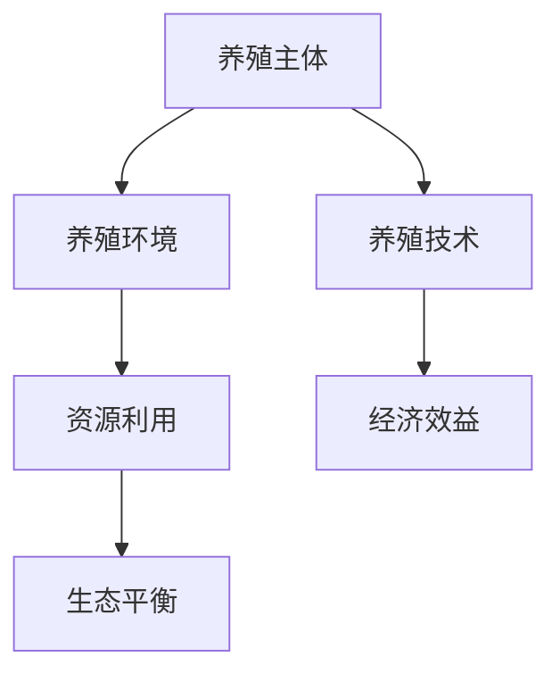

                 

# 可持续水产养殖的市场前景与投资策略

## 关键词：可持续水产养殖、市场前景、投资策略、技术创新、循环经济

## 摘要：  
本文深入分析了可持续水产养殖的市场前景与投资策略。通过探讨可持续水产养殖的核心概念、技术原理、系统架构以及实际案例，本文旨在为投资者和从业者提供科学的决策依据，帮助他们在水产养殖领域实现可持续发展。文章结合理论与实践，详细阐述了可持续水产养殖的技术创新、商业模式优化以及投资策略制定，为读者提供了全面的视角和深度的分析。

---

# 第一部分: 可持续水产养殖的背景与核心概念

## 第1章: 可持续水产养殖的背景与问题背景

### 1.1 可持续水产养殖的定义与核心要素

#### 1.1.1 可持续水产养殖的定义  
可持续水产养殖是一种以生态、经济和社会效益为核心的水产养殖模式，强调资源高效利用、环境友好和长期盈利能力。其核心在于在不破坏生态环境的前提下，实现水产养殖的高效生产和可持续发展。

#### 1.1.2 可持续水产养殖的核心要素  
- **生态平衡**：确保养殖过程中生态系统的稳定，避免资源枯竭和环境污染。  
- **经济效益**：通过技术创新和优化管理降低成本，提高产量和市场竞争力。  
- **社会效益**：提供就业机会，促进区域经济发展，改善当地居民生活水平。  

#### 1.1.3 可持续水产养殖的生态与经济意义  
可持续水产养殖不仅是解决全球粮食安全问题的重要途径，也是实现绿色经济和可持续发展目标的关键领域。通过减少对自然资源的过度依赖，水产养殖业可以为全球提供高质量的蛋白质来源。

### 1.2 可持续水产养殖的现状与问题背景

#### 1.2.1 当前全球水产养殖业的发展现状  
全球水产养殖业近年来发展迅速，成为食品生产的重要组成部分。然而，传统养殖模式往往伴随着资源浪费、环境污染和生态破坏等问题，限制了行业的可持续发展。

#### 1.2.2 可持续水产养殖面临的主要问题  
- **资源过度开发**：传统的养殖模式导致水资源浪费和饵料资源枯竭。  
- **环境污染**：养殖过程中产生的废水、废弃物对环境造成压力。  
- **技术落后**：部分地区的养殖技术仍停留在低效阶段，缺乏创新。  

#### 1.2.3 可持续水产养殖的重要性和紧迫性  
随着全球人口增长和对蛋白质需求的增加，可持续水产养殖的重要性日益凸显。通过技术创新和模式优化，水产养殖业可以在满足市场需求的同时，保护生态环境，实现可持续发展。

### 1.3 可持续水产养殖的边界与外延

#### 1.3.1 可持续水产养殖的边界  
- **空间边界**：限定在特定的地理区域或水域范围内。  
- **时间边界**：强调长期性，避免短期收益损害长期发展。  
- **资源边界**：限制对自然资源的过度利用，确保资源的可再生性。  

#### 1.3.2 可持续水产养殖的外延  
可持续水产养殖不仅涵盖养殖技术本身，还涉及上游的饲料生产、下游的市场销售，以及相关的金融服务和技术支持。

#### 1.3.3 可持续水产养殖与相关领域的联系  
- **农业**：与粮食生产、水资源利用密切相关。  
- **环保**：与生态保护、污染防治相关联。  
- **经济**：与市场供需、产业发展相互影响。  

### 1.4 可持续水产养殖的核心概念结构

#### 1.4.1 核心概念的组成  
- **生态平衡**：确保养殖环境的稳定。  
- **经济效益**：通过技术创新提高生产效率。  
- **社会影响**：关注养殖对当地社区的影响。  

#### 1.4.2 核心概念的属性特征  
- **生态友好性**：减少对环境的负面影响。  
- **经济可行性**：确保养殖模式的盈利能力。  
- **社会可持续性**：促进区域经济发展和就业。  

#### 1.4.3 核心概念的ER实体关系图  

---

## 第2章: 可持续水产养殖的核心概念与联系

### 2.1 可持续水产养殖的核心概念原理

#### 2.1.1 生态平衡与资源利用  
通过合理规划养殖密度和饵料投放量，确保养殖环境的生态平衡，减少对水资源的浪费和污染。

#### 2.1.2 经济效益与社会影响  
优化养殖技术降低成本，同时为当地社区提供就业机会，实现经济效益与社会效益的双重目标。

#### 2.1.3 技术创新与模式优化  
引入智能化养殖技术和循环经济模式，提高资源利用效率，降低环境污染风险。

### 2.2 核心概念属性特征对比表格

| 核心概念       | 生态特征             | 经济特征             | 社会特征             |
|----------------|----------------------|----------------------|----------------------|
| 可持续性       | 资源高效利用         | 经济效益最大化       | 社会效益最大化       |
| 传统养殖模式   | 资源浪费，环境污染   | 成本高，利润低         | 就业机会有限         |

### 2.3 可持续水产养殖的ER实体关系图

---

## 第3章: 可持续水产养殖的市场分析与投资策略

### 3.1 可持续水产养殖的市场前景

#### 3.1.1 全球水产养殖市场的现状与趋势  
全球水产养殖市场增长迅速，预计未来几年将以年均5%以上的速度增长。消费者对健康、绿色食品的需求增加，推动了可持续水产养殖的发展。

#### 3.1.2 可持续水产养殖的市场需求  
消费者对环保、健康食品的关注度提高，推动了对可持续养殖产品的需求。此外，政府政策的支持也为可持续水产养殖提供了良好的发展环境。

#### 3.1.3 可持续水产养殖的市场潜力  
通过技术创新和模式优化，可持续水产养殖可以实现更高的产量和更低的成本，具有广阔的市场前景。

### 3.2 可持续水产养殖的投资策略

#### 3.2.1 投资者的角色与定位  
投资者需要关注行业趋势，选择具有发展潜力的养殖项目，同时注重技术创新和模式优化。

#### 3.2.2 可持续水产养殖的投资风险与机遇  
- **风险**：技术落后、政策变化、市场需求波动。  
- **机遇**：技术进步、政策支持、市场需求增长。  

#### 3.2.3 投资策略的制定与实施  
- **市场定位**：选择具有潜力的市场和产品。  
- **风险管理**：建立风险预警机制，及时应对潜在问题。  
- **技术创新**：加大研发投入，提升生产效率。  

### 3.3 可持续水产养殖的商业模式

#### 3.3.1 传统养殖模式的转型  
通过引入新技术和新模式，传统养殖模式可以向可持续方向转型，提高生产效率和资源利用率。

#### 3.3.2 可持续养殖模式的创新  
- **智能化养殖**：利用物联网和大数据技术优化养殖过程。  
- **循环经济模式**：将养殖废弃物转化为资源，实现循环利用。  

#### 3.3.3 可持续养殖的盈利模式  
- **直接销售**：通过品牌建设和市场推广，提高产品售价。  
- **附加服务**：提供技术支持、培训和咨询服务。  

---

## 第4章: 可持续水产养殖的技术与模式创新

### 4.1 可持续水产养殖的技术创新

#### 4.1.1 智能化养殖技术  
通过物联网技术实时监测养殖环境，优化养殖条件，减少资源浪费。  

#### 4.1.2 循环经济模式  
将养殖废弃物转化为有机肥或能源，实现资源的循环利用，降低环境污染风险。

#### 4.1.3 绿色金融工具  
通过绿色贷款和绿色债券等金融工具，支持可持续水产养殖项目的实施。

---

## 第5章: 可持续水产养殖的项目实战

### 5.1 项目背景与目标

#### 5.1.1 项目背景  
某地区传统养殖模式效率低下，资源浪费严重，环境污染问题突出。通过引入可持续养殖技术，实现资源高效利用和环境友好。

### 5.2 系统架构设计

#### 5.2.1 系统功能设计  
- **养殖环境监测**：实时监测水温、溶解氧等参数。  
- **饵料投喂控制**：根据鱼群需求自动投喂饵料。  
- **废弃物处理**：将养殖废弃物转化为有机肥。  

#### 5.2.2 系统架构图  

### 5.3 项目实施与优化

#### 5.3.1 环境效益  
通过智能化监测和优化管理，减少水资源浪费和环境污染，提高生态效益。

#### 5.3.2 经济效益  
通过技术创新降低成本，提高产量和市场竞争力，实现经济效益最大化。

### 5.4 项目小结

#### 5.4.1 成功经验总结  
- 引入智能化养殖技术，提高生产效率。  
- 实现资源循环利用，降低环境污染风险。  

#### 5.4.2 挑战与改进方向  
- 加强技术研发，提升智能化水平。  
- 加大政策支持力度，推动可持续发展。  

---

## 第6章: 总结与展望

### 6.1 总结

可持续水产养殖是实现全球粮食安全和环境保护的重要途径。通过技术创新和模式优化，水产养殖业可以在满足市场需求的同时，保护生态环境，实现可持续发展。

### 6.2 展望

未来，随着技术的进步和政策的支持，可持续水产养殖将得到更广泛的应用。智能化、绿色化和循环化的养殖模式将成为行业发展的主要方向。

---

通过以上分析，我们可以看到，可持续水产养殖不仅具有广阔的市场前景，也是实现绿色经济和可持续发展的重要手段。投资者和从业者应积极关注行业趋势，抓住机遇，推动水产养殖业的可持续发展。

