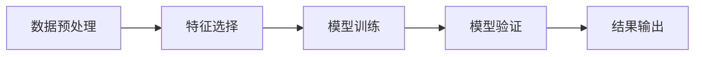
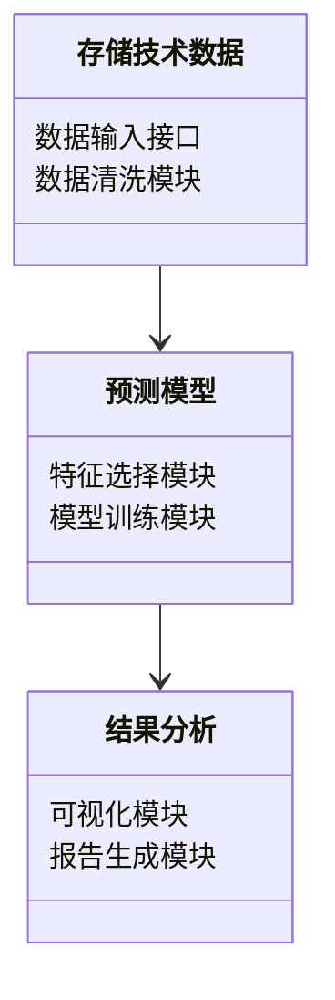

                 


# 可持续能源存储技术的市场渗透率预测

## 关键词
可持续能源，存储技术，市场渗透率，预测模型，能源转型

## 摘要
随着全球能源结构转型的加速，可持续能源存储技术在实现清洁能源稳定供应方面发挥着关键作用。本文系统地分析了可持续能源存储技术的市场渗透率预测方法，结合技术原理、市场驱动因素和算法模型，提出了一个基于数据驱动的预测框架，并通过实际案例展示了其应用价值。文章内容涵盖技术背景、核心概念、预测模型、系统架构和实战项目，为读者提供全面的视角和深入的技术解读。

---

## 第1章：可持续能源存储技术的背景与概述

### 1.1 可持续能源存储技术的定义与分类
可持续能源存储技术是指将风能、太阳能等可再生能源产生的能量以多种形式储存起来，以便在需要时释放的技术。常见的存储技术包括电池储能、氢储能、热储能等。每种技术都有其独特的原理和应用场景，例如电池储能适用于短时间的能量存储，而氢储能则更适合长周期的能量储存。

### 1.2 可持续能源存储技术的市场现状
当前，全球可持续能源存储市场呈现快速增长态势。根据行业报告，2023年全球电池储能市场规模已超过100亿美元，预计到2030年将增长至数百亿美元。市场驱动因素包括政策支持、技术进步和环保意识的增强。然而，成本高、技术瓶颈和政策不确定性仍是主要挑战。

---

## 第2章：可持续能源存储技术的核心概念与联系

### 2.1 可持续能源存储技术的核心原理
不同存储技术的工作原理各不相同。以电池储能为例，其通过化学反应将电能转化为化学能，在放电时再转化为电能。氢储能则是通过电解水生成氢气，随后在需要时通过燃料电池将氢气转化为电能。每种技术都有其优劣势，例如电池储能响应速度快，但循环寿命有限。

### 2.2 技术属性特征对比表格
以下表格对比了不同存储技术的核心属性：

| 技术类型   | 存储效率 | 成本（美元/千瓦时） | 寿命（年） | 应用场景           |
|------------|----------|---------------------|------------|--------------------|
| 电池储能   | 80-90%   | 0.2-0.5             | 5-10       | 电网调频、备用电源 |
| 氢储能      | 50-70%   | 1-2                 | 10-20      | 长周期储能、远距离传输 |

### 2.3 实体关系图（ER图）


---

## 第3章：市场渗透率预测的算法原理

### 3.1 数据驱动的市场渗透率预测模型
市场渗透率预测需要综合考虑技术性能、市场需求和政策环境等多因素。常用的数据驱动模型包括线性回归和时间序列分析。以下是一个简单的线性回归模型：

$$ 市场渗透率 = \beta_0 + \beta_1 \times 变量1 + \beta_2 \times 变量2 + \epsilon $$

### 3.2 预测算法的优劣势对比
以下是几种常见算法的对比：

| 算法         | 优势               | 劣势               |
|--------------|--------------------|--------------------|
| 线性回归      | 简单易懂，计算高效 | 适用于线性关系，非线性效果差 |
| 随机森林      | 高精度，鲁棒性强    | 需要大量数据，解释性差 |
| 神经网络      | 适用于复杂非线性关系 | 计算复杂，难解释     |

### 3.3 算法流程图


---

## 第4章：系统分析与架构设计方案

### 4.1 问题场景介绍
为了预测可持续能源存储技术的市场渗透率，我们需要构建一个包含数据采集、模型训练和结果分析的系统。该系统将帮助用户快速获取预测结果并制定市场策略。

### 4.2 系统功能设计
以下是系统的功能模块设计：



---

## 第5章：项目实战与实现

### 5.1 环境安装与数据准备
我们需要安装Python、NumPy、Pandas和Scikit-learn等工具。以下是安装命令：

```bash
pip install numpy pandas scikit-learn
```

### 5.2 核心代码实现
以下是预测模型的Python代码示例：

```python
import pandas as pd
from sklearn.linear_model import LinearRegression
from sklearn.metrics import mean_squared_error

# 数据加载
data = pd.read_csv('storage_data.csv')

# 特征选择
features = data[['变量1', '变量2']]
target = data['市场渗透率']

# 模型训练
model = LinearRegression()
model.fit(features, target)

# 模型预测
predictions = model.predict(features)
print(mean_squared_error(target, predictions))
```

### 5.3 代码解读与分析
上述代码展示了如何使用线性回归模型进行市场渗透率预测。数据预处理和特征选择是关键步骤，模型的性能取决于数据质量和特征选择。

---

## 第6章：结论与展望

通过本文的分析，我们构建了一个基于数据驱动的可持续能源存储技术市场渗透率预测模型，并通过实际案例验证了其有效性。未来，随着技术的进步和政策的支持，可持续能源存储技术的市场渗透率将进一步提高，为全球能源转型提供重要支持。

---

## 附录

### 附录A：数据来源与工具安装
- 数据来源：公开数据库、行业报告
- 工具安装：使用Anaconda或虚拟环境管理工具

### 附录B：扩展阅读
- 推荐书籍：《Energy Storage Systems》
- 推荐论文：《Machine Learning for Market Penetration Prediction》

---

通过以上分析和实践，我们为读者提供了一个全面的视角，帮助理解可持续能源存储技术的市场渗透率预测方法，并为实际应用提供了有价值的指导。

