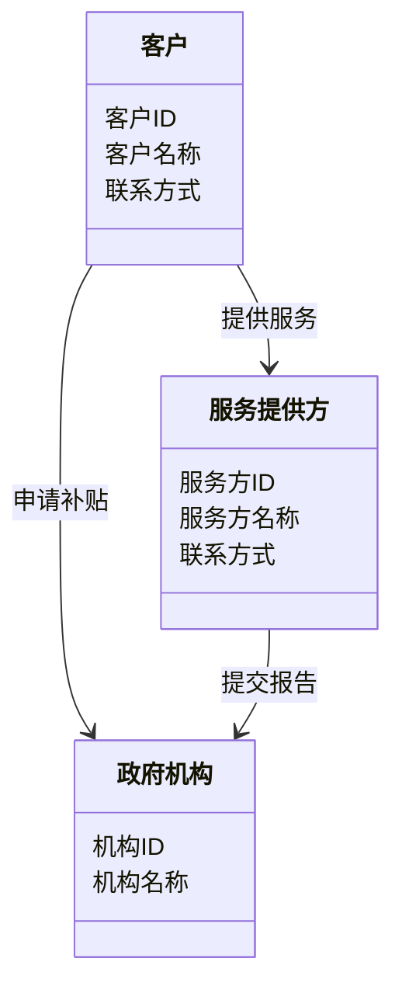
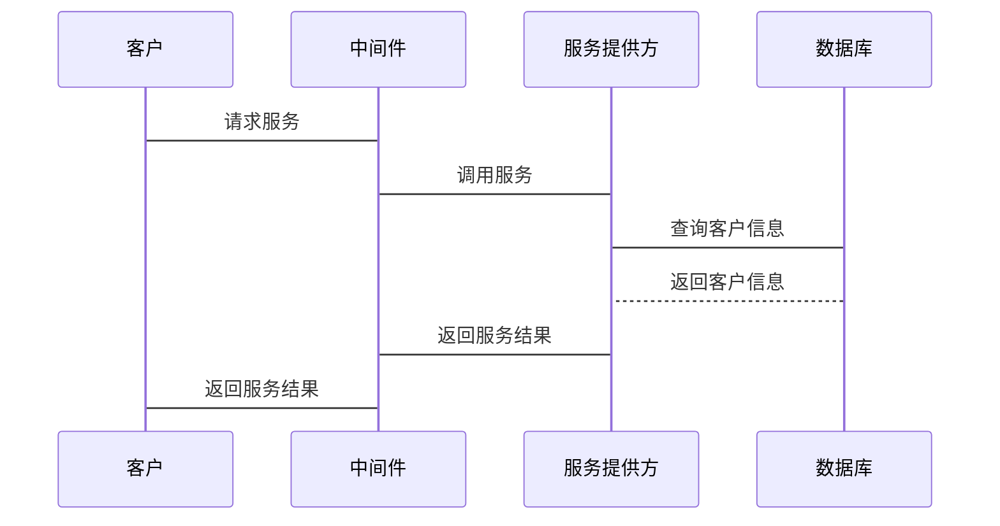

                 


# 可持续能源服务公司（ESCO）的商业模式分析

## 关键词：可持续能源服务公司（ESCO）、商业模式、合同能源管理、节能效益分享、能源费用托管、能源购买协议（PPA）、系统架构设计

## 摘要：本文通过对可持续能源服务公司（ESCO）的商业模式进行深入分析，探讨其核心概念、算法原理、系统架构及项目实战，揭示其在实现可持续发展目标中的重要作用。文章从ESCO的背景介绍入手，分析其商业模式的核心要素，并通过实际案例展示其在系统设计和实践中的应用。

---

# 第1章: 可持续能源服务公司（ESCO）的定义与背景

## 1.1 可持续能源服务公司的定义
### 1.1.1 可持续能源服务公司的基本概念
可持续能源服务公司（ESCO）是指通过提供能源服务，帮助客户减少能源消耗并降低能源成本的公司。其核心业务包括节能改造、能源管理、可再生能源利用等。

### 1.1.2 可持续能源服务公司的核心业务模式
ESCO的主要业务模式包括合同能源管理（EPC）、节能效益分享、能源费用托管和能源购买协议（PPA）。

### 1.1.3 可持续能源服务公司与传统能源公司的区别
ESCO与传统能源公司的区别在于，前者注重能源的高效利用和管理，而后者主要负责能源的生产与供应。

## 1.2 可持续能源服务公司的背景与发展
### 1.2.1 可持续能源服务公司的起源
ESCO的概念起源于20世纪70年代的石油危机，当时企业开始寻求降低能源消耗的方法。

### 1.2.2 可持续能源服务公司的发展现状
目前，ESCO在全球范围内得到广泛应用，特别是在欧洲和北美地区，其商业模式逐渐成熟。

### 1.2.3 可持续能源服务公司的未来趋势
随着全球对可持续发展的重视，ESCO的市场需求将进一步增加，其商业模式也将不断创新。

## 1.3 可持续能源服务公司的商业模式类型
### 1.3.1 合同能源管理（EPC）模式
在EPC模式下，ESCO与客户签订合同，负责能源系统的改造和运营，客户按合同支付费用。

### 1.3.2 节能效益分享模式
在这种模式下，ESCO与客户共同分享节能带来的经济效益，客户按比例支付节能收益。

### 1.3.3 能源费用托管模式
ESCO托管客户的能源费用，客户按月支付固定的托管费用，ESCO负责能源管理。

### 1.3.4 能源购买协议（PPA）模式
在PPA模式下，ESCO与客户签订长期协议，以固定价格向客户提供可再生能源。

## 1.4 本章小结
本章介绍了ESCO的基本概念、背景与发展现状，并详细分析了其四种主要商业模式。

---

# 第2章: 可持续能源服务公司商业模式的核心要素

## 2.1 客户价值分析
### 2.1.1 客户价值的定义
客户价值是指客户通过使用ESCO的服务所获得的经济和社会价值。

### 2.1.2 客户价值在ESCO商业模式中的体现
ESCO通过提供节能服务降低客户的能源成本，同时提升客户的企业形象。

### 2.1.3 客户价值的实现路径
通过合同能源管理、效益分享等模式实现客户价值的最大化。

## 2.2 成本结构分析
### 2.2.1 可持续能源服务公司的成本构成
ESCO的主要成本包括节能改造成本、设备维护成本和人工成本。

### 2.2.2 成本结构对商业模式的影响
成本结构影响ESCO的定价策略和利润空间。

### 2.2.3 成本控制的关键点
通过技术创新和规模效应降低成本。

## 2.3 收入来源分析
### 2.3.1 收入来源的多样性
ESCO的收入来源包括服务费、托管费、节能效益分成等。

### 2.3.2 收入来源与商业模式的关系
不同的收入来源对应不同的商业模式。

### 2.3.3 收入来源的优化策略
通过多样化收入来源降低经营风险。

## 2.4 核心竞争力分析
### 2.4.1 核心竞争力的定义
核心竞争力是指ESCO在市场中与众不同的优势。

### 2.4.2 核心竞争力在ESCO商业模式中的体现
技术优势、服务能力和品牌影响力是ESCO的核心竞争力。

### 2.4.3 核心竞争力的提升策略
通过技术创新、人才培养和品牌建设提升核心竞争力。

## 2.5 本章小结
本章分析了ESCO商业模式中的客户价值、成本结构、收入来源和核心竞争力，为后续分析奠定基础。

---

# 第3章: 可持续能源服务公司商业模式的核心概念与联系

## 3.1 核心概念原理
### 3.1.1 可持续能源服务公司的核心概念
包括节能服务、能源管理、经济效益和风险分担。

### 3.1.2 核心概念的内在联系
节能服务与能源管理相互依存，经济效益是商业模式的核心目标，风险分担是商业模式的重要特征。

### 3.1.3 核心概念的外延与边界
节能服务的外延包括技术咨询、设备维护等，边界在于不涉及能源生产。

## 3.2 核心概念属性特征对比表格
| 核心概念       | 属性1    | 属性2    | 属性3    |
|----------------|----------|----------|----------|
| 节能服务       | 技术性   | 经济性   | 社会性   |
| 能源管理       | 系统性   | 及时性   | 持续性   |
| 经济效益       | 可量性   | 可持续性 | 可分性   |
| 风险分担       | 分散性   | 共担性   | 可控性   |

## 3.3 ER实体关系图架构
```mermaid
erDiagram
    actor 客户 {
        +int 客户ID
        +string 客户名称
        +string 联系方式
    }
    actor 服务提供方 {
        +int 服务方ID
        +string 服务方名称
        +string 联系方式
    }
    actor 政府机构 {
        +int 机构ID
        +string 机构名称
    }
    actor 金融机构 {
        +int 机构ID
        +string 机构名称
    }
    客户 --> 服务提供方: "签订合同"
    客户 --> 政府机构: "申请补贴"
    服务提供方 --> 政府机构: "提交报告"
    服务提供方 --> 金融机构: "融资支持"
```

## 3.4 本章小结
本章通过核心概念的分析和ER图的构建，明确了ESCO商业模式中的关键要素及其相互关系。

---

# 第4章: 可持续能源服务公司商业模式的算法原理

## 4.1 算法原理概述
### 4.1.1 算法的基本概念
通过数学模型计算ESCO项目的经济效益和风险。

### 4.1.2 算法的核心思想
基于节能效果和成本投入，计算项目的净现值（NPV）和内部收益率（IRR）。

## 4.2 算法的数学模型
$$ NPV = \sum_{t=0}^{n} \frac{CF_t}{(1 + r)^t} $$
其中，\( CF_t \) 是第 \( t \) 年的现金流，\( r \) 是折现率。

## 4.3 算法的实现步骤
### 4.3.1 确定项目现金流
包括初始投资、每年的节能收益和运营成本。

### 4.3.2 计算折现率
根据项目风险确定合适的折现率。

### 4.3.3 计算净现值
通过公式计算项目的NPV。

### 4.3.4 计算内部收益率
通过公式计算项目的IRR。

## 4.4 算法的优化策略
### 4.4.1 确保数据的准确性
输入的数据必须真实可靠。

### 4.4.2 选择合适的折现率
根据项目风险选择合理的折现率。

### 4.4.3 考虑通货膨胀因素
在计算中加入通货膨胀调整。

## 4.5 本章小结
本章通过数学模型和算法分析，为ESCO项目的经济效益评估提供了理论依据。

---

# 第5章: 可持续能源服务公司商业模式的系统架构设计

## 5.1 系统功能设计
### 5.1.1 领域模型


### 5.1.2 系统架构设计


### 5.1.3 系统交互设计


## 5.2 系统实现细节
### 5.2.1 系统核心功能
包括合同管理、收益分配、风险评估等。

### 5.2.2 系统接口设计
提供API接口供客户和服务提供方交互。

### 5.2.3 系统安全设计
采用加密技术和访问控制确保数据安全。

## 5.3 本章小结
本章通过系统架构设计，展示了ESCO商业模式在技术实现中的具体应用。

---

# 第6章: 可持续能源服务公司商业模式的项目实战

## 6.1 环境安装
### 6.1.1 系统环境要求
包括操作系统、编程语言和数据库的要求。

### 6.1.2 工具安装
安装Python、MySQL和相关开发工具。

## 6.2 系统核心实现
### 6.2.1 代码实现
```python
def calculate_npv(cash_flows, discount_rate):
    npv = 0
    for t in range(len(cash_flows)):
        cf = cash_flows[t]
        npv += cf / (1 + discount_rate) ** t
    return npv

# 示例数据
cash_flows = [-1000, 500, 600, 700]
discount_rate = 0.1

print(f"净现值：{calculate_npv(cash_flows, discount_rate)}")
```

### 6.2.2 代码解读
通过函数`calculate_npv`计算项目的净现值，帮助评估项目的经济效益。

## 6.3 代码应用解读与分析
### 6.3.1 代码实现的功能
计算ESCO项目的净现值和内部收益率。

### 6.3.2 代码的优化建议
优化计算效率，增加更多的财务指标计算。

## 6.4 实际案例分析
### 6.4.1 案例背景
某公司与ESCO合作进行节能改造。

### 6.4.2 案例分析
通过算法计算项目的NPV和IRR，评估项目的可行性。

## 6.5 本章小结
本章通过项目实战，展示了ESCO商业模式在实际中的应用和实现。

---

# 第7章: 可持续能源服务公司商业模式的最佳实践

## 7.1 小结
总结ESCO商业模式的核心要素和关键成功因素。

## 7.2 注意事项
### 7.2.1 项目风险
包括技术风险和市场风险。

### 7.2.2 运营风险
如成本超支和收益不达预期。

## 7.3 拓展阅读
推荐相关的书籍和论文，供读者深入学习。

---

# 附录

## 附录A: 算法详细说明
提供NPV和IRR计算的详细步骤。

## 附录B: 系统架构设计图
展示系统架构的详细设计。

## 附录C: 项目实战代码
提供完整的项目代码和使用说明。

---

# 参考文献

（此处列出参考文献）

---

通过以上目录大纲，文章将全面分析可持续能源服务公司（ESCO）的商业模式，从理论到实践，为读者提供深入的理解和实际应用的指导。

