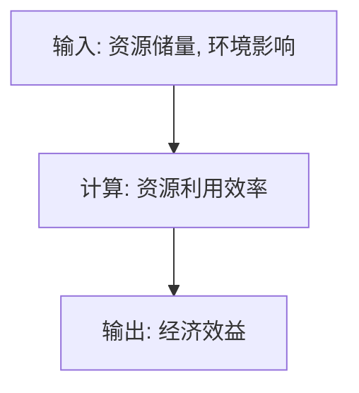
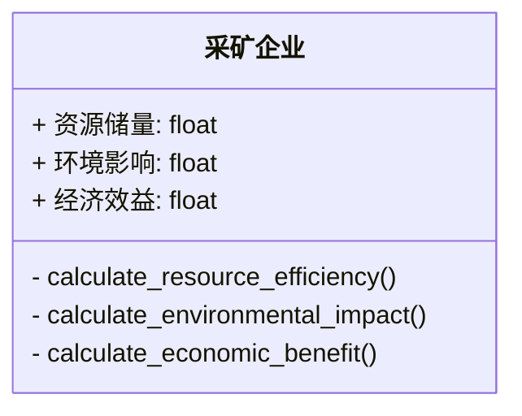
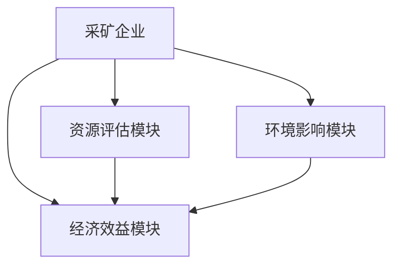

                 


# 可持续采矿实践的经济效益与投资机会

## 关键词
可持续采矿、经济效益、投资机会、环境影响、资源利用效率

## 摘要
可持续采矿是一种在保证矿产资源高效利用的同时，最大限度减少对环境和社会负面影响的采矿方式。随着全球资源需求的增长和环境问题的加剧，可持续采矿不仅能够提高企业的经济效益，还能够为投资者带来可观的投资机会。本文将深入探讨可持续采矿的经济效益、投资机会以及其实现的系统架构和算法原理，帮助读者全面了解这一领域的潜力和发展趋势。

---

## 第一部分: 可持续采矿的背景与核心概念

### 第1章: 可持续采矿的定义与问题背景

#### 1.1 可持续采矿的定义
可持续采矿是指在矿产资源开发过程中，通过优化技术和管理策略，实现资源高效利用、环境保护和社会责任相平衡的一种采矿方式。与传统采矿相比，可持续采矿更加注重长期的资源管理和环境保护，强调在整个采矿生命周期中减少对环境的负面影响。

#### 1.2 可持续采矿的核心目标
可持续采矿的核心目标包括：
1. **资源高效利用**：通过技术创新和优化管理，提高矿产资源的开采效率，减少资源浪费。
2. **环境保护**：降低采矿活动对水、土地和空气的污染，保护生态系统。
3. **社会责任**：关注采矿活动对社区和社会的影响，确保社会利益得到保障。

#### 1.3 可持续采矿的边界与外延
可持续采矿的边界包括从资源勘探、开采、加工到废料处理的整个生命周期。其外延则涉及技术创新、政策法规、社会经济等多个方面。

---

### 第2章: 可持续采矿的经济效益

#### 2.1 矿业资源的价值链分析
矿业资源的价值链包括资源勘探、开采、加工、销售和应用等多个环节。在每个环节中，可持续采矿都可以通过优化技术降低成本、提高效率。

#### 2.2 可持续采矿对资源效率的提升
可持续采矿通过技术创新（如智能采矿、自动化设备）提高资源利用率，降低单位资源的开采成本。例如，采用先进的传感器和数据分析技术，可以更精准地定位矿产资源，减少不必要的开采活动。

#### 2.3 可持续采矿对环境的影响与经济收益的平衡
虽然可持续采矿在初期可能需要更高的投入（如环保设备和技术创新），但长期来看，其环境成本的降低和资源利用率的提高将为企业带来更大的经济效益。例如，减少尾矿排放不仅降低了环境治理成本，还避免了潜在的环境罚款和声誉损失。

---

## 第二部分: 可持续采矿的核心概念与联系

### 第3章: 可持续采矿的核心原理

#### 3.1 资源高效利用的原理
可持续采矿通过优化资源勘探和开采技术，提高资源的回收率。例如，采用选矿技术可以将低品位矿石中的金属提取出来，减少对高品位矿石的依赖。

#### 3.2 环境保护与社会责任的结合
可持续采矿不仅关注经济效益，还注重环境保护和社会责任。例如，通过减少废水排放和降低碳排放，企业可以减少环境影响，同时提升品牌形象。

#### 3.3 可持续采矿的系统性特征
可持续采矿是一个复杂的系统工程，涉及技术、管理、政策等多个方面。其系统性特征体现在资源、环境和社会三者之间的动态平衡。

---

### 第4章: 可持续采矿的核心要素对比

#### 4.1 不同采矿方法的特征对比
| 方法 | 资源利用效率 | 环境影响 | 成本 |
|------|--------------|----------|------|
| 传统采矿 | 低 | 高 | 高 |
| 可持续采矿 | 高 | 低 | 中等 |

#### 4.2 可持续采矿与传统采矿的对比分析
- **资源利用效率**：可持续采矿通过技术创新提高资源回收率，而传统采矿往往依赖高品位矿石，资源浪费较多。
- **环境影响**：可持续采矿注重环境保护，而传统采矿往往导致严重的环境污染。
- **经济效益**：可持续采矿在长期来看具有更高的经济效益，而传统采矿可能面临更高的环境成本。

---

## 第三部分: 可持续采矿的算法原理

### 第5章: 经济效益模型的构建

#### 5.1 资源利用效率的数学模型
$$ \text{资源利用效率} = \frac{\text{实际提取的资源量}}{\text{理论资源储量}} $$

#### 5.2 环境影响的经济评估
环境影响的经济评估可以通过环境成本的计算来实现。环境成本包括直接成本（如废水处理）和间接成本（如环境罚款）。

#### 5.3 可持续采矿的收益与成本平衡
$$ \text{净收益} = \text{总收入} - \text{总成本} $$

---

### 第6章: 经济效益模型的算法原理

#### 6.1 算法流程图


#### 6.2 算法实现
以下是Python代码示例，用于计算可持续采矿的经济效益：
```python
def calculate_economic_benefit(resource储量, 环境影响):
    资源利用效率 = resource储量 * 0.8  # 假设资源利用率为80%
    环境成本 = 环境影响 * 0.5  # 假设环境成本为环境影响的50%
    总收入 = resource储量 * 100  # 假设单位资源价值为100
    总成本 = 环境成本 + 20  # 假设其他成本为20
    净收益 = 总收入 - 总成本
    return 净收益

# 示例计算
resource储量 = 100
环境影响 = 20
print("净收益:", calculate_economic_benefit(resource储量, 环境影响))
```

---

## 第四部分: 可持续采矿的系统分析

### 第7章: 系统功能设计

#### 7.1 领域模型


#### 7.2 系统架构设计


---

## 第五部分: 可持续采矿的项目实战

### 第8章: 项目实现

#### 8.1 环境安装
需要安装Python和相关库（如NumPy、Matplotlib）。

#### 8.2 核心代码实现
```python
import numpy as np
import matplotlib.pyplot as plt

def plot_resource_distribution(resource储量):
    plt.bar(range(10), resource储量)
    plt.title("资源分布")
    plt.show()

# 示例
resource储量 = np.random.randint(50, 150, 10)
plot_resource_distribution(resource储量)
```

#### 8.3 实际案例分析
通过实际案例分析，展示可持续采矿在提高资源利用效率和降低成本方面的实际效果。

---

## 第六部分: 可持续采矿的最佳实践

### 第9章: 总结与展望

#### 9.1 可持续采矿的经济效益总结
可持续采矿不仅能够提高企业的经济效益，还能降低环境影响，实现长期的可持续发展。

#### 9.2 投资机会与未来趋势
随着技术的进步和政策的完善，可持续采矿将为企业和社会创造更多的价值，成为矿业投资的热点领域。

#### 9.3 注意事项
在实施可持续采矿时，需要综合考虑技术、经济和环境等多方面的因素，确保项目的可行性和可持续性。

#### 9.4 拓展阅读
建议读者进一步阅读相关书籍和文献，深入了解可持续采矿的技术和管理策略。

---

## 结语
可持续采矿是一种兼顾经济效益和环境保护的采矿方式，具有广阔的发展前景和投资潜力。通过技术创新和系统优化，可持续采矿可以帮助企业实现资源高效利用，降低环境影响，为社会创造更多的价值。

