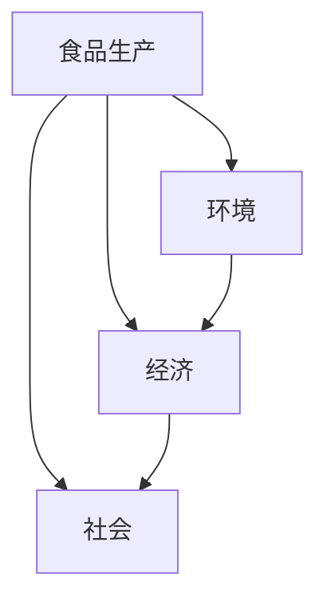
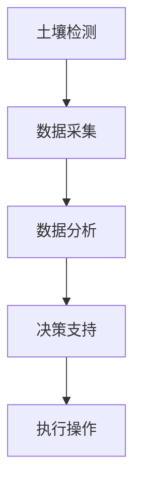

                 

# 可持续食品系统的创新与投资机会

> 关键词：可持续食品系统, 创新, 投资机会, 数字农业, 循环经济, 生物技术

> 摘要：  
本文旨在探讨可持续食品系统的创新方向与投资机会，通过分析数字农业、生物技术与循环经济模式的技术创新，结合实际案例，深入分析可持续食品系统的市场趋势、投资策略与风险应对。本文不仅为技术专家提供理论支持，也为投资者提供实践指导，为构建更加可持续的食品系统提供参考。

---

# 第一部分: 可持续食品系统的背景与概念

## 第1章: 可持续食品系统的背景介绍

### 1.1 可持续食品系统的定义与背景

#### 1.1.1 什么是可持续食品系统  
可持续食品系统是指在生产、加工、分配、消费和废弃物处理等各个环节中，尽可能减少对环境的负面影响，同时满足人类对食品的需求，并促进社会和经济的可持续发展的系统。

#### 1.1.2 可持续食品系统的背景与重要性  
随着全球人口的快速增长、资源的日益紧缺以及环境问题的加剧，传统的食品生产方式已经难以满足现代社会的需求。可持续食品系统的提出，旨在通过技术创新和模式优化，实现食品供应链的高效、环保和可持续。

#### 1.1.3 可持续食品系统的边界与外延  
可持续食品系统的边界包括从农业生产到消费的全过程，外延则涉及技术、经济、社会和环境等多个维度。

**图1-1 可持续食品系统的核心要素**

### 1.2 可持续食品系统的核心要素

#### 1.2.1 食品生产方式  
可持续食品系统的生产方式包括有机农业、精准农业和垂直农业等，强调资源的高效利用和环境的保护。

#### 1.2.2 食品供应链管理  
通过优化供应链的各个环节（如运输、存储和分销），减少资源浪费和环境污染。

#### 1.2.3 食品消费模式  
倡导减少食物浪费、选择本地化和季节性食品等可持续的消费方式。

---

## 第2章: 可持续食品系统的创新方向

### 2.1 数字化农业技术

#### 2.1.1 智能农业的概念与应用  
智能农业通过物联网、大数据和人工智能技术，实现农业生产的智能化和精准化。

**图2-1 智能农业的实现流程**

#### 2.1.2 大数据在农业中的应用  
大数据技术可以帮助农民优化种植计划、预测天气变化和管理作物病虫害。

#### 2.1.3 人工智能在农业中的创新  
人工智能技术可以用于作物识别、病虫害诊断和农业机器人开发。

### 2.2 生物技术与食品创新

#### 2.2.1 合成生物学在食品生产中的应用  
合成生物学可以通过工程化微生物生产食品成分，如蛋白质和脂肪。

#### 2.2.2 CRISPR技术在作物改良中的作用  
CRISPR技术可以用于开发抗病虫害、耐旱的作物品种。

#### 2.2.3 微生物发酵技术的创新  
微生物发酵技术可以用于生产替代蛋白和功能性食品成分。

### 2.3 循环经济模式

#### 2.3.1 食品循环经济的定义  
循环经济模式强调资源的循环利用，减少废弃物的产生。

#### 2.3.2 食品废弃物的资源化利用  
通过生物降解和化学回收技术，将食品废弃物转化为高附加值产品。

#### 2.3.3 循环经济模式的优势与挑战  
优势包括资源效率高、环境污染少，但需要克服技术和成本障碍。

---

# 第二部分: 可持续食品系统的投资机会

## 第3章: 可持续食品系统的投资分析

### 3.1 可持续食品系统的市场趋势

#### 3.1.1 全球食品市场的现状与趋势  
全球食品市场正向健康化、个性化和可持续化方向发展。

#### 3.1.2 可持续食品市场的增长潜力  
预计到2030年，可持续食品市场的规模将大幅增长，尤其是在发达国家和发展中国家。

#### 3.1.3 区域市场的差异与机会  
不同地区的市场需求和政策环境差异较大，需要针对具体市场进行分析。

### 3.2 可持续食品系统的投资策略

#### 3.2.1 投资者如何识别机会  
通过关注技术创新、市场需求和政策支持，识别具有潜力的投资领域。

#### 3.2.2 风险评估与管理  
从技术、市场和政策等多个维度进行风险评估，并制定应对策略。

#### 3.2.3 投资组合优化  
根据风险偏好和收益预期，优化投资组合，分散风险。

---

## 第4章: 可持续食品系统的创新案例分析

### 4.1 数字农业的成功案例

#### 4.1.1 智能灌溉系统的应用  
通过物联网技术实现精准灌溉，节省水资源。

#### 4.1.2 农业大数据平台的实践  
利用大数据分析优化农业生产，提高产量和效率。

#### 4.1.3 无人机在农业中的应用  
无人机用于农田监测、病虫害防治和精准施药。

### 4.2 生物技术创新的案例

#### 4.2.1 合成生物学在食品生产中的应用  
通过合成生物学技术生产替代蛋白，减少对传统畜牧业的依赖。

#### 4.2.2 微生物发酵技术的实际案例  
利用微生物发酵技术生产功能性食品成分，如益生菌和维生素。

#### 4.2.3 CRISPR技术在作物改良中的成功案例  
通过CRISPR技术开发抗病虫害的作物品种，提高产量和抗性。

### 4.3 循环经济模式的实践

#### 4.3.1 食品废弃物的资源化利用  
将食品废弃物转化为肥料、生物燃料和高附加值产品。

#### 4.3.2 循环农业模式的实践  
通过循环农业模式实现资源的高效利用和废弃物的最小化。

#### 4.3.3 零废弃供应链的创新  
构建从生产到消费的零废弃供应链，实现资源的全生命周期管理。

---

## 第5章: 可持续食品系统的投资风险与应对

### 5.1 可持续食品系统的投资风险

#### 5.1.1 技术风险  
技术创新的不确定性和技术瓶颈可能影响投资回报。

#### 5.1.2 市场风险  
市场需求的不确定性和消费者接受度可能影响产品的商业化。

#### 5.1.3 政策风险  
政策的变化和监管的不确定性可能对投资产生影响。

### 5.2 投资风险的应对策略

#### 5.2.1 技术风险的应对  
通过持续的技术研发和合作，降低技术风险。

#### 5.2.2 市场风险的应对  
通过市场调研和消费者教育，提高产品接受度。

#### 5.2.3 政策风险的应对  
密切关注政策变化，积极参与行业标准的制定。

---

## 第6章: 可持续食品系统的最佳实践与展望

### 6.1 最佳实践

#### 6.1.1 技术创新与商业模式的结合  
通过技术创新和商业模式的创新，实现可持续发展。

#### 6.1.2 社会责任与经济效益的统一  
在追求经济效益的同时，注重社会责任，实现可持续发展。

### 6.2 小结

可持续食品系统的创新与投资机会是一个多维度的系统工程，需要技术创新、商业模式优化和社会责任的统一。通过本文的分析，读者可以更好地理解可持续食品系统的潜力和挑战，并为投资决策提供参考。

### 6.3 注意事项

#### 6.3.1 技术创新的可行性  
在投资前需充分评估技术创新的可行性。

#### 6.3.2 市场需求的动态变化  
密切关注市场需求的变化，及时调整投资策略。

#### 6.3.3 政策环境的不确定性  
需密切关注政策变化，合理应对政策风险。

### 6.4 拓展阅读

#### 6.4.1 可持续食品系统的技术文献  
推荐阅读相关领域的技术文献，了解最新研究进展。

#### 6.4.2 可持续投资的行业报告  
参考权威机构发布的行业报告，获取市场趋势和投资机会。

#### 6.4.3 循环经济的实践案例  
学习循环经济的成功案例，借鉴经验教训。

---

# 结语

可持续食品系统的创新与投资机会是一个充满挑战和机遇的领域。通过技术创新、模式优化和社会责任的统一，我们可以为构建更加可持续的食品系统贡献力量。希望本文能为读者提供有价值的见解和指导，帮助他们在可持续食品系统的创新与投资中取得成功。

