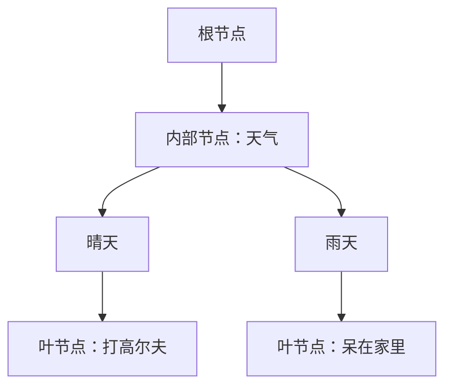
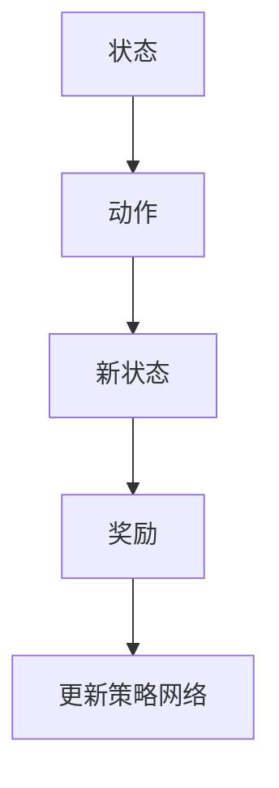
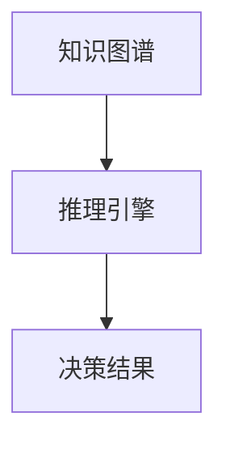
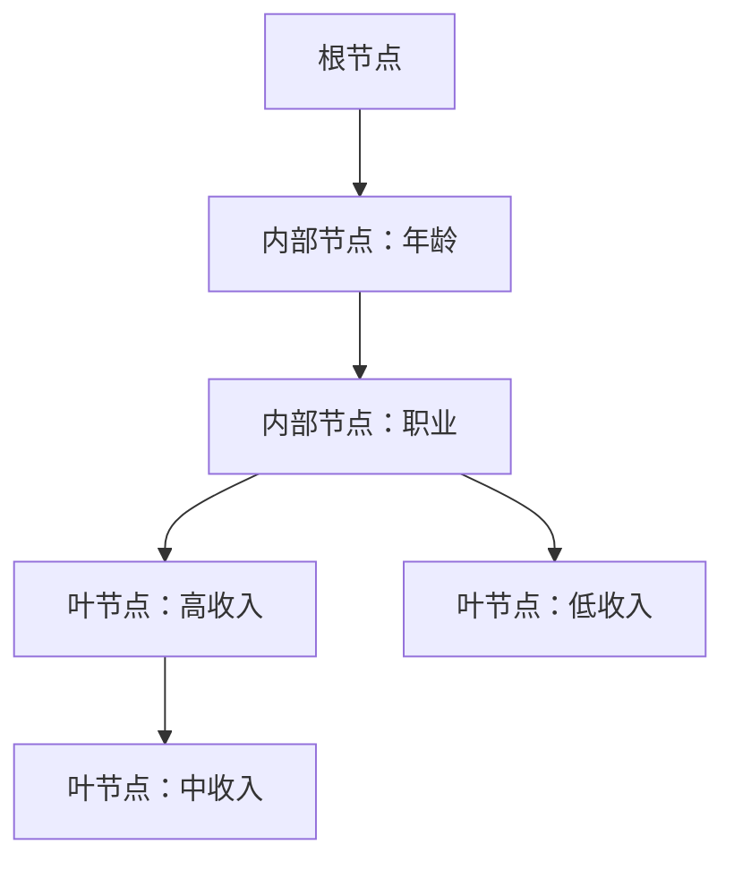
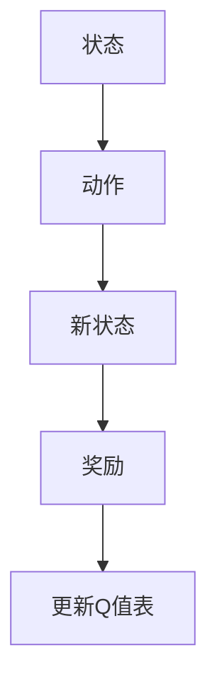
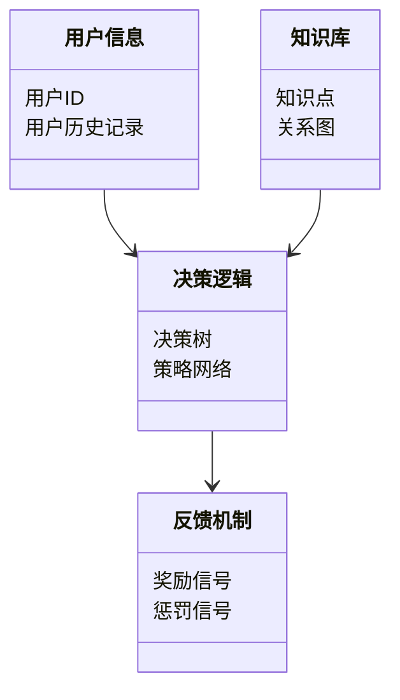
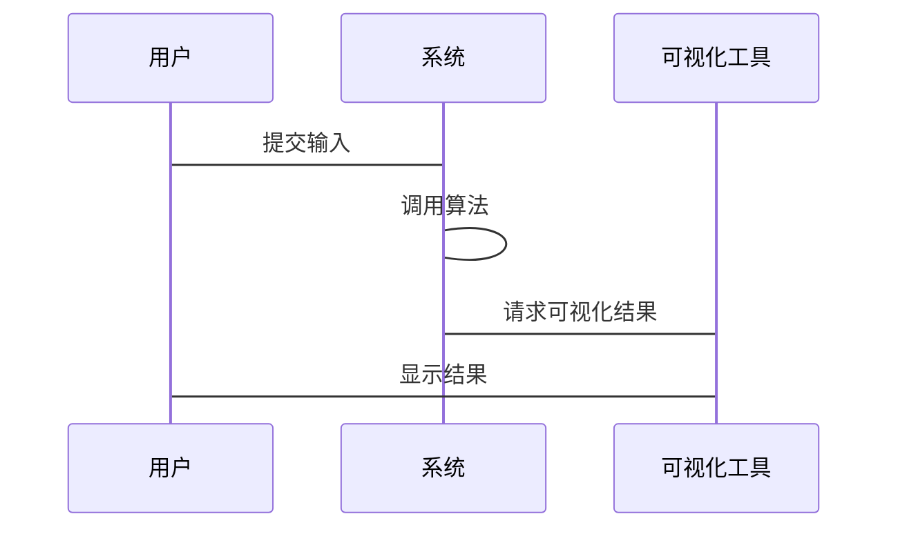

                 


# 可视化调试：深入了解AI Agent的决策过程

## 关键词：AI Agent、决策过程、可视化调试、强化学习、知识图谱、决策树、可解释性

## 摘要：  
AI Agent的决策过程是人工智能领域的重要研究方向，但其复杂性和黑箱特性常常使得理解和调试变得困难。本文通过深入分析AI Agent的决策机制，结合可视化技术，探讨如何有效地调试和优化AI Agent的决策过程。文章从AI Agent的核心概念出发，详细介绍了决策树、强化学习、知识图谱等关键算法的原理和可视化方法，并通过实际案例展示了如何将这些理论应用到实践中。最终，本文为读者提供了一套系统化的可视化调试方法，帮助开发者更好地理解和优化AI Agent的决策过程。

---

# 第一部分: 可视化调试与AI Agent决策过程引言

## 第1章: AI Agent与可视化调试概述

### 1.1 AI Agent的基本概念  
- **1.1.1 什么是AI Agent**  
  AI Agent（人工智能代理）是指能够感知环境、自主决策并执行任务的智能实体。它通过接收输入、分析信息、做出决策并输出行动来实现目标。  
- **1.1.2 AI Agent的分类**  
  AI Agent可以分为基于规则的代理、基于知识的代理、基于学习的代理和混合型代理。每种类型都有其独特的特点和应用场景。  
- **1.1.3 可视化调试在AI Agent中的作用**  
  可视化调试是通过图形化界面展示AI Agent的决策过程，帮助开发者快速定位问题、优化算法并提升性能。  

### 1.2 AI Agent的决策过程  
- **1.2.1 决策过程的基本步骤**  
  AI Agent的决策过程通常包括感知环境、构建知识表示、推理与计算、选择行动等步骤。  
- **1.2.2 决策过程的可视化需求**  
  可视化需求包括状态空间的展示、决策树的可视化、策略网络的展示以及知识图谱的可视化。  
- **1.2.3 可视化调试的核心价值**  
  可视化调试可以帮助开发者更好地理解AI Agent的行为，发现潜在问题，并优化算法性能。  

### 1.3 可视化调试的技术基础  
- **1.3.1 可视化技术的基本原理**  
  可视化技术通过图形化工具将复杂的数据和算法转化为易于理解的图形或图表。  
- **1.3.2 AI Agent决策过程的可解释性**  
  可解释性是可视化调试的关键，只有将AI Agent的决策过程转化为可解释的形式，才能进行有效的调试。  
- **1.3.3 调试工具的发展趋势**  
  随着AI技术的进步，可视化调试工具将更加智能化、交互化，并支持多模态的数据展示。  

### 1.4 本章小结  
本章从AI Agent的基本概念出发，介绍了其决策过程的可视化需求和可视化调试的技术基础，为后续内容奠定了基础。

---

# 第二部分: AI Agent决策过程的核心概念与联系

## 第2章: AI Agent决策过程的核心概念  

### 2.1 决策树与概率推理  
- **2.1.1 决策树的基本结构**  
  决策树是一种树状结构，由根节点、内部节点和叶节点组成，用于表示决策过程中的各种可能性。  
- **2.1.2 概率推理的原理**  
  概率推理通过计算不同路径的概率，选择概率最大的决策路径。  
- **2.1.3 决策树与概率推理的联系**  
  决策树为概率推理提供了结构化的框架，而概率推理则为决策树的每个节点赋予了概率值，从而实现了基于概率的决策优化。  

**图2-1: 决策树的结构与概率推理的关系**  


### 2.2 强化学习与策略网络  
- **2.2.1 强化学习的基本概念**  
  强化学习是一种通过试错机制，基于奖励信号优化决策策略的算法。  
- **2.2.2 策略网络的结构与功能**  
  策略网络通过神经网络模型，直接输出决策动作，是一种端到端的学习方法。  
- **2.2.3 强化学习在决策过程中的应用**  
  强化学习广泛应用于游戏AI、机器人控制等领域，其核心是通过不断试错优化策略网络。  

**图2-2: 强化学习的基本流程图**  


### 2.3 知识图谱与推理引擎  
- **2.3.1 知识图谱的构建与表示**  
  知识图谱通过实体和关系的表示，构建了一个结构化的知识库。  
- **2.3.2 推理引擎的工作原理**  
  推理引擎通过逻辑推理，在知识图谱中找到最优的决策路径。  
- **2.3.3 知识图谱在决策过程中的作用**  
  知识图谱为AI Agent提供了丰富的背景知识，使其能够做出更智能的决策。  

**图2-3: 知识图谱的结构与推理引擎的关系**  


### 2.4 核心概念对比分析  
- **2.4.1 决策树与强化学习的对比**  
  决策树是一种基于规则的决策方法，而强化学习是一种基于试错的优化方法。  
- **2.4.2 概率推理与知识图谱的对比**  
  概率推理关注的是概率分布，而知识图谱关注的是知识的结构化表示。  
- **2.4.3 策略网络与推理引擎的对比**  
  策略网络是基于神经网络的端到端学习，而推理引擎是基于逻辑推理的结构化方法。  

### 2.5 本章小结  
本章详细分析了AI Agent决策过程中的核心概念，包括决策树、强化学习、知识图谱等，并通过对比分析帮助读者更好地理解这些概念之间的联系。

---

# 第三部分: AI Agent决策过程的算法原理  

## 第3章: 决策树算法原理  

### 3.1 决策树的构建过程  
- **3.1.1 数据预处理与特征选择**  
  数据预处理包括数据清洗和特征提取，特征选择则采用信息增益或信息增益率等指标。  
- **3.1.2 决策树的分裂标准**  
  常见的分裂标准包括ID3算法的熵、C4.5算法的信息增益率以及C5.0算法的其他优化指标。  
- **3.1.3 决策树的剪枝技术**  
  剪枝技术包括预剪枝和后剪枝，旨在避免过拟合并提升模型的泛化能力。  

### 3.2 ID3/C4.5/C5.0算法  
- **3.2.1 ID3算法的原理与实现**  
  ID3算法基于熵的概念，选择信息增益最大的特征进行分裂。  
- **3.2.2 C4.5算法的改进与优化**  
  C4.5算法通过引入信息增益率，解决了ID3算法对特征偏倚的敏感性问题。  
- **3.2.3 C5.0算法的性能提升**  
  C5.0算法在C4.5的基础上进行了优化，提高了算法的效率和准确性。  

### 3.3 决策树的可视化与调试  
- **3.3.1 决策树的可视化工具**  
  常见的可视化工具包括Scikit-learn、Graphviz和Python的matplotlib库。  
- **3.3.2 决策树的调试方法**  
  调试方法包括调整特征选择、优化剪枝策略和选择合适的算法参数。  
- **3.3.3 决策树的可解释性分析**  
  可视化决策树可以帮助开发者理解每个节点的决策逻辑，并发现潜在的优化点。  

**图3-1: 决策树的可视化示例**  


### 3.4 本章小结  
本章详细讲解了决策树算法的构建过程、不同算法的优缺点以及可视化调试的方法。

---

## 第4章: 强化学习算法原理  

### 4.1 强化学习的基本原理  
- **4.1.1 状态、动作、奖励的定义**  
  状态是环境的描述，动作是AI Agent的选择，奖励是对决策结果的反馈。  
- **4.1.2 Q-learning算法的原理**  
  Q-learning算法通过更新Q值表，学习最优策略。  
- **4.1.3 策略网络的构建与训练**  
  策略网络通过神经网络模型，直接输出最优动作。  

### 4.2 策略网络的实现细节  
- **4.2.1 神经网络的结构设计**  
  策略网络通常采用多层感知机（MLP）或卷积神经网络（CNN）结构。  
- **4.2.2 策略网络的训练方法**  
  策略网络通过强化学习算法（如Policy Gradient）进行训练，目标是最化期望奖励。  

### 4.3 强化学习的可视化调试  
- **4.3.1 强化学习的可视化工具**  
  常见的可视化工具包括TensorBoard和Flask搭建的可视化界面。  
- **4.3.2 策略网络的调试方法**  
  调试方法包括监控奖励曲线、观察决策路径和分析动作分布。  
- **4.3.3 强化学习的可解释性分析**  
  可视化策略网络的权重分布和激活值，可以帮助开发者理解模型的决策逻辑。  

**图4-1: Q-learning算法的流程图**  


### 4.4 本章小结  
本章详细讲解了强化学习算法的基本原理、策略网络的实现细节以及可视化调试的方法。

---

# 第四部分: AI Agent决策过程的系统分析与架构设计  

## 第5章: 系统分析与架构设计方案  

### 5.1 问题场景介绍  
- **5.1.1 项目背景**  
  以一个智能客服系统为例，AI Agent需要根据用户的问题，选择最优的回复策略。  
- **5.1.2 系统功能需求**  
  系统需要实现用户意图识别、知识库检索、决策推理和回复生成等功能。  

### 5.2 系统功能设计（领域模型）  
- **5.2.1 领域模型的构建**  
  领域模型包括用户信息、知识库、决策逻辑和反馈机制等模块。  
- **5.2.2 领域模型的可视化表示**  
  使用mermaid类图展示系统的各个模块及其交互关系。  

**图5-1: 领域模型的类图表示**  


### 5.3 系统架构设计  
- **5.3.1 系统架构的总体设计**  
  系统架构包括数据层、算法层、可视化层和用户交互层。  
- **5.3.2 系统架构的可视化表示**  
  使用mermaid架构图展示系统的整体架构。  

**图5-2: 系统架构的分层设计**  


### 5.4 系统接口设计  
- **5.4.1 系统接口的定义**  
  系统接口包括数据输入接口、算法调用接口和可视化展示接口。  
- **5.4.2 系统接口的交互设计**  
  使用mermaid序列图展示系统接口的交互流程。  

**图5-3: 系统接口的交互流程**  


### 5.5 本章小结  
本章通过实际案例，详细分析了AI Agent决策系统的系统架构、功能设计和接口设计，并通过图表展示了系统的整体结构。

---

# 第五部分: 项目实战与最佳实践  

## 第6章: 项目实战  

### 6.1 环境安装与配置  
- **6.1.1 安装Python与相关库**  
  需要安装的库包括Scikit-learn、TensorFlow、Keras和Graphviz等。  
- **6.1.2 安装可视化工具**  
  常见的可视化工具包括Jupyter Notebook和Plotly等。  

### 6.2 系统核心实现源代码  
- **6.2.1 决策树算法的实现**  
  使用Scikit-learn库实现ID3/C4.5/C5.0算法，并通过Jupyter Notebook进行可视化。  
- **6.2.2 强化学习算法的实现**  
  使用TensorFlow或Keras库实现Q-learning算法，并通过自定义可视化工具展示决策过程。  

**代码示例1: 决策树的实现与可视化**  
```python
from sklearn.tree import DecisionTreeClassifier
from sklearn.datasets import make_classification
from sklearn.tree import plot_tree

# 生成数据集
X, y = make_classification(n_samples=100, n_features=2, n_classes=2)

# 训练决策树模型
model = DecisionTreeClassifier()
model.fit(X, y)

# 可视化决策树
plot_tree(model)
```

**代码示例2: 强化学习的实现与可视化**  
```python
import numpy as np
import matplotlib.pyplot as plt

# 定义Q-learning算法
class QLearning:
    def __init__(self, state_space, action_space):
        self.q_table = np.zeros((state_space, action_space))
    
    def choose_action(self, state, epsilon):
        if np.random.random() < epsilon:
            return np.random.randint(action_space)
        return np.argmax(self.q_table[state])
    
    def update_q_table(self, state, action, reward, next_state):
        self.q_table[state, action] = self.q_table[state, action] * 0.9 + reward

# 初始化参数
state_space = 5
action_space = 3
epsilon = 0.1
ql = QLearning(state_space, action_space)

# 训练过程
for episode in range(100):
    state = np.random.randint(state_space)
    action = ql.choose_action(state, epsilon)
    next_state = np.random.randint(state_space)
    reward = np.random.randint(1, 10)
    ql.update_q_table(state, action, reward, next_state)

# 可视化Q值表
plt.figure(figsize=(10, 6))
plt.imshow(ql.q_table, cmap='hot')
plt.title('Q值表')
plt.colorbar()
plt.show()
```

### 6.3 代码应用解读与分析  
- **6.3.1 决策树的实现细节**  
  代码通过Scikit-learn库实现了决策树的训练和可视化，并通过数据集验证了模型的正确性。  
- **6.3.2 强化学习的实现细节**  
  代码通过自定义Q-learning算法实现了强化学习的基本功能，并通过可视化展示了Q值表的更新过程。  

### 6.4 实际案例分析  
- **6.4.1 案例背景**  
  以智能客服系统为例，AI Agent需要根据用户的问题，选择最优的回复策略。  
- **6.4.2 案例分析**  
  通过可视化调试，发现模型在某些情况下选择的回复策略不够准确，通过优化算法参数和调整决策树的结构，提升了模型的性能。  

### 6.5 最佳实践与注意事项  
- **6.5.1 可视化调试的注意事项**  
  在进行可视化调试时，需要注意数据的可解释性、调试工具的易用性以及模型的泛化能力。  
- **6.5.2 项目实施的关键点**  
  关键点包括数据质量、算法选择、可视化设计和模型优化。  

### 6.6 本章小结  
本章通过实际案例展示了AI Agent决策过程的可视化调试方法，并总结了项目实施中的最佳实践和注意事项。

---

# 第六部分: 总结与展望  

## 第7章: 总结与展望  

### 7.1 核心内容回顾  
- AI Agent的决策过程涉及决策树、强化学习、知识图谱等多种算法。  
- 可视化调试是理解和优化AI Agent决策过程的重要工具。  

### 7.2 未来发展方向  
- **7.2.1 可视化调试工具的智能化**  
  未来的可视化工具将更加智能化，能够自动生成可视化界面并提供优化建议。  
- **7.2.2 多模态的可视化方法**  
  结合文本、图像、语音等多种模态的数据，提供更加丰富的可视化体验。  
- **7.2.3 可解释性AI的发展**  
  可解释性AI将是未来研究的重要方向，能够帮助开发者更好地理解和优化AI Agent的决策过程。  

### 7.3 最终总结  
本文通过深入分析AI Agent的决策过程，结合可视化调试技术，为开发者提供了一套系统化的调试方法。希望本文能够帮助读者更好地理解AI Agent的决策过程，并在实际应用中取得更好的效果。

---

**本文结构至此结束，后续内容将根据上述大纲逐步展开，详细阐述每个部分的具体内容和实现细节。**

