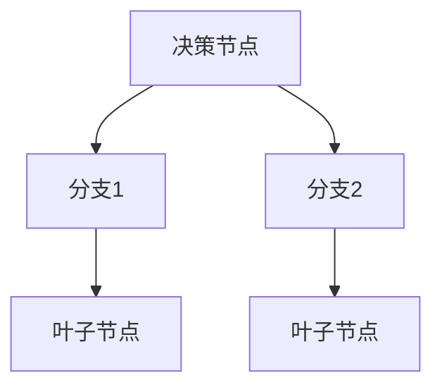
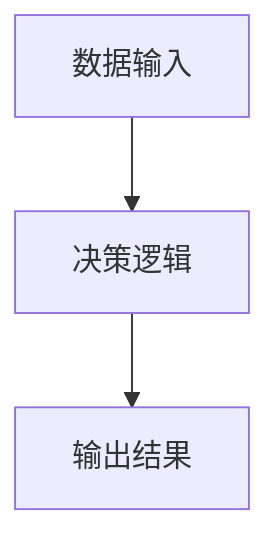
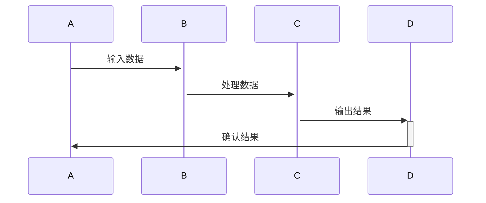

                 


# 可解释性设计：理解AI Agent的决策过程

## 关键词：  
AI Agent，可解释性设计，决策过程，强化学习，决策树，系统架构

## 摘要：  
本文深入探讨了AI Agent的决策过程及其可解释性设计的核心要素。从基本概念到算法原理，从系统架构到实际应用，全面解析了如何理解并实现AI Agent的可解释性设计。通过具体的案例分析和算法实现，详细阐述了可解释性设计的方法论和最佳实践，为读者提供了清晰的理论框架和实践指南。

---

# 第一部分：可解释性设计的引言

## 第1章：可解释性设计的基本概念

### 1.1 问题背景与定义  
#### 1.1.1 AI Agent决策过程的复杂性  
- AI Agent的决策过程涉及多维度的输入和复杂的计算逻辑。  
- 从感知到行动的链式反应中，如何保持决策的透明性和可追溯性？  

#### 1.1.2 可解释性设计的重要性  
- 用户对AI决策的信任依赖于可解释性。  
- 可解释性设计是AI系统合规性和伦理性的基础。  

#### 1.1.3 可解释性设计的核心目标  
- 提供清晰的决策路径。  
- 确保决策过程的可验证性和可追溯性。  

### 1.2 AI Agent决策过程的背景  
#### 1.2.1 AI Agent的基本概念  
- 定义：AI Agent是具有自主决策能力的智能体。  
- 核心功能：感知环境、目标设定、决策制定。  

#### 1.2.2 决策过程的关键要素  
- 输入数据：感知数据、状态信息。  
- 决策逻辑：规则、模型或算法。  
- 输出行动：基于决策的结果。  

#### 1.2.3 可解释性在AI Agent中的作用  
- 通过可解释性增强用户信任。  
- 通过可解释性优化决策逻辑。  

### 1.3 本章小结  
- 介绍了AI Agent的基本概念和决策过程的核心要素。  
- 强调了可解释性设计在AI Agent中的重要性。  

---

# 第二部分：AI Agent的决策过程分析

## 第2章：AI Agent的决策模型与算法  

### 2.1 基础决策模型  
#### 2.1.1 逻辑推理模型  
- 基于规则的决策：简单、可解释性强。  
- 示例：医疗诊断中的基于规则的决策系统。  

#### 2.1.2 基于规则的决策模型  
- 优点：规则明确，易于解释。  
- 缺点：规则复杂时维护成本高。  

#### 2.1.3 基于概率的决策模型  
- 优势：能够处理不确定性。  
- 示例：医疗诊断中的概率推理模型。  

### 2.2 现代AI Agent决策算法  
#### 2.2.1 强化学习算法  
- 核心思想：通过与环境的交互学习最优策略。  
- 示例：Q-learning算法。  

#### 2.2.2 深度学习模型  
- 优势：处理高维数据能力强。  
- 示例：基于神经网络的决策模型。  

#### 2.2.3 迁移学习与联合学习  
- 通过迁移学习提升决策效率。  
- 示例：联合学习在推荐系统中的应用。  

### 2.3 算法原理与流程图  
#### 2.3.1 强化学习算法的数学模型  
$$ V(s) = \max_a Q(s,a) $$  

#### 2.3.2 决策树算法的流程图  


## 第3章：可解释性模型的构建  

### 3.1 可解释性模型的分类  
#### 3.1.1 基于规则的可解释性模型  
- 优点：规则清晰，易于解释。  
- 示例：基于规则的医疗诊断系统。  

#### 3.1.2 基于树的可解释性模型  
- 优点：决策路径直观。  
- 示例：决策树在金融风控中的应用。  

#### 3.1.3 基于符号的可解释性模型  
- 优点：符号化表达易于理解。  
- 示例：基于符号推理的法律决策系统。  

### 3.2 可解释性评估方法  
#### 3.2.1 透明度评估  
- 评估决策过程的透明度。  
- 示例：基于规则的模型透明度高。  

#### 3.2.2 一致性评估  
- 评估决策结果的一致性。  
- 示例：同一输入多次决策结果一致。  

#### 3.2.3 可靠性评估  
- 评估决策过程的可靠性。  
- 示例：基于概率模型的决策可靠性评估。  

### 3.3 算法实现与比较  
#### 3.3.1 线性回归模型  
- 优点：简单、可解释性强。  
- 示例：房价预测中的线性回归模型。  

#### 3.3.2 决策树模型  
- 优点：决策路径直观，易于解释。  
- 示例：医疗诊断中的决策树模型。  

#### 3.3.3 对比分析与优缺点  
- 线性回归模型的可解释性强，但对非线性关系的处理能力有限。  
- 决策树模型的可解释性高，但决策边界不够清晰。  

---

# 第四部分：实际应用与案例分析  

## 第4章：可解释性设计的系统架构  

### 4.1 问题场景介绍  
#### 4.1.1 医疗诊断中的可解释性设计  
- 患者病例分析中的决策过程。  
- 可解释性设计的必要性。  

#### 4.1.2 金融风控中的可解释性设计  
- 信用评估中的决策过程。  
- 可解释性设计的合规性要求。  

### 4.2 系统功能设计  
#### 4.2.1 系统功能模块划分  
- 数据输入模块。  
- 决策逻辑模块。  
- 输出结果模块。  

#### 4.2.2 系统功能流程图  


### 4.3 系统架构设计  
#### 4.3.1 系统架构图  


#### 4.3.2 系统接口设计  
- 数据接口：输入数据格式与接口定义。  
- 结果接口：输出结果的格式与接口定义。  

### 4.4 系统交互序列图  


## 第5章：可解释性设计的项目实战  

### 5.1 环境安装与配置  
#### 5.1.1 安装Python环境  
- 使用Anaconda或虚拟环境。  
- 安装必要的库：numpy, pandas, scikit-learn。  

#### 5.1.2 安装AI框架  
- 安装TensorFlow或PyTorch。  
- 配置GPU环境（可选）。  

### 5.2 系统核心实现  
#### 5.2.1 可解释性模型实现  
- 实现一个基于规则的决策系统。  
- 代码示例：  
```python
def decision_rule(input_data):
    if input_data['age'] < 18:
        return '拒绝'
    elif input_data['score'] < 60:
        return '拒绝'
    else:
        return '接受'
```

#### 5.2.2 决策树模型实现  
- 使用scikit-learn库实现决策树。  
- 代码示例：  
```python
from sklearn.tree import DecisionTreeClassifier
model = DecisionTreeClassifier()
model.fit(X_train, y_train)
```

### 5.3 代码应用解读与分析  
#### 5.3.1 代码功能分析  
- 分析决策树模型的决策路径。  
- 示例：医疗诊断中的决策树模型。  

#### 5.3.2 代码实现细节  
- 代码中的关键参数设置。  
- 代码的可扩展性和可维护性。  

### 5.4 实际案例分析  
#### 5.4.1 医疗诊断案例  
- 患者病例分析。  
- 决策过程的可解释性展示。  

#### 5.4.2 金融风控案例  
- 信用评估中的决策过程。  
- 可解释性设计的实际应用。  

## 第6章：可解释性设计的未来趋势与挑战  

### 6.1 可解释性设计的未来趋势  
#### 6.1.1 更复杂的模型与可解释性设计的结合  
- 如何在复杂的模型中保持可解释性。  
- 示例：图神经网络的可解释性设计。  

#### 6.1.2 多模态数据的可解释性设计  
- 如何在多模态数据中实现可解释性设计。  
- 示例：图像识别与自然语言处理的结合。  

### 6.2 可解释性设计的挑战  
#### 6.2.1 技术挑战  
- 复杂模型的可解释性设计难度。  
- 多模态数据的处理与解释。  

#### 6.2.2 伦理与法律挑战  
- 可解释性设计的合规性要求。  
- 数据隐私与可解释性设计的平衡。  

### 6.3 本章小结  
- 总结了可解释性设计的未来发展趋势。  
- 提出了当前面临的主要挑战。  

---

# 第五部分：总结与展望  

## 第7章：总结与展望  

### 7.1 本章总结  
- 回顾了可解释性设计的核心概念与实现方法。  
- 强调了可解释性设计在实际应用中的重要性。  

### 7.2 未来展望  
- 可解释性设计在AI Agent中的进一步研究。  
- 多模态数据与复杂模型的可解释性设计。  

### 7.3 最佳实践 tips  
- 在实际项目中优先选择可解释性设计。  
- 定期评估系统的可解释性与合规性。  

### 7.4 本章小结  
- 本文为读者提供了可解释性设计的全面解析。  
- 展望了未来的研究方向与挑战。  

---

# 关键词：  
AI Agent，可解释性设计，决策过程，强化学习，决策树，系统架构

# 摘要：  
本文深入探讨了AI Agent的决策过程及其可解释性设计的核心要素。从基本概念到算法原理，从系统架构到实际应用，全面解析了如何理解并实现AI Agent的可解释性设计。通过具体的案例分析和算法实现，详细阐述了可解释性设计的方法论和最佳实践，为读者提供了清晰的理论框架和实践指南。

