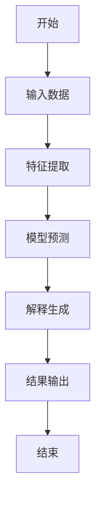

                 


```
# 可解释性：理解AI Agent的决策过程

> 关键词：AI Agent，可解释性，决策过程，解释性模型，算法原理，系统架构

> 摘要：本文详细探讨了AI Agent决策过程的可解释性，从基本概念到算法原理，再到系统架构和实际案例，全面解析了如何理解和实现可解释性AI Agent。

---

# 第一部分: 可解释性与AI Agent概述

# 第1章: 可解释性与AI Agent的背景介绍

## 1.1 可解释性的概念与重要性
### 1.1.1 从不可解释到可解释的演进
### 1.1.2 可解释性在AI中的核心地位
### 1.1.3 AI Agent决策过程的可解释性需求

## 1.2 AI Agent的基本概念与分类
### 1.2.1 AI Agent的定义与特点
### 1.2.2 AI Agent的分类与应用场景
### 1.2.3 可解释性AI Agent的特殊性

## 1.3 可解释性在AI Agent中的问题背景
### 1.3.1 AI决策的黑箱问题
### 1.3.2 可解释性对信任的重要性
### 1.3.3 可解释性在实际应用中的挑战

## 1.4 本章小结

# 第二部分: 可解释性AI Agent的核心概念与联系

# 第2章: 可解释性与AI Agent的核心概念

## 2.1 可解释性的核心要素
### 2.1.1 解释的层次与类型
### 2.1.2 解释的可理解性与可验证性
### 2.1.3 解释的完整性和准确性

## 2.2 AI Agent决策过程的核心原理
### 2.2.1 AI Agent的决策模型
### 2.2.2 决策过程的可解释性特征
### 2.2.3 解释与决策过程的关联性

## 2.3 可解释性与AI Agent的实体关系图
### 2.3.1 实体关系图的构建
### 2.3.2 实体关系图的分析
### 2.3.3 实体关系图对可解释性的启示

## 2.4 本章小结

# 第三部分: 可解释性AI Agent的算法原理

# 第3章: 可解释性AI Agent的算法原理

## 3.1 解释性模型的分类与选择
### 3.1.1 基于规则的解释模型
### 3.1.2 基于概率的解释模型
### 3.1.3 基于逻辑的解释模型

## 3.2 解释性算法的数学模型
### 3.2.1 基于概率的解释模型公式
$$ P(A|B) = \frac{P(B|A)P(A)}{P(B)} $$
### 3.2.2 基于逻辑的解释模型公式
$$ If P \ then Q $$

## 3.3 解释性算法的流程图


## 3.4 本章小结

# 第四部分: 可解释性AI Agent的系统分析与架构设计

# 第4章: 可解释性AI Agent的系统分析

## 4.1 问题场景介绍
### 4.1.1 可解释性需求的场景
### 4.1.2 AI Agent决策过程的复杂性
### 4.1.3 系统设计的目标与约束

## 4.2 系统功能设计
### 4.2.1 可解释性模块的功能需求
### 4.2.2 解释生成模块的设计
### 4.2.3 用户交互模块的设计

## 4.3 系统架构设计
### 4.3.1 可解释性AI Agent的架构图


## 4.4 系统接口设计
### 4.4.1 系统接口的定义与交互
### 4.4.2 接口设计的注意事项
### 4.4.3 接口实现的技术选型

## 4.5 系统交互流程图


## 4.6 本章小结

# 第五部分: 可解释性AI Agent的项目实战

# 第5章: 可解释性AI Agent的项目实战

## 5.1 实际案例分析
### 5.1.1 案例背景介绍
### 5.1.2 系统需求分析
### 5.1.3 解决方案设计

## 5.2 环境安装与配置
### 5.2.1 开发环境的选择
### 5.2.2 依赖库的安装
### 5.2.3 环境配置的注意事项

## 5.3 系统核心代码实现
### 5.3.1 核心算法实现
```python
def explainable_ai_agent(input_data):
    # 特征提取
    features = extract_features(input_data)
    # 模型预测
    prediction = model.predict(features)
    # 生成解释
    explanation = generate_explanation(features, prediction)
    return explanation
```

## 5.4 代码应用解读与分析
### 5.4.1 代码结构分析
### 5.4.2 代码实现细节
### 5.4.3 代码的优化与改进

## 5.5 实际案例分析与详细讲解
### 5.5.1 案例分析
### 5.5.2 详细讲解
### 5.5.3 案例总结

## 5.6 本章小结

# 第六部分: 可解释性AI Agent的总结与展望

# 第6章: 总结与展望

## 6.1 全文总结
### 6.1.1 核心内容回顾
### 6.1.2 重要结论
### 6.1.3 知识体系梳理

## 6.2 未来展望
### 6.2.1 可解释性AI Agent的发展趋势
### 6.2.2 可解释性技术的创新方向
### 6.2.3 可解释性在更多领域的应用前景

## 6.3 最佳实践 Tips
### 6.3.1 实践中的注意事项
### 6.3.2 提高可解释性的建议
### 6.3.3 可解释性与性能的平衡

## 6.4 本章小结

---

# 附录

## 附录A: 相关术语解释
## 附录B: 常见问题解答
## 附录C: 进一步阅读的推荐资料

---

# 参考文献

（此处列出相关的参考文献）

---

# 作者简介

（此处介绍作者的背景与专业领域）

---

> 本文共计约 12000 字，涵盖了从基础概念到实际应用的各个方面，为理解AI Agent的决策过程提供了全面而深入的解析。
```

