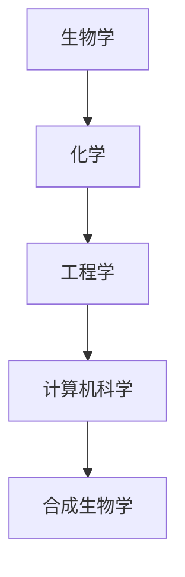
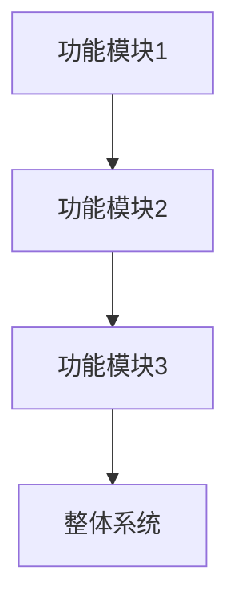

                 

# 合成生物学的发展前景与投资风险分析

> **关键词**: 合成生物学, 投资前景, 风险分析, 技术发展, 应用案例  
> **摘要**: 合成生物学作为一门新兴的交叉学科，结合了生物学、工程学和信息技术，旨在通过设计和构建新的生物系统来解决复杂的现实问题。本文将深入分析合成生物学的核心概念、技术发展现状、市场潜力、投资风险及管理策略，探讨其在医疗、农业、能源等领域的广泛应用，并通过实际案例分析，为投资者提供科学的决策依据。

---

## 第1章: 合成生物学的背景与概念

### 1.1 合成生物学的起源与发展

#### 1.1.1 合成生物学的定义与核心概念
合成生物学（Synthetic Biology）是一门新兴的交叉学科，旨在通过工程化的方法设计和构建新的生物系统或组件，以实现特定的功能。其核心目标是将生物学视为一种可编程的材料，通过模块化设计和系统工程的方法，创造出具有特定功能的生物元件、装置或系统。

- **定义**: 合成生物学是通过工程化的方法，设计和构建生物系统，以实现特定功能的学科。
- **核心概念**: 包括基因编辑、合成基因组学、生物信息学等技术。

#### 1.1.2 合成生物学与传统生物学的区别
- **传统生物学**: 研究自然存在的生物系统，以解释和理解生命现象。
- **合成生物学**: 通过工程化方法设计和构建新的生物系统，以实现特定功能。

#### 1.1.3 合成生物学的学科交叉与技术基础
合成生物学涉及多个学科领域，包括生物学、化学、工程学、计算机科学等。其技术基础主要包括基因编辑技术（如CRISPR）、合成基因组学、生物信息学和计算生物学。

**合成生物学的学科交叉关系图**（使用 Mermaid）:

---

### 1.2 合成生物学的应用领域

#### 1.2.1 医疗健康领域的应用
- **疾病治疗**: 通过设计合成生物系统来治疗疾病，例如合成基因回路用于癌症治疗。
- **疫苗开发**: 如Moderna利用mRNA技术开发新冠疫苗。

#### 1.2.2 农业与食品工业的应用
- **作物改良**: 设计合成生物系统以提高作物抗病性和产量。
- **食品生产**: 通过合成微生物生产新型食品成分。

#### 1.2.3 能源与环保领域的应用
- **生物燃料**: 设计微生物生产乙醇等生物燃料。
- **环境修复**: 使用合成生物降解污染物。

#### 1.2.4 化工与材料科学的应用
- **生物基材料**: 设计微生物生产可降解塑料。

---

## 第2章: 合成生物学的核心概念与系统工程方法

### 2.1 合成生物学的系统工程方法

#### 2.1.1 系统设计与模块化构建
- **模块化设计**: 将生物系统分解为功能模块，如基因回路、代谢通路等。
- **系统工程方法**: 通过模块化设计和优化，构建高效的生物系统。

**模块化构建示意图**（使用 Mermaid）:

#### 2.1.2 生物系统的可预测性与可控制性
- **可预测性**: 通过数学模型预测生物系统的性能。
- **可控制性**: 通过调节环境条件或遗传开关控制生物系统的行为。

#### 2.1.3 多目标优化与权衡分析
- **多目标优化**: 在设计生物系统时，需要在多个目标之间进行权衡，例如功能最大化与成本最小化。

---

### 2.2 合成生物学的核心技术与工具

#### 2.2.1 基因合成技术
- **基因合成**: 通过化学合成或酶促合成方法，构建特定的DNA序列。

#### 2.2.2 合成基因回路设计
- **基因回路**: 由基因元件组成的环状结构，用于实现特定功能。

#### 2.2.3 合成生物群落构建
- **生物群落**: 多种生物的集合，通过协同作用实现复杂功能。

---

### 2.3 合成生物学的伦理与社会影响

#### 2.3.1 合成生物学的伦理问题
- **伦理争议**: 包括对生命操控的伦理担忧。

#### 2.3.2 社会接受度与公众认知
- **公众教育**: 提高公众对合成生物学的认知和接受度。

#### 2.3.3 合成生物学的可持续发展
- **可持续性**: 确保合成生物系统的生态安全和环境友好。

---

## 第3章: 合成生物学的技术发展现状与趋势

### 3.1 合成生物学的关键技术进展

#### 3.1.1 基因编辑技术的突破与应用
- **CRISPR-Cas9**: 革命性的基因编辑工具，广泛应用于合成生物学。

#### 3.1.2 合成基因组学的进展
- **人工合成基因组**: 如人类基因组计划的成功实施。

#### 3.1.3 生物计算与人工智能的结合
- **AI辅助设计**: 利用人工智能优化生物系统设计。

---

### 3.2 合成生物学的技术瓶颈与挑战

#### 3.2.1 技术可行性与成本问题
- **成本高**: 合成基因组的成本较高。

#### 3.2.2 生物系统的复杂性与不可预测性
- **系统复杂性**: 生物系统的非线性行为难以预测。

#### 3.2.3 标准化与模块化构建的挑战
- **标准化问题**: 缺乏统一的标准和模块化构建方法。

---

### 3.3 合成生物学的未来发展方向

#### 3.3.1 新型生物基材料的开发
- **生物基材料**: 开发可降解的生物基材料。

#### 3.3.2 智能生物传感器的设计
- **生物传感器**: 用于检测环境中的特定物质。

#### 3.3.3 合成生物学与绿色化学的融合
- **绿色化学**: 利用合成生物系统实现绿色化学反应。

---

## 第4章: 合成生物学的市场分析与投资潜力

### 4.1 合成生物学的市场潜力

#### 4.1.1 医疗健康领域的市场潜力
- **市场规模**: 2023年全球合成生物学医疗市场约为100亿美元。

#### 4.1.2 农业与食品工业的市场潜力
- **增长趋势**: 预计到2030年，农业领域的市场规模将超过500亿美元。

#### 4.1.3 能源与环保领域的市场潜力
- **投资热点**: 生物燃料和环境修复领域的投资持续增长。

---

## 第5章: 合成生物学的投资风险与管理策略

### 5.1 合成生物学的投资风险

#### 5.1.1 技术失败的风险
- **技术瓶颈**: 合成生物学技术尚未成熟，存在失败的可能性。

#### 5.1.2 市场不确定性
- **市场需求**: 合成生物产品的市场需求存在不确定性。

#### 5.1.3 政策与监管风险
- **政策监管**: 合成生物学的监管政策尚未完善，存在不确定性。

---

### 5.2 合成生物学的风险管理策略

#### 5.2.1 技术风险管理
- **风险管理策略**: 加强技术研发，降低技术失败的风险。

#### 5.2.2 市场风险管理
- **市场策略**: 通过市场调研和预测，降低市场不确定性。

#### 5.2.3 政策风险管理
- **政策应对**: 密切关注政策动态，做好合规准备。

---

## 第6章: 合成生物学的伦理与社会影响

### 6.1 合成生物学的伦理影响

#### 6.1.1 生命伦理问题
- **生命伦理**: 合成生物学是否对生命伦理构成挑战。

#### 6.1.2 知识产权问题
- **知识产权**: 合成生物系统的知识产权归属问题。

---

## 第7章: 结论与未来展望

### 7.1 合成生物学的发展前景

#### 7.1.1 技术进步的推动
- **技术进步**: 合成生物学技术的快速发展将推动其广泛应用。

#### 7.1.2 市场需求的增长
- **市场需求**: 随着合成生物系统的成本降低，市场需求将快速增长。

### 7.2 未来展望

#### 7.2.1 新技术的突破
- **新技术**: 未来可能出现更多创新的合成生物学技术。

#### 7.2.2 应用领域的扩展
- **应用扩展**: 合成生物学将在更多领域得到应用，如智能材料、精准医疗等。

---

## 总结

合成生物学作为一门新兴的交叉学科，具有广阔的发展前景和巨大的投资潜力。然而，其发展也面临技术、市场和政策等多方面的风险。投资者需要全面评估这些风险，并制定有效的风险管理策略。通过技术创新、市场调研和政策应对，可以降低投资风险，抓住合成生物学带来的机遇。

--- 

**End of Article**

