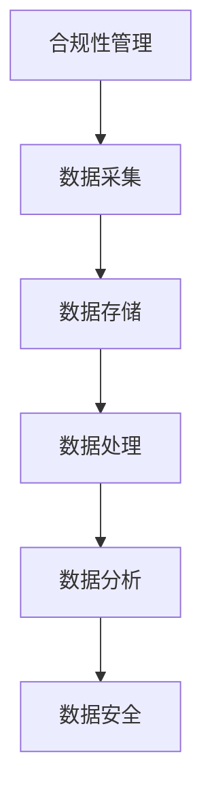
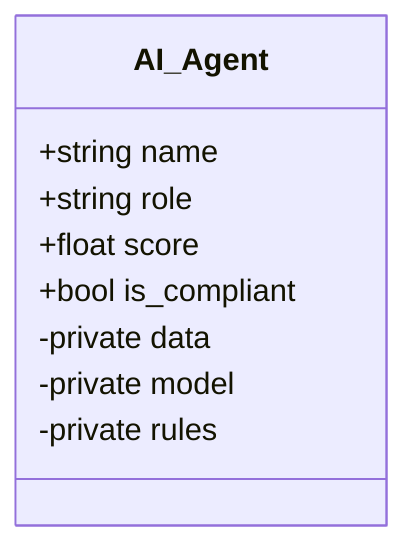
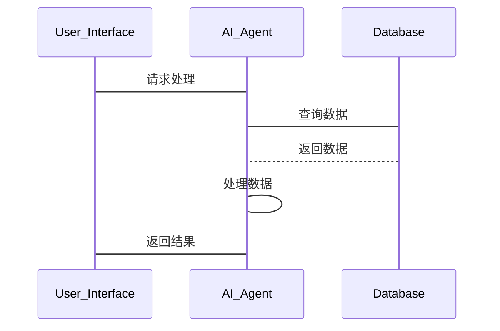

                 


# 合规性管理：确保AI Agent符合法规要求

## 关键词：AI Agent，合规性管理，数据隐私，算法透明性，法律框架

## 摘要：本文将详细探讨如何确保AI Agent在设计和运行过程中符合相关法律法规和伦理标准。通过分析合规性管理的核心概念、算法原理、系统架构以及实际案例，本文旨在为AI开发者和管理者提供一套系统化的合规性管理方法论，帮助他们更好地应对AI技术带来的法律挑战。

---

# 第一部分: 合规性管理概述

## 第1章: 合规性管理的核心概念

### 1.1 合规性管理的背景与意义

#### 1.1.1 合规性管理的定义与内涵
合规性管理是指确保组织或系统的行为符合相关法律法规、行业标准和伦理规范的过程。在AI Agent领域，合规性管理的核心目标是确保AI系统的输出和行为符合法律和伦理要求，避免因技术滥用或误用导致的法律风险。

#### 1.1.2 AI Agent与合规性管理的关系
AI Agent是一种能够自主决策和执行任务的智能体。由于其决策过程依赖算法，可能存在偏见、歧视或隐私泄露等问题，这些都可能违反相关法律法规。因此，合规性管理在AI Agent的设计、开发和部署过程中至关重要。

#### 1.1.3 合规性管理的重要性与挑战
随着AI技术的广泛应用，合规性管理的重要性日益凸显。不合规的AI Agent可能导致企业面临法律诉讼、罚款甚至声誉损失。然而，AI Agent的复杂性和动态性也带来了合规性管理的挑战，例如如何确保算法的透明性和可解释性。

### 1.2 AI Agent的定义与特点

#### 1.2.1 AI Agent的基本概念
AI Agent是一种智能体，能够感知环境、做出决策并执行任务。它可以分为简单反射式Agent、基于模型的反应式Agent、目标驱动式Agent和效用驱动式Agent。

#### 1.2.2 AI Agent的核心技术特征
AI Agent的核心技术特征包括：
- 数据处理能力：能够处理结构化和非结构化的数据。
- 学习能力：能够通过数据学习和优化模型。
- 决策能力：能够基于数据和模型做出决策。
- 自适应能力：能够根据环境变化调整行为。

#### 1.2.3 AI Agent与传统软件的区别
与传统软件相比，AI Agent具有以下区别：
- 自主性：AI Agent能够自主决策，而传统软件通常需要人工干预。
- 学习能力：AI Agent能够通过数据不断优化，而传统软件通常固定不变。
- 复杂性：AI Agent的设计和运行涉及多个学科，而传统软件通常较为简单。

### 1.3 合规性管理的法律框架

#### 1.3.1 数据隐私与保护的法律要求
数据隐私是合规性管理的重要组成部分。相关法律包括《通用数据保护条例》（GDPR）和《加州消费者隐私法案》（CCPA），这些法律要求企业在处理个人数据时必须获得用户授权，并确保数据的安全性。

#### 1.3.2 人工智能的伦理规范
人工智能的伦理规范包括算法的透明性、公平性、可解释性和隐私保护。例如，欧盟提出的《人工智能法案》要求企业确保AI系统的透明性和可解释性。

#### 1.3.3 国际与国内的合规性法规对比
不同国家和地区的合规性法规存在差异。例如，欧盟的GDPR对数据隐私要求较为严格，而美国则采取分行业监管的方式。了解这些差异对于设计跨国界的AI Agent至关重要。

## 1.4 本章小结
本章从合规性管理的定义、AI Agent的核心概念以及法律框架三个方面进行了探讨，为后续章节的分析奠定了基础。

---

# 第二部分: 合规性管理的核心概念与联系

## 第2章: 合规性管理的原理与方法

### 2.1 合规性管理的原理

#### 2.1.1 合规性管理的基本原则
合规性管理的基本原则包括：
- 合法性：确保所有行为符合相关法律法规。
- 透明性：确保AI系统的决策过程可被理解和追溯。
- 可解释性：确保AI系统的决策过程能够被人类解释。
- 数据安全：确保数据的机密性、完整性和可用性。

#### 2.1.2 AI Agent合规性管理的实施步骤
AI Agent合规性管理的实施步骤包括：
1. **需求分析**：明确合规性管理的目标和范围。
2. **风险评估**：识别可能的法律风险和伦理问题。
3. **合规性设计**：在设计阶段融入合规性要求。
4. **合规性测试**：对AI Agent进行合规性测试，确保其符合相关法规。
5. **持续监控**：定期检查和更新合规性管理策略。

#### 2.1.3 合规性管理的评估标准
合规性管理的评估标准包括：
- 合规性：是否符合相关法律法规和伦理规范。
- 透明性：是否能够解释AI系统的决策过程。
- 可靠性：是否能够保证AI系统的输出符合预期。
- 安全性：是否能够保护用户数据的安全。

### 2.2 合规性管理的核心要素

#### 2.2.1 数据收集与处理的合规性
数据收集与处理是AI Agent合规性管理的关键环节。企业必须确保数据收集的合法性、授权性和目的性。例如，使用GDPR框架时，必须明确告知用户数据收集的目的，并获得用户的同意。

#### 2.2.2 AI算法的透明性与可解释性
AI算法的透明性和可解释性是合规性管理的重要要求。企业需要确保AI算法的决策过程能够被人类理解和解释。例如，使用可解释性机器学习技术（如线性模型或决策树）可以提高算法的透明性。

#### 2.2.3 用户隐私与数据安全
用户隐私与数据安全是合规性管理的核心要素。企业必须采取措施保护用户数据，防止数据泄露和滥用。例如，使用加密技术、访问控制和数据脱敏技术可以有效保护用户数据。

### 2.3 合规性管理的系统架构

#### 2.3.1 合规性管理的系统组成
合规性管理的系统组成包括：
- 数据采集模块：负责收集和处理用户数据。
- 数据存储模块：负责存储和管理用户数据。
- 数据处理模块：负责对数据进行清洗和预处理。
- 数据分析模块：负责分析数据并生成决策。
- 数据安全模块：负责保护数据的安全性。

#### 2.3.2 合规性管理的流程图（Mermaid）


#### 2.3.3 合规性管理的核心要素对比表
| 要素       | 特性                       | 合规性要求                     |
|------------|----------------------------|--------------------------------|
| 数据收集   | 方式                       | 合法、授权、目的明确           |
| 数据处理   | 方法                       | 透明、可追溯、可解释           |
| 算法设计   | 原理                       | 可解释性、公平性、透明性       |
| 数据存储   | 安全性                     | 加密、访问控制、数据脱敏       |
| 数据分析   | 目的                       | 符合法律法规、伦理规范         |

### 2.4 合规性管理的Python实现

#### 2.4.1 数据隐私保护的Python代码
```python
def preprocess_data(data):
    # 数据脱敏处理
    data = data.apply(lambda x: x.replace(x['name'], '匿名') if x['name'] else x)
    return data
```

#### 2.4.2 算法透明性的Python代码
```python
from sklearn.tree import DecisionTreeClassifier
import joblib

# 使用可解释性模型（如决策树）
model = DecisionTreeClassifier()
model.fit(X_train, y_train)
joblib.dump(model, 'model.pkl')  # 保存模型以便解释
```

### 2.5 本章小结
本章从合规性管理的原理、核心要素和系统架构三个方面进行了详细探讨，为读者提供了系统化的合规性管理方法论。

---

# 第三部分: 合规性管理的算法原理

## 第3章: 合规性管理的算法实现

### 3.1 合规性评估的算法流程

#### 3.1.1 数据预处理
数据预处理是合规性评估的基础。通常包括数据清洗、数据转换和数据归约等步骤。

#### 3.1.2 算法选择
根据合规性评估的具体需求选择合适的算法。例如，使用逻辑回归模型评估数据隐私风险，使用决策树模型评估算法透明性。

#### 3.1.3 结果评估
对算法的输出进行评估，确保其符合合规性要求。例如，使用混淆矩阵评估分类模型的性能。

### 3.2 合规性评估的数学模型

#### 3.2.1 数据隐私保护的数学模型
$$ P(\text{数据泄露}) = \text{数据处理次数} \times \text{泄露概率} $$

#### 3.2.2 算法透明性的评估公式
$$ T(\text{算法}) = \frac{\text{可解释性分数}}{\text{算法复杂度}} $$

### 3.3 合规性管理的Python实现

#### 3.3.1 数据预处理代码
```python
import pandas as pd
from sklearn.preprocessing import StandardScaler

# 数据标准化处理
scaler = StandardScaler()
X_processed = scaler.fit_transform(X)
```

#### 3.3.2 算法选择代码
```python
from sklearn.ensemble import RandomForestClassifier
import joblib

# 使用随机森林模型进行分类
model = RandomForestClassifier()
model.fit(X_train, y_train)
joblib.dump(model, 'model.pkl')
```

### 3.4 本章小结
本章从合规性评估的算法流程、数学模型和Python实现三个方面进行了详细探讨，帮助读者理解合规性管理的技术实现。

---

# 第四部分: 合规性管理的系统架构设计

## 第4章: 合规性管理的系统架构

### 4.1 问题场景介绍

#### 4.1.1 问题背景
假设我们正在开发一个智能客服AI Agent，需要确保其在处理用户数据时符合GDPR和CCPA的要求。

#### 4.1.2 问题描述
AI Agent需要处理用户的个人信息，必须确保数据的隐私性和安全性。

### 4.2 系统功能设计

#### 4.2.1 领域模型（Mermaid类图）


#### 4.2.2 系统架构设计（Mermaid架构图）
```mermaid
C4Context
    container Database {
        database user_data.db
    }
    container Web_Server {
        - API Gateway
    }
    container AI_Agent {
        - Processing Logic
        - Model
    }
    container User_Interface {
        - Web Interface
    }
```

#### 4.2.3 系统接口设计
系统接口设计包括：
- 数据接口：负责与数据库交互，确保数据的安全性。
- API接口：负责与前端交互，提供合规性检查结果。

#### 4.2.4 系统交互流程（Mermaid序列图）


### 4.3 本章小结
本章从系统架构设计的角度，详细探讨了合规性管理的实现方案，为读者提供了系统化的架构设计方法。

---

# 第五部分: 合规性管理的项目实战

## 第5章: 项目实战

### 5.1 环境安装

#### 5.1.1 安装Python
```bash
python --version
pip install --upgrade pip
```

#### 5.1.2 安装依赖库
```bash
pip install pandas numpy scikit-learn joblib
```

### 5.2 系统核心实现源代码

#### 5.2.1 数据预处理代码
```python
import pandas as pd
from sklearn.preprocessing import StandardScaler

def preprocess_data(data):
    # 删除敏感字段
    data = data.drop(columns=['ssn', 'phone'])
    # 标准化处理
    scaler = StandardScaler()
    data_processed = scaler.fit_transform(data)
    return data_processed
```

#### 5.2.2 算法实现代码
```python
from sklearn.ensemble import RandomForestClassifier
import joblib

def train_model(X_train, y_train):
    model = RandomForestClassifier()
    model.fit(X_train, y_train)
    joblib.dump(model, 'model.pkl')
    return model
```

### 5.3 代码应用解读与分析

#### 5.3.1 数据预处理解读
数据预处理代码首先删除了敏感字段（如SSN和电话号码），然后对剩余数据进行了标准化处理，确保数据的隐私性和安全性。

#### 5.3.2 算法实现解读
算法实现代码使用随机森林模型进行分类，模型训练完成后保存为.pkl文件，以便后续使用。

### 5.4 实际案例分析

#### 5.4.1 案例背景
假设我们正在开发一个智能客服AI Agent，需要确保其在处理用户数据时符合GDPR和CCPA的要求。

#### 5.4.2 案例实现
```python
import pandas as pd
from sklearn.preprocessing import StandardScaler
from sklearn.ensemble import RandomForestClassifier
import joblib

# 数据预处理
data = pd.read_csv('user_data.csv')
data_processed = preprocess_data(data)

# 模型训练
X_train = data_processed.drop(columns=['label'])
y_train = data_processed['label']
model = train_model(X_train, y_train)
```

### 5.5 项目小结
本章通过实际案例展示了合规性管理的项目实施过程，帮助读者更好地理解和应用合规性管理的方法论。

---

# 第六部分: 最佳实践与总结

## 第6章: 最佳实践

### 6.1 合规性管理的注意事项
- 定期进行合规性检查和更新。
- 使用可解释性模型提高算法透明性。
- 加强数据安全保护，防止数据泄露。

### 6.2 小结
合规性管理是AI Agent设计和运行中的重要环节，必须贯穿整个生命周期。通过本文的探讨，我们希望读者能够更好地理解和应用合规性管理的方法论。

### 6.3 注意事项
- 确保数据的合法性和隐私性。
- 定期更新合规性管理策略。
- 加强团队的法律意识和合规性意识。

### 6.4 拓展阅读
- 《人工智能的法律与伦理》
- 《数据隐私保护的实践指南》
- 《可解释性机器学习：方法与应用》

---

# 附录: 合规性管理的常用工具

## 附录A: 数据隐私保护工具

### A.1 数据脱敏工具
- **OpenText**：提供数据脱敏和匿名化处理功能。
- **DataMasker**：支持多种数据脱敏方法，如替换、加密和删除。

### A.2 数据安全工具
- **BitLocker**：Windows系统内置的数据加密工具。
- ** VeraCrypt**：开源加密工具，支持多种加密算法。

## 附录B: 可解释性机器学习工具

### B.1 SHAP值
SHAP（Shapley Additive exPlanations）是一种解释模型预测结果的方法，广泛应用于可解释性机器学习。

### B.2 LIME
LIME（Local Interpretable Model-agnostic Explanations）是一种通过生成近似数据点来解释模型预测结果的方法。

---

# 结语
合规性管理是AI Agent设计和运行中的重要环节，必须贯穿整个生命周期。通过本文的探讨，我们希望读者能够更好地理解和应用合规性管理的方法论，确保AI Agent在设计和运行过程中符合相关法律法规和伦理标准。

--- 

希望这篇文章能满足您的需求！如果需要进一步调整或补充，请随时告诉我。

