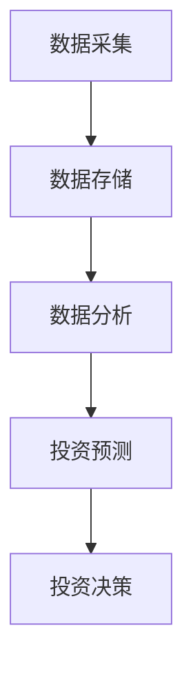

                 


# 后疫情时代的经济复苏投资主题

> 关键词：后疫情时代，经济复苏，投资主题，数字经济，绿色经济，医疗健康

> 摘要：后疫情时代，全球经济面临前所未有的挑战和机遇。本文从经济复苏的背景出发，分析后疫情时代的投资主题，探讨数字经济、绿色经济和医疗健康等领域的投资机会。通过系统分析和案例实战，为投资者提供科学的投资策略和方法。

---

## 第一部分：后疫情时代的经济复苏背景

### 第1章：疫情对全球经济的深远影响

#### 1.1 疫情对全球经济的冲击与重构

疫情的爆发对全球经济造成了深远的影响。从供应链中断到消费行为的改变，全球经济格局发生了翻天覆地的变化。各国政府纷纷出台刺激政策，推动经济复苏。疫情的冲击不仅影响了传统行业，还加速了数字化转型的进程。

#### 1.2 疫情对投资主题的重塑

疫情对投资主题的影响是深远的。传统行业如旅游、航空受到重创，而数字经济、绿色经济和医疗健康等行业却迎来了新的发展机遇。投资者需要重新审视投资策略，抓住新兴行业的投资机会。

#### 1.3 经济复苏的路径与挑战

全球经济复苏的路径充满了挑战。从供应链的恢复到消费市场的回暖，各国的政策支持和企业的调整是关键。疫情后，绿色经济和可持续发展成为全球经济复苏的重要驱动力。

---

## 第二部分：后疫情时代的投资主题分析

### 第2章：后疫情时代的经济特征与投资机会

#### 2.1 后疫情时代的经济特征

后疫情时代，全球经济的特征发生了显著变化。数字经济的崛起、绿色经济的发展以及医疗健康的持续增长成为主要趋势。这些变化为投资者提供了新的机会。

#### 2.2 投资主题的分类与分析

数字经济、绿色经济和医疗健康是后疫情时代的主要投资主题。数字经济领域包括人工智能、大数据和云计算；绿色经济包括新能源和环保技术；医疗健康包括生物技术和医疗服务。

#### 2.3 投资主题的动态变化

投资主题在后疫情时代处于动态变化中。消费行为的改变、政策的支持以及技术的进步都在推动投资主题的演变。投资者需要密切关注市场动态，抓住新兴机会。

---

## 第三部分：投资主题的系统分析与架构设计

### 第3章：投资主题的系统分析

#### 3.1 投资主题的系统架构

投资主题的系统架构包括数据采集、分析、预测和决策模块。通过系统的构建，投资者可以更好地把握市场趋势和投资机会。

#### 3.2 投资主题的系统架构图



#### 3.3 投资主题的系统接口设计

系统的接口设计需要考虑数据的输入输出和模块之间的交互。通过合理的接口设计，确保系统的高效运行和数据的准确传输。

---

## 第四部分：投资主题的算法原理与数学模型

### 第4章：投资主题的算法原理

#### 4.1 投资主题的算法原理

时间序列分析是一种常用的算法，用于预测经济趋势。通过历史数据的分析，投资者可以预测未来的市场走势。

#### 4.2 投资主题的数学模型

时间序列分析的数学模型如下：

$$
\hat{y}_t = \alpha + \beta t + \epsilon_t
$$

其中，$\hat{y}_t$ 是预测值，$\alpha$ 是截距，$\beta$ 是斜率，$t$ 是时间，$\epsilon_t$ 是误差项。

---

## 第五部分：投资主题的项目实战

### 第5章：投资主题的项目实战

#### 5.1 项目背景与目标

本项目旨在通过系统分析和算法模型，识别后疫情时代的投资机会。通过实战案例，为投资者提供科学的投资策略。

#### 5.2 项目核心实现

以下是时间序列分析的Python代码：

```python
import pandas as pd
from statsmodels.tsa.arima.model import ARIMA
import matplotlib.pyplot as plt

# 加载数据
data = pd.read_csv('economic_data.csv')

# 拟合ARIMA模型
model = ARIMA(data['value'], order=(1, 1, 1))
model_fit = model.fit()

# 预测未来值
forecast = model_fit.forecast(steps=5)

# 绘制预测结果
plt.plot(data.index, data['value'], label='实际值')
plt.plot(forecast.index, forecast.values, label='预测值')
plt.legend()
plt.show()
```

---

## 第六部分：总结与展望

### 6.1 总结

后疫情时代，全球经济复苏的投资主题主要集中在数字经济、绿色经济和医疗健康领域。通过系统的分析和算法的应用，投资者可以更好地把握市场趋势和投资机会。

### 6.2 展望

未来，随着技术的进步和政策的支持，投资主题将继续演变。投资者需要保持敏锐的洞察力，抓住新兴行业的投资机会。

---

## 附录

### 附录A：数据来源与工具推荐

- 数据来源：世界银行、国际货币基金组织等官方数据。
- 工具推荐：Python、R、Excel等数据分析工具。

### 附录B：相关法规与政策解读

- 疫情后各国政府出台的经济刺激政策。
- 可持续发展相关法规。

---

通过以上分析，我们为投资者提供了后疫情时代经济复苏的投资主题和科学的投资策略。希望本文能够为投资者在后疫情时代的投资决策提供有价值的参考和指导。

