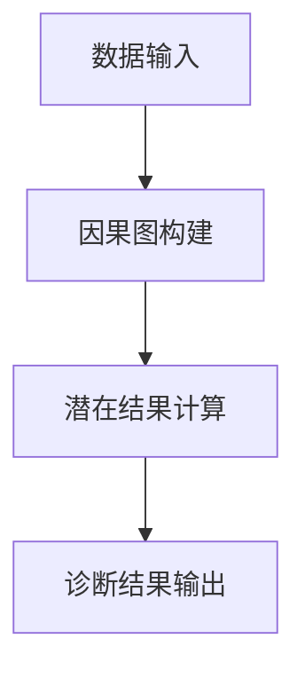

                 


# 因果推断：增强AI Agent的因果理解

---

## 关键词：因果推断、AI Agent、因果关系、因果图、潜在结果、干预、反事实

---

## 摘要

因果推断是理解AI Agent行为背后的根本原因的关键。本文深入探讨了因果推断的核心概念、算法原理、数学模型及其在AI Agent中的应用。通过因果图、潜在结果和干预等工具，我们能够帮助AI Agent更好地理解因果关系，从而做出更智能的决策。本文还结合实际案例，展示了如何通过因果推断提升AI Agent的因果理解能力。

---

## 第一部分: 因果推断的基础

### 第1章: 因果推断的基本概念

#### 1.1 因果关系的定义与背景

因果关系是指一个事件是另一个事件发生的原因。在AI Agent中，因果推断帮助我们理解“为什么”某个事件发生，而不是仅仅观察到“什么”发生了。例如，当AI Agent观察到用户点击了一个产品后，因果推断可以帮助它理解用户点击的原因（因果）而不是仅仅记录点击行为（相关性）。

#### 1.2 因果推断的核心问题

在AI Agent中，因果推断的核心问题包括：

- **因果图的构建**：如何从数据中学习因果关系的结构。
- **潜在结果的估计**：如何估计在不同干预下的结果。
- **反事实推理**：如何推理“如果”情况下的结果。

---

### 第2章: 因果关系的数学模型

#### 2.1 因果图模型

因果图（Directed Acyclic Graph, DAG）是因果推断的核心工具。它通过有向边表示变量之间的因果关系。例如，假设我们有变量X、Y和Z，其中X影响Y，Y又影响Z。因果图可以表示为X → Y → Z。

#### 2.2 潜在结果与干预

潜在结果是指在给定干预下某个变量的值。例如，如果我们在因果图中干预X，那么潜在结果就是Y在X被设置为特定值时的值。

#### 2.3 因果关系的数学公式

因果关系可以通过概率分布来表示。例如，给定因果图X → Y → Z，我们可以写出Y的条件概率公式：

$$ P(Y | do(X)) = P(Y | X) $$

其中，$do(X)$表示对X进行干预。

---

### 第3章: 因果推断的核心算法

#### 3.1 结构学习

结构学习的目标是根据数据学习因果图的结构。常见的方法包括：

- **基于评分的结构学习**：通过评分函数评估每个可能的结构，选择最优结构。
- **基于约束的结构学习**：通过测试数据中的独立性条件来构建因果图。

#### 3.2 参数估计

参数估计的目标是估计因果图中的参数。例如，我们可以使用最大似然估计或贝叶斯估计来估计参数。

#### 3.3 算法实现

以下是基于评分的结构学习算法的伪代码示例：

```python
def structure_learning(data, scoring_function):
    best_score = -infinity
    best_structure = None
    for each possible structure in all_structures:
        score = scoring_function(data, structure)
        if score > best_score:
            best_score = score
            best_structure = structure
    return best_structure
```

---

### 第4章: 因果推断的数学模型与公式

因果关系的数学模型可以通过因果图来表示。例如，因果图X → Y的条件概率公式为：

$$ P(Y | X) = \frac{P(Y, X)}{P(X)} $$

干预分布的识别条件可以通过因果图的后门准则来判断。例如，如果一个节点Y的所有后门都满足可测量条件，则可以识别干预分布：

$$ P(Y | do(X)) = \frac{P(Y, X)}{P(X)} $$

反事实推理的数学模型可以表示为：

$$ P(Y | do(X), X') = \frac{P(Y, X', X)}{P(X')} $$

---

## 第二部分: 因果推断在AI Agent中的应用

### 第4章: 系统分析与架构设计

#### 4.1 问题场景介绍

在医疗领域，AI Agent需要根据患者的症状和检查结果进行诊断。因果推断可以帮助AI Agent理解症状与疾病的因果关系。

#### 4.2 系统功能设计

以下是系统的功能模块：

- 数据输入模块：接收患者的症状和检查结果。
- 因果图构建模块：根据医学知识构建因果图。
- 潜在结果计算模块：计算在不同干预下的诊断结果。

#### 4.3 系统架构设计

以下是系统的架构图：



---

### 第5章: 项目实战

#### 5.1 环境安装

需要安装以下Python库：

```bash
pip install numpy pandas networkx
```

#### 5.2 核心实现代码

以下是因果推断的核心代码示例：

```python
import networkx as nx

def build_causal_graph(data):
    # 构建因果图
    G = nx.DiGraph()
    G.add_edges_from([('X', 'Y'), ('Y', 'Z')])
    return G
```

#### 5.3 案例分析

以医疗诊断为例，假设因果图是症状 → 疾病 → 治疗效果。通过因果推断，AI Agent可以推断出症状是疾病的原因，从而做出准确的诊断。

---

## 第三部分: 总结与展望

### 6.1 最佳实践 Tips

- 在实际应用中，因果图的构建需要结合领域知识。
- 干预分布的识别需要满足后门准则或前门准则。
- 反事实推理可以用于评估不同干预下的结果。

### 6.2 小结

因果推断是增强AI Agent因果理解的核心工具。通过因果图、潜在结果和干预等方法，AI Agent可以更好地理解因果关系，从而做出更智能的决策。

### 6.3 注意事项

- 因果图的构建需要领域知识支持。
- 干预分布的识别需要满足一定的条件。
- 反事实推理的结果需要谨慎解释。

### 6.4 拓展阅读

- Pearl, J. (2000). Causality: Models, Reasoning, and Inference.
- Bishop, C. M. (2006). Pattern Recognition and Machine Learning.

---

通过本文的深入探讨，我们希望能够帮助读者更好地理解因果推断的核心概念和算法，并将其应用于实际的AI Agent设计中。

