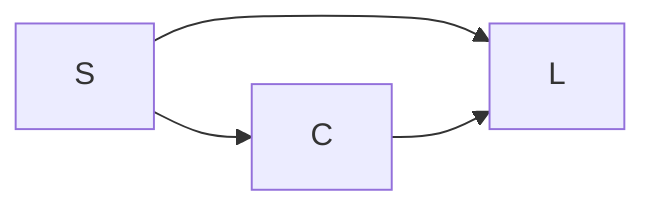
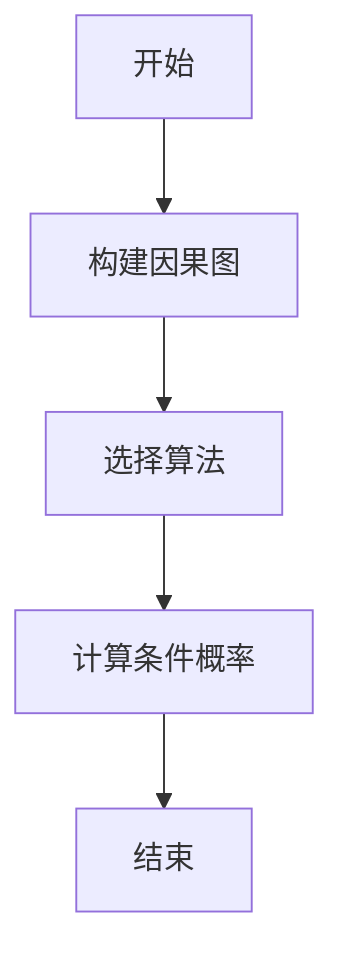
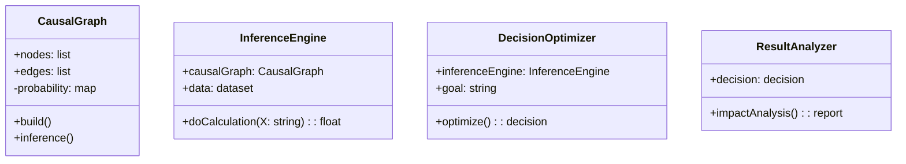
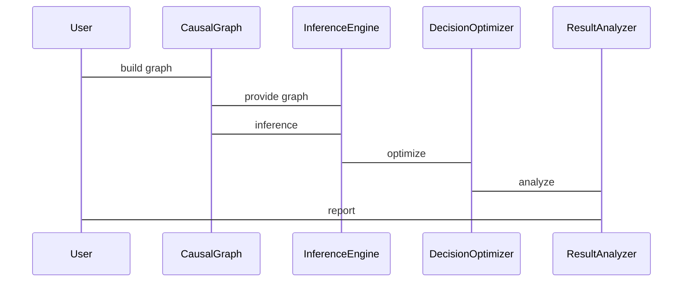

                 


# 因果推理：增强AI Agent的理解和决策能力

> 关键词：因果推理，AI Agent，决策能力，因果图，数学模型

> 摘要：本文深入探讨了因果推理在增强AI Agent理解和决策能力中的应用，从基本概念、算法原理到系统设计和项目实战，全面解析如何通过因果推理提升AI Agent的智能水平。

---

## 第1章: 因果推理的基本概念

### 1.1 问题背景与问题描述

#### 1.1.1 传统统计学习的局限性
传统统计学习方法（如回归分析和分类）主要依赖相关关系，无法直接推断因果关系。例如，数据中发现吸烟与肺癌率的相关关系，但统计方法无法直接证明吸烟是肺癌的原因。这种局限性在复杂决策场景中尤为明显，AI Agent需要理解因果关系以做出更可靠的决策。

#### 1.1.2 因果推理的核心问题
因果推理的核心问题在于识别因果关系并进行推理。我们需要回答以下问题：
- 什么是因果关系？
- 如何从数据中发现因果关系？
- 如何利用因果关系进行推理和决策？

#### 1.1.3 AI Agent在复杂场景中的决策需求
在现实世界中，AI Agent需要处理复杂的因果关系。例如，在医疗领域，AI Agent需要理解药物剂量与患者康复之间的因果关系，以制定最佳治疗方案。在金融领域，AI Agent需要理解投资决策与市场波动之间的因果关系。

---

### 1.2 问题解决与边界

#### 1.2.1 因果推理如何解决问题
因果推理通过构建因果图（Causal Graph）和分析因果关系，帮助AI Agent理解变量之间的因果关系，并在此基础上进行推理和决策。

#### 1.2.2 因果推理的边界与外延
因果推理的边界在于它专注于因果关系，而不是相关关系。其外延包括因果图的构建、因果推断算法的设计以及因果关系在实际问题中的应用。

#### 1.2.3 AI Agent在因果推理中的角色
AI Agent是因果推理的实践者，它利用因果推理技术来理解和分析问题，从而做出更智能的决策。

---

### 1.3 因果推理的核心要素

#### 1.3.1 因果关系的定义与特征
因果关系是指一个事件（原因）导致另一个事件（结果）发生的规律。其主要特征包括：
- 时间顺序：原因发生在结果之前。
- 可干预性：可以通过改变原因来影响结果。
- 唯一性：因果关系是确定的，排除其他干扰因素。

#### 1.3.2 因果图的构建与分析
因果图是一种有向无环图（DAG），用于表示变量之间的因果关系。图中的节点表示变量，边表示因果关系。

#### 1.3.3 因果推理的基本原理
因果推理基于因果图的结构，通过分析变量之间的因果关系来推断条件概率。例如，给定某个干预，计算另一个变量的条件概率。

---

## 第2章: 因果推理的核心概念与联系

### 2.1 因果关系的定义与属性

#### 2.1.1 因果关系的数学定义
因果关系可以用概率论中的条件概率来表示。如果X是Y的原因，则P(Y|do(X)) = P(Y|X)，其中do(X)表示对X进行干预。

#### 2.1.2 因果关系的属性对比
| 属性      | 相关关系      | 因果关系      |
|-----------|---------------|---------------|
| 是否需要干预 | 不需要         | 需要          |
| 可解释性   | 低            | 高            |
| 稳定性     | 低            | 高            |

#### 2.1.3 因果关系的可视化表示
因果关系可以通过因果图（Causal Graph）来表示。例如，以下Mermaid图展示了吸烟（S）、肺癌（L）和咳嗽（C）之间的因果关系：



---

### 2.2 因果图的结构与分析

#### 2.2.1 因果图的构建原理
因果图的构建基于领域知识和数据。通常需要结合专家意见和统计方法来确定变量之间的因果关系。

#### 2.2.2 因果图的节点与边的关系
节点表示变量，边表示因果关系。例如，X → Y表示X是Y的原因。

#### 2.2.3 因果图的实体关系图（Mermaid流程图）
以下Mermaid图展示了因果图的基本结构：


---

### 2.3 因果推理的基本方法

#### 2.3.1 因果推理的算法原理
因果推理的算法通常基于因果图的结构。例如，通过调整法（Backdoor Adjustment）计算条件概率。

#### 2.3.2 因果推理的数学模型
因果推理的数学模型通常涉及条件概率和干预概率。例如，P(Y|do(X)) 表示在干预X的情况下，Y发生的概率。

#### 2.3.3 因果推理的流程图（Mermaid）
以下Mermaid流程图展示了因果推理的基本流程：



---

## 第3章: 因果推理的算法原理

### 3.1 因果图的构建与学习

#### 3.1.1 因果图的构建方法
因果图的构建方法包括基于领域知识的构建和基于数据的构建。例如，可以使用贝叶斯网络结构学习算法来构建因果图。

#### 3.1.2 因果图的参数学习
参数学习是指在因果图结构已知的情况下，估计各个节点的概率分布参数。

#### 3.1.3 因果图的结构学习
结构学习是指在数据已知的情况下，通过算法自动学习因果图的结构。

---

### 3.2 因果推断的核心算法

#### 3.2.1 因果推断的基本方法
因果推断的基本方法包括调整法（Backdoor Adjustment）、倾向评分法（Propensity Score）和干预分析法（Interventional Analysis）。

#### 3.2.2 因果推断的数学公式
调整法的数学公式如下：

$$ P(Y|do(X)) = \sum_{x'} P(Y|x') \cdot P(X=x' | do(X)) $$

#### 3.2.3 因果推断的流程图（Mermaid）
以下Mermaid流程图展示了因果推断的基本流程：


---

## 第4章: 因果推理的系统分析与架构设计

### 4.1 问题场景介绍

#### 4.1.1 因果推理的应用场景
因果推理在医疗、金融、教育等领域有广泛应用。例如，在医疗领域，因果推理可以帮助医生理解不同治疗方案对患者康复的影响。

#### 4.1.2 AI Agent在因果推理中的需求
AI Agent需要具备因果推理能力，以在复杂场景中做出更智能的决策。

#### 4.1.3 系统设计的目标与范围
系统设计的目标是构建一个支持因果推理的AI Agent，能够处理复杂的因果关系并做出决策。

---

### 4.2 系统功能设计

#### 4.2.1 系统功能模块划分
系统功能模块包括因果图构建、因果推断、决策优化和结果分析。

#### 4.2.2 系统功能的领域模型（Mermaid类图）
以下Mermaid类图展示了系统的领域模型：



#### 4.2.3 系统功能的交互流程（Mermaid序列图）
以下Mermaid序列图展示了系统的交互流程：



---

### 4.3 系统架构设计

#### 4.3.1 系统架构的分层设计
系统架构通常分为数据层、计算层和应用层。

#### 4.3.2 系统架构的组件关系（Mermaid架构图）
以下Mermaid架构图展示了系统的组件关系：


#### 4.3.3 系统架构的接口设计
系统架构的接口设计包括因果图构建接口、因果推断接口和决策优化接口。

---

## 第5章: 因果推理的项目实战

### 5.1 项目环境安装与配置

#### 5.1.1 开发环境的搭建
建议使用Python和相关库（如Dowhy、PyTorch）进行开发。

#### 5.1.2 依赖库的安装
安装必要的依赖库，例如：

```bash
pip install dowhy pytorch
```

#### 5.1.3 开发工具的配置
配置IDE和虚拟环境，确保所有依赖库已安装。

---

### 5.2 系统核心功能实现

#### 5.2.1 因果图的构建代码
以下Python代码展示了因果图的构建：

```python
from dowhy import CausalGraph

# 定义变量
variables = ['S', 'L', 'C']

# 构建因果图
cg = CausalGraph(variables)
cg.add_edge('S', 'L')
cg.add_edge('S', 'C')
cg.add_edge('C', 'L')
```

#### 5.2.2 因果推断的算法实现
以下Python代码展示了因果推断的实现：

```python
from dowhy import CausalInference

# 初始化因果推断引擎
inference = CausalInference('L', ['S', 'C'], data)

# 计算条件概率
result = inference.do_calculate('S', 'L')
```

#### 5.2.3 系统功能的测试与验证
测试系统功能，验证因果推断的准确性。

---

### 5.3 项目案例

#### 5.3.1 数据准备
准备包含吸烟（S）、肺癌（L）和咳嗽（C）的数据集。

#### 5.3.2 模型构建
构建因果图并进行因果推断。

#### 5.3.3 结果分析
分析结果，验证因果关系的准确性。

---

## 总结与展望

因果推理是增强AI Agent理解和决策能力的核心技术。通过构建因果图和分析因果关系，AI Agent能够做出更智能的决策。未来，因果推理将在更多领域得到广泛应用，推动人工智能技术的发展。

---

关键词：因果推理，AI Agent，决策能力，因果图，数学模型

摘要：本文深入探讨了因果推理在增强AI Agent理解和决策能力中的应用，从基本概念、算法原理到系统设计和项目实战，全面解析如何通过因果推理提升AI Agent的智能水平。

