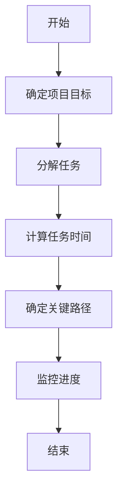
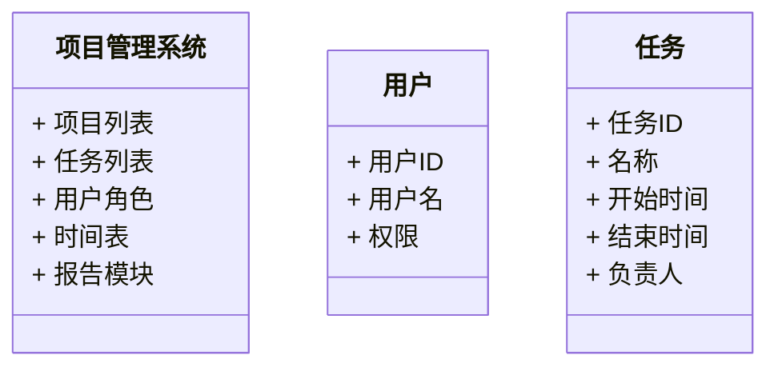
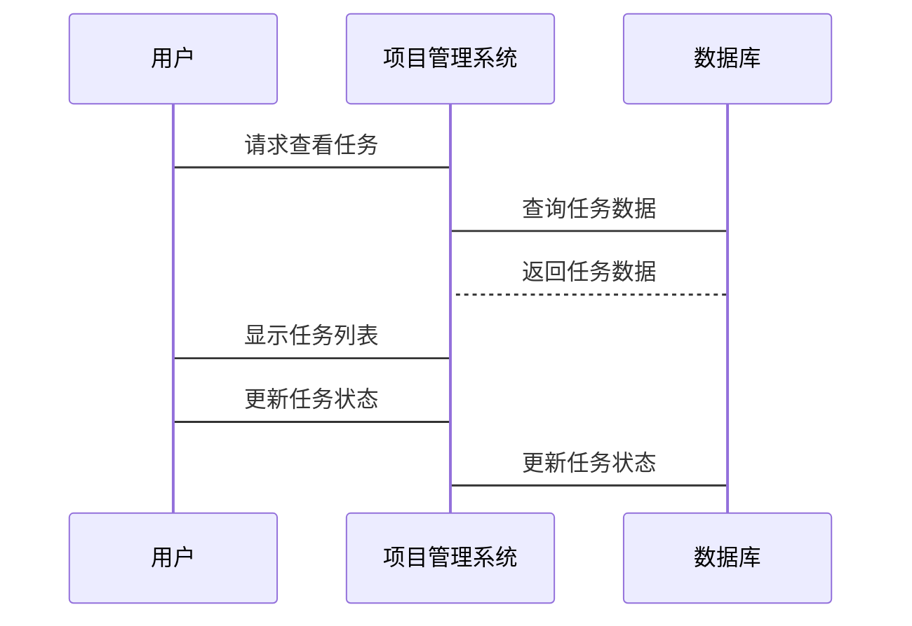

                 


# 团队组建与项目管理

## 关键词
团队组建，项目管理，团队角色，项目进度管理，系统架构，项目实战

## 摘要
本文详细探讨了团队组建与项目管理的核心概念、算法原理、系统架构以及项目实战。首先介绍了团队组建的重要性及其在项目管理中的作用，接着分析了团队角色与分工，并通过ER图和表格对比了不同团队结构的特点。然后讲解了项目进度管理算法，如关键路径法（CPM），并给出了Python代码实现和数学模型。最后，通过项目实战案例，详细解读了系统架构设计和项目管理系统的实现，提出了最佳实践建议。

---

## 第一部分：团队组建与项目管理概述

### 第1章：团队组建的背景与意义

#### 1.1 团队组建的背景与意义
现代企业对高效团队的需求日益增加，团队组建是项目成功的关键。团队成员之间的协作、沟通和分工直接影响项目进度和质量。团队组建不仅是人力资源的合理分配，更是优化项目流程、提高效率的重要手段。

#### 1.2 项目管理的基本概念
项目管理是指在有限资源内，通过计划、执行、监控和收尾等过程，确保项目目标的实现。其核心要素包括时间、成本、质量、范围、资源和沟通管理。项目管理与日常运作的不同在于其目标导向性和临时性。

#### 1.3 团队与项目管理的关系
团队是项目管理的基础，项目管理则是团队协作的框架。团队结构和角色分工直接影响项目的执行效率和成果。通过有效的项目管理，可以协调团队成员的工作，确保项目按时完成。

---

## 第二部分：团队组建的核心要素与流程

### 第2章：团队角色与分工

#### 2.1 团队角色的分类
团队角色可分为技术型、管理型和执行型。技术型角色负责技术方案的制定，管理型角色负责项目整体协调，执行型角色负责具体任务的执行。

#### 2.2 团队角色的对比分析
| 角色类型 | 职责 | 优缺点 |
|----------|------|--------|
| 技术型   | 制定技术方案 | 优点：技术专精；缺点：可能忽略非技术因素 |
| 管理型   | 协调项目进度 | 优点：全局把控；缺点：可能陷入细节 |
| 执行型   | 执行任务 | 优点：高效执行；缺点：创新不足 |

#### 2.3 团队角色的ER实体关系图
```mermaid
er
actor: 角色类型
role: 团队角色
ability: 能力
team: 团队
```

---

## 第三部分：项目管理的算法与数学模型

### 第3章：项目进度管理算法

#### 3.1 项目进度管理的基本原理
项目进度管理是通过计划、执行、监控和调整来确保项目按时完成。常用方法包括甘特图和关键路径法。

#### 3.2 关键路径法（CPM）的应用
关键路径法用于确定项目中最长的路径，即决定项目进度的关键任务。通过计算每个任务的最早和最晚开始时间，识别关键路径并进行优化。

#### 3.3 关键路径法的数学模型
任务时间的期望值计算公式为：
$$E(T) = a + (m - a) \times \frac{(p - a)}{(p - a)}$$

其中，a为最乐观时间，m为最可能时间，p为最悲观时间。

#### 3.4 项目进度算法的流程图


#### 3.5 Python代码实现
```python
import datetime

def calculate_critical_path(tasks):
    for task in tasks:
        task['early_start'] = task['start']
        task['early_finish'] = task['start'] + task['duration']
        task['late_start'] = task['finish'] - task['duration']
        task['late_finish'] = task['finish']
    critical_tasks = [task for task in tasks if task['early_start'] == task['late_start']]
    return critical_tasks

# 示例任务
tasks = [
    {'name': '任务1', 'start': 0, 'duration': 3, 'finish': 3},
    {'name': '任务2', 'start': 3, 'duration': 4, 'finish': 7},
    {'name': '任务3', 'start': 0, 'duration': 2, 'finish': 2},
    {'name': '任务4', 'start': 2, 'duration': 5, 'finish': 7},
]

critical_tasks = calculate_critical_path(tasks)
print("关键任务:", [t['name'] for t in critical_tasks])
```

---

## 第四部分：系统架构与项目管理

### 第4章：项目管理系统的架构设计

#### 4.1 项目管理系统的功能模块
项目管理系统的功能模块包括任务管理、进度监控、资源分配和报告生成。

#### 4.2 系统功能设计（领域模型）


#### 4.3 系统架构设计


#### 4.4 系统交互设计


---

## 第五部分：项目实战与总结

### 第5章：项目实战

#### 5.1 环境安装
需要安装Python和相关库，如Django或Flask框架。

#### 5.2 核心代码实现
```python
from django.shortcuts import render
from .models import Task

def task_list(request):
    tasks = Task.objects.all()
    return render(request, 'task_list.html', {'tasks': tasks})
```

#### 5.3 案例分析
通过一个实际项目案例，详细分析项目管理系统的实现过程，包括任务分解、进度跟踪和问题解决。

#### 5.4 项目小结
总结项目实施过程中的经验教训，强调沟通、协作和风险管理的重要性。

---

## 结语
团队组建与项目管理是企业成功的关键因素。通过科学的团队结构设计、有效的项目管理算法和合理的系统架构，可以显著提高项目成功率。未来，随着技术的发展，项目管理将更加智能化和数据驱动，值得我们进一步探索和实践。

