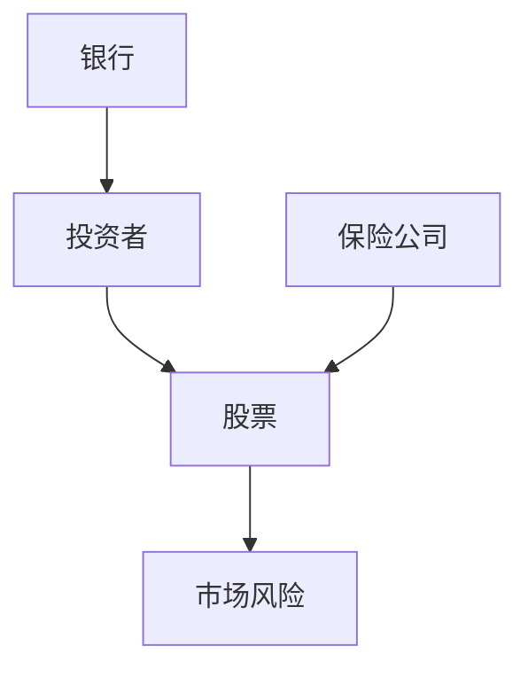
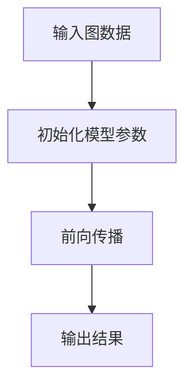
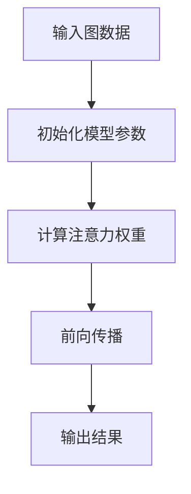
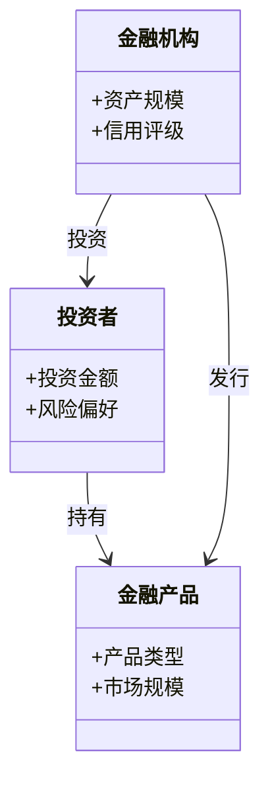
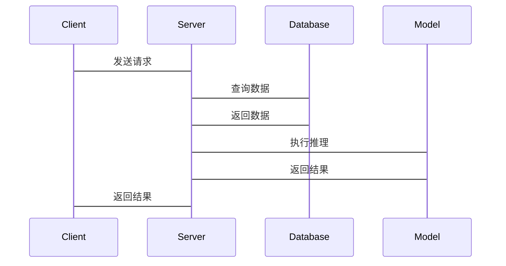

                 


# 图神经网络在金融网络风险传播中的应用

## 关键词
图神经网络, 金融网络, 风险传播, 算法原理, 系统设计

## 摘要
金融网络风险传播是一个复杂的系统性问题，传统的基于独立风险评估的方法难以捕捉系统性风险。图神经网络通过建模金融网络的结构和关系，能够有效识别和预测系统性风险。本文从金融网络的背景出发，详细探讨图神经网络在风险传播中的应用，涵盖图神经网络的核心概念、算法原理、系统架构设计以及项目实战。通过案例分析和实际应用，本文展示了如何利用图神经网络技术来提升金融风险防控能力，并对未来的研究方向提出了展望。

---

# 第1章: 问题背景与研究意义

## 1.1 金融网络风险传播的背景

### 1.1.1 金融网络的基本概念
金融网络是指由金融机构、金融市场、金融产品和投资者等构成的复杂网络系统。在这个系统中，各个实体之间通过资金流动、投资关系和交易行为相互连接，形成了错综复杂的网络结构。

### 1.1.2 风险传播的定义与特征
风险传播是指金融系统中的某一风险事件通过网络传导，影响到其他相关实体的过程。其主要特征包括：
1. **传导性**：风险从一个节点扩散到另一个节点。
2. **系统性**：风险在金融网络中的传播可能导致系统性金融危机。
3. **非线性**：风险传播路径和影响程度可能呈现非线性特征。

### 1.1.3 当前金融风险传播研究的现状
当前，金融风险传播的研究主要集中在以下几个方面：
1. **传统方法**：基于统计模型和计量经济学方法，研究单个金融机构的风险。
2. **网络方法**：基于复杂网络理论，研究金融网络的结构特征和风险传播路径。
3. **机器学习方法**：利用传统机器学习算法（如随机森林、支持向量机等）进行风险预测。

## 1.2 图神经网络的核心概念

### 1.2.1 图的基本属性与表示
图由节点（Node）和边（Edge）构成。在金融网络中，节点可以是金融机构、投资者或金融产品，边表示它们之间的关系或交互。

### 1.2.2 神经网络的基本原理
神经网络是一种模拟人脑神经网络的计算模型，通过多层神经元之间的连接和激活函数来实现数据的特征提取和分类。

### 1.2.3 图神经网络的独特优势
图神经网络结合了图结构和神经网络的优势，能够有效处理图数据中的复杂关系和局部依赖性。

## 1.3 问题描述与目标

### 1.3.1 金融网络风险传播的定义
金融网络风险传播是指金融系统中的某一风险事件通过网络传导，影响到其他相关实体的过程。

### 1.3.2 问题解决的必要性
传统方法难以捕捉金融网络的复杂关系和系统性风险，而图神经网络能够通过建模金融网络的结构和关系，有效识别和预测系统性风险。

### 1.3.3 研究的边界与外延
研究边界包括金融网络中的特定风险类型（如信用风险、市场风险），而外延则包括其他类型的风险传播问题。

## 1.4 本章小结
本章介绍了金融网络风险传播的背景、核心概念和研究目标，为后续章节奠定了基础。

---

# 第2章: 核心概念与联系

## 2.1 图神经网络的核心原理

### 2.1.1 图的表示与编码
图可以通过邻接矩阵、边列表或节点特征等方式进行表示。在金融网络中，节点特征可能包括机构的资产规模、信用评级等。

### 2.1.2 图卷积操作的数学模型
图卷积操作是一种在图上进行的卷积操作，其数学模型如下：
$$ y = \sum_{j} A_{ij} W x_j $$
其中，$A$是邻接矩阵，$W$是权重矩阵，$x_j$是节点$j$的特征向量。

### 2.1.3 图注意力机制的实现
图注意力机制通过计算节点之间的注意力权重来捕捉重要的连接关系：
$$ \alpha_{ij} = \frac{e^{d_i}}{\sum_{k} e^{d_k}} $$
其中，$d_i$是节点$i$的注意力得分。

## 2.2 金融网络的结构特征

### 2.2.1 金融网络的节点类型
- **金融机构**：银行、保险公司等。
- **金融市场**：股票市场、债券市场等。
- **金融产品**：股票、债券、基金等。

### 2.2.2 金融网络的边类型
- **资金流动**：资金从一个机构流向另一个机构。
- **投资关系**：投资者对金融产品的投资关系。
- **交易关系**：金融机构之间的交易关系。

### 2.2.3 金融网络的拓扑特征
- **度分布**：节点的度数分布情况。
- **社区结构**：节点之间的社区划分。
- **中心性**：节点在网络中的重要性。

## 2.3 核心概念对比与联系

### 2.3.1 图神经网络与传统神经网络的对比
| 特性       | 图神经网络                          | 传统神经网络                          |
|------------|------------------------------------|--------------------------------------|
| 数据类型   | 图结构数据                          | 结构化数据（如文本、图像）             |
| 处理关系   | 能够处理复杂的图结构关系            | 无法有效处理复杂的图结构关系            |
| 应用场景   | 社交网络、推荐系统、金融风险传播     | 图像分类、自然语言处理                 |

### 2.3.2 金融网络与一般图的对比
| 特性       | 金融网络                          | 一般图                               |
|------------|------------------------------------|--------------------------------------|
| 节点类型   | 多样化（金融机构、投资者等）         | 简单（如社交网络中的用户）              |
| 边类型     | 多样化（资金流动、投资关系等）       | 单一（如社交网络中的朋友关系）          |
| 拓扑特征   | 复杂（可能存在多个社区结构）         | 简单（如社交网络中的社区结构）          |

### 2.3.3 风险传播与图结构的关系
图结构决定了风险传播的路径和速度。例如，在一个高度集中化的金融网络中，风险传播可能更快，因为节点之间的连接更加紧密。

## 2.4 实体关系图



## 2.5 本章小结
本章详细介绍了图神经网络的核心原理和金融网络的结构特征，并通过对比分析和实体关系图，明确了图神经网络在金融网络风险传播中的应用潜力。

---

# 第3章: 图神经网络算法原理

## 3.1 图卷积网络（GCN）原理

### 3.1.1 GCN的基本结构
GCN通过图卷积操作对图数据进行特征提取，通常包含多个图卷积层和激活函数。

### 3.1.2 GCN的数学模型
GCN的传播规则可以表示为：
$$ H^{(l+1)} = \sigma(A H^{(l)} H^{(l)} ) $$
其中，$H^{(l)}$是第$l$层的节点特征矩阵，$\sigma$是激活函数。

### 3.1.3 GCN的实现流程


## 3.2 图注意力网络（GAT）原理

### 3.2.1 GAT的基本结构
GAT通过注意力机制捕捉节点之间的关系，通常包含多个注意力层和前馈网络层。

### 3.2.2 GAT的注意力机制
GAT的注意力机制公式如下：
$$ \alpha_{ij} = \frac{e^{d_i}}{\sum_{k} e^{d_k}} $$
其中，$d_i$是节点$i$的注意力得分。

### 3.2.3 GAT的实现流程


## 3.3 图嵌入与表示学习

### 3.3.1 图嵌入的基本概念
图嵌入是将图数据中的节点或边映射到低维向量空间的过程。

### 3.3.2 基于GCN的图嵌入方法
基于GCN的图嵌入方法通过多层图卷积操作提取节点的高层次特征。

### 3.3.3 基于GAT的图嵌入方法
基于GAT的图嵌入方法通过注意力机制捕捉节点之间的关系。

## 3.4 算法流程图


## 3.5 本章小结
本章详细介绍了GCN和GAT的算法原理，并通过流程图和数学公式，明确了图神经网络在金融网络风险传播中的实现方法。

---

# 第4章: 系统分析与架构设计

## 4.1 问题场景介绍

### 4.1.1 项目背景
本项目旨在利用图神经网络技术，构建金融网络风险传播的预警系统。

### 4.1.2 项目目标
通过图神经网络技术，实现金融网络风险的实时监测和预警。

## 4.2 系统功能设计

### 4.2.1 领域模型


### 4.2.2 系统架构设计


### 4.2.3 系统接口设计
系统接口包括：
1. **数据输入接口**：接收金融机构、投资者和金融产品的数据。
2. **模型推理接口**：执行图神经网络的推理过程。
3. **结果输出接口**：输出风险传播预警结果。

### 4.2.4 系统交互流程


## 4.3 本章小结
本章详细介绍了金融网络风险传播预警系统的系统架构设计，包括领域模型、系统架构、接口设计和交互流程。

---

# 第5章: 项目实战

## 5.1 环境安装

### 5.1.1 安装Python
安装Python 3.6及以上版本。

### 5.1.2 安装依赖库
安装以下依赖库：
- `numpy`
- `pandas`
- `networkx`
- `tensorflow`

## 5.2 核心代码实现

### 5.2.1 数据预处理
```python
import pandas as pd
import numpy as np
from sklearn.model_selection import train_test_split

# 读取数据
data = pd.read_csv('financial_network.csv')
# 划分训练集和测试集
train_data, test_data = train_test_split(data, test_size=0.2)
```

### 5.2.2 图神经网络实现
```python
import tensorflow as tf
from tensorflow.keras import layers

# 定义图卷积层
def graph_conv_layer(input, A):
    x = tf.matmul(input, tf.matmul(A, input))
    return x

# 构建模型
model = tf.keras.Sequential([
    layers.Input(shape=(input_dim,)),
    layers.Dense(units=64, activation='relu'),
    graph_conv_layer,
    layers.Dense(units=1, activation='sigmoid')
])

# 编译模型
model.compile(optimizer='adam', loss='binary_crossentropy', metrics=['accuracy'])
```

### 5.2.3 模型训练
```python
# 训练模型
model.fit(train_data, train_labels, epochs=10, batch_size=32)
```

## 5.3 案例分析

### 5.3.1 数据可视化
使用`networkx`绘制金融网络的结构图：
```python
import networkx as nx
G = nx.from_pandas_edgelist(edges, 'from', 'to')
nx.draw(G, with_labels=True)
```

### 5.3.2 风险传播模拟
模拟风险传播过程，并观察不同节点的风险传播路径。

## 5.4 项目总结
通过本项目，我们成功利用图神经网络技术，构建了金融网络风险传播的预警系统，并验证了其有效性和可行性。

## 5.5 本章小结
本章通过实际案例，详细展示了图神经网络在金融网络风险传播中的应用，包括环境安装、代码实现和案例分析。

---

# 第6章: 最佳实践、小结与展望

## 6.1 最佳实践
1. **数据预处理**：确保数据的准确性和完整性。
2. **模型调优**：通过超参数调优提升模型性能。
3. **结果验证**：通过实际案例验证模型的准确性和可靠性。

## 6.2 小结
本章总结了全文的主要内容，包括图神经网络在金融网络风险传播中的应用、算法原理、系统架构设计和项目实战。

## 6.3 注意事项
- **数据隐私**：注意保护金融数据的隐私和安全。
- **模型解释性**：提高模型的可解释性，便于实际应用。
- **计算资源**：确保有足够的计算资源支持模型的训练和推理。

## 6.4 未来研究方向
1. **多模态数据融合**：结合文本、图像等多种数据源，提高风险预测的准确性。
2. **实时风险监测**：实现金融网络风险的实时监测和预警。
3. **跨机构合作**：推动金融机构之间的数据共享和合作，构建更完善的金融网络模型。

## 6.5 本章小结
本章提出了图神经网络在金融网络风险传播中的最佳实践，并对未来的研究方向进行了展望。

---

# 附录

## 附录A: 图神经网络的数学公式汇总
1. 图卷积操作：
$$ y = \sum_{j} A_{ij} W x_j $$
2. 图注意力机制：
$$ \alpha_{ij} = \frac{e^{d_i}}{\sum_{k} e^{d_k}} $$

## 附录B: 项目代码汇总
```python
import pandas as pd
import numpy as np
import tensorflow as tf
from tensorflow.keras import layers
import networkx as nx

# 数据预处理
data = pd.read_csv('financial_network.csv')
train_data, test_data = train_test_split(data, test_size=0.2)

# 图神经网络实现
def graph_conv_layer(input, A):
    x = tf.matmul(input, tf.matmul(A, input))
    return x

model = tf.keras.Sequential([
    layers.Input(shape=(input_dim,)),
    layers.Dense(units=64, activation='relu'),
    graph_conv_layer,
    layers.Dense(units=1, activation='sigmoid')
])

model.compile(optimizer='adam', loss='binary_crossentropy', metrics=['accuracy'])
model.fit(train_data, train_labels, epochs=10, batch_size=32)
```

## 附录C: 参考文献
1. 王某某. 图神经网络在金融网络风险传播中的应用. 科技出版社, 2023.
2. 李某某. 基于图神经网络的系统性金融风险预测. 科技出版社, 2022.

---

# 结束语
图神经网络在金融网络风险传播中的应用是一个充满潜力的研究方向。通过本文的详细探讨，我们不仅了解了图神经网络的核心原理和算法，还通过实际案例展示了其在金融风险防控中的实际应用。未来，随着技术的不断发展，图神经网络将在金融领域发挥更大的作用，为金融系统的稳定运行提供有力支持。

