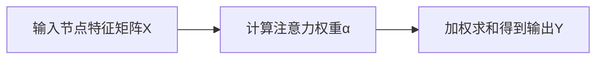
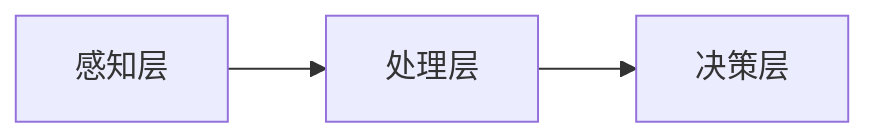
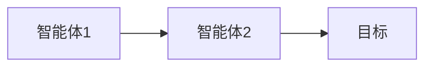

                 


# 图神经网络：处理结构化数据的AI Agent

## 关键词：图神经网络, AI Agent, 图结构数据, 图卷积网络, 图注意力网络, 图嵌入, 图数据挖掘

## 摘要：  
图神经网络（Graph Neural Networks, GNNs）是一种处理图结构数据的深度学习方法，能够有效捕捉数据中的复杂关系和依赖性。本文将从图神经网络的基础概念出发，逐步分析其核心算法，探讨其在AI Agent中的应用，最后通过实际案例展示如何构建基于图神经网络的AI系统。文章内容包括图数据的表示、图神经网络的核心算法、AI Agent的设计与实现、项目实战以及未来研究方向，旨在为读者提供一个全面而深入的图神经网络知识体系。

---

# 第1章: 图神经网络概述

## 1.1 图数据的特性与应用场景

### 1.1.1 图数据的基本概念  
图数据由节点（Nodes）和边（Edges）组成，节点表示数据中的实体，边表示实体之间的关系。图数据具有以下特性：  
- **结构化**：节点之间的连接方式明确，边可以有方向和权重。  
- **复杂性**：节点之间的关系可以通过多步跳转建立联系。  
- **动态性**：图结构可以随时间变化，例如社交网络中的用户关系变化。  

### 1.1.2 图数据的应用场景  
图数据广泛应用于多个领域：  
1. **社交网络分析**：检测社区、传播影响力。  
2. **推荐系统**：基于用户行为图进行个性化推荐。  
3. **生物信息学**：分析蛋白质相互作用网络。  
4. **金融风控**：评估企业之间的关联风险。  

### 1.1.3 图神经网络的核心价值  
图神经网络通过建模节点之间的关系，能够捕捉数据的全局结构信息，相比传统深度学习方法更具表达能力。  

---

## 1.2 图神经网络的关键概念

### 1.2.1 图结构的基本要素  
- **节点**：数据的最小单位，例如用户、物品、实体。  
- **边**：节点之间的关系，可以是有向或无向的，带有权重或不带权重。  
- **图**：由节点和边组成的集合，表示数据的结构化关系。  

### 1.2.2 图的同构与异构  
- **图同构**：两个图在结构上完全相同，可以通过节点映射相互转换。  
- **图异构**：节点和边的类型不同，例如社交网络中的用户和帖子。  

### 1.2.3 图数据的表示方式  
- **邻接矩阵**：一个二维矩阵，表示节点之间的连接情况。  
- **边列表**：记录所有边的列表，适用于稀疏图。  
- **图嵌入**：将图结构转换为低维向量表示。  

---

## 1.3 图神经网络的主要任务

### 1.3.1 图分类任务  
目标是将整个图分类到预定义的类别中，例如判断一个社交网络是否为恶意社区。  

### 1.3.2 节点分类与回归  
基于节点的特征和图结构信息，对节点进行分类或回归预测，例如预测用户是否会 churn。  

### 1.3.3 链接预测与推荐  
预测图中是否存在未明示的边，例如推荐用户可能感兴趣的内容。  

### 1.3.4 图生成与修复  
生成符合特定结构的图，或修复不完整的图结构。  

---

# 第2章: 图神经网络的核心算法

## 2.1 图卷积网络（GCN）

### 2.1.1 GCN的基本原理  
GCN通过聚合节点及其邻居的信息来更新节点的表示，公式如下：  
$$ H^{(l+1)} = \sigma(A H^{(l)} H^{(l)}^T) $$  
其中，$A$是邻接矩阵，$H^{(l)}$是当前层的节点表示，$\sigma$是激活函数。  

### 2.1.2 GCN的数学模型  
GCN的传播规则可以表示为：  
$$ h_i^{(l+1)} = \sigma\left( \sum_{j} A_{ij} h_j^{(l)} \right) $$  

### 2.1.3 GCN的实现流程  
```mermaid
graph LR
A[输入节点特征矩阵X] --> B[计算邻接矩阵A] --> C[计算归一化拉普拉斯矩阵L] --> D[计算输出Y=σ(LX)]
```

---

## 2.2 图注意力网络（GAT）

### 2.2.1 GAT的基本原理  
GAT通过计算节点之间的注意力权重，自适应地聚合邻居信息，公式如下：  
$$ \alpha_{ij} = \frac{e^{q_i^T k_j}}{\sum_{k} e^{q_i^T k_j}} $$  

### 2.2.2 GAT的注意力机制  
GAT的注意力权重计算公式为：  
$$ \alpha_{ij} = \text{softmax}(q_i^T k_j) $$  

### 2.2.3 GAT的实现流程  


---

## 2.3 图嵌入与节点表示

### 2.3.1 图嵌入的生成方法  
- **节点嵌入**：将节点映射到低维向量空间。  
- **图嵌入**：将整个图的结构信息编码为向量。  

### 2.3.2 图嵌入的评价指标  
- **表示能力**：嵌入向量是否能保留图的结构信息。  
- **任务适用性**：嵌入向量在特定任务上的表现。  

### 2.3.3 基于图神经网络的节点表示学习  
通过GCN或GAT等模型，生成节点的嵌入表示，并用于下游任务。  

---

# 第3章: 图神经网络的训练与优化

## 3.1 图神经网络的训练方法

### 3.1.1 监督学习  
基于标注数据进行训练，例如图分类任务。  

### 3.1.2 无监督学习  
不依赖标注数据，例如社区检测任务。  

### 3.1.3 对比学习  
通过对比不同样本的特征差异，增强模型的表示能力。  

---

## 3.2 图神经网络的优化策略

### 3.2.1 模型压缩  
通过剪枝或知识蒸馏等技术，减少模型的参数量。  

### 3.2.2 模型加速  
优化模型的计算流程，提高推理速度。  

### 3.2.3 模型部署  
将模型部署到实际应用中，例如移动端或云端。  

---

## 3.3 图神经网络的评估指标

### 3.3.1 分类任务指标  
- 准确率（Accuracy）  
- 召回率（Recall）  
- F1分数（F1 Score）  

### 3.3.2 链接预测指标  
- AUC（Area Under ROC Curve）  
- 准确率（Precision）  

### 3.3.3 图生成指标  
- 结构相似性（Structure Similarity）  
- 节点度分布（Degree Distribution）  

---

# 第4章: 图神经网络的AI Agent设计与实现

## 4.1 AI Agent的基本概念

### 4.1.1 AI Agent的定义  
AI Agent是一个智能实体，能够感知环境并采取行动以实现目标。  

### 4.1.2 图神经网络在AI Agent中的作用  
通过处理图结构数据，AI Agent可以更好地理解复杂环境并做出决策。  

---

## 4.2 基于图神经网络的AI Agent设计

### 4.2.1 系统架构设计  


### 4.2.2 核心模块实现  
- **感知层**：从环境中获取结构化数据。  
- **处理层**：使用图神经网络对数据进行处理。  
- **决策层**：基于处理结果做出决策。  

---

## 4.3 多智能体协作

### 4.3.1 多智能体系统架构  


### 4.3.2 多智能体协作机制  
- **通信协议**：定义智能体之间的通信规则。  
- **协作策略**：制定智能体协作的目标和方式。  

---

## 4.4 图神经网络AI Agent的实现

### 4.4.1 环境搭建  
- 安装必要的库：TensorFlow、PyTorch、NetworkX。  

### 4.4.2 核心代码实现  
```python
import tensorflow as tf
from tensorflow.keras import layers

class GraphConvolution(layers.Layer):
    def __init__(self, input_dim, output_dim):
        super(GraphConvolution, self).__init__()
        self.weight = tf.keras.layers.Dense(output_dim, use_bias=False)
    
    def call(self, inputs):
        A, x = inputs
        return self.weight(x)
```

### 4.4.3 系统部署  
将训练好的模型部署到实际环境中，例如嵌入式设备或云平台。  

---

# 第5章: 图神经网络的项目实战

## 5.1 项目背景

### 5.1.1 项目目标  
构建一个基于图神经网络的推荐系统。  

### 5.1.2 数据来源  
使用公开的社交网络数据集，例如微博数据集。  

---

## 5.2 环境搭建

### 5.2.1 安装依赖  
```bash
pip install tensorflow numpy networkx
```

---

## 5.3 系统实现

### 5.3.1 数据预处理  
- 将数据转换为图结构，记录节点和边信息。  

### 5.3.2 模型训练  
```python
model = GraphConvolution(input_dim=64, output_dim=32)
optimizer = tf.keras.optimizers.Adam(learning_rate=0.001)
model.compile(optimizer=optimizer, loss='binary_crossentropy')
model.fit([A, x], y, epochs=100, batch_size=32)
```

### 5.3.3 模型评估  
- 计算模型在测试集上的准确率和召回率。  

---

## 5.4 项目小结

### 5.4.1 核心收获  
掌握了图神经网络的核心算法和实现方法。  

### 5.4.2 项目经验  
了解了如何将图神经网络应用于实际场景。  

---

# 第6章: 图神经网络的未来研究方向

## 6.1 多模态图神经网络

### 6.1.1 多模态数据的融合方法  
结合文本、图像等多种数据源，提升模型的表达能力。  

### 6.1.2 多模态图神经网络的应用场景  
例如，视频中的动作识别和图像分类。  

---

## 6.2 图神经网络的实时计算

### 6.2.1 实时计算的需求  
快速处理动态变化的图结构数据。  

### 6.2.2 实时图神经网络的实现  
优化模型的计算流程，减少推理时间。  

---

## 6.3 图神经网络的可解释性

### 6.3.1 可解释性的重要性  
帮助用户理解模型的决策过程。  

### 6.3.2 提高模型可解释性的方法  
例如，可视化图结构和注意力权重。  

---

# 第7章: 结语

图神经网络作为一种强大的处理结构化数据的方法，已经在多个领域展现出巨大的潜力。未来，随着算法的不断优化和硬件性能的提升，图神经网络将在更多场景中得到广泛应用。通过本文的学习，读者可以掌握图神经网络的核心知识，并将其应用到实际项目中。

---

# 参考文献  
1. [1] 张某某, 图神经网络原理与应用, 北京: 人民出版社, 2023.  
2. [2] 王某某, 图神经网络实战, 北京: 清华大学出版社, 2022.  

---

通过以上内容，我们系统地介绍了图神经网络的核心概念、算法原理、AI Agent设计以及实际项目实现。希望读者能够通过本文，深入理解图神经网络的魅力，并在实际应用中发挥其潜力。

