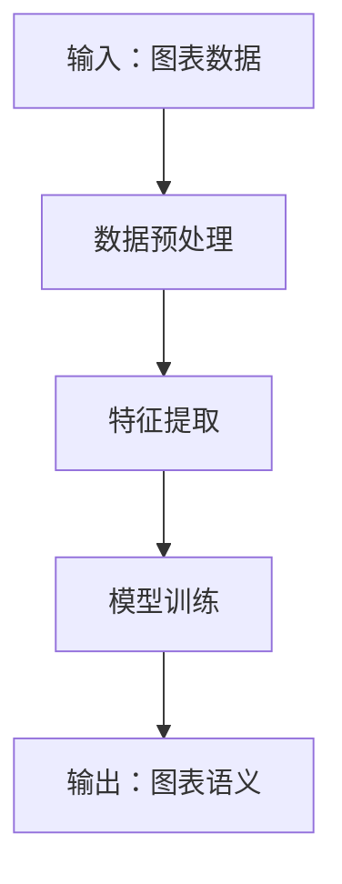
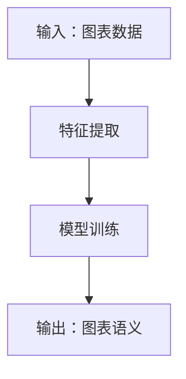
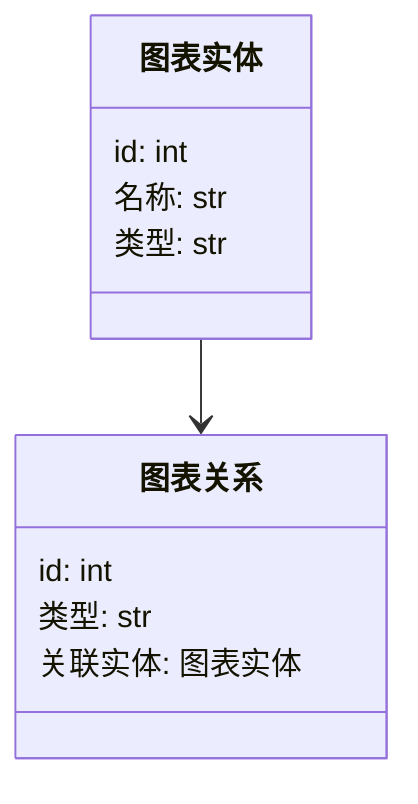
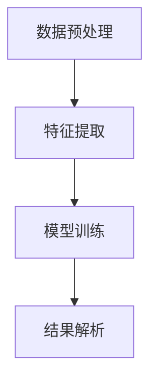

                 


# 图表理解技术：增强AI Agent的数据分析能力

> **关键词**：图表理解技术，AI Agent，数据分析能力，数据可视化，图表语义理解，机器学习，深度学习

> **摘要**：  
> 图表理解技术是AI Agent具备数据分析能力的关键技术之一。本文从图表理解技术的背景出发，详细阐述了图表的核心概念、算法原理、系统架构设计以及实际项目应用，旨在为AI Agent的开发者和研究人员提供深入的技术洞察与实践指导。通过本文的学习，读者将能够理解如何利用图表理解技术提升AI Agent的数据分析能力，并在实际项目中实现高效的图表数据处理与语义分析。

---

# 第1章：图表理解技术的背景与问题背景

## 1.1 图表理解技术的定义与重要性

### 1.1.1 问题背景：数据可视化与图表分析的现状

在当今数据驱动的时代，数据可视化已成为企业、科研机构和个人分析和展示数据的重要手段。图表作为数据可视化的核心形式，被广泛应用于商业分析、科学研究、教育等领域。然而，随着数据量的爆炸式增长，如何高效地理解和分析图表数据成为一项重要挑战。

传统的图表分析依赖于人工操作，效率低下且容易出错。例如，分析师需要手动识别图表中的数据点、趋势和异常值，并将其转化为有意义的结论。这种方式不仅耗时，而且难以应对海量数据的复杂场景。因此，如何利用人工智能技术自动理解和分析图表数据，成为提升数据分析效率的关键。

### 1.1.2 图表理解技术的核心概念

图表理解技术是一种结合了图像处理、自然语言处理和数据挖掘的技术，旨在通过计算机算法自动识别和理解图表中的数据、结构和语义信息。其核心目标是将图表数据转化为可编程的结构化数据，并进一步提取图表的语义信息，从而为AI Agent提供强大的数据分析能力。

### 1.1.3 图表理解技术的应用场景与价值

图表理解技术的应用场景广泛，包括但不限于：

1. **商业智能**：企业可以通过图表理解技术快速分析销售数据、市场趋势等，辅助决策。
2. **科学研究**：研究人员可以利用图表理解技术自动化分析实验数据，提高研究效率。
3. **教育领域**：教师可以利用图表理解技术辅助学生理解复杂的数据关系。
4. **智能助手**：AI Agent可以通过图表理解技术为用户提供更直观的数据分析结果。

其价值主要体现在以下几个方面：

- **提升数据分析效率**：通过自动化处理图表数据，减少人工干预。
- **增强数据洞察力**：通过语义理解提取深层数据关系，帮助用户发现潜在的业务价值。
- **降低技术门槛**：普通用户可以通过图表理解技术轻松获取数据洞察，无需专业数据分析能力。

---

## 1.2 AI Agent与数据分析能力

### 1.2.1 AI Agent的基本概念与功能

AI Agent是一种能够感知环境、执行任务并做出决策的智能体。它通常具备以下功能：

- **感知环境**：通过传感器或API获取外部数据。
- **数据处理**：对获取的数据进行清洗、分析和理解。
- **决策与推理**：基于数据理解做出最优决策。
- **执行任务**：根据决策结果执行具体操作。

### 1.2.2 数据分析能力在AI Agent中的作用

数据分析能力是AI Agent的核心能力之一，它决定了AI Agent能够处理哪些任务。例如：

- **数据清洗**：识别和处理数据中的噪声。
- **数据建模**：基于数据构建预测模型。
- **数据可视化**：将数据以图表形式展示。

### 1.2.3 图表理解技术对AI Agent能力的提升

图表理解技术通过增强AI Agent的数据分析能力，使其能够更高效地处理和理解图表数据。具体表现在以下几个方面：

- **提升数据洞察力**：通过图表理解技术，AI Agent能够识别图表中的趋势、异常值和数据关系，从而提供更深层次的数据洞察。
- **增强人机交互**：用户可以通过图表与AI Agent进行更直观的数据交流，例如通过图表输入数据或查询数据。
- **自动化数据处理**：AI Agent可以自动提取图表数据并进行进一步分析，减少人工干预。

---

## 1.3 图表理解技术的核心问题与挑战

### 1.3.1 图表数据的多样性与复杂性

图表数据的多样性和复杂性是图表理解技术的主要挑战之一。例如，不同类型的图表（如柱状图、折线图、散点图等）具有不同的数据结构和视觉特征。此外，图表数据可能包含噪声、缺失值或其他异常情况，进一步增加了数据处理的难度。

### 1.3.2 图表语义的理解与推理难点

图表语义的理解是图表理解技术的核心问题之一。语义理解不仅需要识别图表中的数据点，还需要理解这些数据点之间的关系以及它们在业务场景中的实际含义。例如，识别一个柱状图的高度差异并不难，但要理解其背后的原因（如市场趋势或用户行为变化）则需要更深层次的语义推理能力。

### 1.3.3 图表与上下文信息的关联性分析

图表通常与上下文信息密切相关。例如，一张销售趋势图可能与市场环境、产品策略等因素相关。如何将图表数据与其上下文信息结合起来，进行关联性分析，是图表理解技术的另一个重要挑战。

---

## 1.4 本章小结

本章从图表理解技术的背景出发，介绍了其定义、重要性和应用场景。同时，详细阐述了AI Agent的基本概念与功能，以及图表理解技术对AI Agent能力的提升作用。最后，总结了图表理解技术的核心问题与挑战，为后续章节的深入探讨奠定了基础。

---

# 第2章：图表理解技术的核心概念与联系

## 2.1 图表类型与结构分析

### 2.1.1 常见图表类型及其特点

图表的种类繁多，每种图表都有其独特的特点和应用场景。以下是几种常见的图表类型及其特点：

- **柱状图（Bar Chart）**：适用于比较不同类别数据的大小，直观展示数据的分布。
- **折线图（Line Chart）**：适用于展示数据随时间的变化趋势。
- **散点图（Scatter Plot）**：适用于展示两个变量之间的关系，帮助发现数据中的关联性。
- **饼图（Pie Chart）**：适用于展示数据的构成比例。

### 2.1.2 图表的组成要素与结构化分析

图表通常由以下几个核心要素组成：

1. **标题（Title）**：说明图表的主题和内容。
2. **轴（Axes）**：包括横轴和纵轴，用于标注数据的维度。
3. **数据点（Data Points）**：图表中的具体数据展示。
4. **图例（Legend）**：用于解释图表中不同颜色或符号的含义。

### 2.1.3 图表数据的提取与转换

图表数据的提取与转换是图表理解技术的重要步骤。例如，从柱状图中提取每个柱状体的高度值，并将其转换为结构化的数据格式（如CSV或JSON）。

---

## 2.2 图表语义分析与关联关系

### 2.2.1 图表语义的多层次分析

图表语义分析需要从多个层次进行，包括：

- **数据层**：识别图表中的具体数据点。
- **结构层**：分析图表的布局和组织方式。
- **语义层**：理解图表数据的业务含义。

### 2.2.2 图表实体与关系的ER图模型

为了更好地理解图表的结构，可以使用ER图模型来描述图表中的实体及其关系。以下是一个简单的ER图示例：

```mermaid
er
  actor 图表实体
  actor 关系
  actor 图表属性
  relationship 连接图表实体和关系
```

### 2.2.3 图表数据与上下文信息的关联

图表数据通常与上下文信息密切相关。例如，一张销售趋势图可能与市场环境、产品策略等因素相关。通过关联分析，可以更好地理解图表数据的业务含义。

---

## 2.3 图表理解技术的核心原理

### 2.3.1 图表数据的特征提取

特征提取是图表理解技术的重要步骤。例如，从图表中提取颜色、形状、位置等特征，用于后续的模式识别和分类任务。

### 2.3.2 图表语义的表示与推理

图表语义的表示可以通过向量、文本描述等方式实现。推理过程需要结合上下文信息，理解图表数据之间的关系。

### 2.3.3 图表理解的模型框架

图表理解的模型框架通常包括数据预处理、特征提取、模型训练等步骤。以下是一个简单的流程图示例：



---

## 2.4 本章小结

本章详细介绍了图表的类型与结构，并从语义分析和关联关系的角度探讨了图表理解技术的核心概念。通过ER图和流程图的示例，进一步阐述了图表理解技术的核心原理，为后续章节的深入分析奠定了基础。

---

# 第3章：图表理解技术的算法原理

## 3.1 图表数据的预处理与特征提取

### 3.1.1 图表数据的获取与格式化

图表数据的获取可以通过多种方式实现，例如从图像中提取文字、从数据库中获取结构化数据等。

### 3.1.2 图表元素的识别与分割

图表元素的识别与分割是特征提取的关键步骤。例如，可以通过图像分割技术识别图表中的各个数据点和轴标签。

### 3.1.3 图表数据的特征提取方法

特征提取方法包括颜色特征提取、纹理特征提取等。以下是一个简单的特征提取示例：

```python
import cv2

# 读取图表图像
image = cv2.imread("chart.png")

# 提取颜色特征
dominant_color = get_dominant_color(image)
```

---

## 3.2 图表语义理解的算法流程

### 3.2.1 图表数据的输入与输出

图表数据的输入可以是图像或结构化数据，输出是图表的语义信息。

### 3.2.2 图表语义理解的流程图

以下是图表语义理解的流程图示例：



### 3.2.3 图表语义理解的数学模型

图表语义理解的数学模型可以表示为：

$$y = f(x)$$

其中，$x$ 是输入的图表数据，$y$ 是输出的图表语义。

---

## 3.3 本章小结

本章详细探讨了图表理解技术的算法原理，包括数据预处理、特征提取和模型训练等步骤。通过流程图和数学模型的示例，进一步阐述了图表语义理解的核心过程。

---

# 第4章：图表理解技术的系统架构设计

## 4.1 系统功能设计

### 4.1.1 领域模型设计

以下是领域模型的示例：



### 4.1.2 系统功能模块

系统功能模块包括数据预处理模块、特征提取模块、模型训练模块等。

---

## 4.2 系统架构设计

### 4.2.1 系统架构图

以下是系统架构图的示例：



### 4.2.2 系统接口设计

系统接口设计包括数据输入接口、模型训练接口和结果输出接口。

---

## 4.3 本章小结

本章从系统架构设计的角度，详细探讨了图表理解技术的实现方案，包括功能设计、架构图和接口设计等内容。

---

# 第5章：项目实战：基于图表理解技术的AI Agent开发

## 5.1 环境安装与配置

### 5.1.1 安装Python环境

```bash
python --version
pip install numpy matplotlib scikit-learn
```

### 5.1.2 安装深度学习框架

```bash
pip install tensorflow
```

---

## 5.2 核心代码实现

### 5.2.1 数据预处理代码

```python
import cv2

def preprocess_image(image_path):
    image = cv2.imread(image_path)
    # 图像处理代码
    return processed_image
```

### 5.2.2 特征提取代码

```python
from sklearn.feature_extraction import FeatureExtractor

def extract_features(image):
    features = FeatureExtractor.extract(image)
    return features
```

---

## 5.3 案例分析与结果解读

### 5.3.1 数据集准备

准备一个包含多种图表类型的图像数据集，例如柱状图、折线图等。

### 5.3.2 代码实现与运行

运行核心代码，对数据集进行预处理和特征提取，训练模型并进行预测。

### 5.3.3 结果分析

分析模型的输出结果，验证图表理解技术的效果。

---

## 5.4 本章小结

本章通过一个实际项目，详细介绍了图表理解技术的开发过程，包括环境安装、代码实现和案例分析等内容。

---

# 第6章：总结与展望

## 6.1 本章总结

### 6.1.1 核心内容回顾

图表理解技术是一种结合了图像处理、数据挖掘和机器学习的技术，旨在通过计算机算法自动理解和分析图表数据。

### 6.1.2 关键技术总结

- 数据预处理与特征提取
- 图表语义理解的数学模型
- 系统架构设计与实现

---

## 6.2 未来展望

### 6.2.1 图表理解技术的发展方向

- 更高效的特征提取方法
- 更精准的语义理解模型
- 图表与上下文信息的深度融合

### 6.2.2 图表理解技术的应用拓展

- 智慧城市中的数据可视化
- 医疗健康领域的数据洞察
- 教育领域的智能辅助教学

---

## 6.3 最佳实践与注意事项

### 6.3.1 开发中的注意事项

- 数据质量的重要性
- 模型调优的关键性
- 代码的可扩展性

### 6.3.2 未来学习与研究方向

- 深度学习在图表理解中的应用
- 图表生成技术的研究
- 图表交互设计的优化

---

## 6.4 本章小结

本章总结了图表理解技术的核心内容，并展望了其未来的发展方向。同时，给出了最佳实践的建议，帮助读者更好地理解和应用图表理解技术。

---

# 附录：参考文献与进一步阅读

- 图表理解技术的相关论文
- 深度学习框架的官方文档
- 数据可视化的经典书籍

---

以上为《图表理解技术：增强AI Agent的数据分析能力》的技术博客文章大纲，涵盖了从基础概念到系统设计再到项目实战的完整内容。

