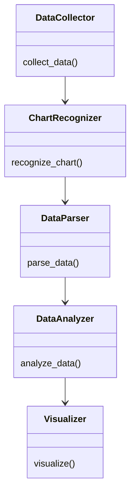
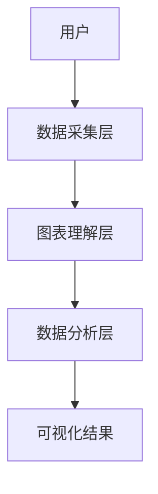

                 


# 图表理解：增强AI Agent的数据分析能力

---

## 关键词：
图表理解，AI Agent，数据分析，数据可视化，深度学习，图表识别，智能数据处理

---

## 摘要：
图表理解是增强AI Agent数据分析能力的关键技术。通过解析图表中的视觉信息和数据关系，AI Agent能够更高效地处理复杂数据，生成可信赖的分析结果。本文从图表理解的核心概念出发，深入探讨其算法原理、系统架构设计，并结合实际项目案例，详细讲解如何利用图表理解技术提升AI Agent的数据分析能力。

---

# 第一部分：图表理解的背景与重要性

## 第1章：图表理解的背景与重要性

### 1.1 数据可视化的核心概念
数据可视化是将数据转化为图表、图形或其他视觉形式的过程，旨在更直观地展示数据之间的关系和趋势。图表理解则是对这些视觉化数据进行识别、解析和分析的过程，是数据科学和人工智能领域的交叉技术。

#### 图表理解的定义与目标
- **定义**：图表理解是指通过算法和模型，从视觉图表中提取有用信息并转化为可分析数据的过程。
- **目标**：帮助AI Agent识别图表中的数据、结构和关系，从而提高数据分析的效率和准确性。

### 1.2 图表在数据分析中的作用
图表是数据可视化的重要工具，能够将复杂的数据转化为易于理解的视觉形式。AI Agent通过理解图表，可以快速获取数据的全局概览和局部细节，从而辅助决策。

#### 图表的基本类型与特点
图表的种类繁多，每种图表都有其独特的适用场景和特点：
- **柱状图**：适用于展示分类数据的大小比较。
- **折线图**：适用于展示时间序列数据的趋势变化。
- **散点图**：适用于展示二维数据点的分布情况。
- **饼图**：适用于展示数据的构成比例。
- **热力图**：适用于展示矩阵数据的分布和权重。

#### 图表理解的挑战与机遇
- **挑战**：图表的视觉元素复杂，数据关系隐含，难以直接提取。
- **机遇**：AI技术的进步（如深度学习）为图表理解提供了强大的工具。

---

## 第2章：图表理解的核心概念

### 2.1 图表理解的定义与属性
图表理解不仅仅是对图表的识别，还包括对图表背后数据关系的分析。其核心属性包括：
- **数据属性**：图表中的数据点、数值范围等。
- **结构属性**：图表的布局、轴的设置等。
- **视觉属性**：颜色、线条、字体等视觉元素。

### 2.2 图表与数据的关系
图表是数据的非结构化表示，但可以通过理解图表重新还原或补充数据。AI Agent需要同时理解图表的结构和内容，才能准确提取数据信息。

#### 图表理解的流程
1. 数据采集：获取图表的图像或数据源。
2. 图表识别：识别图表的类型和结构。
3. 数据解析：提取图表中的数据和关系。
4. 数据分析：基于提取的数据进行进一步分析。

---

# 第二部分：图表理解的算法原理

## 第3章：图表理解的算法原理

### 3.1 图表识别的算法
图表识别是理解图表的第一步，常用算法包括：
- **图像分类算法**：如CNN（卷积神经网络）。
- **目标检测算法**：如YOLO、Faster R-CNN。

#### 图表识别的流程
1. 图像输入：将图表图像输入模型。
2. 特征提取：提取图像的特征。
3. 分类/检测：识别图表的类型和位置。

#### 代码实现（CNN图像分类）
```python
import tensorflow as tf
from tensorflow.keras import layers

# 定义模型
model = tf.keras.Sequential([
    layers.Conv2D(32, (3, 3), activation='relu', input_shape=(224, 224, 3)),
    layers.MaxPooling2D((2, 2)),
    layers.Conv2D(64, (3, 3), activation='relu'),
    layers.MaxPooling2D((2, 2)),
    layers.Flatten(),
    layers.Dense(128, activation='relu'),
    layers.Dense(num_classes, activation='softmax')
])
```

### 3.2 图表数据解析的算法
图表数据解析需要结合图像识别和自然语言处理（NLP）技术，提取图表中的文字和数据点。

#### 图表解析的流程
1. 图像分割：分割出图表中的文字区域。
2. 文字识别：使用OCR技术提取文字内容。
3. 数据解析：将文字内容转化为结构化数据。

#### 代码实现（OCR文字识别）
```python
import pytesseract
from PIL import Image

# 使用OCR识别图像中的文字
def extract_text(image_path):
    image = Image.open(image_path)
    text = pytesseract.image_to_string(image)
    return text
```

### 3.3 图表分析的算法
图表分析需要结合数据可视化技术，对图表中的数据关系进行建模和分析。

#### 图表分析的流程
1. 数据建模：将图表数据转化为数学模型。
2. 数据分析：使用统计学或机器学习方法分析数据。
3. 可视化输出：生成新的可视化结果。

#### 代码实现（数据建模）
```python
import pandas as pd
import numpy as np

# 假设data是一个数据框
data = pd.DataFrame({
    'x': np.random.rand(100),
    'y': np.random.rand(100)
})

# 数据建模
model = np.polyfit(data['x'], data['y'], 1)
```

---

# 第三部分：图表理解的系统架构设计

## 第4章：图表理解的系统架构设计

### 4.1 系统功能设计
图表理解系统的功能模块包括：
- 数据采集模块：采集图表图像或数据源。
- 图表识别模块：识别图表类型和结构。
- 数据解析模块：提取图表中的数据和文字。
- 数据分析模块：对数据进行建模和分析。
- 可视化输出模块：生成新的可视化结果。

#### 系统功能模块的Mermaid类图


### 4.2 系统架构设计
图表理解系统的架构包括：
- 数据采集层：负责数据的采集和预处理。
- 图表理解层：负责图表的识别和解析。
- 数据分析层：负责数据的建模和分析。
- 用户交互层：负责与用户的交互和结果展示。

#### 系统架构的Mermaid架构图


---

# 第四部分：图表理解的项目实战

## 第5章：图表理解的项目实战

### 5.1 项目环境安装
需要安装的库包括：
- `tensorflow`：用于深度学习模型训练。
- `pytesseract`：用于OCR文字识别。
- `mermaid`：用于绘制流程图。

#### 环境配置代码
```bash
pip install tensorflow pytesseract
pip install mermaid
```

### 5.2 项目核心实现
实现一个简单的图表理解系统，包括数据采集、图表识别、数据解析和数据分析。

#### 图表识别代码
```python
import tensorflow as tf
from tensorflow.keras import layers

# 定义模型
model = tf.keras.Sequential([
    layers.Conv2D(32, (3, 3), activation='relu', input_shape=(224, 224, 3)),
    layers.MaxPooling2D((2, 2)),
    layers.Conv2D(64, (3, 3), activation='relu'),
    layers.MaxPooling2D((2, 2)),
    layers.Flatten(),
    layers.Dense(128, activation='relu'),
    layers.Dense(num_classes, activation='softmax')
])
```

#### 图表解析代码
```python
import pytesseract
from PIL import Image

# 使用OCR识别图像中的文字
def extract_text(image_path):
    image = Image.open(image_path)
    text = pytesseract.image_to_string(image)
    return text
```

### 5.3 项目案例分析
通过实际案例分析，展示图表理解在数据分析中的应用。

---

# 第五部分：图表理解的高级主题与最佳实践

## 第6章：图表理解的高级主题

### 6.1 图表理解的前沿技术
包括多模态图表分析、实时图表理解等。

### 6.2 图表理解的数学模型
包括图神经网络、强化学习等高级算法。

## 第7章：图表理解的最佳实践

### 7.1 开发注意事项
- 数据质量的重要性。
- 模型的可解释性。
- 系统的可扩展性。

### 7.2 小结
图表理解是一个复杂的任务，需要结合多种技术。

---

# 第六部分：总结与展望

## 第8章：总结与展望

### 8.1 全文总结
图表理解是增强AI Agent数据分析能力的重要技术，未来的发展方向包括多模态分析和实时处理。

### 8.2 未来展望
随着技术的进步，图表理解将更加智能化和自动化。

---

## 附录：参考文献

- TensorFlow官方文档
- PyTorch官方文档
- Mermaid官方文档
- 相关学术论文

---

# 结语

通过本文的讲解，读者可以深入了解图表理解的核心概念、算法原理和系统架构设计，并通过实际项目案例掌握图表理解技术的实现方法。希望本文能为AI Agent的数据分析能力的提升提供有价值的参考。

