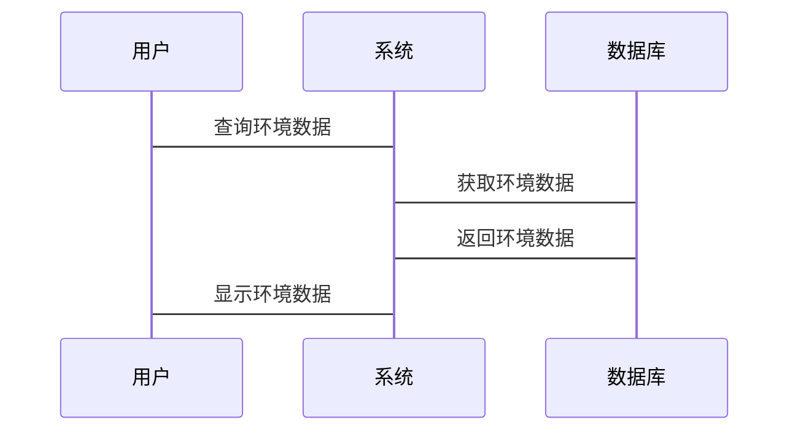

                 

# 垂直农业技术的发展与投资前景

> 关键词：垂直农业，人工智能，物联网，农业技术，投资前景

> 摘要：  
> 垂直农业作为一种新兴的农业模式，利用先进技术实现高效、可持续的农业生产，正在成为全球农业发展的焦点。本文将深入分析垂直农业的核心技术、系统架构、投资机会及未来发展趋势，帮助读者全面了解这一领域的技术与商业潜力。

---

## 第一部分: 垂直农业技术的背景与概念

### 1.1 垂直农业的定义与核心概念

#### 1.1.1 垂直农业的定义  
垂直农业（Vertical Farming）是一种通过多层立体种植方式，利用人工智能、物联网等技术实现高效农业生产的模式。与传统农业相比，垂直农业能够在有限空间内最大化产量，同时减少资源消耗。

#### 1.1.2 垂直农业的核心技术特征  
- **多层种植**：通过立体空间布局，最大化利用土地资源。  
- **智能环境控制**：精确调控温度、湿度、光照等环境参数。  
- **物联网（IoT）**：实时监测作物生长状态，优化种植条件。  
- **人工智能（AI）**：通过数据驱动优化种植策略。  

#### 1.1.3 垂直农业与传统农业的对比  

| 对比维度       | 传统农业                     | 垂直农业                     |
|----------------|------------------------------|-------------------------------|
| 种植空间       | 平面种植，占用土地多          | 立体种植，空间利用高效        |
| 资源消耗       | 水、肥料等资源浪费较大        | 资源利用高效，节水节能        |
| 生产效率       | 受天气影响较大，效率较低      | 生产效率高，周期短            |
| 技术依赖       | 依赖人工经验                 | 依赖人工智能和自动化技术      |

### 1.2 垂直农业技术的发展背景

#### 1.2.1 全球人口增长与粮食需求  
全球人口持续增长，粮食需求逐年上升，传统农业模式难以满足未来的需求。  

#### 1.2.2 土地资源有限与城市化趋势  
城市化进程加快，可用土地资源有限，垂直农业为解决城市粮食供应提供了新思路。  

#### 1.2.3 技术进步推动农业创新  
人工智能、物联网等技术的快速发展，为垂直农业提供了技术支持。  

### 1.3 垂直农业的典型应用场景

#### 1.3.1 城市中的垂直农业模式  
在城市中建立垂直农场，利用屋顶、地下室等空间进行种植，减少运输成本和新鲜农产品的损耗。  

#### 1.3.2 农业企业的垂直化转型  
传统农业企业通过引入垂直农业技术，提升生产效率和产品质量。  

#### 1.3.3 垂直农业在特殊环境中的应用  
在沙漠、极地等极端环境下，垂直农业技术能够实现作物种植，保障粮食供应。  

---

## 第二部分: 垂直农业技术的核心技术与系统架构

### 2.1 智能环境控制系统

#### 2.1.1 温度、湿度、光照的智能调控  
通过传感器实时监测环境参数，并利用AI算法优化调控策略，确保作物生长的最佳环境。  

#### 2.1.2 系统的硬件与软件架构  
- **硬件**：传感器（温度、湿度、光照）、执行器（风扇、加湿器）、控制器（PLC或嵌入式设备）。  
- **软件**：数据采集与处理系统、环境模型算法、用户界面。  

#### 2.1.3 系统的稳定性与可靠性  
通过冗余设计、故障自愈技术确保系统长期稳定运行。  

---

### 2.2 物联网技术在垂直农业中的应用

#### 2.2.1 物联网设备的部署与管理  
- 在种植空间中部署多种传感器，实时采集环境数据。  
- 通过网关将数据上传至云端，进行集中管理和分析。  

#### 2.2.2 数据采集与传输的实现  
- 数据采集：使用MQTT协议进行设备间通信。  
- 数据传输：通过5G或光纤网络实现高速数据传输。  

#### 2.2.3 物联网系统的安全性  
- 数据加密传输，防止数据泄露。  
- 访问控制，确保系统安全。  

---

### 2.3 人工智能算法在垂直农业中的应用

#### 2.3.1 作物生长模型的构建  
- 基于历史数据，训练作物生长模型，预测作物生长周期和产量。  

#### 2.3.2 数据分析与预测算法  
- 使用机器学习算法（如随机森林、神经网络）分析环境数据，优化种植策略。  

#### 2.3.3 优化算法在资源分配中的应用  
- 利用遗传算法优化光照、水分等资源分配，降低资源消耗。  

---

## 第三部分: 垂直农业技术的投资分析与商业模型

### 3.1 垂直农业的投资机会

#### 3.1.1 市场需求与增长潜力  
- 随着城市化进程加快，垂直农业市场需求持续增长。  
- 消费者对新鲜、有机农产品的需求增加。  

#### 3.1.2 技术进步带来的投资机会  
- 新技术（如AI、IoT）的应用降低了种植成本，提高了效率。  

#### 3.1.3 政策支持与行业趋势  
- 各国政府出台政策支持农业技术创新。  

---

### 3.2 垂直农业的投资风险与应对策略

#### 3.2.1 技术风险与解决方案  
- 技术研发周期长，投资风险高。  
- 解决方案：选择成熟的技术供应商，降低技术风险。  

#### 3.2.2 市场风险与市场定位  
- 市场需求不确定性高。  
- 解决方案：精准定位目标市场，进行市场调研。  

#### 3.2.3 资金链与运营风险  
- 初期投资大，回报周期长。  
- 解决方案：寻求政府补贴或合作伙伴。  

---

### 3.3 垂直农业的商业模式

#### 3.3.1 产品销售模式  
- 直接销售农产品，获取利润。  

#### 3.3.2 服务订阅模式  
- 提供环境控制系统服务，按月收取服务费。  

#### 3.3.3 技术输出与合作模式  
- 与农业企业合作，提供技术支持，分享收益。  

---

## 第四部分: 垂直农业技术的系统设计与项目实战

### 4.1 系统功能设计

#### 4.1.1 系统功能概述  
- 环境监测：实时采集和显示环境数据。  
- 自动控制：根据环境数据自动调节种植条件。  
- 数据分析：生成种植报告，优化种植策略。  

#### 4.1.2 系统功能实现  
- **环境监测模块**：传感器采集数据，通过物联网平台传输到云端。  
- **自动控制模块**：根据预设阈值，自动启动设备。  
- **数据分析模块**：利用机器学习算法优化种植策略。  

---

### 4.2 系统架构设计

---

### 4.3 系统接口设计

#### 4.3.1 系统接口描述  
- **传感器接口**：与温湿度传感器、光照传感器连接。  
- **设备控制接口**：与风扇、加湿器等设备连接。  
- **数据接口**：与云端数据库和用户界面连接。  

---

### 4.4 系统交互设计

---

## 第五部分: 垂直农业技术的法律与伦理问题

### 5.1 数据隐私与安全

#### 5.1.1 数据隐私问题  
- 垂直农业系统涉及大量环境数据，需保护数据隐私。  

#### 5.1.2 数据安全问题  
- 防止数据泄露，确保系统安全。  

---

### 5.2 知识产权与技术保护

#### 5.2.1 知识产权保护  
- 对核心技术和算法申请专利。  

#### 5.2.2 技术保密措施  
- 限制技术外流，保护企业核心竞争力。  

---

### 5.3 可持续发展与伦理问题

#### 5.3.1 可持续发展  
- 确保垂直农业技术的资源利用高效，减少环境影响。  

#### 5.3.2 伦理问题  
- 确保技术应用符合伦理规范，避免对环境和生态系统造成破坏。  

---

## 第六部分: 垂直农业技术的未来展望与趋势分析

### 6.1 未来技术发展趋势

#### 6.1.1 更高效的人工智能算法  
- 深度学习算法进一步优化种植策略。  

#### 6.1.2 新型传感器技术  
- 高精度、低成本的传感器技术推动垂直农业发展。  

#### 6.1.3 自动化技术的进步  
- 更智能的机器人和自动化设备应用于垂直农业。  

---

### 6.2 投资机会与趋势分析

#### 6.2.1 垂直农业技术的市场潜力  
- 随着技术成熟，市场需求持续增长。  

#### 6.2.2 投资热点  
- 人工智能、物联网等技术领域的投资机会。  

#### 6.2.3 行业整合与并购  
- 大型企业通过并购整合资源，扩大市场占有率。  

---

## 第七部分: 结语

### 7.1 总结  
垂直农业技术作为一种高效、可持续的农业生产模式，正在全球范围内快速发展。通过技术创新和商业模式优化，垂直农业将为未来农业发展提供重要解决方案。  

### 7.2 展望  
未来，随着技术的进步和市场的需求，垂直农业将变得更加智能化和高效化，投资机会也将进一步增加。  

---

**关键词**：垂直农业，人工智能，物联网，农业技术，投资前景  
**摘要**：  
垂直农业作为一种新兴的农业模式，利用先进技术实现高效、可持续的农业生产，正在成为全球农业发展的焦点。本文将深入分析垂直农业的核心技术、系统架构、投资机会及未来发展趋势，帮助读者全面了解这一领域的技术与商业潜力。

