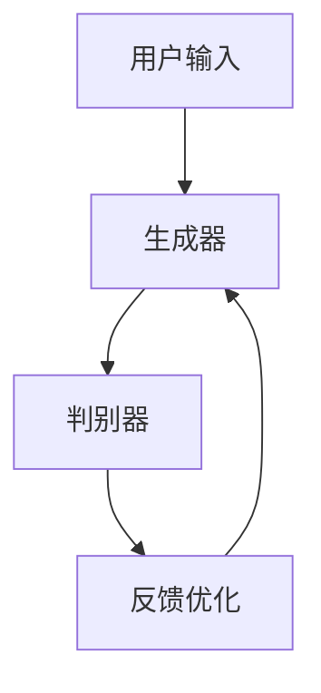

                 


# 基于GAN的AI Agent创造性内容生成

## 关键词：生成对抗网络（GAN）、AI Agent、创造性内容生成、深度学习、生成模型

## 摘要：本文将探讨如何利用生成对抗网络（GAN）赋能AI Agent，使其能够生成创造性内容。通过分析GAN的原理及其与AI Agent的结合，本文将详细阐述创造性内容生成的实现过程，并通过实际案例展示其应用。文章内容涵盖GAN的核心概念、算法原理、系统架构设计以及项目实战，旨在为读者提供从理论到实践的全面指导。

---

## 第一部分：基于GAN的AI Agent概述

### 第1章：GAN与AI Agent的核心概念

#### 1.1 GAN的基本概念
- **生成对抗网络（GAN）**：由Ian Goodfellow等人提出，是一种通过对抗训练来生成数据的深度学习模型。GAN由生成器和判别器两部分组成，生成器的目标是生成逼真的数据，判别器的目标是识别数据的真实性和生成器生成的数据。
- **对抗训练机制**：生成器和判别器通过零和游戏的方式进行训练，生成器不断优化生成的数据以欺骗判别器，判别器则不断优化以识别生成数据的能力。

#### 1.2 AI Agent的基本概念
- **AI Agent**：智能体，一种能够感知环境、自主决策并执行任务的智能系统。AI Agent可以是软件程序、机器人或其他智能系统，具备自主性、反应性、目标导向等特性。
- **AI Agent的核心功能**：感知环境、处理信息、制定决策、执行操作。

#### 1.3 GAN与AI Agent的结合
- **创造性内容生成**：通过GAN生成创造性内容，例如图像、文本、音乐等，AI Agent可以利用这些内容进行创作、推理或与用户交互。
- **AI Agent的生成能力**：GAN赋予AI Agent生成新内容的能力，使其能够动态生成符合需求的创造性输出。

### 第2章：创造性内容生成的背景与挑战

#### 2.1 创造性内容生成的背景
- **传统生成方法的局限性**：基于规则的生成方法难以应对复杂场景，随机生成方法缺乏控制能力。
- **GAN的优势**：GAN能够生成高质量、多样化的数据，具有较高的灵活性和可定制性。

#### 2.2 当前内容生成技术的挑战
- **生成数据的质量**：如何生成高质量、真实感强的内容。
- **生成的可控性**：如何根据需求控制生成内容的方向和风格。
- **生成的效率**：如何提高生成速度，满足实时生成的需求。

#### 2.3 GAN在创造性内容生成中的应用
- **图像生成**：生成高质量的图像，如风景、人物等。
- **文本生成**：生成创意文本，如故事、诗歌等。
- **音乐生成**：生成音乐片段或完整曲目。

---

## 第二部分：GAN的核心原理与实现

### 第3章：GAN的核心原理

#### 3.1 GAN的基本结构
- **生成器（Generator）**：通过卷积层、反卷积层等网络结构生成数据。
- **判别器（Discriminator）**：通过卷积层、全连接层等网络结构判断数据的真实性和生成器生成数据的能力。

#### 3.2 GAN的损失函数
- **判别器的损失函数**：衡量真实数据和生成数据的差异。
- **生成器的损失函数**：衡量生成数据与真实数据的差异。

#### 3.3 GAN的训练过程
- **交替优化**：生成器和判别器交替训练，生成器不断优化生成数据，判别器不断优化识别能力。
- **对抗平衡**：在生成器和判别器的对抗过程中，找到生成器生成数据与真实数据之间的平衡点。

### 第4章：GAN的变体与改进方法

#### 4.1 WGAN与WGAN-GP
- **Wasserstein GAN (WGAN)**：通过 Wasserstein 距离优化判别器和生成器，提高生成数据的质量。
- **WGAN with Gradient Penalty (WGAN-GP)**：引入梯度惩罚项，进一步优化生成器和判别器的训练过程。

#### 4.2 StyleGAN与ProGAN
- **StyleGAN**：通过风格编码器生成多样化的数据，具有较高的生成质量。
- **ProGAN**：通过逐步增加生成器的网络层数，提高生成数据的分辨率和细节。

#### 4.3 GAN的可解释性与稳定性
- **可解释性**：通过可视化生成器和判别器的特征图，分析生成数据的生成过程。
- **稳定性**：通过调整生成器和判别器的网络结构，优化训练过程，提高生成数据的稳定性。

---

## 第三部分：AI Agent与GAN的结合

### 第5章：AI Agent与GAN的结合

#### 5.1 AI Agent的生成能力
- **生成器的嵌入**：将生成器集成到AI Agent中，使其能够生成创造性内容。
- **生成器的控制**：通过输入不同的条件，控制生成器生成不同风格的内容。

#### 5.2 AI Agent的创造性生成过程
- **输入条件**：AI Agent根据用户输入的条件生成对应的内容。
- **生成过程**：生成器根据输入条件生成数据，判别器对生成数据进行验证。
- **反馈优化**：根据判别器的反馈，优化生成器的生成能力。

#### 5.3 AI Agent生成内容的应用场景
- **图像生成**：生成图像用于图像修复、图像生成等任务。
- **文本生成**：生成文本用于内容创作、对话生成等任务。
- **音乐生成**：生成音乐片段用于音乐创作、音乐生成等任务。

---

## 第四部分：基于GAN的AI Agent系统设计

### 第6章：系统设计与实现

#### 6.1 系统背景与目标
- **系统背景**：介绍系统的设计背景和应用场景。
- **系统目标**：通过GAN赋能AI Agent，实现创造性内容生成。

#### 6.2 系统功能设计
- **用户输入模块**：用户输入生成条件。
- **生成器模块**：根据生成条件生成内容。
- **判别器模块**：验证生成内容的质量。
- **反馈优化模块**：根据判别器的反馈优化生成器。

#### 6.3 系统架构设计
- **模块划分**：用户输入模块、生成器模块、判别器模块、反馈优化模块。
- **数据流设计**：用户输入 -> 生成器生成数据 -> 判别器验证数据 -> 反馈优化模块优化生成器。

#### 6.4 系统接口设计
- **输入接口**：用户输入生成条件。
- **输出接口**：生成器生成内容的输出。
- **反馈接口**：判别器对生成内容的反馈。

---

## 第五部分：项目实战

### 第7章：项目实战

#### 7.1 环境搭建
- **安装Python**：安装Python 3.6或更高版本。
- **安装深度学习框架**：安装TensorFlow或PyTorch。
- **安装其他依赖**：安装必要的库，如numpy、matplotlib等。

#### 7.2 生成器与判别器的实现
- **生成器的代码实现**：定义生成器的网络结构，并编写训练代码。
- **判别器的代码实现**：定义判别器的网络结构，并编写训练代码。

#### 7.3 系统实现与优化
- **生成器的训练**：通过对抗训练优化生成器的生成能力。
- **判别器的优化**：通过优化判别器的反馈，提高生成器的生成质量。

#### 7.4 实际案例分析
- **图像生成案例**：通过GAN生成高质量的图像。
- **文本生成案例**：通过GAN生成创意文本。
- **音乐生成案例**：通过GAN生成音乐片段。

---

## 第六部分：总结与展望

### 第8章：总结与展望

#### 8.1 总结
- **GAN的优势**：GAN在创造性内容生成中的优势。
- **AI Agent的生成能力**：通过GAN赋能AI Agent，实现创造性内容生成。

#### 8.2 展望
- **未来的研究方向**：如何进一步优化GAN的生成能力。
- **GAN的未来应用**：GAN在更多领域的应用前景。

---

## 附录

### 附录A：GAN的数学公式

$$
\text{生成器的损失函数} = \mathbb{E}_{z \sim p_z}[\log D(G(z))]
$$

$$
\text{判别器的损失函数} = -\mathbb{E}_{x \sim p_{data}}[\log D(x)] - \mathbb{E}_{z \sim p_z}[\log(1 - D(G(z)))]
$$

### 附录B：生成器与判别器的代码实现

```python
import tensorflow as tf
from tensorflow.keras import layers

def make_generator_model():
    model = tf.keras.Sequential()
    model.add(layers.Dense(256, activation='relu', input_shape=(100,)))
    model.add(layers.Dense(512, activation='relu'))
    model.add(layers.Dense(784, activation='sigmoid'))
    return model

def make_discriminator_model():
    model = tf.keras.Sequential()
    model.add(layers.Dense(256, activation='relu', input_shape=(784,)))
    model.add(layers.Dense(128, activation='relu'))
    model.add(layers.Dense(1, activation='sigmoid'))
    return model
```

### 附录C：系统架构图



---

通过以上思考步骤，我整理出了《基于GAN的AI Agent创造性内容生成》的技术博客文章的详细内容，涵盖了从理论到实践的各个方面。

